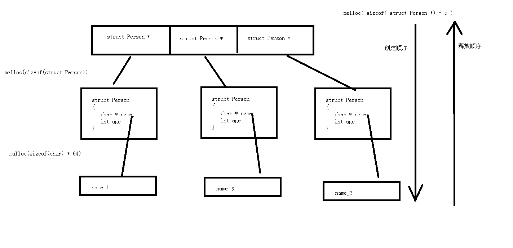

# 2020年3月黑马C&C++课程--C语言部分

<div STYLE="page-break-after: always;"></div>

## 学习说明

> //始自2022年4月8日
>
> //掌握vs的使用
>
> //函数查找参考：Linux C.chm
>
> //20220509 18:09完成C语言的学习，并完成所有笔记

<div STYLE="page-break-after: always;"></div>

## 学习资料--网站、教程等

> 1.网站（按住ctrl键，左键点击即可访问）
>
> > 1.C语言中文网：http://c.biancheng.net/c/
>
> 2.其他


<div STYLE="page-break-after: always;"></div>

## 常用代码格式模板

```html
//插入图片

```

<div STYLE="page-break-after: always;"></div>

## Visual Studio相关

> ##### 1.VS对中文和空格兼容较好。比如名称可以用中文，项目路径可以带中文或空格。
>
> ##### 2.VS是一个集成开发环境，想写代码，必须先建一个项目或工程。
>
> 新建项目：以VS2015为例，虽然我在用vs2022，新建项目 -- Visual C++ -- Win32 -- Win32控制台应用程序
>
> 或者 新建项目 -- Visual C++ --  空项目
>
> ##### 3.新建文件，必须放在工程里才能编译。
>
> 所以应该在“解决方案资源管理器”面板中找到项目，并在“源文件”上右键-- 添加--新建项--创建.c文件即可写C语言文件。如果“解决方案资源管理器”面板找不到，可以在“视图”选项卡打开它。
>
> ##### 4.VS调试和多行注释，代码语句上下移动
>
> 调试：添加断点：点击某行，按F9键
>
> 打开调试后，调试--窗口--局部变量、监视、内存、反汇编，在监视面板中添加要监视的项，比如&a，表示取a变量的地址，然后把地址输入到内存面板的地址栏，即可看到数据值。十六进制表示。
>
> 多行注释：选中需要注释的代码块，CTRL + K + C。取消注释：选中代码块，CTRL + K + U 。
>
> 代码语句上下移动：选中某行或某几行代码，按住alt键，之后按向上/下键。
>
> ##### 5.VS消除不安全函数警告
>
> VS中出现C4996警告编号，处理方法，在文件内容的最前面第一行加上以下两句话中的任意一句。
>
> 警告原因：VS建议使用带_s的函数，比如scanf_s，strcpy_s，但这些不是标准C函数。
>
> ```c
> #define _CRT_SECURE_NO_WARNINGS
> 或
> #pargma warning(disable:4996)
> ```
>
> 或者使用这一方法：
>
> 更改预处理定义：项目->属性->配置属性->C/C++ -> 预处理器 -> 预处理器定义，增加_CRT_SECURE_NO_DEPRECATE 
>
> 当然也可以用VS推荐的安全函数替换老函数。
>
> ##### 6.项目和解决方案的关系是：一个解决方案中包含多个项目。
>
> VS2022创建新项目时的选项是否勾选：将解决方案和项目放在同一目录中。
>
> 唯一的区别便是，当选择[将解决方案和项目放在同一目录中]后.sln文件和第一个新建的项目文件混合在一块，没有选择[将解决方案和项目放在同一目录中].sln文件和新建的项目在同级目录中。为了方便管理，不选择这个选项卡，让解决方案和项目文件夹同级目录管理即可。
>
> ##### 7.同一解决方案下有多个项目
>
> 如果一个解决方案下有多个项目（各个项目直接可以没有任何关系），那么可以选择在某个项目名上右键--设为启动项目，这样这个项目名就会看着比其他项目名显得字体更黑更粗一些。此时其他项目中的main函数不会再执行，而会只执行被设置为启动项目的那个项目。
>
> 另一种方法：在解决方案上右键--属性--通用属性--启动项目--将“单启动项目”改为“当前选定内容”--确定
>
> ##### 8.快捷键代码对齐
>
> 选中需要对齐的行，CTRL+K，CTRL+F
>
> ##### 9.VS安装vsix的扩展文件
>
> ##### 10.VS中使用bool的方法，见1-9 结构体--13布尔类型
>
> ##### 11.查看定义，选中待查对象，右击--转到定义
>
> ##### 12.复制路径，打开文件夹：双击打开一个.c文件，在文件窗口上方右键，即可看到复制完整路径，打开所在文件夹等
>
> ##### 13.查看某个函数的实现，按住ctrl键，鼠标左键点击函数名，即可跳转到该函数。
>
> ##### 14.VS中展开和折叠代码
> 
>VS2005代码编辑器的展开和折叠代码确实很方便和实用。以下是展开代码和折叠代码所用到的快捷键，很常用：
> 
>Ctrl + M + O: 折叠所有函数的函数体，以及注释段落；
> 
>Ctrl + M + M: 折叠或者展开当前方法；
> 
>Ctrl + M + L: 折叠/展开所有类的定义；折叠/展开所有函数体；
> 
>

<div STYLE="page-break-after: always;"></div>

## 阶段一：C开发实战

//20220408-20220425

### 第一章 C语言基础语法

//20220408

#### 1-1 第一个helloworld

//20220408

##### 1.VS是一个集成开发环境，想写代码，必须先建一个项目或工程。

新建项目：以VS2015为例，虽然我在用vs2022，新建项目 -- Visual C++ -- Win32 -- Win32控制台应用程序

或者 新建项目 -- Visual C++ --  空项目

##### 2.新建文件，必须放在工程里才能编译。

所以应该在“解决方案资源管理器”面板中找到项目，并在“源文件”上右键-- 添加--新建项--创建.c文件即可写C语言文件。如果“解决方案资源管理器”面板找不到，可以在“视图”选项卡打开它。

##### 3.第一个helloworld程序

```c
#include<stdio.h>

int main()
{

	printf("hello world!\n");


	return 0;
}

//生成--开始执行（不调试），快捷键Ctrl+F5，会自动编译并执行
```


##### 4.用文本编辑器+mingw来写和编译代码

​	先打开电脑终端（win+R，输入CMD，按回车），输入gcc -v，确定电脑上已安装mingw，可以正常使用gcc来编译文件。

​	**一步编译**：在某文件夹下创新hello.c文件，并写入helloworld代码，之后在该文件夹下打开终端，输入gcc hello.c -o hello.exe，注：此处的hello.exe可以换成任意名称，后缀.exe加不加都无所谓，会默认生成。-o表示生成目标（可执行文件），gcc表示编译。

此时在该目录下会生成hello.exe文件，如果直接双击打开，会一闪而过，如果在该文件夹下打开终端，再在终端输入hello.exe则会执行（不写.exe也可以执行），并在终端输出hello world!

##### 5.windows命令

cls：清屏

dir：查看当前目录下的文件

cd：切换文件夹

在某文件夹下打开终端：在win系统的文件资源管理器中打开目录文件夹，然后在地址栏清空后，输入cmd按回车键，即可打开当前文件夹下的终端。也可以按住shift键后再右键，点击“在此处打开Powershell窗口”。也可以使用cd命令

##### 6.C语言编译编译步骤

C代码编译成可执行程序经过4步，

分步编译

```c
预处理：gcc -E hello.c -o hello.i
编  译：gcc -S hello.i -o hello.s
汇  编：gcc -c hello.s -o hello.o
链  接：gcc    hello.o -o hello

-E	只进行预处理
-S(大写)	只进行预处理和编译
-c(小写)	只进行预处理、编译和汇编
-o file	指定生成的输出文件名为 file

.c	C 语言文件
.i	预处理后的 C 语言文件
.s	编译后的汇编文件
.o	编译后的目标文件

```

预处理：宏定义展开、头文件展开、条件编译等，同时将代码中的注释删除，这里并不会检查语法。所谓“预”，即C文件中用“#”开头的语句。所有的#开头的行，都代表预编译指令，预编译指令行结尾是没有分号的。

​	头文件展开：#include<stdio.h> 包含文件stdio.h，预处理时，会将该文件拷贝至预处理文件中。#include <任意文件>，即include可以包含和拷贝任意格式文件，但一般都是用.h的头文件。

​	宏替换：定义宏：#define 宏名称 宏值  比如#define PI 3.14

​	条件编译：包含在#if 和#endif中的代码

```c
预处理：gcc -E hello.c -o hello.i
条件编译:比如把0换成WIN32，表示程序只会在32位系统下被编译。
    如果是#if abc，则不会编译，因为条件不存在。但如果预处理语句改为gcc -E hello.c -o hello.i -Dabc，则会编译，因为-D给它加上了条件abc
情况一：不会打印输出hello，此时预处理后的hello.i文件中不包含printf("hello");
#if 0
printf("hello");
#endif
情况二：会打印输出hello,此时预处理后的hello.i文件中包含printf("hello");
#if 1
printf("hello");
#endif
```

编译：检查语法错误，将预处理后文件编译生成汇编文件

汇编：将汇编文件生成目标文件(二进制文件)

链接：设置运行环境，堆栈等，链接其他库。C语言写的程序是需要依赖各种库的，所以编译之后还需要把库链接到最终的可执行程序中去。

##### 7.system库函数--在<stdlib.h>下

作用：在程序中启动另一个程序，使用此函数需要先引入stdlib.h文件。

参数：要的是待启动程序的路径名，有一些程序的路径名称，系统根据环境变量能找到，所以可以不用加路径名。

注：windows下路径以两个反斜杠\，或者一个斜杠/

```C
#include<stdio.h>
#include<stdlib.h>

int main()
{
	system("mspaint"); //启动win下的画图板
    system("D:\\Mp3tag\\Mp3tag.exe"); //成功打开该程序
    system("D:/DevCpp/DevCpp.exe");//成功打开该程序
    //system("D:\Program Files (x86)\Dev-Cpp\DevCpp.exe"); //出错，即使这个程序存在，两个原因，一是路径中有空格，二是没有用两个\\
	printf("hello world!\n");
    system("pause");//VS中，按F5是调试运行，执行结果的黑窗口往往一闪而过，为了让窗口停留久一点，可以加上此命令。此时按任意键，比如按一下空格键，执行结果程序即结束。pause程序的作用是等待用户输入任意按键。


	return 0;
}

/**
system函数的定义
#include <stdlib.h>
int system(const char *command);
功能：在已经运行的程序中执行另外一个外部程序
参数：外部可执行程序名字
返回值：
成功：0
失败：任意数字

*/
```

##### 8.vs2022下C语言嵌套汇编语言代码


```c
//本程序是在VS2022中写的，但网课教程中能跑起来，而我的总是报错。原因不是因为代码，
//error C4235: 使用了非标准扩展: 不支持在此结构上使用“_asm”关键字 报错原因:x86平台不支持原来x64平台的内联汇编，暂时未找到解决方法。等以后学了汇编语言再说。
#include<stdio.h>
#include<stdlib.h>


int main()
{
	int a;
	int b;
	int c;

	__asm
	{
		mov a,3   //将3的值放在a对应内存的位置
		mov b,4
		mov eax,a //将a内存的值放在eax寄存器，eax为32位系统下寄存器名称
		add eax,b //eax和b相加，结果存放在eax
		mov c,eax
	}

	printf("c = %d\n",c);

	system("pause");
	return 0;
}
```

跑起来上述代码的方法


##### 9.VS调试和多行注释，代码语句上下移动

调试：添加断点：点击某行，按F9键

打开调试后，调试--窗口--局部变量、监视、内存、反汇编，在监视面板中添加要监视的项，比如&a，表示取a变量的地址，然后把地址输入到内存面板的地址栏，即可看到数据值。十六进制表示。

多行注释：选中代码块，先按Ctrl + K，再按Ctrl + C。取消注释：选中代码块，先按Ctrl + K，再按Ctrl + U。

代码语句上下移动：选中某行或某几行代码，按住alt键，之后按向上/下键。

##### 10.VS消除不安全函数警告

VS中出现C4996警告编号，处理方法，在文件内容的最前面第一行加上以下两句话中的任意一句。

警告原因：VS建议使用带_s的函数，比如scanf_s，strcpy_s，但这些不是标准C函数。

```c
#define _CRT_SECURE_NO_WARNINGS
或
#pargma warning(disable:4996)
```

或者使用这一方法：

更改预处理定义：项目->属性->配置属性->C/C++ -> 预处理器 -> 预处理器定义，增加_CRT_SECURE_NO_DEPRECATE 

当然也可以用VS推荐的安全函数替换老函数。

<div STYLE="page-break-after: always;"></div>

#### 1-2 变量和数据结构

//20220410

##### 1.数据类型

作用：告诉编译器我这个数据在内存中需要多大的空间。

​	1.1常量：在程序运行中不能改变的量。（C中宏可以认为是一个常量）

​		整形常量：1,200

​		字符常量：'a'

​		字符串常量："string"、"hello"

​		浮点型常量：3.14(浮点型也叫值型)

​		定义宏：# define PI 3.14

​	1.2变量：程序运行中可以被改变的量，存在于内存中，变量需要定义

​	所谓定义：就是在内存中开辟空间，告诉编译器我有这个变量（即声明）。定义形式：数据类型  变量名

​	

|类型| 在内存中所占字节|
|--- |--- |
|int   类型|     4字节|
|short  类型|                     2字节|
|long   类型  |                   在windows  4字节  ，linux  32位4字节，64位8字节|
|char   类型   |                  1字节|
|float  类型     |                4字节，一般用来存小数|
|double 类型  |                   8字节，用来存小数|

整型常量的数据输入格式

|整型常量|	所需类型|
|--- |--- |
|10|	代表int类型|
|10l, 10L|	代表long类型|
|10ll, 10LL|	代表long long类型|
|10u, 10U|	代表unsigned int类型|
|10ul, 10UL|	代表unsigned long类型|
|10ull, 10ULL|	代表unsigned long long类型|

##### 2.C中关键字


##### 3.变量命名（变量名即标识符）

​	标识符不能是关键字；标识符只能由字母、数字、下划线组成； 第一个字符必须为字母或下划线；标识符中字母区分大小写

##### 4.extern关键字

用此关键词修饰变量，是为了告诉编译器我有这个变量，（没有定义） 即变量声明，但没有内存空间，可能在其他文件，但没有定义，所以不可以赋值使用。

注：只有定义变量才会开辟内存空间，但声明变量不会开辟内存空间。初始化： 定义时赋值。

```c
extern  short SUM;//声明变量SUM 并没有开辟空间
// SUM = 200000;  //err
```


##### 5.const关键字

const 修饰的局部变量不能被更改

注：不可以通过变量名修改，但可以通过 取地址 的方式修改。

const 修饰的全局变量不能被更改，即使是通过取地址方式。

```C
const int   a;//const修饰的变量a, 不能通过变量名a去修改变量a的内容
// a = 10;  //error

```


##### 6.进制（16和8互转） 输入和打印格式

十六进制转八进制：先转二进制，再转八进制。

八进制转十六进制：先转二进制，再转十六进制。

```
实例：十六转八
2a5b
0 010 101 001 011  011
0  2   5   1   3    3
```

 输入：

| 十进制   | 直接输入数字即可                  |
| -------- | --------------------------------- |
| 十六进制 | 以0x开头，即数字0和字母x，如0x123 |
| 八进制   | 以数字0开头，如0123               |
| 二进制   | C语言不能直接书写二进制           |

打印格式

| 打印格式 | 	含义 |
|--- |--- |
| %d	 | 输出一个有符号的10进制int类型|
| %o(字母o)	 | 输出8进制的int类型|
| %x	| 输出16进制的int类型，字母以小写输出|
| %X	| 输出16进制的int类型，字母以大写输出|
| %u	| 输出一个10进制的无符号数|


##### 7.有符号数和无符号数

**注：一个小的类型和一个大的类型做运算，结果为大类型。无符号数比有符号数要大，因为多一位数据位。**

```C
int + double = double;
//无符号数比有符号数要大，所以
int + unsigned int = unsigned int;

//示例：
int a = -10; unsigned int b = 5;
a + b > 0 ? printf("a+b>0\n") : printf("a+b<0\n");  //结果为a+b>0
```

有符号： 可以表示正数和负数。e.g.char num；char默认有符号，C语言中，char占1B，即8位。

无符号： 只能表示正数

signed char num; 有符号数num。注：这个signed，无论写不写，默认都是有符号的。

unsigned char num;无符号数num

有符号： 最高位为符号位，1代表负数，0代表正数。其他位数据位。

无符号：全都为数据位


##### 8.数的范围

char： 有符号数和无符号数能够表示数的个数相同，只是表示数的范围不一样

| signed char                                                  | unsigned  char                                   |
| ------------------------------------------------------------ | ------------------------------------------------ |
| 1 0000000 - 1 1111111  -0 - -127 <br/>0 0000000 - 0 1111111  +0 - +127<br/>**规定： 将-0 表示成-128**<br/>-128 - +127  (-2^7 ->  2^7-1) | 00000000 - 1111 1111<br/>0 - 255 (0->2^8-1)<br/> |

short 

| signed short      | unsigned short |
| ----------------- | -------------- |
| (-2^15 -> 2^15-1) | (0 -> 2^16-1)  |

int 

| signed int        | unsigned int  |
| ----------------- | ------------- |
| (-2^31 -> 2^31-1) | (0 -> 2^32-1) |


##### 9.原码、反码、补码

> //赋值时（输入），赋的是十进制，给的是原码。如果赋值给的是八进制或者十六进制给的是补码
>
> //打印时（输出），十进制打印要的是原码，如果是十六进制或八进制打印要的数补码

原码：数的最原始的二进制码，符号位用0表示正数，1表示负数，数据位用0或1表示。

​	负数如果在计算机中用原码存，会导致两个问题  ，负数运算结果不正确，0的状态还有两种。

```
-0：    1000 0000
+0：   0000 0000
-1：    1000 0001
1：      0000 0001
1 +  -1？
0000 0001
1000 0001
1000 0010   = -2
```

反码：正数的反码不变 ，负数的反码（符号位不变，其他位取反）

如果计算机用反码去存，负数运算结果正确，但是 0的状态还是有两种

```
-0：1111 1111
+0： 0000 0000
-1：1111 1110
1：  0000 0001
1 + -1 =  1111 1111  = -0
```

补码：正数的补码不变，负数的补码等于反码加1

如果计算机用补码去存，负数运算结果是正确的，0的状态只有一种

```
-0：0000 0000
+0： 0000 0000
-1：1111 1111
1：  0000 0001
1+ -1= 0
```

实例代码：

```C
#define _CRT_SECURE_NO_WARNINGS
#include<stdio.h>
#include<string.h>
#include<stdlib.h>
int main()
{
        //赋值时（输入），赋的是十进制，给的是原码。如果赋值给的是八进制或者十六进制给的是补码
        //打印时（输出），十进制打印要的是原码，如果是十六进制或八进制打印要的数补码
        char  num = 127+2;  //char  num = 129;
        //129的原码=反码=补码 = 1000 0001
        //但是num是有符号数，最高位为1，计算机认为这是一个负数的补码
        // 补码如何求原码：符号位不变，数据位全部取反，然后+1。
        //补码：1000 0001
        //反码：1111 1110
        //原码：1111 1111
        printf("num=%d\n",num);//-127
        unsigned char e = 127 + 2；
        printf("e = %d\n", e); //129
        system("pause");
        return 0;
}
```


##### 10.补码如何求原码

符号位不变，数据位全部取反，然后+1。

##### 11.有符号数和无符号数打印

有符号数：最高位为符号位，0代表正数，1代表负数。

无符号数：最高位不是符号位，而就是数的一部分，无符号数不可能是负数。

​	当我们写程序要处理一个不可能出现负值的时候，一般用无符号数，这样可以增大数的表达最大值。

```C
%d    有符号打印int
%u    无符号打印int
%hd   有符号打印short
%hu   无符号打印short
%ld   有符号打印long
%lu   无符号打印long   
```

注：%d 和 %u，打印输出时都会转成32位原码。

**计算机输出时是否有符号，不看怎么存储的，只看打印输出的格式是有符号还是无符号。**

```C
unsigned int d = 0xffffffff;//定义无符号int变量d，以16进制方式赋值
//0x表示以补码存储，但因为unsigned，所以计算机内会直接存储ffffffff的二进制,而不会再将其转为补码存储。即就是把ffffffff看成补码。此时它对应的原码 1000 0000 0000 0000 0000 0000 0000 0001.
printf("有符号打印：%d\n",d);  //%d 打印时把其看成一个有符号数，结果为-1
printf("无符号打印：%u\n",d);  //%u 打印时把其看成一个有符号数，即全为正数，直接将0xffffffff转成十进制打印输出
```

思考char和int下不同的输出结果：

```C
char a = 0x81;  //补码:1000 0001
printf("a = %d\n", a);  //-127
printf("a = %u\n", a);  //4294967169


int a = 0x81;  //补码:1000 0001
printf("a = %d\n", a);  //129  //0000 0000 0000 0000 0000 0000 1000 0001
printf("a = %u\n", a);  //129

//这个问题非常深奥
```

有符号数和无符号数的取值范围：

|数据类型|	占用空间|	取值范围|
|--|--|--|
|short|	2字节| -32768 到 32767 (-2^15 ~ 2^15-1) |
|int	|4字节| -2147483648 到 2147483647 (-2^31 ~ 2^31-1) |
|long	|4字节	|-2147483648 到 2147483647 (-2^31 ~ 2^31-1)|
|unsigned short|	2字节| 0 到 65535 (0 ~ 2^16-1) |
|unsigned int	|4字节	|0 到 4294967295 (0 ~ 2^32-1)|
|unsigned long	|4字节	|0 到 4294967295 (0 ~ 2^32-1)|

##### 12.整数的输入--scanf

scanf（）： 从键盘（标准输入stdin）读取数据

//windows下，按Enter键，输入的字符是\r\n

在头文件stdio.h中

```C
int num;
int sum;
scanf("%d",&num);
scanf("%d %d",&num,&sum);
```

##### 13.sizeof--查看数据类型的大小

注：C语言中，sizeof是个关键字，也是个单目操作符，类似++，--，返回一个对象或类型所占的内存字节数。但它不是一个方法或函数。

```C
int/char/short/long a；
//int len = sizeof(a);
printf("%d\n",sizeof(a));
```


##### 14.字符--char及ASCII和单引号

//windows下，按Enter键，输入的字符是\r\n，而字符串以\0结束

//char的本质就是一个1字节大小的整型。

```C
sizeof('a');  //4B，等价于siezof(97);

sizeof("a");//2B，两个字符，分别是a和\0，各占一个字符char
```

ASCII表：表示字符，因为计算机只能存储0/1，所以不能直接存储字符，为了将字符转0/1，出现了ASCII对照表。

**char的本质**：char为最小整型单位，占1B，表示有符号数，范围为-128 - 127。因为ASCII表中值最大为127，所以可以用char来存储表示字符的ASCII值，因此，char也被称为字符型。即char并不是专门用来存字符的，而是它能存储字符，因为字符所对应的最大ascii值是127,所以用char类型就可以存得下所有的字符。

**单引号**：本质是个运算符，可以将字符转为ASCII值。

单个字符，用单引号括起来。

字符'0' - '9' : ASCII码值为48 - 57。

字符'A' - 'Z'：ASCII码值为65 - 90。  'A' + 32 = 'a'

字符'a' - 'z'：ASCII码值为97 - 122。'a' - 32 = 'A'

注：因为'a' - 'A' = 32，而值为32的字符是空字符，即' '，所以也可以用 'a' - ' ' = 'A'

```C
char zero = 48;   
printf("zero = %c\n", zero);  //0
printf("zero+8 = %c\n", zero+8);  //8
```

如果不知道一个字符的ASCII码值，可以用这种方法获取

```C
printf("ASCII:a = %d\n", 'a');  //97

//注：
'\n'是个字符，其ASCII码值为10，为控制字符LF，意思是换行。
```

两种siexof值

```C
char ch = 'a';
printf("%d\n", sizeof(ch));  // 1   原因 ch是char类型的变量
printf("%d\n", sizeof('a'));  // 4  原因是'a'是一个常量，本句等价于printf("%d\n", sizeof(97));97是个int类型，占4B。

```

**字符转整数**：因为字符'0'的码值为48

e.g.字符'8' 转成数字8 

```C
char ch = '8';  
printf("ch = %d\n",ch);//ch=56
int a = ch - 48;  //等价于int a = '8' - '0';
printf("a = %d\n",a); //a = 8
```


##### 15.字符的输入--多个字符输入产生的问题

单个字符的输入：

```C
char ch;
scanf("%c",&ch);  //只能输入一个字符，如果多个字符，也只会将首字符赋值给ch，例如输入abc，那么ch=a。
char ch2;
scanf("%c %c",&ch,&ch2)
```

两个字符的输入:产生的问题

```C
char ch;
scanf("%c",&ch); 
printf("ch = %c\n",ch); 
char ch2;
scanf("%c",&ch2)
printf("ch2 = %c\n",ch2); 
/**
此时程序运行时，可以输入一个字符a，然后按回车键，(本质是输入了a\n，而\n是一个特定字符，而不是\和n两个字符)
那么输出为
ch = a
ch2 = 
之所以ch2不会再等待输入，而是直接输出，是因为回车键，ch2输出的值其实是码值为10的字符，即LF，意思是换行。
查看方法：
输入不变，输出改成如下：
printf("ch = %d\n",ch);   //ch = 97
printf("ch2 = %d\n",ch2);  //ch2 = 10
*/
```


##### 16.转义字符

转义字符：有特殊含义的字符，用反斜杠\开头表示。

\a表示警报，这不是两个字符，而是一个字符。

\b表示退格（BS），将当前位置移到前一列

\n表示换行（LF），将当前位置移动到下一行开头

\r表示回车（CR），将当前位置移到本行开头

\t表示一个Tab键

\\\表示\，即两个斜杠表示一个反斜杠。

注：单个的单引号，双引号，问号等，如果想要它们打印出来，必须在前面加入反斜杠，否则就报错

```C
char jinggao = '\a';
printf("%c\n", jinggao);  //运行时程序会发出一声警告
printf("abc\bdef");  //结果为abdef，因为\b表示退格，从而删除c
printf("abc\rdef");  //结果为def，因为\r
printf("abc\tdef");  //结果为abc	def，因为\t
```


##### 17.浮点型(实型)--float、double

用于存小数数据：float占4B， double占8B，注：在C语言中看到带小数点的，默认都是double类型。

```C
printf("%d\n",sizeof(3.14));  //输出结果为8

printf("%d\n",sizeof(3.14f));  //输出结果为4
```

建议：当需要表示小数时，直接使用double类型即可。

```C
int main()
{
        //打印时,默认输出6位小数点
        //float类型能够保证的精度是7位有效数字
        //double类型能够保证的精度是15位有效数字
        float a = 3.1415926456;
        double b = 3.1415926456;
        printf("a=%f\n",a);  //a=3.141593 打印时,默认输出6位小数点
        printf("b=%f\n",b);  //b=3.141593 打印时,默认输出6位小数点
        printf("a=%.8f\n",a); //a=3.14159274  不正确原因：float类型能够保证的精度是7位有效数字
        printf("b=%.8lf\n", b);//b=3.14159265 正确原因：double类型能够保证的精度是15位有效数字
        system("pause");
        return 0;
}
```

注：打印输出double类型数据时，可用%lf做参数，如果想用科学计数法表示，可以用%e或%E做参数。

int类型想变成double类型

```C
int a = 10;
double b = a * 1.0; //int和double进行运算，结果为double
printf("%lf\n",b); //10.000000
```


##### 18.类型限定符

|  限定符  |                             含义                             |
| :------: | :----------------------------------------------------------: |
|  extern  |           声明 ,(告诉编译器有这个东西,不开辟空间)            |
|  const   |                      修饰的内容不可改变                      |
| volatile | 防止编译器优化，比如做单片机开发时，或写内核驱动时，但写应用时基本不用 |
| Register | 定义寄存器变量，提高效率。register是建议型的指令，而不是命令型的指令，如果CPU有空闲寄存器，那么register就生效，如果没有空闲寄存器，那么register无效。 |

关于编译器优化的示例

```C
int sum;
for(int i=0;i<100;i++)
{
    sum = i;
}
会被优化为
sum = 99;
如果不想被优化，则将sum定义为
volatile int sum;
```


##### 19.字符串常量

字符串是数组存储，以字符串"abc"为例，表面上只有a,b,c三个字符，实际上有四个字符，分别是'a'、'b'、'c'、'\0'。其中\0的ASCII码值为0，即NUT，即'\0' == 0。双引号引起了字符串，末尾自动跟上\0字符，就是为了做标记，比如打印字符串时，printf("%s\n","abc");先打印a，再打印b，再打印c，直到遇到\0才停止打印。

数字0                内存中存的是0
'0'                      内存中存的是48
'\0'                     内存中存的是0


##### 20.输出一个百分号

```C
printf("%%\n");
```


##### 21.打印的格式问题

注：

```C
printf("%02d\n",12345);//打印结果为12345
```


| 字符              | 含义                                                         |
| ----------------- | ------------------------------------------------------------ |
| l(字母l)          | 附加在d,u,x,o前面，表示长整数                                |
| \-（负号）        | 左对齐                                                       |
| m(代表一个整数)   | 数据最小宽度                                                 |
| 0(数字0)          | 将输出的前面补上0直到占满指定列宽为止不可以搭配使用-         |
| m.n(代表一个整数) | m指域宽，即对应的输出项在输出设备上所占的字符数。n指精度，用于说明输出的实型数的小数位数。对数值型的来说，未指定n时，隐含的精度为n=6位。 |

代码示例：

```C
int main()
{
        //m.n   m指的是宽度  n指的是小数点的位数
        double a = 3.1415;
        printf("%10.4lf\n",a);  //    3.1415
        int  b = 10;
        printf("%d\n", b);  //10
        printf("%5d\n", b);  //   10
        //printf("%0-5d\n", b); 左对齐和补0不能同时用
        printf("%05d\n", b);//00010
        system("pause");  
        return 0;
}
```


##### 22.getchar()和putchar()函数

scanf和getchar函数的比较

作用: 都是从键盘读取一个字符，两者几乎完全相同。

```C
char ch =0;
scanf("%c",&ch);
ch = getchar();

//如果想前后两次读取输入的字符，需要用三次getchar，其中第二个getchar负责读第一次输入字符后按回车键而产生的字符\n
char ch =0;
ch = getchar();   
printf("%c\n",ch);
getchar();   
ch = getchar();   
printf("%c\n",ch);
```

printf函数和putchar函数比较

printf是输出一个字符串，可以通过格式化输出来表现空格或换行。

putchar输出一个char，不带空格或换行。

<div STYLE="page-break-after: always;"></div>

#### 1-3 运算符和程序结果

//始自20220410

##### 1.常用运算符分类

|运算符类型|	作用|
|--|--|
|算术运算符|	用于处理四则运算|
|赋值运算符|	用于将表达式的值赋给变量|
|比较运算符|	用于表达式的比较，并返回一个真值或假值|
|逻辑运算符|	用于根据表达式的值返回真值或假值 |
|位运算符	|用于处理数据的位运算|
|sizeof运算符	|用于求字节数长度|


##### 2.算术运算符

注：int和double进行运算，结果为double。

关于除法：两数相除，如果想得到小数，必须有一个是double/float类型。

```C
double f = 15 * 1.0 / 5; //3.000000
double f = 15 / 5; //err
```


##### 3.自增自减

```C
++	前自增	a=2; b=++a;	结果a=3; b=3;
++	后自增	a=2; b=a++;	结果a=3; b=2;
--	前自减	a=2; b=--a;	结果a=1; b=1;
--	后自减	a=2; b=a--;	结果a=1; b=2;
```


##### 4.赋值运算符、比较运算符、逻辑运算符

赋值运算符：=、+=、-=、*=、\=、%=

比较运算符：C语言的比较运算中，“真”用数字“1”表示，“假”用数字“0”表示，注：非0即为真，哪怕是 -1，也是真。比较运算符有==、!=、<、>、<=、>=

逻辑运算符：非!、逻辑与&&、逻辑或||。关于“短路”：a&&b：如果a为假，则结果为假，不需要再看b是真是假；a||b，如果a为真，则结果为真，不需要再看b是真是假。


##### 5.运算符优先级

建议不要写的太复杂，必要时可以用括号来实现优先级。

```C
C语言中运算符优先级排序如下：
分为优先级15级：

1、圆括号【（）】、下标运算符【[]】、分量运算符的指向结构体成员运算符【->】、结构体成员运算符【.】；

2、逻辑非运算符【!】、按位取反运算符【~】、自增自减运算符【++】【 --】、负号运算符【-】、类型转换运算符【(类型)】、指针运算符和取地址运算符【*】【&】、长度运算符【sizeof】；

3、乘法运算符【*】、除法运算符【/】、取余运算符【%】；

4、加法运算符【+】、减法运算符【-】；

5、左移动运算符【<<】、右移动运算符【>>】；

6、关系运算符【< 】【>】【<=】【 >= 】；

7、等于运算符【==】、不等于运算符【!=】；

8、按位与运算符【&】；

9、按位异或运算符【^】；

10、按位或运算符【|】；

11、逻辑与运算符【&&】；

12、逻辑或运算符【||】；

13、条件运算符【?:】；

14、赋值运算符【=】【/=】【*=】【%=】【+=】【-=】【<<=】【>>=】【&=】【^=】【|=】；

15、逗号运算符【,】。
```


##### 6.逗号运算符

逗号运算符,最终的结果是最后一个表达式的结果

```C
int main()
{
        int a = 1;
        int b = 2;
        //逗号运算符,最终的结果是最后一个表达式的结果
        int c = (a++,b++,a+b,10,200,a+b,1000);  
        printf("c = %d\n",c);  //c = 1000
        system("pause");
        return 0;
}
```

##### 7.类型转换

(需要转的类型) 待转的类型

```C
int main()
{
        int  a = 3;
        double b = a;//隐式转换 
        //类型的转换  所需要的类型和给的类型不匹配,需要转换
        //强制转换  (需要转的类型)原来的数据类型  double b = (double)a;
        //printf("%d\n",(int)3.14);  //结果正确
        //printf("%d\n",3.14); //打印结果出错：结果为1374389535
        printf("%lf\n",(double)a);
        system("pause");
        return 0;
}

```

强制转换宗旨:  数据不丢失

为了保证数据不丢失一般都是小的转大的。

示例：

```C
int a;  //a占4B，假设分别存储00000001 00000011 00000111 00001111
char b;  //b占1B
b = (char)a  //b实际上只会有00001111，a的前面部分则会丢失。
```

类型转换的原则：占用内存字节数少(值域小)的类型，向占用内存字节数多(值域大)的类型转换，以保证精度不降低。


##### 8.选择结构

//C语言支持最基本的三种程序运行结构：顺序结构、选择结构、循环结构。

if语句

if-else语句

if-else if语句

```c
//if后面不要加 分号,分号是空语句，
//一般if后面加上{},{}里面的语句都属于if
//如果if后面不加{},只有if后面的一条语句属于if
if(a == 3) 应该写成if(3 == a){}//最好常量写在左边，条件语句非0即为真。
```

一个示例：两个条件的判断

```C
int a = 5;
//错误写法：
if(10 < a < 15)  
{
   printf("hello!");  //会被打印输出，因为10 < 5 < 15 等价于 0 < 15
}
//正确写法：
if(a>10 && a<15)  //关于运算符的优先级 大于小于 优先于 逻辑与
```


##### 9.三目运算符

```C
c = a > b ? a : b; 

等价于
if(a>b)
    c=a;
else
    c=b;
```


##### 10.switch整数判断 -- 注意break，及char的ascii码值

等价于if-else-if

需要重点强调的是，当和某个整型数值匹配成功后，会执行该分支以及后面所有分支的语句。如果希望只执行条件匹配的某个分支，而跳过后面的其他分支，必须要在每个分支最后添加  break;  语句。

defalut：由于 default 是最后一个分支，匹配后不会再执行其他分支，所以也可以不添加break;语句。default 不是必须的。当没有 default 时，如果所有 case 都匹配失败，那么就什么都不执行。

case语句：case 后面必须是一个整数，或者是结果为整数的表达式，但不能包含任何变量。

```C
case 10: printf("..."); break;  //正确
case 8+9: printf("..."); break;  //正确
case 'A': printf("..."); break;  //正确，字符和整数可以相互转换
case 'A'+19: printf("..."); break;  //正确，字符和整数可以相互转换
case 9.5: printf("..."); break;  //错误，不能为小数
case a: printf("..."); break;    //错误，不能包含变量
case a+10: printf("..."); break;  //错误，不能包含变量
```

switch示例：

```C
//switch
int main()
{
        int num = 0;
        int a = 0;
        scanf("%d", &num);
        a = num % 4;//0 1  2  3
        switch (a)//()里面的判断条件只能是整数，注：‘a'或'1'也是整数，因为以ascii码存储
        {
               case 0:  //只要case成立，里面的单语句或多语句都会执行
                       printf("0\n");
                       printf("hello\n");
                       break;//跳出switch语句
               case 1:
                       printf("1\n");
                       break;//跳出switch语句
               case 2:
                       printf("2\n");
                       break;//跳出switch语句
               default://默认
                       printf("3\n");
                       break;//跳出switch语句
        }
        system("pause");
        return 0;
}

/**
注：如果没有break语句，即注释所有case0 - default中的break语句
假设a = 1，那么会打印1 2 3
从匹配到的第一个case语句中的打印内容开始输出，一直输出到default中的打印语句。
此时下面的case判断会被编译器忽略。
或者输出到有break语句处。比如a=1,同时只注释case1中的break语句，那么会打印1 2，之后跳出循环，因为遇到了case 2中的break。
*/
int main()
{
	char c;
	c = getchar();

	switch (c) //参数只能是整型变量
	{
	case '1':
		printf("OK\n");
		break;//switch遇到break就中断了
	case '2':
		printf("not OK\n");
		break;
	default://如果上面的条件都不满足，那么执行default
		printf("are u ok?\n");
	}
	return 0;
}

```


##### 11.循环结构--for、while、do-while 

while的一种等价写法

```C
int num=0;
while(num++ != 100)
{
   
}
//等价于
while(num++ != 100);  //分号表示空语句
```

注意：do-while结束时需要有分号

```C
do{
   //执行语句
}while(条件);
```

注：for循环如果不写条件，条件默认为真并且死循环。

```C
int i = 1;
int sum = 0;
for( ; ; )  //等价于 while(1)
{
    sum += i;
    i++;
}
```


##### 12.循环嵌套--示例：打印99乘法表

```C
int main() {
    int i, j;  // i, j控制行或列 
    for (i = 1; i <= 9; i++) {
        for (j = 1; j <= i; j++)
            // %2d 控制宽度为两个字符，且右对齐；如果改为 %-2d 则为左对齐
            // \t为tab缩进
            printf("%d*%d=%2d\t", i, j, i * j);
        printf("\n");
    }
    system("pause");
    return 0;
}
```


##### 13.跳转语句--break、continue、goto、return

//break与continue的对比：break 用来结束所有循环，循环语句不再有执行的机会；continue 用来结束本次循环，直接跳到下一次循环，如果循环条件成立，还会继续循环。

**break**：只能在循环或开关中使用。跳出switch或者离break最近的循环。

当 break 关键字用于 while、for 循环时，会终止循环而执行整个循环语句后面的代码。break 关键字通常和 if 语句一起使用，即满足条件时便跳出循环。

```C
int i = 0;
for (i = 0; i < 5; i++)
{
    if (i == 2)
    {
        break; 
    }
    printf("i=%d\n",i);
        
}
//结果为：0 1，因为break会跳出最近的循环。
```

**continue**：只能在循环中使用。结束本次循环（如果还有下一个循环，则继续执行循环）。

continue 语句的作用是跳过循环体中剩余的语句而强制进入下一次循环。continue语句只用在 while、for 循环中，常与 if 条件语句一起使用，判断条件是否成立。

```C
int i = 0;
for (i = 0; i < 5; i++)
{
    if (i == 2)
    {
        continue;
    }
    printf("i=%d\n",i);
        
}
//结果为：0 1 3 4，因为continue会跳出i等于2的那次循环，并继续执行之后的循环。
```

goto：无条件跳转，想跳哪就跳哪，谨慎使用。

**return**：函数一旦遇到 return 语句就立即返回，后面的所有语句都不会被执行到了。从这个角度看，return 语句还有强制结束函数执行的作用。return 语句是提前结束函数的唯一办法。return 后面可以跟一份数据，表示将这份数据返回到函数外面；return 后面也可以不跟任何数据，表示什么也不返回，仅仅用来结束函数。

```C
//返回两个整数中较大的一个  
int max(int a, int b){
    return (a>b) ? a : b;
    printf("Function is performed\n");
}
//第 4 行代码就是多余的，永远没有执行的机会。
```

<div STYLE="page-break-after: always;"></div>

#### 1-4 数组

//20220411

##### 1.数组的概念、定义、初始化和大小

> //定义数组时，建议填入2的次方为数组大小。

数组: 将若干个相同数据类型的变量存放在一个连续的内存空间，数组的最小单位数元素，数组中的每一个元素都是一个变量。

构造类型:  将基本类型构建成类型，例如结构体。

数组:  相同类型的数据存放在一个集合中,这种的构造类型就是数组。

数组定义：

数组名和变量名定义方法一样

```C
//定义数组时,[]里面的值不能为变量,只能为常量
//这种写法绝对错误
int n = 10;
int num[n];
//但使用时,[]里面的值可以为常量也可以是变量
for(int i = 10;i<=2;i++)
{
    printf("%d ",num[i]);
}
printf("\n");
```

初始化：

```C
int  num[10] = {1,2,3,4,5,6,7,8,9,10};
//如果数组只初始化部分元素,其他元素被初始化为0
//如果数组只是定义，而没有初始化，那打印数组中元素时，都是些随机数。
int  num[10] = { 1,2 };
int num[10] = { 0 };//将数组所有元素初始化为0
int  num[10] = {[5]=5};
//int num[]; err  定义时没有告知有几个元素
int  num[] = { 1,2,3 };//如果定义时,[]中没有值,这个数组的元素个数由{}里面的元素个数决定
```

数组的大小：

```C
int  num[10] = { 1,2,3,4,5,6,7,8,9,10 };
//数组大小
printf("%d\n",sizeof(int [10]));
printf("%d\n", sizeof(num));
//求数组元素个数
int n = sizeof(num) / sizeof(num[0]);
//遍历数组
for (int i = 0; i < sizeof(num)/sizeof(num[0]); i++)
{
    printf("%d ", num[i]);
}
```


##### 2.数组在内存中的存储情况


##### 3.数组的地址和数组名

int a[10]

> **数组名a ,等价于第0个元素的地址(首元素地址) 即a == &a[0]，所以 a+1 == &a[1]**
>
> 注：数组名是一个**常量**，这是错误的：a = 10;

**数组名是常量,不能被赋值**，

```C
//错误示例
int a[5];
int b[5];
a = b; //错误，数组名是常量
```

&a[0] 第0个元素的地址，&a 整个数组地址。


##### 4.冒泡排序

```C
//最终按有小到大输出
int a[] = { 9,8,7,6,9,5,4,1,3,2,1,0 };
int len = sizeof(a) / sizeof(a[0]);

for (i = 0; i < len-1; i++)  //i从0-9，每一轮把最小值冒出来，放在a[i]位置上
{
   for (j = i + 1; j < len; j++)
   {
       if (a[j] <= a[i])  //如果想由大到下输出，此处改为>=
       {
          temp = a[j];
          a[j] = a[i];
          a[i] = temp;
        }
    }
}
```


##### 5.二维数组

二维数组就是有多个一维数组，按照矩阵理解。


##### 6.二维数组的初始化

二维数组定义时,不能省略列的下标,可以省略行的下标。

```C
//给二维数组部分元素初始化,其他元素为0
//int a[3][4] = { {1,2,3,4},{5,6,7,8},{9,10,11,12} };  //可以
//int a[3][4] = { 1,2,3,4 , 5,6,7,8 , 9,10,11,12  };  //可以
//int a[3][4] = {1,2,3};  //可以  等价于 {{1,2,3,0},{0,0,0,0},{0,0,0,0}}
//二维数组定义时,不能省略列的下标,可以省略行的下标
int  a[][3] = { 1,2,3,4,5 };  //可以，等价于{{1,2,3},{4,5,0}}，只给出列下标和元素总数，后者除以前者，就是行的个数。
```


7.二维数组的行、列和打印模板

```C
//二维数组打印
void printMatrix(int* a, int m, int n)//a为一个m行，n列的二维数组的首地址。
{
    int i, j;
    for (i = 0; i < m; i++)
    {
        for (j = 0; j < n; j++)
        {
            printf("%d,", a[i * n + j]);//a[i*n+j]也就是原始二维数组第i行第j列的元素。
        }
        printf("\n");//每行结束输出换行。
    }
}

//调用方法
//求元素个数，行数，列数
int a[3][4] = { {1,2,3,4},{5,6,7,8},{9,10,11,12} };
int len = sizeof(a) / sizeof(a[0][0]);//元素的个数
int row_nums = sizeof(a) / sizeof(a[0]);//行数  = 二维数组总大小除以 一行的大小
int col_nums = sizeof(a[0]) / sizeof(a[0][0]);//列 = 行大小除以 一个元素的大小

printMatrix(a, row_nums, col_nums);
```


##### 8.二维数组数组名

二维数组数组名代表首行地址


##### 9.二维数组的一个练习

```C
//给定五个人的三科成绩，求各科成绩的平均分和各科不及格人数
#define _CRT_SECURE_NO_WARNINGS
#include<stdio.h>
#include<stdlib.h>

void printArrI(int num[], int len)
{
	printf("各科不及格人数\n");
	int i;
	for (i = 0; i < len; i++)
	{
		switch (i)
		{
		case 0:
			printf("语文： ");
			break;
		case 1:
			printf("数学： ");
			break;
		default:
			printf("英语： ");
			break;
		}
		printf("%-6d  ", num[i]);
	}
	printf("\n");
}

void printArrF(float num[], int len)
{
	printf("各科各科平均成绩\n");
	int i;
	for (i = 0; i < len; i++)
	{
		printf("%-6.2lf", num[i]);
	}
	printf("\n");
}

int main()
{
	float a[5][3] = { { 80, 75, 56 }, { 59, 65, 71 }, { 59, 63, 70 }, { 85, 45, 90 }, { 76, 77, 45 } };

	int ke_peo[3] = {0};  //各科不及格人数  ke_peo[0]:语文不及格人数   ke_peo[1]数学不及格人数   ke_peo[2] 英语不及格人数
	float ke_avg[3] = {0};   //各科平均成绩  ke_avg[0]:语文平均成绩   ke_avg[1]数学平均成绩   ke_avg[2] 英语平均成绩
	float ke_sum = 0.0;  //各科总分数

	for (int j = 0; j < 3; j++)
	{
		for (int i = 0; i < 5; i++)
		{
			//a[i][j]:每一科的五个人的成绩。
			ke_sum += a[i][j];
			if (a[i][j] < 60)
			{
				ke_peo[j]++;
			}			
		}
		ke_avg[j] = ke_sum / 5;
		ke_sum = 0.0;
	}

	printArrI(ke_peo, 3);
	printArrF(ke_avg, 3);

	system("pause");
	return 0;
}
```


##### 10.字符数组

int  a[10]//每个元素int类型,所以这个是数值数组

char a[10]//每个元素是char类型,所以这个是字符数组

注：字符数组中存的不是字符，而是字符的ASCII码。

```C
char str[64] = "hello\0world";
int t = sizeof(str);  //t=64B，因为字符数组一旦被定义，无论是否赋初值，都会被分配制定数组大小的内存
```

**字符串**就是字符数组中有\0字符的数组，可以直接打印 %s 输出，如果没有\0字符，它就不是字符串，而只是普通的字符数组，需要遍历才能打印 %c 输出。只要看到了双引号，后边必定跟了一个\0字符。

注：以后遇到字符串，操作时只要其中有 \0 即结束，可以搭配strlen()函数使用，该函数返回字符串的有效字符，遇到\0即结束。

> 注：'\0'后面最好不要跟数字，有可能几个数字连起来刚好是一个转义字符。比如'\ddd'是八进制字义字符，'\xdd'是十六进制转义字符，\012相当于\n

```C
int main()
{
        //"hello"
        //字符数组
        //字符串就是字符数组中有\0字符的数组
        //因为有\0字符的字符数组,操作起来方便
        //char  a[5] = {'a','b','c','d','e'};普通的字符数组 不可以使用printf("%s\n", a);打印，没有\0字符，打印结果：前面正常，但后边乱码，就是因为没有 '\0'字符，会一直打印到有\0的位置。
        //char  a[5] = {'a','b','c','d','\0'};//字符数组中含有\0字符的,它也是字符串，可以使用printf("%s\n", a);
        //char  a[5] = "abcd";//定义了一个字符数组,存的是abcd\0，编译器会自动加上\0
        //char  a[] = "world";//此数组有6个元素
        //char  a[100] = "abcd";//定义了一个字符数组,有100个元素
        //char  a[100] = "\0";//将数组的第0个元素填\0,其他元素就是\0
        char  a[100] = { 0 };//将一个字符数组清0
        //char  a[100] = "";//将一个字符串清0
        /*for (int i = 0; i < sizeof(a) / sizeof(a[0]); i++)
        {
               printf("%c",a[i]);
        }*/
        printf("%s\n",a);
        printf("\n");
        printf("%s\n","hello");
        system("pause");
        return 0;
}
```


##### 11.字符串的输出 -- scanf

缺点: 遇到空格或\n就会提前结束读取, 如果存放读取字符的空间不足,继续向后存放,会造成内存污染

使用scanf函数，如果不在 .c 文件头部加 #define _CRT_SECURE_NO_WARNINGS，微软就会提示4996警告。

```C
char num[123] = "";
scanf("%s",num); //不要用&num
printf("[%s]\n",num);

//scanf造成的内存污染
char a[5] = "";
scanf("%s",a);  //此时键盘输入abcdefghijklmnopqrstuvwxyz，共26个字符，已经超出了a定义时的5个字符
printf("[%s]\n",a); //打印结果：abcdefghijklmnopqrstuvwxyz，也就是说a中放慢之后，还继续往后面的内存放，但后面的内存不是a的，就会更改其他数据所在的内存。
```


##### 12.字符串的输出 -- gets()

gets是一个库函数,从键盘读取字符串,在头文件stdio.h中

gets遇到\n结束.,但是遇到空格不结束读取空格，gets也会造成内存污染。

```C
int main()
{
        //gets遇到\n结束.,但是遇到空格不结束读取空格
        //gets也会造成内存污染
        char  num[5] = "";
        gets(num);//()里面的参数要的是存放读取字符串的地址
        printf("num=%s\n",num);
        system("pause");
        return 0;
}
```


##### 13.字符串的输出 -- fgets()【建议使用】

//比scanf和gets更好用，只是参数多了些，推荐

//只能用来读字符串，如果想读单个字符，用fgetc

fgets是一个库函数,从文件/键盘中读取字符串,在头文件string.h中。fgets 相对于scanf 和 gets不会污染内存,(安全),但是fgets会将\n读取.

使用模板：

```C
//#include<string.h>
char buf[1024] = "";
fgets(buf,sizeof(buf),stdin);
buf[strlen(buf)-1]=0;
printf("%s\n",buf);
```

缺点：输入数据后，按回车键，会自行读取\n，打印时则把\n当换行符打印出来。


如何去掉\n？

```C
//#include<string.h>
int main()
{
        //fgets会把回车键\n读取，scanf和gets不会读\n。
        char buf[1024] = "";
        fgets(buf,sizeof(buf),stdin);//hello\n  //fgtes从stdin(标准输入-键盘)读取字符串到num数组中,最大可以读sizeof(num)-1个字符，最后一位会自动填写\0，多出的字符直接丢弃。
        printf("%s\n",buf);
        system("pause");
        return 0;
}
//如何将最后一位字符置为 \0
char buf[128] = "hello\n"; //即buf[5] = '\n'，将其置为0或'\0'即可
int i = 0;
while(buf[i] != 0)
{i++}
buf[i-1] = 0;
printf("%s\n",buf);
//如何去掉\n？ 
char buf[1024] = "";
fgets(buf,sizeof(buf),stdin);
buf[strlen(buf)-1]=0;
printf("%s\n",buf);
```


##### 14.字符串的输出 -- 库函数strlen()

作用：测字符数组有效字符的个数，参数要的是字符数组的首元素地址

遇到 \0 字符就结束

```C
//两者效果类似
while(buf[i] != 0)
{i++}
printf("%d\n",i);
//等价于
i = strlen(buf);

char str[64] = "hello\0world";
printf("%d\n",strlen(str));  //结果为5，因为遇到\0即结束
printf("%s\n",str);  //结果为hello，因为遇到\0即结束
```


##### 15.字符串的输出 -- puts

作用：定义在stdio.h头文件中，标准设备输出s字符串，在输出完成后自动输出一个'\n'，即自动换行。参数只有一个，即字符串首地址。

```C
char str1[1024] = "hello1";
char str2[1024] = "hello2";

printf("hello");
printf("%s",str1);
puts(str2);  //自动换行
puts("hello3");
```


##### 16.字符串的输出 -- fputs

作用：定义在stdio.h头文件中，将str所指定的字符串写入到stream指定的文件中， 字符串结束符 '\0'  不写入文件。

```C
int fputs(const char * str, FILE * stream);
//参数：str：字符串
//参数：stream：文件指针，如果把字符串输出到屏幕，固定写为stdout
```

fputs()是puts()的文件操作版本，但fputs()不会自动输出一个'\n'。

```C
char buf[1024] = "helloworld";
fputs(buf,stdout);//第一个参数,数组首元素地址,stdout标准输出(屏幕)
```


##### 17.练习：追加字符串

```C
#define _CRT_SECURE_NO_WARNINGS
#include<stdio.h>
#include<stdlib.h>
#include<string.h>

int main()
{

	char str1[128] = "hello";
	char str2[128] = "world";

	printf("Before: %s\n", str1);

	int len1 = strlen(str1);
	int len2 = strlen(str2);
	
	for (int i = 0; i < len2; i++)
		str1[len1+i] = str2[i];

	printf("After: %s\n", str1);

	system("pause");

	return 0;
}
/**
Before: hello
After: helloworld
*/
```


##### 18.随机数--srand和rand函数

```C
#include<stdio.h>
#include<stdlib.h>
#include<time.h>
int main()
{
    srand((unsigned)time(NULL));  //用时间做种子
    int n=rand();
    printf("%d\n",n);
    return 0;
}

/**
产生随机数范围：[m,n]
int a=m+rand()%(n-m+1);
int num = rand()；//产生的是[0,1)之间的随机数
*/
```

##### 19.练习：由电脑产生一个四位随机数，然后读取键盘输入的一个四位数，提示给出输入的每位数与系统随机数的各位的比较大小，继续输入，直到输入正确结果为止。

```C
//全是我自己写的，没参考任何相关资料或提醒，花了约2.5小时，自己一步步写出来的。
#define _CRT_SECURE_NO_WARNINGS
#include<stdio.h>
#include<stdlib.h>
#include<time.h>

void printArr(int num[], int len)
{
	int i;
	for (i = 0; i < len; i++)
	{
		printf("%-3d", num[i]);
	}
	printf("\n");
}
int comp_nums(int a,int b,int i)
{
	int flag = 0;
	i += 1;
	if (a < b)
		printf("你输入的第%d位数字小于系统给定数字的第%d位\n",i,i);
	else if (a > b)
		printf("你输入的第%d位数字大于系统给定数字的第%d位\n", i, i);
	else
	{
		printf("你输入的第%d位数字是正确的\n", i);
		flag = 1;
	}
	return flag;
}

int main()
{
	printf("猜数字：系统已经产生了一个四位数字：  ");

	srand((unsigned)time(NULL));
	int n = 1000 + rand() % 9000;
	//printf("%-6d\n\n\n", n);

	char xts_num[8] = { 0 };
	xts_num[0] = n / 1000 + '0'; // 字符'8'转为数字8：'8'-'0'=8;
	xts_num[1] = n / 100 % 10 + '0';
	xts_num[2] = n / 10 % 10 + '0';
	xts_num[3] = n % 10 + '0';

	int flag[4] = { 0 };
	int sum_flag = 0;

	while (sum_flag != 4)
	{
		sum_flag = 0;
		printf("请输入一个四位数字：  ");
		char usr_num[8] = { 0 };  //char usr_num[4] = { 0 };如果数组长度定义为4，虽然能运行，但结束时会警告数组越界。
		scanf("%s", usr_num);

		printf("你输入的数字是： %s\n\n", usr_num);

		for (int i = 0; i < 4; i++)
		{
			if (comp_nums(usr_num[i], xts_num[i], i) == 1)
			{
				flag[i] = 1;
			}
		}
		sum_flag = flag[0] + flag[1] + flag[2] + flag[3];
		flag[0] = 0; flag[1] = 0; flag[2] = 0; flag[3] = 0;
		printf("\n");
	}

	printf("Congrations to you!\n\n");

	system("pause");

	return 0;
}
```

游戏效果如下：


##### 20.多维数组（了解）

不管是几维数组，在物理地址上都是一维数组。

```C
int num[2][3][4]; //定义了一个三维数组，有2个二维数组，每个二维数组有3个一维数组，每个一维数组有4个元素。
```

<div STYLE="page-break-after: always;"></div>

#### 1-5 函数

//20220412

##### 1.函数以及作用

函数: 函数就是将原来在main函数中的代码换一个位置,存放在另一个地方

//存代码块的东西就是函数

函数的作用:  1. 为了减少重复代码块；2. 代码模块清晰

##### 2.函数定义格式--参数  返回值 return语句

函数的定义：一个函数的定义，不能出现在另一个函数的代码块{}中，比如在其他函数的外面，即main函数内部不能定义其他函数，只能引用其他函数。

```C
//函数格式：一个函数的定义不能定义在另一个函数的代码块里,必须在其他函数的外面定义函数
返回类型 函数名(形式参数列表)
{
    数据定义部分;
    执行语句部分;
}
函数名：理论上是可以随意起名字，最好起的名字见名知意，应该让用户看到这个函数名字就知道这个函数的功能。注意，函数名的后面有个圆换号()，代表这个为函数，不是普通的变量名。符号加()代表这个是一个函数。

形参：函数定义时()里面的参数叫形参,(因为这个形参只是形式上的参数,定义函数时没有给形参开辟空间)，形参只有在被调用时才会分配空间。
    
参数列表：在定义函数时指定的形参，在未出现函数调用时，它们并不占内存中的存储单元，因此称它们是形式参数或虚拟参数，简称形参，表示它们并不是实际存在的数据，所以，形参里的变量不能赋值。以下这种写法是错误的：
void max(int a = 10, int b = 20){}  //err：形参不能被赋值

无参函数：在定义函数时指定的形参，可有可无，根据函数的需要来设计，如果没有形参，圆括号内容为空，或写一个void关键字，代表空、无的意思。
没形参函数示例： void max(){}  等价于 void max(void){}
    
错误写法:
//1: error, 只有类型，没有变量
void max(int, int)
{}
//2: error, 只有变量，没有类型
int a, int b;
void max(a, b)
{}

返回值：函数的返回值是通过函数中的return语句获得的，return后面的值也可以是一个表达式。
//无返回类型
void fun1()
{
    return; //可有可无，中断函数
}
//有返回类型:注意：如果函数返回的类型和return语句中表达式的值不一致，而它又无法自动进行类型转换，程序则会报错。
//a)尽量保证return语句中表达式的值和函数返回类型是同一类型。
int fun2()
{
    int a = 10;
    return a;
    //return 0;
}
//b)如果函数返回的类型和return语句中表达式的值不一致，则以函数返回类型为准，即函数返回类型决定返回值的类型。对数值型数据，可以自动进行类型转换。
double fun3()
{
    int a = 10;
    return a; //返回值a为int类型，它会转为double类型再返回
}

//return语句的另一个作用为中断return所在的执行函数，类似于break中断循环、switch语句一样。
int max()
{
	return 1;// 执行到，函数已经被中断，所以下面的return 2无法被执行到
	return 2;// 没有执行
}

//如果函数带返回值，return后面必须跟着一个值，如果函数没有返回值，函数名字的前面必须写一个void关键字，这时候，我们写代码时也可以通过return中断函数(也可以不用)，只是这时，return后面不带内容( 分号“；”除外)。
void fun1()
{
    return; //中断函数，可有可无
}
```


##### 3.函数的调用

```C
无参无返回值调用
//函数的调用  函数名+()    

有参无返回值调用
//函数调用有参函数时,不可以不传参
//调用函数时.()里面的参数叫实参,
//实参的类型和形参的类型必须一致
//函数调用时,实参的个数应该和形参的个数相同
//实参为常量,可以为变量,可以为表达式,只要实参的类型和形参的类型匹配即可
    
有参有返回值调用    
//调用有返回值函数时,可以不接返回值,也可以接
//注意  返回的类型和所接收返回值的变量的类型需要相同
//参数的传递,只能是单向传递(实参传给形参)
//可以将函数调用的返回值作为其他函数的参数，比如传递给printf函数打印输出
注：函数调用时，如果有返回值，返回值小于4B，则返回到寄存器，返回值大于4B，存内存。    
```

##### 4.实参传给形参,形参的值改变不会改变实参的值

以后如果实参是传变量本身,只会是值传递,不会把变量本身的空间给传进去。

经典错误：传值--交换两个数--解决方法：学过指针后，传地址解决。

```C
void swap(int  a, int  b)
{
        int  c = a;
        a = b;
        b = c;
        printf("a=%d  b=%d\n",a,b);
        return;
}
int main()
{
        int  x = 10;
        int  y = 20;
        printf("x=%d   y=%d\n",x,y);  //x=10   y=20
        swap(x,y);
        printf("x=%d   y=%d\n",x,y);  //x=10   y=20  //并未实现两数的交换
        system("pause");
        return 0;
}
```

##### 5.函数的声明

```C
//声明的作用就是告诉编译器这个东西在其他地方定义
//函数的声明,把函数的定义形式放在调用之前
//没有函数体就是函数的声明,有函数体就是函数的定义
//函数声明不用写函数体
//声明函数时需要加分号
//函数的声明不加extern 也是可以的
//extern  用来声明
//extern void swap(int  a, int  b);  //可以
//void swap(int a , int  b);  //可以
//void swap(int , int  );  //可以
```

##### 6.return和exit函数的区别

return 结束当前所在的函数，如果return在子函数中调用只会结束子函数，如果return在main函数中,会结束整个程序。

exit 是一个库函数，用来结束整个程序，不管exit在哪里调用，都会结束整个程序exit(0)。

##### 7.多文件(分文件)编程

> 把函数声明放在头文件xxx.h中，在主函数中包含相应头文件。
>
> 在头文件对应的xxx.c中实现xxx.h声明的函数。
>
> 之所以引入别的文件，是因为每个.c文件是单独编译的。
>
> 头文件不应该定义，而只应该声明，定义应该在对应的.c文件中。在头文件中定义的变量，都是全局变量。

如果想在一个 .c 文件中使用另一个 .c 文件中函数，假设 a.c 想使用 b.c 中的 fun01() 方法，需要先声明一个 b.h 的头文件，在头文件中，用extern声明b.c中所有函数，只用声明即可。然后在a.c中引用该头文件 #include "b.h" 后，这样就可以在a.c中调用b.c中的方法/函数了。

注:引入系统头文件用 #include<系统头文件.h>     引入自定头文件用  #include "自定义头文件.h"，双引号表示先从当前目录下找，所谓当前目录，以VS为例，在本地文件夹找到项目，打开main.c文件所在的文件夹，即是当前目录，会发现main.c和双引号引入的.h文件放在一起，尽管在VS界面上的解决方案资源管理器面板中，.c文件放在源文件夹中，.h文件放在头文件夹中。

##### 8.防止头文件重复包含

假设存在a.h  a.c  b.h  b.c，如果b.c想用a.c中的数据或函数，只需要在b.h中#include "a.h" 即可。

如果存在main.c，想同时使用a.c和b.c中的数据，需要在main.c中#include "a.h" 和#include "b.h" ，但同时b.c已经使用a.c中的数据，那么为了解决main.c引入的.h文件被重复包含的情况，有两种解决方法。

第一种解决方法：

示例：在b.h文件中做如下定义

```C
#ifndef _B_H_  //其中宏名称可以定义成任何内容，但建议和.h文件名相同，以下划线开始、间隔和结尾，所有字母大写
#define _B_H_

//中间是各个函数的声明，只做声明，定在在对应的.c文件中

#endif  //与ifndef是一对，必须搭配使用
```

> 说明：
>
> #include是用来将头文件中的内容在预处理阶段拷贝到当前文件的，#ifndef是如果没定义的意思,假设之前没定义这个宏，那么#ifndef就会成立，就会执行#ifndef到#endif之间的内容，如果之前已经定义过了，那么就不会再执行#ifndef到#endif之间的内容，#define是定义的意思。
>
> 如果出现了头文件重复包含，那么在main.c中，经过#include "a.h" 和#include "b.h" 后，这个宏就会出现两次，第一次是发现没定义后定义它，第二次则是发现已定义，就不会再定义它了，一定要理解#ifndef。

第二种解决方法：在VS中经常会用到

在头文件.h中加入一句话：#pragma once  结尾没有分号

<div STYLE="page-break-after: always;"></div>

#### 1-6 指针（上）

//20220412

##### 1.内存和地址

程序员只关心虚拟/逻辑地址空间，逻辑地址到物理地址的映射由系统实现。

地址：内存的编号

我们把这个编号（地址）也叫指针，e.g. 0x0000 0001这个地址就是个指针，即能找到指针，就能找到对应的空间。

**指针 等价于 地址 等价于 编号**


##### 2.指针变量

> 数据在内存中的地址也称为指针，如果一个变量存储了一份数据的指针，我们就称它为指针变量。
>
> 指针变量的值就是某份数据的地址，这样的一份数据可以是数组、字符串、函数，也可以是另外的一个普通变量或指针变量。

整型变量：存整数的变量。e.g. int a;

**指针变量：用来存指针(地址)的变量。**  e.g.指针类型  变量名;  变量是用来存地址的，而这个地址(编号)长度是32位的，由系统的编译器决定的，例如0x0000 0001，所以存储需要4B。

注：64位编译器：地址编号：0x0000 0000 0000 0000 -> 0xffff ffff ffff ffff，所以64位系统下指针变量需要占8B。

变量一旦定义就要分配内存，指针也是如此

```C
int *p;  //它不是空指针，它的值是随机的，是垃圾值，如果不小心使用了它，运行时一般会引起段错误，导致程序退出，甚至会不知不觉地修改数据。
```

推荐：声明指针并直接初始化

```C
int     *p = 10;          //声明一个int类型的指针指向变量为10的内存地址
double  *p = 10.55;       //声明一个double类型的指针指向变量为10.55的内存地址
float   *p = 10.0;        //声明一个float类型的指针指向变量为10.0的内存地址
char    *p = "123456";    //声明一个char类型的指针指向变量为"123456"的内存地址
```

不推荐：先声明指针在初始化  

​     C 语言中，定义局部变量时如果未初始化，则值是随机的；全局变量 、静态变量初始值为 0 ；


##### 3.0.解引用的概念 \*

\*的作用是引用指针指向的变量值，引用其实就是引用该变量的地址，“解”就是把该地址对应的东西解开，解出来，就像打开一个包裹一样，那就是该变量的值了，所以称为“解引用”。也就是说，解引用是返回内存地址中对应的对象。


##### 3.定义指针的三个步骤：（重点理解）

> 注意：&可以取得一个变量在内存中的地址。但是，不能取寄存器变量，因为寄存器变量不在内存里，而在CPU里面，所以是没有地址的。

1. 星号\* 与 符号结合，代表一个指针变量   //第1步： \*p
2. 保存谁(哪个变量)的地址，就将那个变量的定义形式放在此处  //第2步： int a
3. 用\*p替换掉定义的变量  //第3步：用\*p替换a，int (\*p)  ,其中括号可以省略不写 即： int \*p;  //定义成功一个指针变量p。可以用来存放变量a的地址，用法：p = &a; 
4. 注：此时\*p就是a的值

```
重点：
分析：  以int *p为例
1. 与*结合代表这个一个指针变量
2. p是变量,p的类型是将变量p本身拖黑,剩下的类型就是指针变量p的类型，即 int *
3. 指针变量p用来保存什么类型数据的地址 ,将指针变量p和指针变量p最近的*一起拖黑,剩下什么类型就保存什么类型数据的地址，即指针变量p保存的是int类型的地址。

再分析：以int **q为例：(两个星号一个q)

只要看到*q，就知道q是一个指针变量，类型是int **，所以此处q是一个变量，用来保存int *类型，参考上面可知，p的类型是int *，所以可以用q来保存p的地址，即二级指针用来保存一级指针的地址。
```

三步并成一步：假设已有变量 char ch，知其存放其地址的指针应定义为 char *p = &ch;

假设已有数组 int a[10]，得对应的数组指针  int (*p)[10] = &a;

假设已有无参函数 void fun1()，得对应的函数指针 void (*p)() = fun1;

假设已有无参函数 void fun2(int a,int b)，得对应的函数指针 void (*p)(int,int) = fun2;

```
函数指针的定义格式：

函数返回值类型 (* 指针变量名) (函数参数列表); 

“函数返回值类型”表示该指针变量可以指向具有什么返回值类型的函数；“函数参数列表”表示该指针变量可以指向具有什么参数列表的函数。这个参数列表中只需要写函数的参数类型即可。

*是一个特殊符号，表明一个变量是指针变量，定义 p 时必须带*。而给 p 赋值时，因为已经知道了它是一个指针变量，就没必要多此一举再带上*，后边可以像使用普通变量一样来使用指针变量。也就是说，定义指针变量时必须带*，给指针变量赋值时不能带*。
int a = 10;
int *p;
p = &a;
```


##### 4.指针的使用,通过指针变量获取数据

指针变量保存谁的地址就指向了谁。

指针变量存储了数据的地址，通过指针变量能够获得该地址上的数据，格式为：\*pointer;

这里的\*称为指针运算符，用来取得某个地址上的数据。

示例

```C
//CPU 读写数据必须要知道数据在内存中的地址，普通变量和指针变量都是地址的助记符，虽然通过 *p 和 a 获取到的数据一样，但它们的运行过程稍有不同：a 只需要一次运算就能够取得数据，而 *p 要经过两次运算，多了一层“间接”。也就是说，使用变量名是直接获取数据，前者比后者的代价要高。
int a = 10;
printf("a = %d\n",a);  //a = 10
int *p = &a;  // 在使用时,*与p结合代表,取p指针所指向那块空间的内容
printf("*p = %d\n",*p);  //*p = 10
*p = 100;
printf("a = %d\n",a);  //a = 100
int b = 20;
p = &b;
printf("*p = %d\n",*p);  //*p = 20
```

【示例】通过指针交换两个变量的值。

```C
#include <stdio.h>
int main(){
    int a = 100, b = 999, temp;
    int *pa = &a, *pb = &b;
    printf("a=%d, b=%d\n", a, b);
    /*****开始交换*****/
    temp = *pa;  //将a的值先保存起来
    *pa = *pb;  //将b的值交给a
    *pb = temp;  //再将保存起来的a的值交给b
    /*****结束交换*****/
    printf("a=%d, b=%d\n", a, b);
    return 0;
}
```


##### 5.星号\*和取地址&

变量p中存放地址，\*p 等价于 \*(地址)，即：将该地址中存放的值取出来。这个值是存放在地址中的，而这个地址是存放在p中的。

> `*`在不同的场景下有不同的作用：`*`可以用在指针变量的定义中，表明这是一个指针变量，以和普通变量区分开；使用指针变量时在前面加`*`表示获取指针指向的数据，或者说表示的是指针指向的数据本身。
>
> 也就是说，定义指针变量时的`*`和使用指针变量时的`*`意义完全不同。
>
> int \*p = &a;
>
> \*p = 100;
>
> 第1行代码中`*`用来指明 p 是一个指针变量，第2行代码中`*`用来获取指针指向的数据。
>
> > 关于 * 和 & 的谜题
> >
> > 假设有一个 int 类型的变量 a，pa 是指向它的指针，那么`*&a`和`&*pa`分别是什么意思呢？
> >
> > `*&a`可以理解为`*(&a)`，`&a`表示取变量 a 的地址（等价于 pa），`*(&a)`表示取这个地址上的数据（等价于 *pa），绕来绕去，又回到了原点，`*&a`仍然等价于 a。
> >
> > `&*pa`可以理解为`&(*pa)`，`*pa`表示取得 pa 指向的数据（等价于 a），`&(*pa)`表示数据的地址（等价于 &a），所以`&*pa`等价于 pa。

在使用时，对一个表达式取\*，就会对表达式减一级\*，如果对表达式取&,就会加一级\*。

注：等式两边必须类型匹配

分析：int  \*\*q; q = &p;

意义：

```C
//说明：在使用时，对一个表达式取*，就会对表达式减一级*
//p是指针变量，类型是int *，而*p的类型是int，相对于p来讲，这就是减一级。
int a = 10;
printf("a = %d\n", a);  //a = 10
int* p;
p = &a;  //等式两边必须类型匹配,p是int *型，&a也是int *型
printf("*p = %d\n", *p);

//说明：如果对表达式取&,就会加一级*。
//a是个变量，类型是int，而&a是个地址值，&a的类型是int *，相对于a的类型来讲，这就是加一级。
printf("&a = %d\n", &a); //打印一个地址值A
printf("p = %d\n", p);  //打印与上一个一样的地址值A

//分析
int *p = &a;
int  **q;
q = &p;  //正确
//q 是int **类型，p是int *类型，&p则是int **类型。对表达式p取&,就会加一级*。
*q = p; //正确，因为*p是int *类型，而p也是int *类型。对一个表达式q取*，就会对表达式减一级*
```


##### 6.指针变量的大小

不管什么类型的指针,大小只和系统编译器有关系。

```C
//我的电脑是64位，在VS2022中选择的也是x64,如果是32位编译器，则只占4B
char* p1;
short* p2;
int* p3;
int** p4;//p4也是一个指针变量  int **
printf("%d\n", sizeof(p1));  //8B
printf("%d\n", sizeof(p2));  //8B
printf("%d\n", sizeof(p3));  //8B
printf("%d\n", sizeof(p4));  //8B
```


##### 7.指针的步长和宽度

**通过*取指针变量所指向那块空间内容时,取的内存的宽度和指针变量本身的类型有关。**

不同类型的指针变量，取指针指向的内容的宽度。

指针的宽度/步长 = sizeof(将指针变量与指针变量最近的*拖黑,剩下的类型) 

宽度也叫做步长; 

步长:  指针加1跨过多少个字节

char  \*p      步长是1B 

short \*p     步长是1B 

int    \*p      步长是1B 

int  \*\*p    sizeof(int  \*)   步长是1B 

```C
int  num = 0x01020304;  //4B
char* p1 = (char*)&num; //强制类型转换：int * 转成 char *
short* p2 = (short*)&num;
int* p3 = &num;
//通过*取指针变量所指向那块空间内容时,取的内存的宽度和指针变量本身的类型有关
printf("%x\n", *p1);  //*p1是char类型，代表取变量num中保存的值，因为char只占1B，所以只能取低字节的04，打印结果即为4
printf("%x\n", *p2);  //*p2是short类型，代表取变量num中保存的值，因为short只占2B，所以只能取0304，打印结果即为304
printf("%x\n", *p3);  //*p3是int类型，代表取变量num中保存的值，因为int只占4B，所以只能取04，打印结果即为1020304


//另一个测试：以VS2022中选择x64编译器为例
//printf格式化打印时，参数%p表示如果参数是void *型指针，则可以使用十六进制格式来显示
printf("%p\n", p1);  //000000A0F7CFF604
printf("%p\n", p1+1);  //000000A0F7CFF605
printf("%p\n", p2);  //000000A0F7CFF604
printf("%p\n", p2 + 1);  //000000A0F7CFF606
printf("%p\n", p3);  //000000A0F7CFF604
printf("%p\n", p3 + 1);  //000000A0F7CFF608

```

##### 8.野指针与空指针 NULL和0和NUL'\0'

野指针即没有初始化(赋值)的指针，指针的指向是随机的，不可以操作野指针。

指针变量也是变量，是变量就可以任意赋值，不要越界即可（32位为4字节，64位为8字节），但是，任意数值赋值给指针变量没有意义，因为这样的指针就成了**野指针**，此指针指向的区域是未知(操作系统不允许操作此指针指向的内存区域)。所以，野指针不会直接引发错误，操作野指针指向的内存区域才会出问题。

```C
int a = 100;
int *p;  //此时会开辟内存,p在内存中有一个4B大小的空间，内部存着一个随机值。
p = a; //把a的值赋值给指针变量p，p为野指针， ok，不会有问题，但没有意义。因为此时*p就是&a
p = 0x12345678; //给指针变量p赋值，p为野指针， ok，不会有问题，但没有意义
*p = 1000;  //err,因为p中存着一个随机值，*p表示获取以该随机值为地址的数据，并将该地址的空间内容改为200，这是错误。操作野指针指向未知区域，内存出问题，err，因为此处1000作为一个具体的地址值没有意义。
```

但是，野指针和有效指针变量保存的都是数值，为了标志此指针变量没有指向任何变量(空闲可用)，C语言中，可以把NULL赋值给此指针，这样就标志此指针为**空指针**，没有任何指针。

**注意 NULL 和 NUL 的区别：NULL表示空指针，是一个宏定义，可以在代码中直接使用。而 NUL 表示字符 ‘\0’，也就是字符串结束标志，它是 ASCII 码表中的第 0 个字符。NUL 没有在 C 语言中定义，仅仅是对 ‘\0’ 的称呼，不能在代码中直接使用。**

**不要把 NULL 和 0 等同起来** NULL = 0x0000 0000

```c
int *p = NULL;//正确写法
int *p = 0;//不专业的
//NULL是一个值为0的宏常量。
#define NULL ((void *)0)

//在C语言中，NULL和0的值都是一样的，但是为了目的和用途及容易识别的原因，NULL用于指针和对象，0用于数值。对于字符串的结尾，使用'\0'，它的值也是0，但是让人一看就知道这是字符串的结尾，不是指针，也不是普通的数值。

//注意区分大小写，null 没有任何特殊含义，只是一个普通的标识符。NULL 是一个宏定义。

//C语言NULL定义在stdio.h中，定义如下：
#undef NULL
#if defined(__cplusplus)
#define NULL 0
#else
#define NULL ((void *)0)
#endif
```


##### 9.空指针

空指针的作用: 如果使用完指针，将指针赋值为NULL，是为了作为一个标记，在使用时判断一下指针是否为NULL，就知道指针有没有被使用。

```C
int main()
{
        int  a = 10;
        //将指针的值赋值为0,0x0000000 =  NULL
        int  *p = NULL;//给指针p的内容赋值为0
        
        *p = 200;//err  因为p保存了0x0000的地址,这个地址是不可以使用的,非法
        printf("%d\n",*p); //err
    
    	if(p == NULL)
            p = &a;
    	printf("%d\n",*p);  //10
        system("pause");
        return 0;
}
```

##### 10.万能指针

万能指针就是可以保存任意的地址，因为地址/指针有各种数据类型，很多时候在定义时并不知道具体使用时的类型。

```C
//万能指针
int main()
{
        //void b; 不可以定义void类型的变量,因为编译器不知道给变量分配多大的空间
        //但是可以定义void *类型,因为指针都是4个字节
        int  a = 10;
        short b = 10;
        void *p = (void *)&a;//万能指针可以保存任意的地址
        void  *q = (void *)&b;
        //printf("%d\n", *p);//err  p是void*,不知道取几个字节的大小
        printf("%d\n",* (int *)p);// *(  (int *)地址)
        system("pause");
        return 0;
}
```

##### 11.const修饰的指针--三种情况

```C
int main()
{
     	const int num = 15;  //const修饰的是变量num，表示不能再通过变量a来修改a内存里面的内容。但可以通过指针修改，例如 int *p = &num; *p = 25; printf("%d\n",a);  此时打印结果为25
        
    	int  a = 10; 
    	//情况1：const 修饰*，此时*p不可修改，但p可以修改,定义格式：const int  *p = &a;
        const int  *p = &a;//err，尽管此时p确实是指向a的地址中的内容的。但因为const的缘故
        //此处const修饰的是 * 还是变量p？这里修饰的是* ，即不能通过 *p 来改 p所指向空间的内容。不能修改的是*p里面的内容，而非p中的内容，因为const修饰的是*，而非p，即p可以修改
        //*p = 100;  //err  因为不能通过*p改p所指向空间的内容
        printf("a = %d\n", a); // a = 10;
    	printf("*p = %d\n", *p); //*p = 10;
    	int  b = 20;
    	p = &b;
    	printf("*p = %d\n", *p); //*p = 20;
    
    
    	//情况2：const 修饰变量p，此时*p可修改，但p不可以修改，定义格式：int  * const p = &a;
		int c = 45;
        int  * const q = &c;
		printf("c = %d\n", c);  //c = 45
    	printf("*q = %d\n", *q); //*q = 45
    	
    	*q = 55;  //正确：*q可修改
    	printf("c = %d\n", c);  //c = 55
    	printf("*q = %d\n", *q); //*q = 55
    
    	int d = 65;
    	//q = &d;  //err，  const 修饰变量q ， q不可以修改
    
    	//情况3：两个const，p本身的指向不能改变，也不能通过*p修改p向那块空间的内容
    	//const int * const p = &a;
        
        system("pause");
        return 0;
}
```

##### 12.多级指针

定义多级指针：如果需要保存某个数据的地址时，那么定义的指针的类型只需要比要保持的数据的类型多一级\*。

e.g.  想要保存int型数据，对应的指针就需要是int \*型，想要保存int \*型数据，对应的指针就应该是int \*\*型。等等。

```C
//多级指针
int main()
{       
        int a = 10;
        //定义变量a指针的三步：*p  int a   int (*p) 即int *p;
        int *p = &a;  //等价于 int *p = NULL; p = &a;
        //定义变量p的指针的三步：*q  int *p   int *(*q)  即int **q
        int **q = &p; ////等价于 int **q = NULL; q = &p;
        //如果*和&相遇,相抵消
        // **q == *(*q) == *(p) ==  a
        //**q == *(*q) == *(&a) ==  a
        printf("%d\n", **q);
        // *k  int **q  int ***k
        int ***k = &q;
        //*符号结合,代表这个k是一个指针变量
        //k是一个变量
        //k的类型,将变量k拖黑,剩下的类型
        //k用来保存谁的地址  将变量k和k最近的*一起拖黑,剩下什么类型
        //就保存什么类型数据的地址
        int *******************g;   //无意义
        int ********************f = &g;   
        system("pause");
        return 0;
}
```


##### 13.数组与指针

指针加1，跨过一个步长 ，int  \*p;   步长  =  sizeof(int)

> 指针的宽度/步长 = sizeof(将指针变量与指针变量最近的*拖黑,剩下的类型) 

要得到内存的数据，就该先得到数据的地址。\*(地址)  得到的是地址里面的内容

说明：

```C
int main()
{
        int  a[10] = {1,2,3,4,5,6,7,8,9,10};
        //int  a[10] = { 0 };
        //a 数组名,首元素的地址 
        int  *p = a;//指针p保存的是首元素的地址,此处a等价于 &a[0]
    	//int *q = &a[5]; printf("a[5] = %d, *q = %d\n",a[5],*q);//a[5] = 6, *q = 6
    
    	//打印输出数组，与int  a[10] = {1,2,3,4,5,6,7,8,9,10};搭配使用
        for (int i=0;i<sizeof(a)/sizeof(a[0]);i++)  //数组总长度 = sizeof(a)/sizeof(a[0]);
        {
               //printf("%d ",a[i]);
               printf("%d ", *(p+i));  //此处*(p+1)括号不能去掉，去掉后就变成了*p + 1,即去p中地址对应的值以后再进行加1运算。
        }
   		printf("\n");
    
    	//对数组进行赋值，与int  a[10] = { 0 };搭配使用
        for (int i = 0; i<sizeof(a) / sizeof(a[0]); i++)
        {
               *(p + i) = i;
        }
    	printf("\n");
        system("pause");
        return 0;
}
```

一个示例：

```C
int a[5] = {1,2,3,4,5};
int *p = (int *)(&a+1);
printf("%d, %d\n",*(a+1),*(p-1));  //2, 5
//说明不考虑类型，只考虑数值：a == &a == &a[0] ,a+1 == &a[1]，&a+1 == &a[0] + sizeof(a)/sizeof(a[0])
```


##### 14.指针的加减运算

指针的减法：两指针必须类型一致，结果为中间跨过多少个元素，例如拿到一个网络包，可以用首尾指针相加得包内元素个数。

假设已有数组a[]，则可以获取两个指针p和q分别指向其首元素和尾元素。

```C
int a[10] = {1,2,3,4,5,6,7,8,9,10};
int *p = a;  //指向首元素
int *q = (int *)(&a+1) -1;//指向尾元素，等价于int *q = &a[9];
printf("q - p = %d\n",q-p);  //q -p = 9//所以p可以进行加法
p++;
printf("%d,%d\n",*p,*(p+3));//2,5
```

指针加法：指针自加实现数组的赋值和打印（两指针相加没有意义，如 p+q）

```C
#define _CRT_SECURE_NO_WARNINGS
#include<stdio.h>
#include<stdlib.h>

int main()
{
	
	int  a[10] = { 0 };
	//a 数组名,首元素的地址 
	int* p = a;//指针p保存的是首元素的地址,此处a等价于 &a[0]
	int* q = &a + 1;   //也可以int* q = (int *) (& a + 1) - 1;此时第一个for循环中条件改为p<=q

	
	for (int i = 0; p < q; i++)  //数组总长度 = sizeof(a)/sizeof(a[0]);
	{
		*p = i; 
		p++;
	}
	printf("\n");

	//对数组进行赋值，与int  a[10] = { 0 };搭配使用
	p = a;
	for (int i = 0; i < sizeof(a) / sizeof(a[0]); i++)
	{
		printf("*(p + %d) = %d\n", i, *(p + i));
	}


	printf("\n");
	system("pause");
	return 0;
}
```


##### 15.中括号[]不是数组的专属，指针也可以用[]

> 说明：[]== *()   即：对于指针p有 p[i] = *(p+i)  或对于数组a有  a[i] = *(a+i)  同时还有 *a[0] == **(a+0)

```C
//单个变量
int a = 10;
int *p = &a;
p[0] = 20;
printf("a = %d\n",a);//a = 20

//数组
int a[10] = {1,2,3,4,5,6,7,8,9,10};
int *p = a;
for (int i=0;i<sizeof(a)/sizeof(a[0]);i++)
{
      //printf("%d ",a[i]);
      printf("p[%d] = %d\n",i, p[i]);
      printf("*(a+%d) = %d\n",i, *(a+i));
}
```

##### 16.指针数组1--指针与数组、字符串(字符数组)

整型数组：是一个数组，数组的每一个元素是整型

指针数组： 是一个数组，数组的每一个元素都是一个指针

```C
int main()
{
        int a = 10;
        int b = 20;
        int c = 30;
        // int *p1 = &a  int *p2 = &a  int *p2 = &a
        //需求:  数组中的每一个元素都是指针(地址)
        int *num[3] = {&a,&b,&c};
        //printf("%d\n",sizeof(num));
        ////&a  ==  num[0]
        //for(int i=0;i<sizeof(num)/sizeof(num[0]);i++)
        //{
        // printf("%d\n",*num[i]);
        //
        //}
        //定义一个指针用来保存数组num首元素的地址
        // num ==  &num[0] =   &(int *)  == int **
        //num[0]是int *类型,要保持int  *类型的地址,需要比它多一级*
        int **k = num;
        for (int i = 0; i < sizeof(num) / sizeof(num[0]); i++)
        {
               printf("%d ",**(k+i));  //k == &num[0],*k == *(num[0]) == *(&a) == a
        }
        
        system("pause");
        return 0;
}
```

指针与字符串(字符数组)

```C
int main()
{
	char arr[] = "hello world";
	int len = sizeof(arr) / sizeof(arr[0]);
	printf("len = %d\n",len); //len = 12

	char* p = arr;

	for (int i = 0; i < len; i++)
	{
		printf("%c", p[i]);  //hello world
	}

	printf("\n");

	system("pause");

	return 0;
}
```


##### 17.指针数组2--两级指针

> 说明：[]== *()   即：对于指针p有 p[i] = *(p+i)  或对于数组a有  a[i] = *(a+i)  同时**还有 *a[0] == \*\*(a+0)**

```C
int main()
{
	int a = 10;
	int b = 20;
	int c = 30;

	int* num[3] = { &a,&b,&c };
	printf("%d\n", sizeof(num));

	printf("%d\n", *num[0]);  //[] == *()  //*num[0]  == * *(num+0)
	printf("%d,  &b = %d\n", *(num+1),&b);  //*(num=1)得到的是num[1]的值，即&b
	printf("%d\n", **(num+2));

	int** q = num;
	for (int i = 0; i < sizeof(num) / sizeof(num[0]); i++)
	{
        //printf("%d\n", *num[i]);  
		printf("%d\n", **(q + i));  
	}


	system("pause");

	return 0;
}
```

三级指针：基本用不着

```C
	int a = 10;
	int *p = &a; //一级指针
	*p = 100; //*p就是a

	int **q = &p;
	//*q就是p
	//**q就是a

	int ***t = &q;
	//*t就是q
	//**t就是p
	//***t就是a

```


##### 18.指针与函数--指针做函数的形参、参数、返回值

1.函数形参改变实参的值 -- 交换函数

```C
void swap1(int x, int y)
{
	int tmp;
	tmp = x;
	x = y;
	y = tmp;
	printf("x = %d, y = %d\n", x, y);
}

void swap2(int *x, int *y)
{
	int tmp;
	tmp = *x;
	*x = *y;
	*y = tmp;
}

int main()
{
	int a = 3;
	int b = 5;
	swap1(a, b); //值传递
	printf("a = %d, b = %d\n", a, b);  //交换失败

	a = 3;
	b = 5;
	swap2(&a, &b); //地址传递
	printf("a2 = %d, b2 = %d\n", a, b);  //交换成功

	return 0;
}
```

2.数组作为参数 

数组作为形参会被转化为指针：

```C
 void printf_arr1(int b[10]) //参数会被编译器自动转为 int *b ，哪怕是写int b[1000],也只会被转成int *b，即：有几个中括号[]，转几个*，但二维数组情况复杂，在后面会有讨论
 {
     int size = sizeof(b)/sizeof(b[0]);   //size始终为1，b[0] == *(b+0) == *b;
     printf("size = %d\n",size);  //结果为1
 }
void printf_arr1(int *b,int len){}
int main()
{
    int a = {1,2,3,4,5,6,7,8,9,10};
    printf_arr1(a); 
    printf_arr2(a,sizeof(a)/sizeof(a[0]));
}
```

3.指针作为函数的返回值，局部变量和全局变量

```C
//int num = 0;//在函数外面定义的变量叫全局变量,整个工程都可以使用
//整个变量程序启动开辟空间,直到程序结束释放空间
int * getnum()
{
        //{}中定义的变量叫局部变量,局部变量在函数结束之后的空间会被释放
        srand(time(NULL));
        int num = rand();  //此时num是局部变量
    	//num = rand();  //此时num是全局变量
        return &num;//一旦此句执行结束，getnum函数就会结束，所占内存会被系统释放
}
int main()
{
        int * p = getnum(); //此时getnum被系统释放内存，其成员变量num也被销毁，再来使用*p访问该空间，就不再安全。尽管编译器未必会报错。解决方法：使用全局变量。
        printf("%d\n",*p);
        system("pause");
        return 0;
}
```

注：在C程序中，这样一段代码表示的是函数fun的声明，而非定义，因为没有函数体。 char \*fun(int x);

<div STYLE="page-break-after: always;"></div>

#### 1-7 指针（下）

//始自20220416

##### 1.指针与字符数组(字符串)--%s的用法

关于printf中的%s：

```C
int main()
{
	char s[]="123456";
	int i=0;
	printf("%s\n",s);//%s隐式循环打印知道\0结束
	//等价于
	while(*(s+i)!='\0'){
		printf("%c",*(s+i));//s[i] 取内容 只能使用c 因为当前元素是char 类型
		i++;	
	}
	system("pause");
    return 0;
}
```

指针操作字符数组：

```C
#define _CRT_SECURE_NO_WARNINGS
#include<stdio.h>
#include<stdlib.h>

int main()
{
	char a[] = "helloworld";
	char b[] = "hello\0world";

	char* p = a;
	char* q = b;
	printf("a = %s\n", a); //a = helloworld //%s打印一个字符串，要的是首个字符的地址，此处不需要用*p，因为%s
	printf("b = %s\n", b); //b = hello  //遇到\0就结束

	printf("p = %s\n", p); //p = helloworld //数组名就是首元素的内存地址 p获得首元素地址 使用%s打印 都是由当前地址打印到‘\0’ 再换行
	printf("q = %s\n", q); //q = hello
	printf("p+2 = %s\n", p+2); //p+2 = lloworld
	printf("*(p+3) = %c\n", *(p+1)); //*(p+3) = e
	
    *p = 'm';
    p++;
    *p = 'i';
    printf("a = %s\n", a); //a = milloworld 
    
	system("pause");
	return 0;
}
```


##### 2.字符串常量（不可改变）

> 常量不能取地址。
>
> 错误写法一：
>
> > int *p = &5; //5是个常量，不能取地址。
> >
> > int i = 2; int *p = NULL; p = &(i+3); //同样的错误
>
> 错误写法二：
>
> > char s[] = "abcde"; //正确
> >
> > char str = ""; s = "abcde";//s是字符串常量，不可改变。

"hello" 字符串常量是不可以改变的，存在文字常量区。

在使用时，双引号""代表取这个字符串首元素的地址

char *p = "hello"; //代表将字符串常量的地址赋值给指针p

```C
int main()
{
        char  a[] = "helloworld";//定义了一个字符数组,字符数组内容为helloworld
 		//错误写法：char s[]; s = "hello"; 因为s是个常量，表示s[0]的地址，不能被用来赋值字符串，常量永远不能被赋值
    
        char  * p = a;//定义一个指针用来保存数组首元素的地址
    	printf("p = %s\n", p); //p = helloworld
    
        p = "abcdef";//字符串常量存文字常量区，不可改变,""在使用时,取的是字符串首元素的地址
        //文字常量区的内容是不可以改变的
        printf("p = %s\n",p); //p = abcdef
        printf("%d\n",sizeof(p));//4  由编译器/操作系统位数决定
        printf("%d\n", sizeof("abcdef"));//7  最后隐含了一个\0字符
        printf("%d\n", strlen(p));//6  有效字符
        printf("%d\n", strlen("abcdef"));//6
        
    	*p = 'm';  //err，打印为空，因为之前p指向的是字符串常量，没法对齐进行赋值
        printf("p = %s\n",p); //打印输出空，但会占一行
        system("pause");
        return 0;
}
```


##### 3.字符指针做形参--strlen

与strlen结合使用

> strlen:定义在<string.h>中,计算字符串s的长度,strlen() 函数从字符串的开头位置依次向后计数，中间的空格也会被计数，直到遇见`\0`，然后返回计时器的值。最终统计的字符串长度不包括`\0`。
>
> sizeof 统计出的字符串长度比 strlen() 函数的统计值大 1。原因很简单，sizeof 统计了字符串结尾的`\0`，而 strlen() 函数没有。

```C
#define _CRT_SECURE_NO_WARNINGS
#include<stdio.h>
#include<stdlib.h>
#include<string.h>

void my_strcat(char* p1, char* p2)
{
	int a = strlen(p1), b = strlen(p2);
	int i = 0;

	for (i; i < b; i++)
	{
		*(p1 + a + i) = *(p2 + i);
	}

	*(p1 + a + i) = '\0';

	//printf("p1 = %s\n", p1);
}

int main()
{
	char str1[128] = "hello";
	char str2[128] = "123456";
		
	my_strcat(str1, str2);
	printf("str1 = %s\n", str1);  //hello123456
    //printf("str1 = %s\n", my_strcat(str1, str2));  //链式调用
		
	system("pause");

	return 0;
}
```


##### 4.字符指针数组（转成二维数组），还是%s

字符指针数组：是一个数组，每一个元素是字符指针

```C
//字符指针数组
//是一个数组,每一个元素是字符指针
int main()
{
        /*char *p1 = "heihei";
        char *p2 = "haha";
        char *p3 = "xixi";*/
        //char *num[3] = { p1,p2,p3};
        char *num[3]={ "heihei" ,"haha","xixi"};
        //定义一个指针保存num数组首元素的地址   &num[0]  num
        char **p = num;
        for (int i = 0; i < 3; i++)
        {
        //      printf("%s\n",*(p+i));
               printf("%s\n", p[i]);  //因为%s，给出字符串地址，%s就会打印出该地址所有的字符直到遇到\0字符为止，所以会换行打印出heihei ,haha,xixi三个字符串
        }
    	
    	printf("*(num[0]) = %c\n",*(num[0]));//*(num[0]) = h，打印字符串heihei首字符
   		printf("*(num[0]) = %c\n",*(num[1]+1));//*(num[0]) = a，打印字符串heihei第二个字符  因为num[1]是char *类型，所以其步长为1
    	
        printf("p[1][3] = %c\n", *(*(p + 1) + 3));// *(p[1]+3)   == p[1][3]  结果为p[1][3] = a
        //for (int i = 0; i < 3; i++)
        //{
        //      printf("%s\n",num[i]); //因为%s，所以会换行打印出heihei ,haha,xixi三个字符串
        //}
        //printf("%c\n",*num[0]);//
        //printf("%c\n", *(num[1] + 1));
        //printf("%c\n", *(num[2]+2));
        system("pause");
        return 0;
}

```


##### 5.字符指针数组作为main函数参数

int main(int argc,char *argv[])

argc 是执行可执行程序时的参数个数   argv 是一个字符指针数组,保存的是参数(字符串)的首元素地址

```C
//.*.exe  //不输入参数命令
//.*.exe    hello   123456 //输入两个参数命令
//char *argv[] = { ".*.exe",    "hello"   "123456" };
//以VS2022为例：在解决方案资源管理器面板中，右击项目名称--属性--配置属性--调试--命令参数，输入hello 123456--确定
int main(int  argc,char *argv[])
{
        /*printf("%d\n",argc);   //当不输入命令参数时，会打印1  //当输入2个参数命令，会打印3
        printf("%s\n", argv[0]); //当不输入命令参数时，会打印本exe在本地磁盘的绝对路径 //当输入2个参数命令，会打印绝对路径
        printf("%s\n", argv[1]); //当不输入命令参数时，会打印(null) //当输入2个参数命令，会打印hello
        printf("%s\n", argv[2]);//当输入2个参数命令，会打印123456
        printf("%s\n", argv[3]); //当输入2个参数命令，会打印(null) */
        for (int i = 0; i < argc; i++)
        {
               printf("%s\n", argv[i]);
        }
        system("pause");
        return 0;
}
```

以上是在VS2022中设置的，如果是在文件夹和控制台，则如下

假设某文件夹下有hello.c文件，内容为

```C
#include<stdio.h>

int main(int a,char *v[])
{
    int i;
    for(i=0;i<a;i++)
    {
        printf("%s\n",v[i]);
    }
    return 0;
}
```

第0步：在win下，cmd查看某文件夹下所有文件及文件夹的命令：dir

第一步：在该文件夹下打开终端，输入 gcc hello.c -o helloTest，此时该文件夹下会出现helloTest.exe

第二步：继续在终端输入 .\helloTest.exe hello 123456，按回车键，即可看到输出结果，结果为3个，第一个结果为该.exe文件所在目录，第2、3个结果为输入的参数


##### 6.字符串处理函数--拷贝与连接 strcpy、strncpy、strcat

1.**strcpy函数**

> str开头的库函数，多数在库文件<string.h>中
>
> > #include <string.h>
> > char *strcpy(char *dest, const char *src);
> > 功能：把src所指向的字符串复制到dest所指向的空间中，'\0'也会拷贝过去
> > 参数：
> > 	dest：目的字符串首地址
> > 	src：源字符首地址
> > 返回值：
> > 	成功：返回dest字符串的首地址
> > 	失败：NULL
> >
> > 注意：如果参数dest所指的内存空间不够大，而源字符串的长度又太长，可能会造成缓冲溢出的错误情况。

示例：

```C
//char *strcpy(char *dest, const char *src)
//把 src 所指向的字符串复制到 dest。
//遇到\0就停止
//当dest中有内容的时候，会用src中的内容覆盖dest中的内容，而若dest中内容多余src中内容，则覆盖后，全部加\0进行覆盖，即dest中原有内容会全部被覆盖

char str1[128] = "";
char str2[128] = "hello";
strcpy(str1,str2);
printf("str1 = %s\n",str1);  //str1 = hello

char str3[128] = "he\0llo";
strcpy(str1,str3);
printf("str1 = %s\n",str1);  //str1 = he

```

2.**strncpy函数**

> #include <string.h>
> char *strncpy(char *dest, const char *src, size_t n);
> 功能：把src指向字符串的前n个字符复制到dest所指向的空间中，是否拷贝结束符看指定的长度是否包含'\0'。最多复制 n 个字符。当 src 的长度小于 n 时，dest 的剩余部分将用空字节填充。
> 参数：
> 	dest：目的字符串首地址
> 	src：源字符首地址
> 	n：指定需要拷贝字符串个数
> 返回值：
> 	成功：返回dest字符串的首地址
> 	失败：NULL
>
> 注：strncpy 没有自动加上终止符的，需要手动加上不然会出问题的。如果拷贝时不足n个,遇到\0拷贝结束
>
> 例如：strncpy ( dest, str, 5 );  dest[5] = '\0';   /* 手动加上终止符 */

关于拷贝中的\0字符的处理

```C
char str1[128] = "";
char str2[128] = "wo\0rldhello";
strncpy(str1,str2,5);
for(int i=0;i<5;i++)
{
    printf("%d  ",str[i]);  //打印结果为: 119 111 0 0 0
}
//说明，一旦拷贝中遇到\0，则之后全部置0，所以向str1中拷贝的是wo\0\0\0，而非wo\0rld
```

3.**strcat函数**  ：通过字符串函数连接两个字符数组

> #include <string.h>
> char *strcat(char *dest, const char *src);
> 功能：将src字符串连接到dest的尾部，‘\0’也会追加过去
> 参数：
> 	dest：目的字符串首地址
> 	src：源字符首地址
> 返回值：
> 	成功：返回dest字符串的首地址
> 	失败：NULL
>
> 注：遇到\0就结束

4.**strncat函数**

> #include <string.h>
> char *strncat(char *dest, const char *src, size_t n);
> 功能：将src字符串前n个字符连接到dest的尾部，‘\0’也会追加过去
> 参数：
> 	dest：目的字符串首地址
> 	src：源字符首地址
> 	n：指定需要追加字符串个数
> 返回值：
> 	成功：返回dest字符串的首地址
> 	失败：NULL
>
> 注：遇到\0就结束


##### 7.字符串处理比较函数--strcmp

1.**strcmp函数**

> #include <string.h>
> int strcmp(const char *s1, const char *s2);
> 功能：比较 s1 和 s2 的大小，比较的是字符ASCII码大小。
> 参数：
> 	s1：字符串1首地址
> 	s2：字符串2首地址
> 返回值：
> 	相等：0
> 	大于：>0 在不同操作系统strcmp结果会不同   返回ASCII差值
> 	小于：<0

```C
int main()
{
        char  str1[] = "a\0bcdef";
        char str2[] = "a\0cdrrr";
        //str1数组中和str2数组拿出一个元素进行比较,相等继续往后比较
        //比较的是字符的ascii值
        //如果str1> str2  返回值等于1
        //如果str1==  str2  返回值等于0
        //如果str1 <str2  返回值等于 - 1
        //printf("%d\n",strcmp(str1,str2));
        printf("%d\n", strncmp(str1, str2,3));
        system("pause");
        return 0;
}
```

2.**strncmp函数**

> #include <string.h>
> int strcmp(const char *s1, const char *s2, size_t n);
> 功能：比较 s1 和 s2 的大小，比较的是字符ASCII码大小。最多比较前 n 个字节。


##### 8.sprintf组包函数--之后不能使用strlen来测量长度

> #include <stdio.h>
> int sprintf(char *str, const char *format, ...);
> 功能：根据参数format字符串来转换并格式化数据，然后将结果输出到str指定的空间中，直到出现字符串结束符 '\0'  为止。
> 参数：
> 	str：字符串首地址
> 	format：字符串格式，用法和printf()一样，可以包含嵌入的 format 标签，format 标签可被随后的附加参数中指定的值替换，并按需求进行格式化。
> 返回值：
> 	成功：实际格式化的字符个数，即**sprintf函数的返回值是组完包的有效长度**
> 	失败： - 1

示例1：

```C
int main()
{
	char dst[100] = { 0 };
	int a = 10;
	char src[] = "hello world";
	printf("a = %d, src = %s", a, src);  //a = 10, src = hello world  //共25个字符
	printf("\n");

	int len = sprintf(dst, "a = %d, src = %s", a, src);
	printf("dst = \" %s\"\n", dst);  //dst = " a = 10, src = hello world"
	printf("len = %d\n", len); //len = 25

	system("pause");

	return 0;
}
```

示例2：

```C
int main()
{
	int  year = 2018;
	int  month = 10;
	int day = 20;

	printf("year=%d month=%d day=%d \n", year, month, day);

	char buf[1024] = "";
	char buf1[1024] = "";
	int len = sprintf(buf, "year=%d month=%d day=%d ", year, month, day);
	int len1 = sprintf(buf1, "year=%d %cmonth=%d day=%d ", year, 0, month, day);
	//printf("%d\n",strlen(buf)); //所以不能用strlen来测量sprintf组包函数后的长度，因为其中或许含有\0
	printf("len=%d\n", len);
	printf("len1=%d\n", len1);
	printf("buf=[%s] \n", buf);
	printf("buf1=[%s] \n\n", buf1);

	system("pause");
	return 0;
}

/**
year=2018 month=10 day=20
len=26
len1=27
buf=[year=2018 month=10 day=20 ]
buf1=[year=2018 ]
*/
```


##### 9.sscanf拆包函数

注：scanf函数默认从键盘的标准输入中读取。而sscanf函数则是从一个字符数组中进行格式化读取

> #include <stdio.h>
> int sscanf(const char *str, const char *format, ...);
> 功能：从str指定的字符串读取数据，并根据参数format字符串来转换并格式化数据。
> 参数：
> 	str：指定的字符串首地址
> 	format：字符串格式，用法和scanf()一样
> 返回值：
> 	成功：参数数目，成功转换的值的个数
> 	失败： - 1

```C
int main()
{
	//%d    0-9的字符
	int  year = 0;
	int  month = 0;
	int day = 0;
	char  buf[1024] = "beijing:2018:t:10:20";
	//scanf("%d:%d:%d",&year,&month,&day);//从键盘按照相应的格式获取数据
	sscanf(buf, "beijing:%d:t:%d:%d", &year, &month, &day);//从buf中按照`相应的格式获取数据
	printf("%d %d %d\n", year, month, day); //2018 10 20
	
    //int day, year;
   	char weekday[20], mon[20], dtm[100];
   	strcpy( dtm, "Saturday March 25 1989" );
   	sscanf( dtm, "%s %s %d  %d", weekday, mon, &day, &year );
   	printf("%s %d, %d = %s\n", mon, day, year, weekday );//March 25, 1989 = Saturday
    
    system("pause");
	return 0;
}
```


##### 10.字符串中找某个字符的首次/最后一次出现位置--strchr、strrchr

1.strchr函数：第一次出现

> #include <string.h>
> char *strchr(const char *s, int c);
> 功能： 在参数 **str** 所指向的字符串中搜索第一次出现字符 **c**（一个无符号字符）的位置（地址应该用char *）来接。
> 参数：
> 	s：字符串首地址
> 	c：匹配字母(字符)
> 返回值：
> 	成功：返回第一次出现的c地址
> 	失败：NULL

```C
int main()
{
	char str[] = "xiaohellogworldhaha";
	char* p = strchr(str, 'o');

	int position = p - str;

	printf("%s\n\n", p); //ohellogworldhaha

	printf("position = %d\n", position); //position = 3

	system("pause");

	return 0;
}
```

2.strrchr函数：最后一次出现

```C
int main ()
{
   int len;
   const char str[] = "https://www.runoob.com";
   const char ch = '.';
   char *ret;
 
   ret = strrchr(str, ch);
 
   printf("|%c| 之后的字符串是 - |%s|\n", ch, ret);
   
   return(0);
}
```


##### 11.strstr--在字符串中找子字符串首次出现的位置

注：strsrt底层用strncmp来实现的

> #include <string.h>
> char *strstr(const char *haystack, const char *needle);
> 功能：在字符串haystack中查找字符串needle出现的位置
> 参数：
> 	haystack：源字符串首地址
> 	needle：匹配字符串首地址
> 返回值：
> 	成功：返回第一次出现的needle地址
> 	失败：NULL

```C
int main()
{
	char str1[] = "helloaabcfhaffjhafafha";
	char str2[] = "abc";

	char *p = strstr(str1, str2);
	printf("%s\n", p); //abcfhaffjhafafha

	int position = p - str1;
	printf("position = %d\n", position);  //position = 6

	system("pause");
	return 0;
}
```

关于strstr函数的实现：

```C
char* my_strstr(char* str1, char* str2)
{
	int i = 0;
	while (str1[i] != 0)
	{
		if (str1[i] == str2[0])
		{
			if (0 == strncmp(str1 + i, str2, strlen(str2)))
				return str1 + i;
		}
		i++;
	}
	if (str1[i] == 0)
		return NULL;
}

int main()
{
	char str1[] = "helloaabcfhaffjhafafha";
	char str2[] = "abc";
	//在str1中查找str2字符出现的位置
	//先找a字符,如果找到了a字符,在比较
	char* p = strstr(str1, str2);
	printf("%s\n", p);
	system("pause");
	return 0;
}
```


##### 12.strtok --切割字符串

> #include <string.h>
> char *strtok(char *str, const char *delim);
> 功能：来将字符串分割成一个个片段。当strtok()在参数s的字符串中发现参数delim中包含的分割字符时, **则会将该字符改为\0 字符**，当连续出现多个时只替换第一个为\0。
> 参数：
> 	str：指向欲分割的字符串
> 	delim：为分割字符串中包含的所有字符
> 返回值：
> 	成功：分割后字符串首地址
> 	失败：NULL
>
> 注1：在第一次调用时：strtok()必需给予参数s字符串
>
> 注2：往后的调用则将参数str设置成NULL，因为第二次开始是从\0开始切割，而不是str起始处开始，\0就是NULL，每次调用成功则返回指向被分割出片段的指针

示例：

```C
int main()
{
	char a[100] = "adc*fvcv*ebcy*hghbdfg*casdert";
	char* s = strtok(a, "*");//将"*"分割的子串取出，首次切割
	while (s != NULL)
	{ 
		printf("%s   ", s);  //adc   fvcv   ebcy   hghbdfg   casdert
		s = strtok(NULL, "*");  //第二次切割
	}

	printf("\n");

	system("pause");

	return 0;
}
```

示例2

```C
int main()
{
	char str[] = "15080015225#bangquan#82263#123456";
	
	//strtok
	char *p1 = strtok(str,"#");//在str1中将#切割,返回切割前面的字符串,第一次切割
	printf("第一次切割: %s\n",p1);  //第一次切割: 15080015225
	char *p2 = strtok(NULL,"#");//第二次切割
	printf("第二次切割: %s\n",p2); //第二次切割: bangquan
	char *p3 = strtok(NULL, "#");//第三次切割
	printf("第三次切割:%s\n", p3);//第三次切割:82263

	char str2[] = "15080015225#bangquan#82263#123456";
	char* p[10] = { NULL };//初始化指针数组元素全部为NULL
	int i = 0;
	do {
		if (i == 0)
			p[i] = strtok(str2, "#&");
		else
			p[i] = strtok(NULL, "#&");
	} while (p[i++] != NULL);//等价于p[i] != NULL   i=i+1，因为加在后，先运算再加一 如果strtok的返回值等于NULL,代表切割完毕
	
	i = 0;
	while (p[i] != NULL)
	{
		printf("p[%d] = %s\n", i,p[i]);
		i++;  //等价于printf("p[%d] = %s\n", i,p[i++]);
	}
	system("pause");
	return 0;
}
```


##### 13.atoi--把参数 str 所指向的字符串转换为一个整数（类型为 int 型）

> **#include <stdlib.h>**
> int atoi(const char *nptr);
> 功能：atoi()会扫描nptr字符串，跳过前面的空格字符等，直到遇到数字或正负号才开始做转换，而遇到非数字或字符串结束符('\0')才结束转换，并将结果返回返回值。
>
> 注：字符串nptr不定义成const也没问题。但如果是某个指向该字符串的字符型指针，那么在调用atoi传参时可以传入该指针，而该指针最好定义成const类型。
>
> ```
> char buf[1024] = "-879";  //可以不定义成const，也没问题
> const char *p = buf;  //如果传入指针，最好定义成const类型
> int a = atoi(buf);  //正确
> int b = atoi(p);  //正确
> ```
>
> 参数：
> 	nptr：待转换的字符串
> 返回值：成功转换后整数
>
> 类似的函数有：
> atof()：把一个小数形式的字符串转化为一个浮点数。
> atol()：将一个字符串转化为long类型

```C
int main()
{
	int val;
	char str[20];

    //只有遇到0-9的字符或正负号或空格才开始转，如果不是正负号，而是其他字符，就结束
	strcpy(str, "+9892");
	val = atoi(str);
	printf("字符串值 = %s, 转换后整型值 = %d\n", str, val); //字符串值 = +9892, 转换后整型值 = 9892

	strcpy(str, "runoob.com");
	val = atoi(str);
	printf("字符串值 = %s, 转换后整型值 = %d\n", str, val); //字符串值 = runoob.com, 转换后整型值 = 0

	char num[] = "$#-123";  
	int sum = atoi(num);  //不会转，直接结束。因为$#不是空格、正负号或数字
	printf("sum = %d\n", sum);  //sum = 0

	return(0);
}
```


##### 14.字符串项目开发中常用的字符串应用模型

1.strstr中的while和do-while模型

利用strstr标准库函数找出一个字符串中的substr出现的个数

a.while模型，示例：求母字符串中子字符串出现的次数

```C
#define _CRT_SECURE_NO_WARNINGS
#include<stdio.h>
#include<stdlib.h>
#include<string.h>

int main(void)
{
	char* p = "11abcd111122abcd333abcd3322abcd3333322qqq";
	int n = 0;  //用来记录该字符串中有几个想要的子字符串个数。

	while ((p = strstr(p, "abcd")) != NULL)
	{
		//能进来，肯定有匹配的子串
		//重新设置起点位置
		n++;
        p = p + strlen("abcd");

		if (*p == 0) //如果到结束符
		{
			break;
		}
	}

	printf("n = %d\n", n);  //n = 4

	return 0;
}
```


b.do-while模型

```C
#include <stdio.h>
#include <stdlib.h>
#include <string.h>

int main(void)
{
	char *p = "11abcd111122abcd333abcd3322abcd3333322qqq";
	int n = 0;

	do
	{
		p = strstr(p, "abcd");
		if (p != NULL)
		{
			n++; //累计个数

			//重新设置查找的起点
			p = p + strlen("abcd");

		}
		else //如果没有匹配的字符串，跳出循环
		{
			break;
		}
	} while (*p != 0); //如果没有到结尾

	printf("n = %d\n", n);
	return 0;
}

```


##### 15.两头堵模型

求非空字符串元素的个数

```C
#define _CRT_SECURE_NO_WARNINGS
#include<stdio.h>
#include<stdlib.h>
#include<string.h>

int main()
{

	char buf[] = "     hello world   ";
	char num[] = "";
	
	char* start = buf;
	char* end = &buf[strlen(buf) - 1];

	//printf("end - start = %d\n", end - start);
	while (*start == ' ' && *start != 0)
	{
		start++;
	}
	while (*end == ' ' && end != start)
	{
		end--;
	}
	//printf("end - start = %d\n", end - start+1);

	strcpy(num, start, end - start + 1);

	printf("num = %s\n", num);

	system("pause");

	return 0;
}
```


##### 16.字符串反转

```C
#define _CRT_SECURE_NO_WARNINGS
#include<stdio.h>
#include<stdlib.h>
#include<string.h>

void swapTwoChars(char* p, char* q)
{
	char temp = 0;
	temp = *p;
	*p = *q;
	*q = temp;
}

int main()
{
	char buf[] = "abcdefg";
	char* start = buf;
	char* end = &buf[strlen(buf) - 1];

	printf("buf = %s\n", buf);

	while (start < end)
	{
		swapTwoChars(start, end);
		start++;
		end--;
	}


	printf("buf = %s\n", buf);

	system("pause");

	return 0;
}
```

##### 17.字符串练习--去掉并前移一个字符串中的其他字符

```C
#define _CRT_SECURE_NO_WARNINGS
#include<stdio.h>
#include<stdlib.h>
#include<string.h>

void fun(char s1[])
{
	int i, j;
	for (i = j = 0; *(s1 + i) != '\0'; i++)
	{
		if (*(s1 + i) < 'n')
		{
			*(s1 + j) = *(s1 + i);
			j++;
		}
	}
	*(s1 + j) = '\0';
}

int main()
{
	char str[] = "morning";
	char* p = str;

	fun(p);

	puts(p);  //mig

	system("pause");

	return 0;
}
```


##### 18.星号*和自增++,两者优先级一样，但要看结合方式

1.以加在后示例：即a++

```C
int main()
{
	int str[] = {1,3,5,7,9};
	int* p = str;
	
	printf("第一轮开始：str = [%d,%d,%d,%d,%d]\n", str[0],str[1],str[2],str[3],str[4]);
	printf("*p = %d\n", *p);  //1
	printf("(*p)++ = %d\n", (*p)++);  //1
	printf("*p = %d\n", *p);
	printf("第一轮结束：str = [%d,%d,%d,%d,%d]\n", str[0], str[1], str[2], str[3], str[4]);

	p = str;
	printf("\n第二轮开始：str = [%d,%d,%d,%d,%d]\n", str[0], str[1], str[2], str[3], str[4]);
	printf("*p = %d\n", *p);
	printf("*(p++) = %d\n", *(p++));  //2
	printf("*p = %d\n", *p);
	printf("第二轮结束：str = [%d,%d,%d,%d,%d]\n", str[0], str[1], str[2], str[3], str[4]);

	p = str;
	printf("\n第三轮开始：str = [%d,%d,%d,%d,%d]\n", str[0], str[1], str[2], str[3], str[4]);
	printf("*p = %d\n", *p);
	printf("*p++ = %d\n", *p++);  //2
	printf("*p = %d\n", *p);
	printf("第三轮结束：str = [%d,%d,%d,%d,%d]\n", str[0], str[1], str[2], str[3], str[4]);

	system("pause");

	return 0;
}
/**
第一轮开始：str = [1,3,5,7,9]
*p = 1
(*p)++ = 1
*p = 2
第一轮结束：str = [2,3,5,7,9]

第二轮开始：str = [2,3,5,7,9]
*p = 2
*(p++) = 2
*p = 3
第二轮结束：str = [2,3,5,7,9]

第三轮开始：str = [2,3,5,7,9]
*p = 2
*p++ = 2
*p = 3
第三轮结束：str = [2,3,5,7,9]
*/
```

2.以加在前示例：即++a

```C
int main()
{
	int str[] = { 1,3,5,7,9 };
	int* p = str;

	printf("第一轮开始：str = [%d,%d,%d,%d,%d]\n", str[0], str[1], str[2], str[3], str[4]);
	printf("*p = %d\n", *p);  //1
	printf("++(*p) = %d\n", ++(*p));  //1
	printf("*p = %d\n", *p);
	printf("第一轮结束：str = [%d,%d,%d,%d,%d]\n", str[0], str[1], str[2], str[3], str[4]);

	p = str;
	printf("\n第二轮开始：str = [%d,%d,%d,%d,%d]\n", str[0], str[1], str[2], str[3], str[4]);
	printf("*p = %d\n", *p);
	printf("*(++p) = %d\n", *(++p));  //2
	printf("*p = %d\n", *p);
	printf("第二轮结束：str = [%d,%d,%d,%d,%d]\n", str[0], str[1], str[2], str[3], str[4]);

	p = str;
	printf("\n第三轮开始：str = [%d,%d,%d,%d,%d]\n", str[0], str[1], str[2], str[3], str[4]);
	printf("*p = %d\n", *p);
	printf("++*p = %d\n", ++*p);  //2
	printf("*p = %d\n", *p);
	printf("第三轮结束：str = [%d,%d,%d,%d,%d]\n", str[0], str[1], str[2], str[3], str[4]);

	system("pause");

	return 0;
}

/**
第一轮开始：str = [1,3,5,7,9]
*p = 1
++(*p) = 2
*p = 2
第一轮结束：str = [2,3,5,7,9]

第二轮开始：str = [2,3,5,7,9]
*p = 2
*(++p) = 3
*p = 3
第二轮结束：str = [2,3,5,7,9]

第三轮开始：str = [2,3,5,7,9]
*p = 2
++*p = 3
*p = 3
第三轮结束：str = [3,3,5,7,9]
*/
```


##### 19.字符串练习--给出一个数字字符串，将其转为10进制整数

```C
#define _CRT_SECURE_NO_WARNINGS
#include<stdio.h>
#include<stdlib.h>
#include<string.h>

int my_atoi(char* str)
{
	char* temp = str;
	int flag = 0;//0表示正数，1表示负数

	while (*temp == ' ' || *temp == '\r' || *temp == '\n' || *temp == '\t')
	{
		temp++;
	}

	if (*temp == '-')
	{
		flag = 1;
		temp++;
	}
	if (*temp == '+')
	{
		temp++;
	}

	int num = 0;
	while (*temp != '\0')
	{
		num = num * 10 + (*temp - '0');
		temp++;
	}

	if (0 == flag)
	{
		return num;
	}
	else {
		return -num;
	}
}

int main()
{

	printf("%d\n", my_atoi("+1234"));
	printf("%d\n", my_atoi("-5678"));
	printf("%d\n", my_atoi("   9876"));

	system("pause");

	return 0;
}
```


##### 20.字符串练习--字符串数组的排序--冒泡排序

```C
#define _CRT_SECURE_NO_WARNINGS
#include<stdio.h>
#include<stdlib.h>
#include<string.h>

void print_word(char *str[], int size)
{
	int i = 0;
	for (i = 0; i < size; i++)
	{
		printf("%s ", str[i]);
	}
	printf("\n");
}
void sort_word(char *str[], int size)
{
	int i = 0;
	int j = 0;
	char* tmp;
	for (i = 0; i < size - 1; i++)
	{
		for (j = 0; j < size - 1 - i; j++)
		{
			if (strcmp(str[j], str[j + 1]) > 0)
			{
				tmp = str[j];
				str[j] = str[j + 1];
				str[j + 1] = tmp;
			}
		}
	}
}
int main()
{
	//int a[] = {2,5,1,8,7};
	char* words[] = { "city","student","tree","apple" ,"zoo"};
	int n = sizeof(words) / sizeof(words[0]);

	//排序前:city  student  tree  apple  zoo
	print_word(words, n);

	//冒泡排序
	sort_word(words, n);

	//排序后:
	print_word(words, n);

	system("pause");

	return 0;
}
```

##### 21.字符串练习--切割字符串--通信协议字符串的切割示例--strtok


```C
//飞秋为局域网通信软件，遵循IPMSG协议，其协议格式为：
//char buf[] = "1_lbt6_0#262272#54E1AD293CAD#0#0#0#4000#9:1531646672:lh:lh:32:hello world";
//将IPMSG的版本号、包编号、主机名、用户名、操作码、消息 提取出来
#define _CRT_SECURE_NO_WARNINGS
#include<stdio.h>
#include<stdlib.h>
#include<string.h>

int main()
{
	char buf[] = "1_lbt6_0#262272#54E1AD293CAD#0#0#0#4000#9:1531646672:lh:lh:32:hello world";
	
	char *mess[] = { "版本号","包编号","主机名","用户名","操作码","消息"};
	
	char* s = strtok(buf, ":");

	int i = 0;

	while (s != NULL && i < 6)
	{
		printf("%s = %s\n", mess[i], s);
		s = strtok(NULL, ":");
		i++;
	}
	
	printf("\n");

	system("pause");

	return 0;
}

/**
版本号 = 1_lbt6_0#262272#54E1AD293CAD#0#0#0#4000#9
包编号 = 1531646672
主机名 = lh
用户名 = lh
操作码 = 32
消息 = hello world
*/
```

<div STYLE="page-break-after: always;"></div>

#### 1-8 内存管理

//始自20220420

| **类型**       | **作用域** | **生命周期**   |      |
| -------------- | ---------- | -------------- | ---- |
| auto变量       | 一对{}内   | 当前函数       |      |
| static局部变量 | 一对{}内   | 整个程序运行期 |      |
| extern变量     | 整个程序   | 整个程序运行期 |      |
| static全局变量 | 当前文件   | 整个程序运行期 |      |
| extern函数     | 整个程序   | 整个程序运行期 |      |
| static函数     | 当前文件   | 整个程序运行期 |      |
| register变量   | 一对{}内   | 当前函数       |      |
| 全局变量       | 整个程序   | 整个程序运行期 |      |


##### 1.作用域和变量、生命周期

> 除了局部变量的初始值为随机值，其他变量的初始值都为0

1.作用域：变量起作用的范围

C语言变量的作用域可以分为：代码块作用域，函数作用域，文件作用域。

2.变量：有四种

局部变量：在{}范围之内定义的变量

静态局部变量：在{}范围之内定义的变量,前面加上static修饰变量

全局变量：在函数之外定义的变量

静态全局变量：在函数之外定义的变量 ,加上static修饰的变量

生命周期:什么时候开辟空间(出生),释放空间(死亡),这个过程叫生命周期

> 作用域:  局部变量(普通局部和静态局部)在{}范围之内   普通全局变量作用域在整个工程  静态全局作用当前文件
>
> 生命周期: 只有普通局部是运行至变量定义处时开辟,函数结束释放,其他变量都是执行main函数之前就已经开辟空间,程序结束之后才释放空间
>
> 初始化的值:  只有普通局部未初始化的值为随机,其他为0
>
> > extern 不能和 static连用，即静态变量是不能声明的，错误写法，extern static int a;无论a是局部静态还是全局静态，这种写法都是错误的


##### 2.局部变量和静态局部变量

> 关注变量的三个点：作用域，生命周期，未初始化的值

1.**局部变量**也叫auto自动变量(auto可写可不写)，一般情况下代码块{}内部定义的变量都是自动变量，它有如下特点：

作用域  在定义变量的{}之内有效

​	在一个函数内定义，只在函数范围内有效
​	在复合语句中定义，只在复合语句中有效

生命周期  程序运行至变量定义处开辟空间,所在的函数结束之后释放空间

​	随着函数调用的结束或复合语句的结束局部变量的声明声明周期也结束

如果没有赋初值，内容为随机

2.**静态局部变量**

作用域  在定义变量的{}之内有效

​	static局部变量的作用域也是在定义的函数内有效

生命周期  执行main函数之前就已经开辟空间,程序结束之后才释放空间

​	static局部变量的生命周期和程序运行周期一样，同时staitc局部变量的值**只初始化一次，但可以赋值多次**

static局部变量若未赋以初值，则由系统自动赋值：数值型变量自动赋初值0，字符型变量赋空字符


```C
#define _CRT_SECURE_NO_WARNINGS
#include<stdio.h>
#include<stdlib.h>

void fun1()
{
	int i = 0;
	i++;
	printf("i = %d\n", i);
}

void fun2()
{
	//静态局部变量，没有赋值，系统赋值为0，而且只会初始化一次
	static int a = 1;  //第二次执行fun2()时，本句不执行，因为这是初始化语句，只会执行一次，即在main函数运行之前就已经开辟空间
	a++;  //第二次执行fun2()时，本句会执行，因为这是赋值语句
	printf("a = %d\n", a);
}

int main(void)
{
	fun1();  //i = 1
	fun1();  //i = 1
	fun2();  //i = 2
	fun2();  //i = 3

	system("pause");

	return 0;
}
```


##### 3.全局变量与分文件问题--作用于整个工程，其他文件也能用

> 谨慎使用全局变量，因为没法释放，除非程序运行结束。假设程序在服务器上，而服务器开机一年，那全局变量就会总是占用内存。

作用域： 整个工程，所有文件，在函数外定义，可被本文件及其它文件中的函数所共用，若其它文件中的函数调用此变量，须用extern声明

生命周期：执行main函数之前就已经开辟空间，程序结束之后才释放空间，全局变量的生命周期和程序运行周期一样，**即存储空间一直存在，可以随处修改，修改后的值在其他地方依然有效，直到程序结束。**

**不同文件的全局变量不可重名**

未初始化的值 ：0

**全局变量与分文件编程**：

注:两种方法：在一个.c文件中使用另一个.c文件中定义的全局变量，示例

方法一：在a.c中定义全局变量int num;在b.c中使用该全局变量之前，现在外部声明该变量，extern int num;这表示变量num在其他地方被定义过，然后可以在b.c中使用该全局变量。

方法二：需引入对应的头文件，**在.h中，全局变量只声明不定义，定义只放在.c文件**，示例：在a.c中定义全局变量int num;和函数void fun(){} ，在b.c中使用该全局变量和函数之前，先创建a.h，在a.h中声明该该变量和函数，

```C
//a.h
#pragma once
extern int num; 
extern void fun();
//注：
//int num;//这种写法也行，编译器会因把它看做声明，而不会报错，但不推荐这种省略extern的写法。
//int num = 10;//错误写法，因为有赋值，所以这是定义而不是声明，这样假设b.c中也有一个num变量写作int num = 20，就会在引入a.h后出错，因为一个变量不能定义两次，不推荐这种错误写法。
//建议：在.h文件中只能声明，并且一定要写明extern，定义只能在.c中
```

然后可以在b.c中，引入a.h，#include<a.h> ，之后就可以在b.c中直接使用该全局变量和函数，而不需要再声明。

```C
#define _CRT_SECURE_NO_WARNINGS
#include<stdio.h>
#include<stdlib.h>

int num;

void fun()
{
	num = 32;
}

int main(void)
{
	printf("num = %d\n",num);  //num = 0;
	fun();  
	printf("num = %d\n",num);  //num = 32

	system("pause");

	return 0;
}
```


##### 4.静态全局变量--为了告诉编译器某个变量可能会和其他文件中的变量重名

作用域 ：**当前文件**，在函数外定义，作用范围被限制在所定义的文件中

**不同文件静态全局变量可以重名,但作用域不冲突**

生命周期：执行main函数之前就已经开辟空间,程序结束之后才释放空间，static全局变量的生命周期和程序运行周期一样，同时staitc全局变量的值只初始化一次

未初始化的值：0


##### 5.全局变量的缺陷，只在C语言中，声明还是定义

在某函数内定义同名的局部变量：编译器会报错

```C
int main()
{
	int a;
	int a; //错误，编译器会报错
	
	return 0;
}
```

但在某.c文件中定义同名的全局变量：全部正确，因为编译器分不清这是定义还是声明，如果定义则是错误，如果声明则是正确，但在C++中会报错。

```C
int a;   //正确  
extern int a;   //正确
int a;   //正确
int a;   //正确

int main()
{
	return 0;
}
```

改进方法：以后定义变量时默认不加extern，声明则加上extern，即用extern来区分到底是声明还是定义

```C
int a;
extern int b;

int main()
{
    return 0;
}
```

注：在C语言中声明函数的两种方法：

```C
void fun1();  //正确
extern void fun2();  //正确
```


##### 6.变量重名问题：考虑作用域前提下,就近原则

```C
int a = 10;

int main()
{
	printf("a1 = %d\n", a); //a1 = 10
	int a = 20;
	printf("a2 = %d\n", a); //a2 = 20

	{
		int a = 30;
		printf("a3 = %d\n", a); //a3 = 30
	}
	printf("a4 = %d\n", a); //a4 = 20

	system("pause");

	return 0;
}
```


##### 7.全局函数与静态函数

1.全局函数：在某个项目下的某个.c文件中，如果有这样一个不加修饰的函数

```C
void fun(){}
```

则这个函数就是个全局函数，可以在该项目的任意的.c文件中使用，例如main函数，在整个项目中只能有一个main函数，而且项目执行时每次只会执行该main函数。

注：没有局部函数，因为不能在一个函数中嵌套定义另一个函数。

2.静态函数：静态函数只能在当前文件使用，不能在其他文件中使用

```C
static void fun(){}
```

如果一定要调用静态函数，有一种曲线方法，假设在a.c中有静态函数fun1，现在想在b.c中使用它，方法如下：

```C
//a.c
static void fun1(){}

void fun2()
{
    fun1();
}

//b.c
int main()
{
    fun2();
    return 0;
}
```


##### 8.重名案例

```C
/**
说明：
允许在不同的函数中使用相同的变量名，它们代表不同的对象，分配不同的单元，互不干扰。
同一源文件中,允许全局变量和局部变量同名，在局部变量的作用域内，全局变量不起作用。
所有的函数默认都是全局的，意味着所有的函数都不能重名，但如果是staitc函数，那么作用域是文件级的，所以不同的文件static函数名是可以相同的。
*/

//a.c
int va = 7;

int getG(void)
{
	int va = 20;

	return va;
}

//b.c
static int va = 18;

static int getG(void)
{
	return va;
}

int getO(void)
{
	return getG();
}

//main.c
#define _CRT_SECURE_NO_WARNINGS
#include<stdio.h>
#include<stdlib.h>

extern int va;
extern int getG(void);
extern int getO(void);

int main()
{
	printf("va = %d\n", va); //va = 7
	printf("getO = %d\n", getO()); //getO = 18
	printf("getG = %d\n", getG()); //getG = 20
	printf("%d\n", va*getO()*getG()); //2520

	system("pause");

	return 0;
}
```


##### 9.内存分布--五大区域（重点）

C代码经过预处理、编译、汇编、链接4步后生成一个可执行程序。
在 Windows 下，程序是一个普通的可执行文件，以下列出一个二进制可执行文件的基本情况：

Mac下：


win下示例图：


通过上图可以得知，在没有运行程序前，也就是说程序没有加载到内存前，可执行程序内部已经分好3段信息，分别为代码区（text）、数据区（data）和未初始化数据区（bss）3 个部分（有些人直接把data和bss合起来叫做静态区或全局区）。

```C
#define _CRT_SECURE_NO_WARNINGS
#include<stdio.h>
#include<stdlib.h>

int e;
static int f;
int g = 10;
static int h = 10;
int main()
{
	int a;
	int b = 10;
	static int c;
	static int d = 10;
	char* i = "test";
	char* k = NULL;

	printf("&a\t %p\t //局部未初始化变量\n", &a);
	printf("&b\t %p\t //局部初始化变量\n", &b);

	printf("&c\t %p\t //静态局部未初始化变量\n", &c);
	printf("&d\t %p\t //静态局部初始化变量\n", &d);

	printf("&e\t %p\t //全局未初始化变量\n", &e);
	printf("&f\t %p\t //全局静态未初始化变量\n", &f);

	printf("&g\t %p\t //全局初始化变量\n", &g);
	printf("&h\t %p\t //全局静态初始化变量\n", &h);

	printf("i\t %p\t //只读数据(文字常量区)\n", i);

	k = (char*)malloc(10);
	printf("k\t %p\t //动态分配的内存\n", k);


	return 0;
}
/**VS2022 x86编译
&a       003DFC88        //局部未初始化变量
&b       003DFC7C        //局部初始化变量
&c       0078A164        //静态局部未初始化变量
&d       0078A01C        //静态局部初始化变量
&e       0078A5A4        //全局未初始化变量
&f       0078A160        //全局静态未初始化变量
&g       0078A014        //全局初始化变量
&h       0078A018        //全局静态初始化变量
i        00787BBC        //只读数据(文字常量区)
k        00987AC8        //动态分配的内存
*/
```

1.**代码区**

存放 CPU 执行的机器指令。通常代码区是可共享的（即另外的执行程序可以调用它），使其可共享的目的是对于频繁被执行的程序，只需要在内存中有一份代码即可。代码区通常是只读的，使其只读的原因是防止程序意外地修改了它的指令。另外，代码区还规划了局部变量的相关信息。

2.**全局初始化数据区**/**静态数据区**(data段)

该区包含了在程序中明确被初始化的全局变量、已经初始化的静态变量（包括全局静态变量和局部静态变量）和常量数据（如字符串常量）。

3.**未初始化数据区**(bss区)

存入的是全局未初始化变量和未初始化静态变量。未初始化数据区的数据在程序开始执行之前被内核初始化为 0 或者空（NULL）。

程序在加载到内存前，**代码区和全局区(data和bss)的大小就是固定的**，程序运行期间不能改变。然后，运行可执行程序，系统把程序加载到内存，**除了根据可执行程序的信息分出代码区（text）、数据区（data）和未初始化数据区（bss）之外，还额外增加了栈区、堆区。**


代码区（text segment）
加载的是可执行文件代码段，所有的可执行代码都加载到代码区，这块内存是不可以在运行期间修改的。

未初始化数据区（BSS）
加载的是可执行文件BSS段，位置可以分开亦可以紧靠数据段，存储于数据段的数据（全局未初始化，静态未初始化数据）的生存周期为整个程序运行过程。

全局初始化数据区/静态数据区（data segment）
加载的是可执行文件数据段，存储于数据段（全局初始化，静态初始化数据，文字常量(只读)）的数据的生存周期为整个程序运行过程。

栈区（stack）
栈是一种先进后出的内存结构，由编译器自动分配释放，存放函数的参数值、返回值、局部变量等。在程序运行过程中实时加载和释放，因此，局部变量的生存周期为申请到释放该段栈空间。

堆区（heap）
堆是一个大容器，它的容量要远远大于栈，但没有栈那样先进后出的顺序。用于动态内存分配。堆在内存中位于BSS区和栈区之间。一般由程序员分配和释放，若程序员不释放，程序结束时由操作系统回收。


##### 10.内存操作函数--memset、memcpy、memmove、memcmp以及与str类函数的比较

> 总之: 内存操作函数遇到0或\0都不会结束操作,而str字符串处理函数遇到\0都会结束。

1.memset() -- 一般用来将一块内存清0

> #include <string.h>
> void *memset(void *s, int c, size_t n);
> 功能：将s的内存区域的前n个字节以参数c填入
> 参数：
> 	s：需要操作内存s的首地址
> 	c：填充的字符，c虽然参数为int，但必须是unsigned char , 范围为0~255
> 	n：指定需要设置的大小
> 返回值：s的首地址
>
> 示例：int a; memset(&a,0,sizeof(int)); //等价于int a = 0;

```C
#define _CRT_SECURE_NO_WARNINGS
#include<stdio.h>
#include<stdlib.h>
#include<string.h>

int main()
{
	int a[10];
	memset(a, 0, sizeof(a));  //将数组a内所有元素清零
	memset(a, 97, sizeof(a)); 
	int i = 0;
	for (i = 0; i < 10; i++)
	{
        //printf("%d\n", a[i]);
		printf("%c\n", a[i]);
	}

    //将前9个字符置为'a'
	char buf[10] = "";
    //strcpy(buf,"hello");
	memset(buf, 'a', sizeof(buf) - 1);
	printf("%s\n", buf);
    
	system("pause");

	return 0;
}
```

2.memcpy--内存拷贝

> #include <string.h>
> void *memcpy(void *dest, const void *src, size_t n);
> 功能：拷贝src所指的内存内容的前n个字节到dest所值的内存地址上。
> 参数：
> 	dest：目的内存首地址
> 	src：源内存首地址，注意：dest和src所指的内存空间不可重叠，可能会导致程序报错
> 	n：需要拷贝的字节数
> 返回值：dest的首地址

```C
int main()
{

	char str1[128] = "";
	char str2[128] = "abc\0def\0dadfa";
	//memcpy(str1,str2,10*sizeof(char));  //97 98 99 0 100 101 102 0 100 97
	strncpy(str1, str2, 10 * sizeof(char)); //97 98 99 0 0 0 0 0 0 0
	for (int i = 0; i < 10; i++)
	{
		printf("%d ", str1[i]);

	} 
	printf("\n");

	//将数组a中前5个元素拷贝至数组b中
	int  a[10] = { 1,2,3,4,5,6,7,8,9,10 };
	int  b[10] = { 0 };
	//a = b;
	memcpy(b, a, sizeof(int) * 5);
	for (int i = 0; i < sizeof(b) / sizeof(b[0]); i++)
	{
		printf("%d ", b[i]);

	}
	printf("\n");
	system("pause");
	return 0;
}
```

3.memmove()

> memmove()功能用法和memcpy()一样，区别在于：dest和src所指的内存空间重叠时，memmove()仍然能处理，不过执行效率比memcpy()低些。
>
> 注1：memcpy的问题在现在编译器中已经被处理了，所以不会再出错，不必要使用memmove，当然也可以用memmove
>
> 注2：在低版本的编译器中，仍然建议两者分开使用，否则就会出错。

```C
int a[10] = {1,2,3,4,5,6,7,8,9,10};
//假设将a[0]到a[3]的值拷贝到a[2]到a[5],想要得到的目的数组是{1,2,1,2,3,4,7,8,9,10}
memcpy(&a[2],&a[0],4*sizeof(int)); //这时就会出现问题
//因为数据是一个一个拷贝过去的，当拷贝完a[0]后，a[2]内的值就已经改变了，后面要把a[2]拷贝到a[4]就会出现错误的结果，最终得到的却是{1,2,1,2,1,2,7,8,9,10}
//解决方法：使用memmove解决
memmove(&a[2],&a[0],4*sizeof(int)); //1 2 1 2 3 4 7 8 9 10
```


4.memcmp()--内存比较

> #include <string.h>
> int memcmp(const void *s1, const void *s2, size_t n);
> 功能：比较s1和s2所指向内存区域的前n个字节
> 参数：
> 	s1：内存首地址1
> 	s2：内存首地址2
> 	n：需比较的前n个字节
> 返回值：
> 	相等：=0
> 	大于：>0
> 	小于：<0

```C
int main()
{
        char num1[] = { 1,0,3,4,5,6,7 };
        char num2[] = { 1,0,3,6,5,6,7 };
        char str1[] = "dbakf\0afnafa";
        char str2[] = "dbakf\0bfnafa";
        char str1[] = "dbakf\0cfnafa";
		char str2[] = "dbakf\0bfnafa";
		printf("%d\n", memcmp(num1,num2,7*sizeof(char))); //-1
		printf("%d\n", strncmp(num1, num2, 7 * sizeof(char))); //0
		printf("%d\n", memcmp(str1, str2, sizeof(str1))); //1
		printf("%d\n", strncmp(str1, str2, sizeof(str1))); //0
        system("pause");
        return 0;
}
```


##### 11.堆区内存的分配和释放--malloc、free

malloc：向堆区申请空间

> #include <**stdlib.h**>
> void *malloc(size_t size);
> 功能：在内存的动态存储区(堆区)中分配一块长度为size字节的连续区域，用来存放类型说明符指定的类型。分配的内存空间内容不确定，一般使用memset初始化。
> 参数：
> 	size：需要分配内存大小(单位：字节)
> 返回值：
> 成功：分配空间的起始地址
> 失败：NULL
>
> 注：malloc获得的指针，只要不释放，它就一直存在内存当中，直到程序结束。即，在一个函数中定义的m


free：释放内存

> #include <**stdlib.h**>
> void *malloc(size_t size);
> 功能：在内存的动态存储区(堆区)中分配一块长度为size字节的连续区域，用来存放类型说明符指定的类型。分配的内存空间内容不确定，一般使用memset初始化。
> 参数：
> 	size：需要分配内存大小(单位：字节)
> 返回值：
> 成功：分配空间的起始地址
> 失败：NULL
>
> 注1: free只能释放一次上次申请过的空间
>
> free 参数 地址必须是上一次malloc申请过的,不能改变这个地址
>
> 即int *p = (int *)malloc(1024*sizeof(int)); free(p);//是正确的  free(p+1)；//错误
>
> 注2：free只能释放自己向堆区申请的空间，而栈区的空间不允许free。不能乱释放。
>
> int a = 10;free(&a);//错误，因为a是局部变量，存放在栈区。
>
> free(0x0100 0000);//错误，free只能释放malloc申请的空间

```C
#define _CRT_SECURE_NO_WARNINGS
#include<stdio.h>
#include<stdlib.h>
#include<string.h>

int main()
{
	int count, * array, n;
	printf("请输入要申请数组的个数:\n");
	scanf("%d", &n);

	array = (int*)malloc(n * sizeof(int));
	if (array == NULL)
	{
		printf("申请空间失败!\n");
		return -1;
	}
	//将申请到空间清0
	memset(array, 0, sizeof(int) * n);

	for (count = 0; count < n; count++) /*给数组赋值*/
		array[count] = count;

	for (count = 0; count < n; count++) /*打印数组元素*/
		printf("%-2d", array[count]);

	free(array); // malloc申请的空间不可以释放两次,申请一次,释放一次

	printf("\n");
    
    //申请一个字符数组,有1024元素
    char *p =(char *) malloc(1024); //要判断p是否为NULL
    if (p == NULL)
	{
		printf("申请空间失败!\n");
		return -1;
	}
    memset(p,0,1024);
    strcpy(p,"helloworld");
    //free(p+1);  //错误 free 参数  地址必须是上一次malloc申请过的,不能改变这个地址
    free(p);  malloc申请的空间不可以释放两次,申请一次,释放一次
    //printf("%s\n",p);
    
	system("pause");
	return 0;
}
```


##### 12.内存分区代码分析--后面有单独小节详解

> 原则：能不能返回 看有没有被释放

1.返回栈区地址

```C
int *fun()
{
	int a = 10;
	return &a;//函数调用完毕，a释放 //错误，a是局部变量，随着大括号的执行完毕而被释放，返回a的地址毫无意义
}
```

2.返回data区地址

```C
int *fun()
{
	static int a = 10;
	return &a;//可以，因为a是静态局部变量，函数调用完毕，a依然存在在内存中。 
}
```

3.值传递1

```C
#include <stdio.h>
#include <stdlib.h>

void fun(int *tmp)
{
	tmp = (int *)malloc(sizeof(int));  //即malloc只要你不释放，它就一直存在内存当中，直到程序结束
	*tmp = 100;
}

int main(int argc, char *argv[])
{
	int *p = NULL;
	fun(p); //值传递，形参修改不会影响实参
	printf("*p = %d\n", *p);//err，操作空指针指向的内存

	return 0;
}

```

4.值传递2

```C
#include <stdio.h>
#include <stdlib.h>

void fun(int *tmp)
{
	*tmp = 100;
}

int main(int argc, char *argv[])
{
	int *p = NULL;
	p = (int *)malloc(sizeof(int));

	fun(p); //值传递
	printf("*p = %d\n", *p); //ok，*p为100
    
    free(p);

	return 0;
}

```

5.返回堆区地址

```C
#include <stdio.h>
#include <stdlib.h>

int *fun()
{
	int *tmp = NULL;
	tmp = (int *)malloc(sizeof(int));
	*tmp = 100;
	return tmp;//返回堆区地址，函数调用完毕，不释放，因为没有显式调用free，即malloc只要你不释放，它就一直存在内存当中，直到程序结束
}

int main(int argc, char *argv[])
{
	int *p = NULL;
	p = fun();
	printf("*p = %d\n", *p);//ok

	//堆区空间，使用完毕，手动释放
	if (p != NULL)
	{
		free(p);
		p = NULL;
	}

	return 0;
}

```


##### 13.练习--打字游戏

```
在C语言中一般使用scanf或gets函数来获取键盘输入，但缺点是输入后比如按回车键才会被读取。
如何不按回车键也能读取刚输入的字符？
如果是linux平台，可以使用这mygetch.h和mygetch.c来实现
//mygetch.h
#ifndef _MYGETCH_H //防止头文件重复包含
#define _MYGETCH_H

char mygetch(void); //函数声明

#endif

//mygetch.c
#include <unistd.h>
#include <termios.h>
#include <stdio.h>

char mygetch() 
{
    struct termios oldt, newt;
    char ch;
    tcgetattr( STDIN_FILENO, &oldt );
    newt = oldt;
    newt.c_lflag &= ~( ICANON | ECHO );
    tcsetattr( STDIN_FILENO, TCSANOW, &newt );
    ch = getchar();
    tcsetattr( STDIN_FILENO, TCSANOW, &oldt );
	
    return ch;
}

如果是Windows平台，WINAPI自带类似功能函数
	char ch = _getch(); //需要头文件#include <conio.h>
	
#define _CRT_SECURE_NO_WARNINGS
#include<stdio.h>
#include<stdlib.h>
#include<string.h>
#include<conio.h>

int main()
{
	char str[1024] = { 0 };
	printf("请任意输入5个字符：\n");

	for (int i = 0; i < 5; i++)
	{
		str[i] = _getch();
	}

	printf("str = %s\n", str);

	system("pause");

	return 0;
}
```

游戏代码：

```C
//简单的字母输入测试程式
#include <stdio.h>
#include <time.h>
#include <stdlib.h>

#include "mygetch.h"

#define MAX  51 //定义测试字母的最大长度

void help()
{
	printf("\n*******************************************");
	printf("\n* 输入过程中无法退出，输入出错则以 _ 表示!*");
	printf("\n* 按任意键开始测试，按下首字母时开始计时! *");
	printf("\n*******************************************\n\n");
}

void start(char *str)
{
	srand((unsigned int)time(NULL));//随机种子
	int i = 0;
	
	for(i = 0; i < MAX-1; i++)//打印50个英文字符用于测试
	{
		str[i] = rand() % 26 + 'a';
	}
	
	*(str + MAX-1) = '\0';//写完字符后补上结束标志位
}

void on_game(char *str)
{

	char ch;
	int i = 0;
	int count = 0;
	time_t t_start,t_end;
	
	system("cls");	//先清屏
	printf("\n%s\n",str);

	count = 0;
	for(i = 0; i < MAX-1; i++)
	{
		ch = _getch();
		if(i == 0)
		{
			t_start = time(NULL);//取开始时间
		}
		if(ch == *(str+i))
		{
			printf("%c",ch);
			count++;
		}
		else
		{
			printf("_");//打印出错标志
		}
	}
	
	t_end = time(NULL);//取结束时间
	
	printf("\n完成输入!\n用时 %ld s\n", t_end - t_start);
	printf("正确率%lf  %%\n", (count*1.0 / (MAX - 1)) * 100);
	printf("按下Esc退出，任意键继续!\n\n");
}

int main()
{
	char str[MAX] = {0};

	while(1)
	{
		help(); //游戏说明菜单
		
		start(str); //产生随机字母
	
		_getch();//等待用户输入任意按键
		
		on_game(str); //开始游戏
		
		char ch = _getch();//等待用户输入任意按键
			
		if(ch == 27)//Esc的ascii为27
		{
			break;
		}
		
		system("cls");	//先清屏
	}
	
	return 0;
}
```


##### 14.内存泄漏、内存污染

内存泄漏：内存只申请，不释放，随着时间的推移，导致程序使用的内存空间一直再增长。只有当程序退出时，程序所使用的的所有内存，才都会释放。

内存污染：想没有申请过的内存空间写入数据。


##### 15.返回变量的地址

只有普通局部变量的地址不可以返回，因为普通局部变量在所在的函数结束之后就被释放。而对于静态局部，全局，静态全局这些变量，只要程序不退出，就不会释放，所以这些变量的地址是可以返回操作。

注：形参的本质就是局部变量

```C
int a = 10;  //全局变量
int * fun()
{
        //int a = 10; //局部变量
        //static  int  a = 10; //静态局部变量
        a *= 10;
        return &a;
}
int *fun2(int sum)
{
    sum += 100;
    return &num;  //不能返回，因为sum是局部变量
}
void *fun3(int *k)
{
    int i = 100;
    *k = *k + i;
    return k;
}
int main()
{
        int * p = fun();
        *p = 2000;//  p所指向的空间没有释放(静态局部变量),则可以操作这块内存,
        //释放不可以操作(普通局部)
        printf("%d\n",*p);
    
    	int num = 123;
    	int *q = fun(num);//失败，不可以返回形参的地址
    
    	int val = 15;
    	int *r = fun3(&val); //可以，因为fun3返回的是val的地址
    	printf("%d\n",*r);
        system("pause");
        return 0;
}
```

##### 16.返回堆区的地址

堆区的地址是可以被返回，只要没有释放 

```C
char *fun4()
{
        char *q = malloc(100);
        return q;//ok  堆区的地址是可以返回的,堆区函数结束不会被释放
}
int main()
{
        char *p = fun4(); //正确
    	//free(p);//正确
        //p = "hello";
    	//free(p);//err  p并没有指向堆区,而是指向文字常量区"hello"
        strcpy(p,"hello");//或者用memcpy也行
        free(p);//正确
        system("pause");
        return 0;
}
```


##### 17.实参为一级指针的地址

注意: **能不能返回这个地址,需要看这个地址所指向的空间有没有被释放**

1.通过函数的值传递,不能改变实参的值

```C
void mem_p(char *q)  //一旦传参进来，则q = NULL
{
    q = malloc(1024);  //q的本质是个局部变量，会随着所在函数运行结束而被回收。将q指向新开辟的内存区域
    return;//返回 ，即malloc空间给了q，而没有返回给p，所以p依然指向NULL
}
int main()
{
    char *p = NULL;
    mem_p(p);  //失败，因为传参时形参，不改变实参的值，此处传的是p的值，即NULL，也就是说把NULL给了q
    strcpy(p,"hello");  //错误，因为此时p依然是指向NULL的，然后进行拷贝时就会出错
    printf("p = %s\n",p);
    system("pause");
    return 0;
}
```

2.传实参的地址,可以在调用函数改变实参的值

```C
void mem_p2(char **k)
{
    *k = malloc(1024);
    return;
}
int main()
{
    char *p = NULL;
    mem_p2(&p);
    strcpy(p,"hello");
    printf("p = %s\n",p);
    system("pause");
    return 0;
}
```

<div STYLE="page-break-after: always;"></div>

#### 1-9 结构体

//始自20200421

结构体是复合类型（自定义类型），构造类型的一种。

工作中极少数直接操作变量，大多数时候都是操作结构体，结构体内还可以嵌套其他结构体，C++中的类就相当于C语言中的结构体。

##### 1.结构体概述

将多个相同或不同类型的数据存在在一块连续的内存空间中，当其中的数据类型都相同时，结构体就蜕变成数组。

要把结构体看成是一种数据类型，类似数组。

##### 2.结构体的定义和初始化

定义结构体变量的三种方式：先声明结构体类型再定义变量；在声明类型的同时定义变量；直接定义结构体类型变量（无类型名）

注：结构体的成员可以是任意类型


结构体类型和结构体变量关系：

结构体类型：指定了一个结构体类型，它相当于一个模型，但其中并无具体数据，系统对之也不分配实际内存单元。例如struct stu是个结构体类型，内部有三个成员变量id，age，name

结构体变量：系统根据结构体类型（内部成员状况）为之分配空间。例如变量student就是个结构体变量，它的数据类型是struct stu类型。

```C
#define _CRT_SECURE_NO_WARNINGS
#include<stdio.h>
#include<string.h>
#include<stdlib.h>
//定义一个结构体数据类型
//关键字 struct 代表这个是一个结构体类型,
//stu   是这个结构的名字
//整个结构体的类型是   struct  stu
// 结构体类型struct  stu   {}中是结构体的成员,一个有3个成员,每个成员的类型可以是
//任意的类型
//定义结构体类型时,{}后面记得加分号
//注意定义结构struct  stu,它只是一个类型,一个模板,没有空间,不可以给结构体成员赋值
struct  stu
{
        int id ;
        int age;
        char name[128];
} a;//定义类型时,同时定义了两个结构体变量struct  stu a;
struct  stu c;
int main()
{
    	c.id = 1; //正确
    	c.age = 18;//正确
    	//c.name = "zhangsan";//err，错误，因为数组名是一个常量，如果想赋值，应该用strcpy
    
        //struct  stu d = {1,20,"ubunqu"};
        //struct  stu d = { .age=20 };//给部分成员初始化,其他成员内容为0
        struct  stu d;  //此时内部值是随机的
        //如何给结构体成员赋值(如何操作结构体成员)
        //如果通过结构体变量操作结构体成员,使用点域.操作
        /*d.id = 2;
        d.age = 20;
        strcpy(d.name , "world");
        printf("%d %d %s\n",d.id,d.age,d.name);*/
        //如果通过结构体的地址操作结构体成员,使用->
        (&d)->id = 3;  //结构体地址引用成员变量，不需要加星号
        (&d)->age = 20;
        strcpy((&d)->name, "world");
        printf("%d %d %s\n", (&d)->id,(&d)->age,(&d)->name);
        system("pause");
        return 0;
}
```


##### 3.结构体数组

是一个数组，数组中每一个元素都是结构体。

注：结构体大小涉及到结构体的对齐方式，将在C提高篇中讲解

```C
struct  stu
{
        int id ;
        int age;
        char name[128];
};
int main()
{
    struct stu num[5] = {{1,20,"lucy"},{2,21,"bob"},{3,22,"peter"},{4,25,"maker"},{5,26,"ubunqu"}};
    for(int i=0;i<sizeof(num)/sizeof(num[0]);i++)
    {
        printf("%d %d %s\n",num[i].id,num[i].age,num[i].name);
    }
    
    return 0;
}
```


##### 4.结构体套结构体

结构体的成员可以是任意类型

```C
struct  stu
{
        int id ;
        int age;
        char name[128];
} ;
struct heima_stu
{
        /*int id;
        int age;
        char name[128];*/
        struct  stu s;
        char subject[128];
};
int main()
{
        struct heima_stu heima;
        heima.s.id = 1;
        heima.s.age = 22;
        strcpy(heima.s.name,"ubunqu");
        strcpy(heima.subject,"c++");
        printf("%d %d %s %s\n",heima.s.id,heima.s.age,heima.s.name,heima.subject);
        system("pause");
        return 0;
}
```


##### 5.结构体赋值的三种方法--三种

> 关于运算符优先级： ->高于&

```C
void memcpy_str(struct stu * dest, struct stu * src)
{
	memcpy(&(dest->id) , &(src->id), sizeof((*dest).id)); //结构体地址引用成员变量，不需要加星号,dest是*类型，表示地址，直接使用->就可以指向其成语变量，而memcpy函数要求传入地址，故还需要取地址
	memcpy(&(dest->age), &(src->age), sizeof((*dest).age));
	memcpy(&(dest->name), &(src->name), sizeof(( * dest).name));
}

int main()
{
	
	struct stu student1 = { 2,19,"lisi" };
	printf("student1:  %d %d %s\n", student1.id, student1.age, student1.name);

    //赋值方法1
	struct stu student4;
	memcpy_str(&student4, &student1);
	printf("student4:  %d %d %s\n", student4.id, student4.age, student4.name);

    //赋值方法2
	struct stu student5;
	student5.id = student1.id;
	student5.age = student1.age;
	strcpy(student5.name, student1.name);
	printf("student5:  %d %d %s\n", student5.id, student5.age, student5.name);

	//赋值方法3--建议使用
	struct stu student3;
	student3 = student1;  //ok，相同类型的变量是可以相互赋值，本质就是里面执行了memcpy_str方法
	printf("student3: %d %d %s\n", student3.id, student3.age, student3.name);

	system("pause");

	return 0;
}
```


##### 6.结构体指针

注：**结构体地址引用成员变量，不需要加星号**

一定要先给指针赋值或指向新开辟空间

```C
struct stu
{
	int id;
	int age;
	char name[128];
};
int main()
{
	//指针1：错误
	//struct stu* p;  //错误,p是野指针，此处p是个指针，占4B，由编译器决定，没有初始化
	//p->id = 6;
	//p->age = 21;
	//strcpy(p->name, "zhaoliu");
	//printf("Line1: %d %d %s\n", p->id, p->age, p->name);

	//指针2：正确
	struct stu student6;
	struct stu* p = &student6;  //正确
	p->id = 6;
	p->age = 21;
	strcpy(p->name, "zhaoliu");
	printf("Line2: %d %d %s\n", p->id, p->age, p->name); //Line2: 6 21 zhaoliu
	printf("Line3: %d %d %s\n", student6.id, student6.age, student6.name); //Line3: 6 21 zhaoliu

	//指针3：正确
	//struct stu* p = (struct stu*)malloc(sizeof(struct stu));  //正确
	//p->id = 6;
	//p->age = 21;
	//strcpy(p->name, "zhaoliu");
	//printf("Line4: %d %d %s\n", p->id, p->age, p->name);//Line4: 6 21 zhaoli
    //free(p);
	

	system("pause");

	return 0;
}
```


##### 7.结构体套指针--普通类型指针、结构体类型指针--关于 点.和->的使用

1.指针的复习：直接赋值与拷贝，野指针的处理

```C
int main()
{
    //第一种：指针与直接赋值
    char *p;  //局部变量p，定义在栈区，野指针
    p = "hello"; //正确：在文字常量区开辟一个空间，地址假设为0x89ab，内容为hello，双引号表示取地址，将这个地址赋值给p
    printf("p = %s\n",p); //p = hello  %s打印只需要传入地址即可，不需要*p
    
    //第二种：指针与拷贝赋值，错误
    char *q;
    strcpy(q,"world");  //错误，strcpy表示将world的内容拷贝到q所指向的空间，出错在于q是个野指针
    printf("q = %s\n",q); 
    
    //第二种：指针与拷贝赋值，正确
    char *r;//局部变量p，定义在栈区，野指针
    r = malloc(128);//在堆区申请开辟一块内存空间，并是r指向它，此时r不再是野指针
    strcpy(r,"nihao"); //将nihao拷贝到r所指向的内存空间里面
    printf("r = %s\n",r);
    
    free(r);
    
    return 0;
}
```

2.普通类型指针的嵌套：野指针的处理

```C
#define _CRT_SECURE_NO_WARNINGS
#include<stdio.h>
#include<stdlib.h>

struct tea {
	int id;
	char *p;
};


int main07()
{
	struct tea *greenTea = (struct tea* )malloc(sizeof(struct tea));
	greenTea->id = 100;
	greenTea->p = "hello";  //ok
	//strcpy(greenTea->p,"world");//err  因为greenTea->p是个野指针，内部是随机值，也不是NULL

	printf("Line1: %d %s\n", greenTea->id, greenTea->p);//Line1: 100 hello

	//改正：给p开辟一个空间
	greenTea->p = (char *)malloc(128);
	strcpy(greenTea->p, "world");
	printf("Line2: %d %s\n", greenTea->id, greenTea->p); //Line2: 100 world

    free(greenTea->p);
    free(greenTea);

	system("pause");

	return 0;
}
```

3.结构体类型指针的嵌套：**关于点.和->**的使用

```C
#define _CRT_SECURE_NO_WARNINGS
#include<stdio.h>
#include<stdlib.h>

struct str_a {
	int a;
};

struct str_b {
	int b;
};

struct tea {
	int id;
	char *p;

	struct str_a *q;
	struct str_b r;
};

int main()
{
	struct tea* temp = (struct tea*)malloc(sizeof(struct tea));

	temp->id = 100;  //因为指向id的temp是*类型，所以用->
	temp->p = "hello";  //ok
	
	//temp->q->a = 15; //错误，q是野指针
	temp->q = (struct str_a*)malloc(sizeof(struct str_a));
	temp->q->a = 15; //因为指向a的q是*类型，所以用->
	temp->r.b = 23; //因为指向b的r是普通类型，所以用 点. 

	printf("%d %s %d %d\n", temp->id, temp->p, temp->q->a, temp->r.b);
	
	free(temp->q);  //temp必须在temp->q后面释放
	free(temp);

	system("pause");

	return 0;
}
```


##### 8.结构体作为函数形参--比如拷贝时的值传递和地址传递

//传地址，可以改变结构体的值，传值则不行

```C
struct  c13
{
	int  id;
	char name[128];
};
//void set_num(struct  c13 num[5] )
void set_num(struct  c13* p, int n)
{
	for (int i = 0; i < n; i++)
	{
		//(*(p + i)).id = i + 10; //不是很推荐，但要能看懂，本质还是a[i] == *(a+i)
		p[i].id = i + 10;  //最推荐
		//(p + i)->id = i + 10;  //p+i是地址，第二推荐
		char buf[128] = "";
		sprintf(buf, "%d%d%d", i, i, i);
		strcpy(p[i].name, buf);
	}
}
int main()
{
	struct  c13 num[5];
	memset(num, 0, sizeof(num));
	set_num(num, sizeof(num) / sizeof(num[0]));// num  = &num[0] 
	for (int i = 0; i < sizeof(num) / sizeof(num[0]); i++)
	{
		printf("%d %s\n", num[i].id, num[i].name);

	}
	system("pause");
	return 0;
}
```


##### 9.const修饰结构体变量

```C
int main()
{
        struct  c13 a;
        struct  c13 b;
        // struct  c13  const *p = &a; //等价于const struct  c13 *p = &a; 
        //p->id = 100; //err  const修饰的是*,不能通过指针p取修改p指向的那块空间
        struct  c13   * const p = &a;
        //p = &b;  const修饰的是指针变量p,不能修改p本身的内容(指向)
        system("pause");
        return 0;
}
```


##### 10.共用体（联合体）--union

> 假设我要定义一个变量，它的数据类型有好几种可能，但是我不知道它具体是什么类型，那么就可以使用共用体。

多个变量共用同一块内存空间，同一时刻，只能有一个变量起作用

联合union是一个能在同一个存储空间存储不同类型数据的类型 

联合体所占的内存长度等于其最长成员的长度倍数，也有叫做共用体 

同一内存段可以用来存放几种不同类型的成员，但每一瞬时只有一种起作用 

共用体变量中起作用的成员是最后一次存放的成员，在存入一个新的成员后原有的成员的值会被覆盖 

共用体变量的地址和它的各成员的地址都是同一地址。

```C
#define _CRT_SECURE_NO_WARNINGS
#include<stdio.h>
#include<stdlib.h>

union unionTest
{
	char a;  //1B
	int b;  //3B
	short c; //2B
};

int main()
{
	////定义共用体变量
	union unionTest tmp;

	//1、所有成员的首地址是一样的
	printf("%p, %p, %p\n", &(tmp.a), &(tmp.b), &(tmp.c));

	//2、共用体大小为最大成员类型的大小，单位为字节B
	printf("%lu\n", sizeof(union unionTest));  //4

	//3、一个成员赋值，会影响另外的成员
	//左边是高位，右边是低位
	//低位放低地址，高位放高地址
	tmp.b = 0x44332211;

	printf("%x\n", tmp.a); //11
	printf("%x\n", tmp.c); //2211

	tmp.a = 0x00;
	printf("short: %x\n", tmp.c); //2200
	printf("int: %x\n", tmp.b); //44332200

	system("pause");

	return 0;
}
```


##### 11.内存中数据存储的大小端及验证


验证大小端存储方法

```C
#define _CRT_SECURE_NO_WARNINGS
#include<stdio.h>
#include<string.h>
#include<stdlib.h>
union  abc
{
	
	short b;
	char buf[2];
};

int main()
{
	union  abc tmp;
	tmp.b = 0x0102;
	if (tmp.buf[0] == 0x01)
	{
		printf("big\n");
	}
	else
	{
		printf("little\n");  //我的电脑是个人笔记本，所以是小端存储。可以修改，但没必要
	}

	system("pause");
	return 0;
}
```


##### 12.枚举

将枚举类型的变量的值一一列举出来,枚举变量的值只可以赋值为{}里面的值,{}里面的值是常量

枚举{}里面列举的常量的值默认是从0开始，绝对不能小于0

```C
#define _CRT_SECURE_NO_WARNINGS
#include<stdio.h>
#include<string.h>
#include<stdlib.h>
/*#define SUN 0
#define RAIN 1
#define SNOW 2 */

enum ab { SUN, RAIN, SNOW };
//enum ab { SUN  , RAIN=5, SNOW}; //正确，此时其中的值分别为0,5,6
//enum ab { SUN = 5  , RAIN=-1, SNOW}; //错误，枚举值不能为负数
//enum a{"one","two","three"}; //错误， enum 枚举名{标识符[=整型常数]};

int main()
{
    //枚举{}里面列举的常量的值默认是从0开始
    printf("%d %d %d\n", SUN, RAIN, SNOW);  //0 1 2

    //SUN = 10;//err,因为枚举是常量，不能赋值改变

    enum ab tmp = SNOW;  //注：tmp的值只能是枚举中的值，而不能是任意值
    printf("tmp = %d\n", tmp); //tmp = 2

    int  a = 0;
    scanf("%d", &a); //例如输入 2 打印game
    if (SUN == a)
    {
        printf("sleep\n");
    }
    else if (RAIN == a)
    {
        printf("music\n");
    }
    else if (SNOW == a)
    {
        printf("game\n");
    }
    system("pause");
    return 0;
}
```


##### 13.布尔类型Bool

在VS中，引入头文件 #include<stdbool.h>，右键 -> 转到文档<stdbool.h>，可以看到定义

注：C99中新提供此头文件，但VS没有完整实现C99标准，所以在VS中看不到此头文件，也不能用布尔类型，但在CLion中可以正常使用

解决方法1：在VS中使用bool关键字的方法，解决方案资源管理器面板--项目名--右键--属性--C/C++--所有选项--编译为--将"默认"修改为“编译为C++代码(/TP)

解决方法2：在VS中，引入头文件 #include<windows.h> 之后在代码中使用BOOL、TRUE、FALSE。因为 BOOL 和 TRUE是MFC的定义。

解决方案3：使用枚举自己实现一个布尔类型

```C
enum BOLL {false,true};  //BOLL是我故意这么去的，以免出现报错
//给一个类型取别名
//typedef int u32  //比如给int类型取个别名为u32，这样int a;就可以写成u32 a;
typedef enum BOLL bool;

int main()
{
    bool flag = false;
    printf("flag = %d\n",flag);  //flag = 0
    
    return 0;
}
```

其他解决方法示例：

```C
/**
bool是标准C++中的布尔量，占一个字节大小内存，只有false或者true。具有跨平台特性。

BOOL是MFC定义的宏: 
        typedef int BOOL; 

        #define FALSE 0 
        #define TRUE  1
其实是int类型，占四个字节大小内存，其值为FALSE或TRUE。不具有跨平台特性。

C++规定不允许只通过返回类型不同区别两个函数

BOOL类型要比bool类型处理快一些。因为BOOL类型正好等于一个机器能处理的最大字长。bool处理过程中需要一些转换。
*/
#define _CRT_SECURE_NO_WARNINGS
#include<stdio.h>
#include<string.h>
#include<stdlib.h>

#include<windows.h>

int main()
{

    bool a;
    a = 1;
    printf("%d\n", a);  //a = 1

    BOOL b;
    b = TRUE;
    printf("%d\n", b);  //b = 1

    system("pause");

    return 0;
}
```

##### 14.typedef--用来给类型取别名、与define的区别和size_t类型

格式：typedef 原类型  新类型

> typedef为C语言的关键字，作用是为一种数据类型(基本类型或自定义数据类型)定义一个新名字，不能创建新类型。
>
>  与#define不同，typedef仅限于数据类型，而不是能是表达式或具体的值
>  #define发生在预处理，typedef发生在编译阶段

```C
typedef int u32;  //给基本数据类型取别名
struct stu {
    int id;
    int age;
};
typedef struct stu TT;  //给结构体取别名

int main()
{
    int a = 10;
    u32 b = 20;

    printf("a: %d\n", sizeof(a));  //a: 4
    printf("b: %d\n", sizeof(b));  //b: 4
    
    TT student = { 1,18 };
    printf("id = %d, age = %d\n", student.id, student.age); //id = 1, age = 18

    system("pause");

    return 0;
}
```

typedef与define的区别(以VS2022--x86编译器为例)

```C
#define CHAR31 char*  //末尾不带分号
typedef char* CHAR32; //末尾带分号
int main()
{
    CHAR31 x, y;//等价于char *x,y;即x是char *类型，y是char类型
    CHAR32 j, k;

    printf("%d %d\n", sizeof(x), sizeof(y)); //4  1
    printf("%d %d\n", sizeof(j), sizeof(j)); //4  4

    system("pause");

    return 0;
}
```

size_t的本质：typedef unsigned int size_t;


##### 15.结构体练习1--学生成绩排序

```C
/**
1、假如有5个学生，按照年龄排序，如果年龄相同，按照成绩排序
struct student
{
	char name[50];//姓名
	unsigned int age;
	int score;//成绩
};
*/
#include <stdio.h>

typedef struct student
{
	char name[50];//姓名
	unsigned int age;
	int score;//成绩
}student;

void print_stu(student *stu, int n)
{
	int i = 0;
	
	printf("name\tage\tscore\n");
	for(i = 0; i < n; i++)
	{
		printf("%s\t%d\t%d\n", stu[i].name, stu[i].age, stu[i].score);
	};
}

void sort_stu(student *stu, int n)
{
	int i = 0;
	int j = 0;
	student tmp; //临时结构体变量
	
	//冒泡排序，按照年龄排序，如果年龄相同，按照成绩排序
	for(i = 0; i < n-1; i++)
	{
		for(j = 0; j < n-1-i; j++)
		{
			if(stu[j].age > stu[j+1].age) //升序
			{
				tmp = stu[j];
				stu[j] = stu[j+1];
				stu[j+1] = tmp;
			}
			else if(stu[j].age == stu[j+1].age)//如果年龄相同，按照成绩排序
			{
				if(stu[j].score > stu[j+1].score)
				{
					tmp = stu[j];
					stu[j] = stu[j+1];
					stu[j+1] = tmp;
				}
			}
		}
	}
}

int main()
{
	student stu[5] = 
	{
		{"mike", 18, 90},
		{"jiang", 18, 80},
		{"lily", 30, 70},
		{"lucy", 22, 88},
		{"lilei", 33, 60}
	};
	
	int n = sizeof(stu)/sizeof(stu[0]);
	
	printf("排序前：\n");
	print_stu(stu, n);
	
	//排序
	sort_stu(stu, n);
	
	printf("排序后：\n");
	print_stu(stu, n);
	
	return 0;
}
```


##### 16.结构体练习2--模拟时钟 --unistd.h--printf("\r")

```C
/**
2、利用sleep函数(Linux平台)结合结构体，编写一个模拟时钟
	struct Time
	{//表示时间的数据类型
		int hour;
		int minute;
		int second;
	};
	
	提示：
	1)#include <unistd.h>
	  sleep(1);  //以秒为单位
	  
	2) fflush(stdout); //人为刷新打印缓冲区
	   "\r"，转义字符，跳到句首打印
*/
/**
说明，这是个linux下的代码，想在win下的VS中跑起来，需要做以下两件事
1.在VS的项目中添加unistd.h，内容为

#ifndef _UNISTD_H
#define _UNISTD_H
#include <io.h>
#include <process.h>
#endif 

许多在Linux下开发的C程序都需要头文件unistd.h，但VC中没有这个头文件，所以用VC编译总是报错。
unistd.h是unix std的意思，是POSIX标准定义的unix类系统定义符号常量的头文件，包含了许多UNIX系统服务的函数原型，例如read函数、write函数和getpid函数。 unistd.h在unix中类似于window中的windows.h。

2.替换sleep函数，引入头文件Windows.h，并改用Sleep()函数
如果使用sleep函数，就会报错：错误：LNK2019，无法解析的外部符号 _sleep,函数 _main 中引用了该符号
*/

#include <stdio.h>
#include <time.h>
#include <Windows.h> //头文件与Sleep对应
//#include <unistd.h>
#include "unistd.h"

typedef struct Time
{//表示时间的数据类型

	int hour;
	int minute;
	int second;
}Time;


int main()
{
	Time m_date;

	m_date.hour = 10;
	m_date.minute = 00;
	m_date.second = 00;

	printf("当前时间为：\n");

	while (1)
	{
		Sleep(1000);//win下1000毫秒就是1秒
		//sleep(1); //Linux下1秒
		m_date.second++;
		if (m_date.second >= 60)
		{
			m_date.second = 0;

			m_date.minute++;
			if (m_date.minute >= 60)
			{
				m_date.minute = 0;

				m_date.hour++;
				if (m_date.hour >= 24)
				{
					m_date.hour = 0;
				}
			}
		}
		printf("\r%02d:%02d:%02d", m_date.hour, m_date.minute, m_date.second);
        //printf函数中参数\n是另起一行，\r的话回到本行的开头，如果继续输入的话会把先前的覆盖掉
        //比如printf("asdflkj\r111")输出的是111flkj
		fflush(stdout);
	}
}

```

<div STYLE="page-break-after: always;"></div>

####  1-10文件

//始自20220422

##### 1.文件分类--磁盘文件和设备文件

1.磁盘文件：指一组相关数据的有序集合,通常存储在外部介质(如磁盘)上，使用时才调入内存。

2.设备文件：在操作系统中把每一个与主机相连的输入、输出设备看作是一个文件，把它们的输入、输出等同于对磁盘文件的读和写。stdin是键盘的设备文件，stdout是屏幕的设备文件，还有插入U盘的设备文件。如果电脑关机，就不存在了。

3.磁盘文件的分类

计算机的存储在物理上是二进制的，所以物理上所有的磁盘文件本质上都是一样的：以字节为单位进行顺序存储。

从用户或者操作系统使用的角度（逻辑上）把文件分为：

 文本文件：基于字符编码的文件 ，比如某文本中字符0在存储时会存放其对应的ASCII码值，即48对应的二进制。在读取时需要用文本编辑器来读取翻译，但不能用视频播放器来读取文本。基于值编码,自己根据具体应用,指定某个值是什么意思 把内存中的数据按其在内存中的存储形式原样输出到磁盘上 数5678的存储形式(二进制码)为：00010110 00101110

二进制文件：基于值编码的文件，比如图片文件就是二进制文件。点击一张.jpg格式文件，用文本编辑器打开就能看到是二进制存储。基于字符编码，常见编码有ASCII、UNICODE等 一般可以使用文本编辑器直接打开 数5678的以ASCII存储形式(ASCII码)为：00110101 00110110 00110111 00111000


##### 2.文件指针（文件流指针）--特殊的文件指针

> C语言中有三个特殊的文件指针由系统默认打开，用户无需定义即可直接使用:
> stdin： 标准输入，默认为当前终端（键盘），我们使用的scanf、getchar函数默认从此终端获得数据。
> stdout：标准输出，默认为当前终端（屏幕），我们使用的printf、puts函数默认输出信息到此终端。
> stderr：标准出错，默认为当前终端（屏幕），我们使用的perror函数默认输出信息到此终端。

当打开一个文件时，系统会返回一个结构体，这个结构体有对此文件操作的所有信息。即可以根据这个结构体信息来操作这个文件。

文件指针：在C语言中用一个指针变量指向一个文件，这个指针称为文件指针。e.g. 调用fopen时，系统会返回这个结构体的地址：

```C
FILE *p = fopen("a.txt");
```

注：我们不需要直接调用结构体成员，只要把文件指针作为参数传递给文件操作函数即可。比如调用写入字符函数fputc("a",p);//向a.txt中写入字符a

> FILE是系统使用typedef定义出来的有关文件信息的一种结构体类型，结构中含有文件名、文件状态和文件当前位置等信息。
>
> 声明FILE结构体类型的信息包含在头文件“stdio.h”中，一般设置一个指向FILE类型变量的指针变量，然后通过它来引用这些FILE类型变量。通过文件指针就可对它所指的文件进行各种操作。

```C
typedef struct
{
	short           level;	//缓冲区"满"或者"空"的程度 
	unsigned        flags;	//文件状态标志 
	char            fd;		//文件描述符
	unsigned char   hold;	//如无缓冲区不读取字符
	short           bsize;	//缓冲区的大小
	unsigned char   *buffer;//数据缓冲区的位置 
	unsigned        ar;	 //指针，当前的指向 
	unsigned        istemp;	//临时文件，指示器
	short           token;	//用于有效性的检查 
}FILE;

```


##### 3.打开文件--fopen、perror

任何文件使用前必须打开

> #include <stdio.h>
> FILE * fopen(const char * filename, const char * mode);
> 功能：打开文件
> 参数：
> 	filename：需要打开的文件名，根据需要加上路径
> 	mode：打开文件的模式设置
> 返回值：
> 	成功：文件指针
> 	失败：NULL
>
> 注1：第一个参数的形式
>
> > FILE *fp_passwd = NULL;
> >
> > ```C
> > //关于路径问题
> > // "\\"这样的路径形式，只能在windows使用
> > // "/"这样的路径形式，windows和linux平台下都可用，建议使用这种
> > 
> > //相对路径：
> > //打开当前目录passdw文件：源文件(源程序)所在目录
> > FILE *fp_passwd = fopen("passwd.txt", "r");
> > 
> > //打开当前目录(test)下passwd.txt文件
> > fp_passwd = fopen(". / test / passwd.txt", "r");
> > 
> > //打开当前目录上一级目录（相对当前目录）passwd.txt文件
> > fp_passwd = fopen(".. / passwd.txt", "r");
> > 	
> > //绝对路径：
> > //打开C盘test目录下一个叫passwd.txt文件
> > fp_passwd = fopen("c:/test/passwd.txt","r");
> > 
> > ```
>
> 注2：第二个参数的形式
>
> 是否加b，在windows,如果处理文本文件可以不加b，但如果处理二进制文件必须加b，在Linux下，加不加都可以处理文本或二进制文件。
>
> > | **打开模式** | **含义**                                                     |
> > | ------------ | ------------------------------------------------------------ |
> > | r或rb        | 以只读方式打开一个文本文件（不创建文件，若文件不存在则报错） |
> > | w或wb        | 以写方式打开文件(如果文件存在则清空文件，文件不存在则创建一个文件) |
> > | a或ab        | 以追加方式打开文件，在末尾添加内容，若文件不存在则创建文件   |
> > | r+或rb+      | 以可读、可写的方式打开文件(不创建新文件)                     |
> > | w+或wb+      | 以可读、可写的方式打开文件(如果文件存在则清空文件，文件不存在则创建一个文件) |
> > | a+或ab+      | 以添加方式打开文件，打开文件并在末尾更改文件,若文件不存在则创建文件 |
> >
> > 注：b是二进制模式的意思，b只是在Windows有效，在Linux用r和rb的结果是一样的
> > Unix和Linux下所有的文本文件行都是\n结尾，而Windows所有的文本文件行都是\r\n结尾
> > 在Windows平台下，以“文本”方式打开文件，不加b：
> > 	当读取文件的时候，系统会将所有的 "\r\n" 转换成 "\n"
> > 	当写入文件的时候，系统会将 "\n" 转换成 "\r\n" 写入 
> > 	以"二进制"方式打开文件，则读写都不会进行这样的转换
> > 在Unix/Linux平台下，“文本”与“二进制”模式没有区别，"\r\n" 作为两个字符原样输入输出

打开文件格式：

FILE *fp = fopen( "pathname", 打开的方式  );

fopen的返回值: 如果成功返回FILE结构体地址,失败返回NULL，返回的文件流指针标识了打开的那个文件

```C
int main(void)
{
	FILE* fp = NULL;

	// "\\"这样的路径形式，只能在windows使用
	// "/"这样的路径形式，windows和linux平台下都可用，建议使用这种
	// 路径可以是相对路径，也可是绝对路径
	fp = fopen("D:/a.txt", "rb");
	//fp = fopen("..\\test", "w");

	if (fp == NULL) //返回空，说明打开失败
	{
		//perror()是标准出错打印函数，能打印调用库函数出错原因  void perror ( const char * str );
        //perror是包含在#include<stdio.h>这个头文件
        //perror(s) 用来将上一个函数发生错误的原因输出到标准设备(stderr)。参数 s 所指的字符串会先打印出，后面再加上错误原因字符串。
		perror("open");
		return -1;
	}
	else {
		printf("ok\n");
	}

	system("pause");

	return 0;
}

```


##### 4.关闭文件--fclose

//如果程序小，可以不关闭文件，但如果程序大，比如关闭文件

任何文件在使用后应该关闭：
	打开的文件会占用内存资源，如果总是打开不关闭，会消耗很多内存
	一个进程同时打开的文件数是有限制的，默认1024个，超过最大同时打开文件数，再次调用fopen打开文件会失败
	如果没有明确的调用fclose关闭打开的文件，那么程序在退出的时候，操作系统会统一关闭。

> #include <stdio.h>
> int fclose(FILE * stream);
> 功能：关闭先前fopen()打开的文件。此动作让缓冲区的数据写入文件中，并释放系统所提供的文件资源。
> 参数：
> 	stream：文件指针
> 返回值：
> 	成功：0
> 	失败：-1

```C
FILE * fp = NULL;
fp = fopen("abc.txt", "r");
fclose(fp);
```

##### 5.vs中.，当前./相对路径问题

//注：如果不知道，直接用fopen("./a.txt","wb");测试，然后打开工程文件，看看a.txt究竟在哪里

1.如果直接在vs中调试运行: 相对路径相对的是工程文件

2.如果手动运行,.exe文件.相对路径相对的是可执行文件


##### 6.设备文件--stdin、stdout、stderr三个文件指针


##### 7.文件的顺序读写--按字符读写文件--fgetc、fputc、feof与文件结尾

> //这两个既可以处理文本文件，也可以处理二进制文件

1.fputc函数：注意打开文件的模式：写入一个字符到文件中，必须在打开文件指针时搭配wb或ab使用，不能用rb模式。

注：写进去的是ASCII码值，而-1，-2之类是没有ASCII码值的，写进去的是乱码xFF,xFE等

> #include <stdio.h>
> int fputc(int ch, FILE * stream);
> 功能：将ch转换为unsigned char后写入stream指定的文件中
> 参数：
> 	ch：需要写入文件的字符
> 	stream：文件指针
> 返回值：
> 	成功：成功写入文件的字符
> 	失败：返回-1

```C
	FILE* fp = fopen("./a.txt", "ab");
	if (NULL == fp)
	{
		perror("open");
		return;
	}
	char buf[] = "hello";
	int i = 0;
	while (buf[i] != 0)
	{
		fputc(buf[i], fp);
		i++;
	}

	fclose(fp);
```

2.fgetc函数--注意判断是否到了文件结尾，建议用feof函数来处理文本文件和二进制文件

> #include <stdio.h>
> int fgetc(FILE * stream);
> 功能：从stream指定的文件中读取一个字符
> 参数：
> 	stream：文件指针
> 返回值：
> 	成功：返回读取到的字符
> 	失败：-1

```C
ch = fgetc(fp) != EOF   //EOF的值就等于-1，VS中选中EOF，右击--转到定义就可以看到，只能用于文本文件
或者
fgetc(fp) != -1  //只能用于纯文本文件读取，不能用于二进制文件读取
```

3.文件结尾

> 在C语言中，EOF表示文件结束符(end of file)。在while循环中以EOF作为文件结束标志，这种以EOF作为文件结束标志的文件，必须是文本文件。在文本文件中，数据都是以字符的ASCII代码值的形式存放。我们知道，ASCII代码值的范围是0~127，不可能出现-1，因此可以用EOF作为文件结束标志。
>
> #define EOF     (-1)
>
> 当把数据以二进制形式存放到文件中时，就会有-1值的出现，因此不能采用EOF作为二进制文件的结束标志。为解决这一个问题，ANSI C提供一个feof函数，用来判断文件是否结束。feof函数既可用以判断二进制文件又可用以判断文本文件。

4.feof函数--如果读取文件不是纯文本,有像-1这种数字,那么就不可以使用EOF(-1)作为文件的结尾

> #include <stdio.h>
> int feof(FILE * stream);
> 功能：检测是否读取到了文件结尾。判断的是最后一次“读操作的内容”，不是当前位置内容(上一个内容)。即先读了再判断。
> 参数：
> 	stream：文件指针
> 返回值：
> 	非0值：已经到文件结尾
> 	0：没有到文件结尾

```C
while (!feof(fp)) //文件没有结束，则执行循环  等价于 int a = feof(fp);while(a == 0){}
{
	ch = fgetc(fp);
	printf("%c", ch);
}
printf("\n");

```


##### 8.练习--拷贝文件（文本，图片）

```C
#define _CRT_SECURE_NO_WARNINGS
#include<stdio.h>
#include<stdlib.h>

int main()
{
	//FILE* src = fopen("./a.txt", "rb");  //fopen("a.txt", "rb"); 不写./也默认是当前文件夹
	//FILE* dest = fopen("./b.txt", "wb");
	FILE* src = fopen("pic.png", "rb");  //复制图片
	FILE* dest = fopen("mypic.png", "wb");
	
	if (NULL == src)
	{
		perror("open");
		return;
	}
	if (NULL == dest)
	{
		perror("open1");
		return;
	}
	
	char ch = 0;
	while (1)
	{
		ch = fgetc(src);
		if (feof(src))
			break;
		fputc(ch,dest);
        //fputc(ch,stdout);  //输出到终端，stdout在程序启动后自动开启，默认，不需要手动定义
		//printf("%c",ch);  putchar(ch); //输出到终端
	}

	printf("ok\n");
	fclose(src);
	fclose(dest);

	system("pause");

	return 0;
}
```


##### 9.文件的顺序读写--按行读写文件--fgets、fputs

> //这两个只能处理文本文件，不能处理二进制文件

1.读文件--fgets函数 只能操作字符串，不能操作二进制

注意: fgets读取遇到\n结束

> #include <stdio.h>
> char * fgets(char * str, int size, FILE * stream);
> 功能：从stream指定的文件内读入字符，保存到str所指定的内存空间，**直到出现换行字符、读到文件结尾或是已读了size - 1个字符为止**，最后会自动加上字符 '\0' 作为字符串结束。
> 参数：
> 	str：字符串
> 	size：指定最大读取字符串的长度（size - 1）
> 	stream：文件指针，也可以是stdin
> 返回值：
> 	成功：成功读取的字符串  //注，建议设置一个char *p指针来接收本函数返回值，并通过判断p!=NULL来进行后续操作。
> 	读到文件尾或出错： NULL
>
> > 获取键盘的标准输入内容：char cmd[1024] = "";fgets(cmd,sizeof(cmd),stdin); cmd[strlen(cmd)-1]=0;//将最后一个字符去掉。这样cmd中就保存键盘输入的内容了。

2.写文件--fputs函数

> #include <stdio.h>
> int fputs(const char * str, FILE * stream);
> 功能：将str所指定的字符串写入到stream指定的文件中，字符串结束符 '\0'  不写入文件。 
> 参数：
> 	str：字符串
> 	stream：文件指针
> 返回值：
> 	成功：0
> 	失败：-1
>
> 注：写入换行：fputs("\n",fp);或fputc('/n',fp);

示例代码：用fgtes和fputs来实现文本文件的赋值

```C
#define _CRT_SECURE_NO_WARNINGS
#include<stdio.h>
#include<stdlib.h>

int main()
{
	FILE* src = fopen("s.txt", "rb");
	FILE* dest = fopen("mys.txt", "wb");
	
	if (NULL == src)
	{
		perror("open");
		return;
	}
	if (NULL == dest)
	{
		perror("open1");
		return;
	}
	
	char str[1024] = {0};
	
	while (!feof(src))
	{
		char *p = fgets(str,sizeof(str), src);
		if (p != NULL)
			fputs(str, dest);
	}
    /** 另一种写法
    while (1)
	{
		char *p = fgets(str,sizeof(str), src);
		if (p == NULL)
			break;
		fputs(str, dest);
	}
    */

	printf("ok\n");
	fclose(src);
	fclose(dest);

	system("pause");

	return 0;
}
```


##### 10.练习--生成并计算四则运算--结合组包、拆包函数--ssprintf、sscanf

结合组包、拆包函数--ssprintf、sscanf，见1-7 指针下

一定要吃透：

重点1：fgets函数可以将文件中的一行，读到某字符数组中，搭配"rb"模式

重点2：使用sscanf可以从数组中格式化读取值并存入预先定义的变量，使用ssprintf可以将预先制定的变量以格式化方式存入数组。注：存入可以搭配换行\n

重点3：fputs函数可以将字符数组(字符串写入文件中)，搭配"wb"模式

```c
/**
   
	生成一个txt文本，假设有10行，每行的格式类似：3+4=
	其中数字有1-10，运算符有+ - * /
	从生成文件中读取每一行，计算结果并将结果填入，而后读取下一行，直到文件结束
*/
#define _CRT_SECURE_NO_WARNINGS
#include<stdio.h>
#include<string.h>
#include<stdlib.h>
#define CALC_NUM 10
#define FILE_PATH  "calc.txt"
#define OP_NUM 5
FILE* open_file(char* str)
{
	FILE* fp = fopen(FILE_PATH, str);
	if (fp == NULL)
	{
		perror("");
		return -1;
	}
	return fp;
}
void get_date()
{
	FILE* fp = open_file("wb");

	char abb[OP_NUM] = { '+','-','*','/','%'};
	srand(time(NULL));
	int  a = 0;
	int b = 0;
	char c = 0;
	char cmd[128] = "";
	for (int i = 0; i < CALC_NUM; i++)
	{
		a = rand() % 100 + 1;
		b = rand() % 100 + 1;
		c = rand() % OP_NUM;
		sprintf(cmd, "%d%c%d=\n", a, abb[c], b);
		//printf("%s",cmd);
		fputs(cmd, fp);

	}
	fclose(fp);

}
void read_data()
{
	FILE* fp = open_file("rb");
	int  a = 0;
	int b = 0;
	char c = 0;
	char buf[128] = "";
	char cmd[128] = "";
	char buff[100][128] = { 0 };
	//char *buff[10]={NULL};
	char* p = NULL;

	int len = 0;
	int num = 0;
	int i = 0;
	while (1)
	{
		p = fgets(buf, sizeof(buf), fp);
		if (p == NULL)
			break;
		sscanf(buf, "%d%c%d", &a, &c, &b);//4+3= \n

		switch (c)
		{
		case '+':
			num = a + b;
			break;
		case '-':
			num = a - b;
			break;
		case '*':
			num = a * b;
			break;
		case '/':
			num = a / b;
			break;
		case '%':
			num = a % b;
			break;

		}

		
		sprintf(buff[i], "%d%c%d=%d\n", a, c, b, num);//3+4=7\n
		i++;
		
	}

	fclose(fp);
	fp = open_file("wb");
	int j = 0;
	for (j = 0; j < i; j++)
	{

		fputs(buff[j], fp);

	}
	fclose(fp);
}
int main()
{
	printf("开始生成数字表calc.txt：\n");
	get_date();
	printf("已经生成数字表，请查看calc.txt：\n");
	read_data();
	printf("已经读取数字表进行计算，并将计算结果重新存回数字表，请查看calc.txt\n\n");

	system("pause");
	return 0;
}

```

##### 11.文件的顺序读写--按照格式化读写文件--fprintf、fscanf

> //这两个只能处理文本文件，不能处理二进制文件

1.fprintf--写文件函数，每打印一次，都会在后面加上换行符。

> #include <stdio.h>
> int fprintf(FILE * stream, const char * format, ...);
> 功能：根据参数format字符串来转换并格式化数据，然后将结果输出到stream指定的文件中，指定出现字符串结束符 '\0'  为止。之后在文件中光标会移动到下一行的行首为止。
> 参数：
> 	stream：已经打开的文件
> 	format：字符串格式，用法和printf()一样
> 返回值：
> 	成功：实际写入文件的字符个数
> 	失败：-1
>
> 显式加入换行符：fprintf(fp, "\n%d %d %d\n", 1, 2, 3);

```C
#define _CRT_SECURE_NO_WARNINGS
#include<stdio.h>
#include<string.h>
#include<stdlib.h>

int main()
{
	int  year = 2022;
	int month = 4;
	int day = 22;
	char buf[1024] = "";
	printf("%s\n", buf);
	FILE* fp = NULL;
	fp = fopen("./fprintf.txt", "wb");
	if (!fp)
	{
		perror("");
		return -1;
	}

	/*sprintf(buf,"%04d:%02d:%02d\n",year,month,day);
	fputs(buf,fp);*/
	fprintf(fp, "%04d:%02d:%02d\n", year, month, day);
	fprintf(fp, "%d+%d=%d\n", 1, 2, 3);  //会自动换一行写入
	fclose(fp);
	system("pause");
	return 0;
}
/**生成的fprintf.txt文件内容
2022:04:22
1+2=3
*/
```

2.fscanf--读文件函数

> #include <stdio.h>
> int fscanf(FILE * stream, const char * format, ...);
> 功能：从stream指定的文件读取字符串，并根据参数format字符串来转换并格式化数据。
> 参数：
> 	stream：已经打开的文件
> 	format：字符串格式，用法和scanf()一样
> 返回值：
> 	成功：参数数目，成功转换的值的个数
> 	失败： - 1
>
> 使用一次后，在文件中光标就会移向下一行行首，即自动换行

```C
#define _CRT_SECURE_NO_WARNINGS
#include<stdio.h>
#include<string.h>
#include<stdlib.h>


int main()
{
	int year = 0, month = 0, day = 0;
	int a = 0, b = 0, c = 0;

	FILE* fp = NULL;
	fp = fopen("./fprintf.txt", "r");
	if (!fp)
	{
		perror("");
		return -1;
	}
	
	fscanf(fp, "%d:%d:%d\n", &year, &month, &day);
	printf("%04d:%02d:%02d \n", year, month, day); //2022:04:22

	fscanf(fp, "%d+%d=%d\n", &a, &b, &c); // 1 + 2 = 3
	printf("%2d+%2d=%2d\n", a, b, c);

	system("pause");
	return 0;
}

```


##### 12.文件的顺序读写--按照块读写文件--fread、fwrite--处理大文件函数

> //这两个既可以处理文本文件，也可以处理二进制文件

1.fread--读文件函数

> #include <stdio.h>
> size_t fread(void *ptr, size_t size, size_t nmemb, FILE *stream);
> 功能：以数据块的方式从文件中读取内容
> 参数：
> 	ptr：存放读取出来数据的内存空间
> 	size： size_t 为 unsigned int类型，此参数指定读取文件内容的块数据大小
> 	nmemb：读取文件的块数，读取文件数据总大小为：size * nmemb
> 	stream：已经打开的文件指针
> 返回值：
> 	成功：实际成功读取到内容的块数，如果此值比nmemb小，但大于0，说明读到文件的结尾。
> 	失败：0

```C
/**
可以先看下面fwrite函数的输出
*/
#define _CRT_SECURE_NO_WARNINGS
#include<stdio.h>
#include<string.h>
#include<stdlib.h>

typedef struct Stu {
	char id;
	char name[50];
}Stu;

int main()
{
	Stu s[3];
	memset(s, 0, sizeof(s));

	FILE* fp = NULL;
	fp = fopen("./fwrite.txt", "r");
	if (!fp)
	{
		perror("");
		return -1;
	}

	//一次性读
	int ret = fread(s, 1, sizeof(s), fp);
	printf("ret = %d\n", ret);

	for (int i = 0; i < 3; i++)
	{
		/*int count = fread( &s[i] ,1,sizeof(Stu),fp ); //一次读一个
		printf("count =%d\n",count);*/
		printf("id = %c, name = %s\n", s[i].id, s[i].name);
	}

	fclose(fp);

	system("pause");
	return 0;
}
```

2.fwrite--写文件函数

> #include <stdio.h>
> size_t fwrite(const void *ptr, size_t size, size_t nmemb, FILE *stream);   //数组名就相当于const类型指针
> 功能：以数据块的方式给文件写入内容
> 参数：
> 	ptr：准备写入文件的数据的地址
> 	size： size_t 为 unsigned int类型，此参数指定写入文件内容的块数据大小
> 	nmemb：写入文件的块数，写入文件数据总大小为：size * nmemb  
> 	stream：已经打开的文件指针
>
> //size和nmemb用以下中的任意一对都可以，因为乘积相同(1024,4)、{4,1024}、{4*1024,1}等等
>
> //一个技巧，将size置1，此时返回值和块数nmemb相等
>
> 返回值：
> 	成功：实际成功写入文件数据的块数目，此值和 nmemb 相等
> 	失败：0

```C
#define _CRT_SECURE_NO_WARNINGS
#include<stdio.h>
#include<string.h>
#include<stdlib.h>

typedef struct Stu {
	char id;
	char name[50];
}Stu;

int main()
{
	
	Stu s[3] = {{'1',"zhangsan"},{'2',"lisi"},{'3',"wangwu"}};
	
	FILE* fp = NULL;
	fp = fopen("./fwrite.txt", "wb");
	if (!fp)
	{
		perror("");
		return -1;
	}

	int ret = fwrite(s, 1, sizeof(s), fp);
	printf("ret = %d\n",ret);

	fclose(fp);

	system("pause");
	return 0;
}

```


##### 13.文件的随机读写 --fseek、ftell、rewind

1.fseek：能移动光标，比如刚打开文件时，光标在首行行首，如何将光标跳到某个位置，就可以使用fseek函数，从而定向往某个位置输出。

> #include <stdio.h>
> int fseek(FILE *stream, long offset, int whence);
> 功能：移动文件流（文件光标）的读写位置。
> 参数：
> 	stream：已经打开的文件指针
> 	offset：根据whence来移动的位移数（偏移量），可以是正数，也可以负数，如果正数，则相对于whence往右移动，如果是负数，则相对于whence往左移动。如果向前移动的字节数超过了文件开头则出错返回，如果向后移动的字节数超过了文件末尾，再次写入时将增大文件尺寸。
> 	whence：其取值如下：
> 		SEEK_SET：从文件开头移动offset个字节
> 		SEEK_CUR：从当前位置移动offset个字节
> 		SEEK_END：从文件末尾移动offset个字节
> 返回值：
> 	成功：0
> 	失败：-1


2.ftell

> \#include <stdio.h>
>
> long ftell(FILE *stream);
>
> 功能：获取文件流（文件光标）的读写位置。
>
> 参数：
>
> ​    stream：已经打开的文件指针
>
> 返回值：
>
> ​    成功：当前文件流（文件光标）的读写位置
>
> ​    失败：-1
>
> 注：可以用来测文件大小。将光标移动到末尾，fseek(fp,0,SEEK_END);然后通过ftell来获取文件有多少个字符。


3.rewind

> \#include <stdio.h>
>
> void rewind(FILE *stream);
>
> 功能：把文件流（文件光标）的读写位置移动到文件开头。
>
> 相当于：fseek(fp,0,SEEK_SET);
>
> 参数：
>
> ​    stream：已经打开的文件指针
>
> 返回值：
>
> ​    无返回值

```C
#define _CRT_SECURE_NO_WARNINGS
#include<stdio.h>
#include<stdlib.h>

int main()
{
	FILE* fp = fopen("./fseek.txt", "wb");
	if (fp == NULL)
	{
		perror("open error");
		return -1;
	}

	fputs("hello world,I come from China,now I am writing the litter to you.",fp);
	
	fseek(fp, 12, SEEK_SET);

	int flag = fputs("Insert fseek test.", fp);  //hello world,Insert test.China,now I am writing the litter to you.

	if (!flag)
	{
		printf("success\n");
	}
	else {
		printf("failure");
	}

	rewind(fp);
	fputs("Insert rewind test.", fp);   //Insert rewind test.fseek test.now I am writing the litter to you.

	long cur = ftell(fp);
	printf("cur = %ld\n", cur);  //cur = 19

	fclose(fp);
	//fseek(fp, 0, SEEK_SET);

	FILE* fp1 = fopen("./fseek.txt", "rb");
	if (fp1 == NULL)
	{
		perror("open error1");
		return -1;
	}

	char buf[128] = { 0 };
	fgets(buf,sizeof(buf), fp1);
	printf("buf = %s\n", buf);

	fclose(fp1);
	system("pause");

	return 0;
}
```


##### 14.获取文件状态--stat

//可以通过返回值用来判断文件是否存在，

> #include <sys/types.h>
> #include <sys/stat.h>
> int stat(const char *path, struct stat *buf);
> 功能：获取文件状态信息
> 参数：
> path：文件名
> buf：保存文件信息的结构体
> 返回值：
> 成功：0
> 失败-1
>
> > struct stat {
> > 	dev_t         st_dev;         //文件的设备编号
> > 	ino_t         st_ino;          //节点
> > 	mode_t        st_mode;   //文件的类型和存取的权限
> > 	nlink_t       st_nlink;     //连到该文件的硬连接数目，刚建立的文件值为1
> > 	uid_t         st_uid;         //用户ID
> > 	gid_t         st_gid;         //组ID
> > 	dev_t         st_rdev;      //(设备类型)若此文件为设备文件，则为其设备编号
> > 	off_t         st_size;        //文件字节数(文件大小)
> > 	unsigned long st_blksize;   //块大小(文件系统的I/O 缓冲区大小)
> > 	unsigned long st_blocks;    //块数
> > 	time_t        st_atime;     //最后一次访问时间
> > 	time_t        st_mtime;    //最后一次修改时间
> > 	time_t        st_ctime;     //最后一次改变时间(指属性)
> > };
> >
> > //typedef long time_t;  time_t实际上是long型，从一个时间点（一般是1970年1月1日0时0分0秒）到当前的秒数。
> >
> > //st_size的off_t：可以用int来强转

```C
#define _CRT_SECURE_NO_WARNINGS
#include<stdio.h>
#include<stdlib.h>
#include<sys/types.h>
#include<sys/stat.h>

int main()
{

	struct stat st = {0}; //struct stat st;也可以

	int flag = stat("D:/a.txt", &st);

	//错误方式：struct stat *st; int flag = stat("D:/a.txt", st);  错误原因，没有给st开辟空间

	if (!flag)
	{
		printf("the file is exited.\n");
	}
	else {
		printf("no file.\n");
		return -1;
	}

	int size = st.st_size;
	printf("file size = %dB\n", size);

	system("pause");

	return 0;
}
```


##### 15.windows和linux文本文件的区别--换行

1.b是二进制模式的意思，b只是在Windows有效，在Linux用r和rb的结果是一样的  

2.Unix和Linux下所有的文本文件行都是\n结尾，而Windows所有的文本文件行都是\r\n结尾  

3.在Windows平台下，以“文本”方式打开文件，不加b：  

​	a.当读取文件的时候，系统会将所有的 "\r\n" 转换成 "\n"  

​	b.当写入文件的时候，系统会将 "\n" 转换成 "\r\n" 写入   

​	c.以"二进制"方式打开文件，则读\写都不会进行这样的转换  

4.在Unix/Linux平台下，“文本”与“二进制”模式没有区别，"\r\n" 作为两个字符原样输入输出


示例：如何判断一个文件是linux文件还是windows文件

```C
#include<stdio.h>

int main(int argc, char **args)
{
	if (argc < 2)
		return 0;

	FILE *p = fopen(args[1], "rb");
	if (!p)
		return 0;

	char a[1024] = { 0 };
	fgets(a, sizeof(a), p);

	int len = 0;
	while (a[len])
	{
		if (a[len] == '\n')
		{
			if (a[len - 1] == '\r')
			{
				printf("windows file\n");
			}
			else
			{
				printf("linux file\n");
			}
		}
		len++;
	}

	fclose(p);

	return 0;
}

```


##### 16.删除文件、重命名文件名--remove、rename

> #include <stdio.h>
> int remove(const char *pathname);
> 功能：删除文件
> 参数：
> 	pathname：文件名
> 返回值：
> 	成功：0
> 	失败：-1
>
> #include <stdio.h>
> int rename(const char *oldpath, const char *newpath);
> 功能：把oldpath的文件名改为newpath
> 参数：
> oldpath：旧文件名
> newpath：新文件名
> 返回值：
> 成功：0
> 失败： - 1


##### 17.文件缓冲区--fflush

1.缓冲区:  就是内存中的一块临时的空间

ANSI C标准采用“缓冲文件系统”处理数据文件。

所谓缓冲文件系统是指系统自动地在内存区为程序中每一个正在使用的文件开辟一个文件缓冲区从内存向磁盘输出数据必须先送到内存中的缓冲区，装满缓冲区后才一起送到磁盘去。

如果从磁盘向计算机读入数据，则一次从磁盘文件将一批数据输入到内存缓冲区(充满缓冲区)，然后再从缓冲区逐个地将数据送到程序数据区(给程序变量) 。


2.更新缓冲区：

普通文件刷新缓冲区的方法,3种
	a.缓冲区满
	b.fflush函数强制刷新
	c.程序正常退出

windows下标准输出stdout文件,没有缓冲区的
linux 有

标准输入不能调用fflush强制刷新

> #include <stdio.h>
> int fflush(FILE *stream);
> 功能：更新缓冲区，让缓冲区的数据立马写到文件中。
> 参数：
> stream：文件指针
> 返回值：
> 成功：0
> 失败：-1

```C
#define _CRT_SECURE_NO_WARNINGS
#include<stdio.h>
#include<string.h>
#include<stdlib.h>


int main08()
{
	printf("dnaofha");  //标准输出
	FILE *fp = NULL;
	fp = fopen("demo.txt", "w");
	if (!fp)
	{
		perror("");
		return -1;
	}
	char buf[1024];
	for (int i = 0; i < 1024; i++)
	{
		memset(buf,'1',sizeof(buf));
		fwrite(buf,1,sizeof(buf),fp);  //缓冲区满
		printf("i=%d\n",i);
	}
	//fputs("hellodemo",fp);//不会马上写入文件,先存至缓冲区,
	//fflush(fp);//强制刷新缓冲区的内容至fp文件中
	while (1); //使程序暂停，此时打开文件管理器，找到欲写入的文件，观察其中是否有内容

	system("pause");
	return 0;
}
```

##### 18.练习--快译通--搭配dict.txt

//注：将来还可以根据对查询首字母建立索引来优化

v1.0

```C
//v1.0
#define _CRT_SECURE_NO_WARNINGS
#include<stdio.h>
#include<stdlib.h>

struct dict {
	char key[256];
	char content[256];
};
typedef struct dict DICT;

//FILE* openFile(char* filename)
//{
//	FILE* fp = fopen("filename", "r");
//	if (NULL == fp)
//	{
//		ferror("open error");
//		return -1;
//	}
//	return NULL;
//}
void dict_init(DICT** dict) {
	DICT* p = NULL;
	p = malloc(sizeof(DICT) * 2);
	strcpy(p[0].key,"hello");
	strcpy(p[0].content, "你好");
	strcpy(p[1].key, "world");
	strcpy(p[1].content, "世界");

	*dict = p;
}

int dict_search(char *cmd,DICT *dict,int n,char *content)
{
	int i = 0;
	while (i<2)
	{
		if (strcmp(cmd, dict[i].key) == 0)
		{
			strcpy(content, dict[i].content);
			return 1;
		}
		i++;
	}
	return 0;
}

int main()
{
	printf("本程序用作单词查找，请输入您所要查找的单词，然后按回车键。\n如果想退出本程序，请输入esc并按回车键。\n\n\n");
	DICT* dict=NULL;

	dict_init(&dict);
	/*printf("请输入你要查询的单词：  ");*/

	char cmd[256] = "";
	//fgets(cmd, sizeof(cmd), stdin);
	//cmd[strlen(cmd) - 1] = 0;  //将最后一个字符\r\n去掉，win下
	char content[256] = "";
	/*dict_search(cmd, dict, 2, content);
	printf("\ncontent = %s\n", content);*/
	int ret = 0;

	while (1)
	{
		printf("请输入你要查询的单词：  ");
		fgets(cmd, sizeof(cmd), stdin);
		cmd[strlen(cmd) - 1] = 0;  //将最后一个字符\r\n去掉，win下
		if (strcmp(cmd, "esc") == 0)
		{
			printf("您将退出本程序\n");
			break;
		}
		ret = dict_search(cmd, dict, 2, content);
		if (ret)
		{
			printf("\ncontent = %s\n\n", content);
		}
		else {
			printf("\n未找到您输入的单词。\n\n");
		}
	}

	system("pause");

	return 0;
}

```

v2.0

```C
//v2.0
#define _CRT_SECURE_NO_WARNINGS
#include<stdio.h>
#include<stdlib.h>

struct dict {
	char *key;
	char *content;
};
typedef struct dict DICT;

//FILE* openFile(char* filename)
//{
//	FILE* fp = fopen("filename", "r");
//	if (NULL == fp)
//	{
//		ferror("open error");
//		return -1;
//	}
//	return NULL;
//}
void dict_init(DICT** dict) {
	DICT* p = NULL;
	p = malloc(sizeof(DICT) * 2);
	p[0].key = malloc(strlen("hello") + 1);
	p[0].content = malloc(strlen("你好") + 1);
	strcpy(p[0].key,"hello");
	strcpy(p[0].content, "你好");

	p[1].key = malloc(strlen("world") + 1);
	p[1].content = malloc(strlen("世界") + 1);
	strcpy(p[1].key, "world");
	strcpy(p[1].content, "世界");

	*dict = p;
}

int dict_search(char *cmd,DICT *dict,int n,char *content)
{
	int i = 0;
	while (i<2)
	{
		if (strcmp(cmd, dict[i].key) == 0)
		{
			strcpy(content, dict[i].content);
			return 1;
		}
		i++;
	}
	return 0;
}

int main()
{
	printf("本程序用作单词查找，请输入您所要查找的单词，然后按回车键。\n如果想退出本程序，请输入esc并按回车键。\n\n\n");
	DICT* dict=NULL;

	dict_init(&dict);
	/*printf("请输入你要查询的单词：  ");*/

	char cmd[256] = "";
	//fgets(cmd, sizeof(cmd), stdin);
	//cmd[strlen(cmd) - 1] = 0;  //将最后一个字符\r\n去掉，win下
	char content[256] = "";
	/*dict_search(cmd, dict, 2, content);
	printf("\ncontent = %s\n", content);*/
	int ret = 0;

	while (1)
	{
		printf("请输入你要查询的单词：  ");
		fgets(cmd, sizeof(cmd), stdin);
		cmd[strlen(cmd) - 1] = 0;  //将最后一个字符\r\n去掉，win下
		if (strcmp(cmd, "esc") == 0)
		{
			printf("您将退出本程序\n");
			break;
		}
		ret = dict_search(cmd, dict, 2, content);
		if (ret)
		{
			printf("\ncontent = %s\n\n", content);
		}
		else {
			printf("\n未找到您输入的单词。\n\n");
		}
	}

	system("pause");

	return 0;
}

```

v3.0

```C
//v3.0
#define _CRT_SECURE_NO_WARNINGS
#include<stdio.h>
#include<string.h>
#include<stdlib.h>
#include <time.h>
#include <windows.h>
//#define LINES 111102
#define FILENAME "./dict.txt"

struct dict {
	char *key;
	char *content;
};
typedef struct dict DICT;

FILE* openFile()
{
	FILE* fp = fopen(FILENAME, "r");
	if (fp == NULL)
	{
		ferror("open error");
		return NULL;
	}
	
	return fp;
}

int getFileLines()
{
	int i = 0;
	char buf[256] = "";
	char* q = NULL;

	FILE* fp = openFile();
	while (1)
	{
		q = fgets(buf, sizeof(buf), fp);//读取一行单词
		if (q == NULL)
			break;

		q = fgets(buf, sizeof(buf), fp);//读取一行单词
		if (q == NULL)
			break;
		i++;

	}
	fclose(fp);
	return i;
}

void filterBuf(char* buf)
{
	int n = strlen(buf) - 1;
	while (buf[n] == ' ' || buf[n] == '\n' || buf[n] == '\r' || buf[n] == '\t')
	{
		n--;
	}
	buf[n+1] = 0;
}

void dict_init(DICT** dict,int fileLines) {
	DICT* p = NULL;
	p = malloc(sizeof(DICT) * fileLines);

	FILE* fp = openFile();
	
	int i = 0;
	char* q = NULL;  //用来判断是否读结束
	char buf[256] = "";
	while (i< fileLines)
	{
		q = fgets(buf, sizeof(buf), fp);//读取一行单词
		if (q == NULL)
		{
			break;
		}
		
		filterBuf(buf);//过滤掉单词后面的显示不了的字符
		
		p[i].key = malloc(strlen(buf) + 1);//给存储单词开辟空间
		
		strcpy(p[i].key, buf+1);//将单词#后面的内存拷贝

		q = fgets(buf, sizeof(buf), fp);//读取一行翻译
		if (q == NULL)
		{
			break;
		}
		
		filterBuf(buf);
		
		p[i].content = malloc(strlen(buf) + 1);
		
		strcpy(p[i].content, buf + 6);
				
		i++;
	}

	fclose(fp);

	*dict = p;
}

int dict_search(char *cmd,DICT *dict,int n,char *content)
{
	int i = 0;
	while (i<n)
	{
		if (strcmp(cmd, dict[i].key) == 0)
		{
			strcpy(content, dict[i].content);
			return 1;
		}
		i++;
	}
	return 0;
}

int main()
{
	printf("本程序用作单词查找，请输入您所要查找的单词，然后按回车键。\n如果想退出本程序，请输入esc并按回车键。\n\n\n");
	DICT* dict=NULL;
		
	int fileLines = getFileLines();

	dict_init(&dict,fileLines);

	char cmd[256] = "";
	
	char content[256] = "";
	
	int ret = 0;

	while (1)
	{
		printf("请输入你要查询的单词：  ");
		fgets(cmd, sizeof(cmd), stdin);
		cmd[strlen(cmd) - 1] = 0;  //将最后一个字符\r\n去掉，win下
		if (strcmp(cmd, "esc") == 0)
		{
			printf("您将退出本程序\n");
			break;
		}
		LARGE_INTEGER large_interger;  //用以实现微秒级时间计数
		QueryPerformanceCounter(&large_interger);
		_int64 c1, c2;
		c1 = large_interger.QuadPart;
		ret = dict_search(cmd, dict, fileLines, content);
		if (ret)
		{
			printf("\ncontent = %s\n\n", content);
		}
		else {
			printf("\n未找到您输入的单词。\n\n");
		}
		QueryPerformanceCounter(&large_interger);
		c2 = large_interger.QuadPart;
		printf("time = %ld\n", c2-c1); //计算每次查询的用时，建议分别输入dic.txt中的首单词和最末单词，看其查询时间，以便于将来做优化。
	}

	system("pause");

	return 0;
}

```

<div STYLE="page-break-after: always;"></div>

### 第二章 案例--贪吃蛇

//始自20220425

示例代码：在VS2022中可以生成并成功运行。功能正常。

```C
#define _CRT_SECURE_NO_WARNINGS
#include<stdio.h>
#include<string.h>
#include<stdlib.h>
#include <windows.h>
#include <conio.h>
#define WIDE  60
#define HIGH  20
//1 设置地图范围(边界) 宽 高
//2 初始化蛇  初始化食物
//3 将蛇和食物显示在屏幕上
//4 蛇的移动(通过wasd按键控制蛇的移动方向)
/*
	a> 蛇碰到墙
	b> 蛇碰到蛇的身体
	c> 蛇碰到障碍物
	d> 蛇碰到食物( 蛇的身体增长一节,原食物消失,生成新的食物,增加分数)

*/
//5 蛇的死亡 积分

typedef struct _body
{
	int x;
	int y;

}BODY;
typedef struct snake
{
	BODY list[WIDE*HIGH];//身体.身体的每一节坐标都是BODY类型
	int size;//蛇的身体大小
	BODY food;//食物的坐标
	COORD coord;//光标的位置信息
	int dx;//蛇x轴移动的方向
	int dy;//蛇y轴移动的方向
	int score;//得分
	BODY tail;
}SNAKE;

void init_ui()
{
	for (int i = 0; i <HIGH;i++ )
	{

		for (int j = 0; j < WIDE; j++)
		{
			printf("#");
		
		}
		printf("\n");
	
	}

}
void init_food(SNAKE  *snake)
{
	srand(time(NULL));//设置随机数种子
	//初始化食物坐标
	snake->food.x =  rand() % WIDE;
	snake->food.y = rand() % HIGH;
}
void init_snake(SNAKE  *snake)
{
	//初始化蛇头坐标
	snake->list[0].x = WIDE / 2;
	snake->list[0].y = HIGH / 2;
	//初始化蛇尾坐标
	snake->list[1].x = WIDE / 2-1;
	snake->list[1].y = HIGH / 2;
	//初始化蛇的身体大小
	snake->size = 2;
	//初始化食物的坐标
	init_food(snake);
	//初始化蛇的移动方向
	snake->dx = 1;
	snake->dy = 0;
	//初始化分数
	snake->score = 0;

}
void show_ui(SNAKE  *snake)
{
	//显示蛇 注意: 每次显示蛇或食物,都要设置显示的位置,(光标的位置)
	for (int i = 0; i < snake->size; i++)
	{
		snake->coord.X = snake->list[i].x;
		snake->coord.Y = snake->list[i].y;
		SetConsoleCursorPosition(GetStdHandle(STD_OUTPUT_HANDLE), snake->coord);
		if (0 == i)
		{
			printf("@");
		}
		else
		{
			printf("*");
		}
	
	}
	//显示食物
	snake->coord.X = snake->food.x;
	snake->coord.Y = snake->food.y;
	SetConsoleCursorPosition(GetStdHandle(STD_OUTPUT_HANDLE), snake->coord);
	printf("#");
	//将原来尾巴的位置显示为空格
	snake->coord.X = snake->tail.x;
	snake->coord.Y = snake->tail.y;
	SetConsoleCursorPosition(GetStdHandle(STD_OUTPUT_HANDLE), snake->coord);
	printf(" ");
}
void move_snake(SNAKE  *snake)
{
	//记录尾巴的坐标
	snake->tail.x = snake->list[snake->size - 1].x;
	snake->tail.y = snake->list[snake->size - 1].y;
	//更新蛇的身体坐标,除蛇头
	for (int i = snake->size - 1; i > 0; i--)
	{
		snake->list[i] = snake->list[i-1];//将数组的前一个元素的坐标给后一节
	}
	//更新蛇头

	snake->list[0].x += snake->dx;
	snake->list[0].y += snake->dy;

}
void control_snake(SNAKE  *snake)
{
	char  key=0;
	while (_kbhit()) //判断是否按下按键,按下不等于0 
	{
		key = _getch();
	}
	switch (key)
	{
	case 'a':
		snake->dx = -1;
		snake->dy = 0;
		break;
	case 'w':
		snake->dx = 0;
		snake->dy = -1;
		break;
	case 's':
		snake->dx = 0;
		snake->dy = 1;
		break;
	case 'd':
		snake->dx = 1;
		snake->dy = 0;
		break;
	}

}
void game_end(SNAKE  *snake)
{
	snake->coord.X = 25;
	snake->coord.Y = 25;
	SetConsoleCursorPosition(GetStdHandle(STD_OUTPUT_HANDLE), snake->coord);
	printf("游戏结束 得分为%d\n",snake->score);
	Sleep(3000);
	exit(0);//退出进程

	
}
//咬到自己
void snake_eat_body(SNAKE  *snake)
{
	//如果蛇头和蛇的身体的任意一节身体坐标相同,则吃到自己身体
	for (int i = 1; i < snake->size; i++)
	{
		if (snake->list[0].x == snake->list[i].x &&
			snake->list[0].y == snake->list[i].y)
		{
			game_end(snake);
		
		}
		
	}

}
void snake_eat_food(SNAKE  *snake)
{
	//如果蛇头和食物的坐标重合.则吃到了食物
	if (snake->list[0].x == snake->food.x &&
		snake->list[0].y == snake->food.y)
	{
		
		//原食物消失,生成新的食物
		init_food(snake);
		//蛇的身体增长一节
		snake->size++;
		//分数增加if()
		snake->score += 10;
	
	}

}
void init_wall()
{
	for (int i = 0; i <= HIGH; i++)
	{
		for (int j = 0; j <= WIDE; j++)
		{
			if (i == HIGH || j == WIDE)
			{
				printf("+");
			}
			else
			{
				printf(" ");
			}

		}
		printf("\n");
	}
}
void start_game(SNAKE  *snake)
{
	while ( snake->list[0].x <60  && snake->list[0].x >= 0 &&
		snake->list[0].y <20 && snake->list[0].y >=0)
	{
		//控制蛇的方向
		control_snake(snake);
		//更新蛇的坐标
		move_snake(snake);
		//蛇移动
		//system("cls");//清屏
		//init_wall();
		show_ui(snake);
		//蛇是否碰到自己
		snake_eat_body(snake);
		//蛇是否碰到食物-(碰到食物,原食物消失,产生新的食物)
		snake_eat_food(snake);
		Sleep(100);//延时0.5s
	}
	game_end(snake);
	
}

void hide_cur()
{

	//隐藏控制台光标
	CONSOLE_CURSOR_INFO  cci;
	cci.dwSize = sizeof(cci);
	cci.bVisible = FALSE;
	SetConsoleCursorInfo(GetStdHandle(STD_OUTPUT_HANDLE), &cci);
}
int main()
{
	hide_cur();
	//init_ui();
	init_wall();
	//申请蛇的结构体
	SNAKE  *snake = (SNAKE  *)malloc(sizeof(SNAKE));
	init_snake(snake);//初始化蛇和食物
	show_ui(snake);//显示界面信息
	start_game(snake);//开始游戏
	
	system("pause");
	return 0;
}

```

<div STYLE="page-break-after: always;"></div>

## 阶段二 C高级编程

//20220501--20220509

### 第一章 C高级

#### 1-1 变量和内存分布

//20200501

##### 1.C语言标准

​	a.**K&R C的标准**：起初，C语言没有官方标准。1978年由美国电话电报公司(AT&T）贝尔实验室正式发表了C语言。布莱恩·柯林汉（Brian Kernighan） 和 丹尼斯·里奇（Dennis Ritchie） 出版了一本书，名叫《The C Programming Language》。这本书被 C语言开发者们称为**K&R**，很多年来被当作 C语言的非正式的标准说明。人们称这个版本的 C语言为K&R C。
K&R C主要介绍了以下特色：结构体（struct）类型；长整数（long int）类型；无符号整数（unsigned int）类型；把运算符=+和=-改为+=和-=。因为=+和=-会使得编译器不知道使用者要处理i = -10还是i =- 10，使得处理上产生混淆。	即使在后来ANSI C标准被提出的许多年后，K&R C仍然是许多编译器的最准要求，许多老旧的编译器仍然运行K&R C的标准。

​	b.**ANSI C/C89标准**：1989年，美国国家标准协会（ANSI）通过了C语言标准，被称为ANSI X3.159-1989 "Programming Language C"。因为这个标准是1989年通过的，所以一般简称C89标准。有些人也简称ANSI C，因为这个标准是美国国家标准协会（ANSI）发布的。

​	c.**C90标准**：1990年，国际标准化组织（ISO）和国际电工委员会（IEC）把C89标准定为C语言的国际标准，命名为ISO/IEC 9899:1990 - Programming languages -- C[5]  。因为此标准是在1990年发布的，所以有些人把简称作C90标准。不过大多数人依然称之为C89标准，因为此标准与ANSI C89标准完全等同。

​	d.**C99标准**：1999年1月，国际标准化组织（ISO）和国际电工委员会（IEC）发布了C语言的新标准，名叫ISO/IEC 9899:1999 - Programming languages -- C ，简称C99标准。这是C语言的第二个官方标准。

> C99标准增加了新关键字 restrict，inline，\_Complex，\_Imaginary，\_Bool
> 支持 long long，long double _Complex，float _Complex 这样的类型
> 支持了不定长的数组。数组的长度就可以用变量了。声明类型的时候呢,就用 int a[*] 这样的写法。不过考虑到效率和实现，这玩意并不是一个新类型。


##### 2.内存分区之数据类型


1.数据类型由编译器创建，让编译器能确定分配多少内存，为了更好的管理内存空间。

`类型是对数据的抽象;
类型相同的数据具有相同的表示形式、存储格式以及相关操作;
程序中所有的数据都必定属于某种数据类型;
数据类型可以理解为创建变量的模具: 固定大小内存的别名;`

##### 3.内存分区之数据类型的别名--typedef的三个用途

用途1：主要用途： 给类型起别名，如可以简化struct 关键字

```C
//语法  typedef  原名  别名
typedef struct Person
{
	char name[64];
	int age;
}myPerson;
等价于
1、typedef使用  简化结构体关键字 struct
struct Person
{
	char name[64];
	int age;
};
typedef struct Person  myPerson;    

void test01()
{
	struct Person p1 = { "张三", 19 };

	myPerson p2 = { "李四", 20 };
}
```

用途2：区分数据类型

```C
void test02()
{
	//char * p1, p2;  //p1是char *  而 p2 是char

	typedef char* PCHAR;
	PCHAR p1, p2;  //p1是char *  p2 也是char*


	char* p3, * p4; // p3 和 p4都是char *
}
```

用途3：提高代码移植性

```C
typedef int MYINT; //typedef long long MYINT; 只需要替换 long long 就可以了，因为C99才新支持long long类型，如果每个变量都是long long类型，那么当移植到C89机器上时，一个一个的修改将会非常麻烦
void test03()
{
	MYINT a = 10;

	MYINT a2 = 10;
}
```


##### 4.内存分区之void数据类型

void字面意思是”无类型”，void\* 无类型指针，无类型指针可以指向任何类型的数据，又被称为万能指针。

void定义变量是没有任何意义的，当你定义void a，编译器会报错。

void真正用在以下两个方面：对函数返回的限定；对函数参数的限定；

```C
#define _CRT_SECURE_NO_WARNINGS
#include<stdio.h>
#include<string.h>
#include<stdlib.h>

//1、无类型是不可以创建变量的
void test01()
{
	//void a = 10; //编译器直接报错，因为不知道给a分配多少内存空间
}


//2、可以限定函数返回值
void func()
{
	//return 10;
}

void test02()
{
	//func(); //搭配return 10;可以生成，但会警告，因为C语言不太严谨，不检测返回值
	//printf("%d\n", func());//当func不写void时，可以成功输出10，但不建议省略返回值类型，当有void时，会报错。
    func(10,10);//将func返回值类型改为int，然后执行本句，尽管func没有参数，但这里传参后，依然会成功生成，因为C语言不严谨，所以，如果函数没有参数，应该使用void来限制参数列表。
}


//3、限定函数参数列表
int func2(void)
{
	return 10;
}
void test03()
{
	//printf("%d\n", func2(10));
}


//4、void *  万能指针
void test04()
{
	void* p = NULL;  // 编译器将会给p分配4B空间，x86即32位系统下，x64为8B空间。即指针的内存空间，只由操作系统位数决定。

	int* pInt = NULL;
	char* pChar = NULL;

	//pChar = (char *)pInt;
	pChar = p; //万能指针  可以不需要强制类型转换就可以给等号左边赋值

	printf("size of void *   = %d\n", sizeof(p));

}

int main() {
	//test02();
	//test03();
	test04();
	system("pause");
	return EXIT_SUCCESS;
}
```


##### 5.内存分区之sizeof操作符

sizeof是c语言中的一个操作符，而非函数。sizeof能够告诉我们编译器为某一特定数据或者某一个类型的数据在内存中分配空间时分配的大小，大小以字节为单位。

基本用法：

`sizeof(变量);`

`sizeof 变量；`

`sizeof(类型);`

sizeof 注意点：

​	a.sizeof返回的占用空间大小是为这个变量开辟的大小，而不只是它用到的空间。和现今住房的建筑面积和实用面积的概念差不多。所以对结构体用的时候，大多情况下就得考虑字节对齐的问题了；

​	b.sizeof返回的数据结果类型是unsigned int；

​	c.要注意数组名和指针变量的区别。通常情况下，我们总觉得数组名和指针变量差不多，但是在用sizeof的时候差别很大，对数组名用sizeof返回的是整个数组的大小，而对指针变量进行操作的时候返回的则是指针变量本身所占得空间，在32位机的条件下一般都是4。而且当数组名作为函数参数时，在函数内部，形参也就是个指针，所以不再返回数组的大小；

```C
#define _CRT_SECURE_NO_WARNINGS
#include<stdio.h>
#include<string.h>
#include<stdlib.h>

//1、sizeof本质， 是不是一个函数？？？ 不是函数，只是一个操作符，类似+-*/
void test01()
{
	//对于数据类型 ，sizeof必须用()去使用，但是对于变量，可以不加()
	printf("size of int = %d\n", sizeof(int)); //VS2022 X64:size of int = 4

	double d = 3.14;

	printf("size of d = %d\n", sizeof d ); //VS2022 X64:size of d = 8

}

//2、sizeof的返回值类型是什么 ？  unsigned int 无符号整型
void test02()
{
	//unsigned int a = 10;
	//if (a - 20 > 0) //当unsigned int和int类型数据做运算，编译器会将数据类型都转为unsigned int
	//{
	//	printf("大于 0 \n");//大于0，减法本质上是加法，-负号会优先和20结合，然后转为无符号整数，再进行加法计算。
	//}
	//else
	//{
	//	printf("小于 0 \n");
	//}


	if ( sizeof(int) - 5 > 0 )
	{
		printf("大于 0 %u \n", sizeof(int)-5); //大于 0 4294967295
        //printf("%d \n", sizeof(int)-5); //-1，因为%d是有符号数打印
	}
	else
	{
		printf("小于 0 \n");
	}

}


//3、sizeof可以统计数组长度
//当数组名作为函数参数时候，会退化为指针，指向数组中第一个元素
void calculateArray( int arr[] )
{
	printf("arr的数组长度2： %d\n", sizeof(arr)); //arr的数组长度2： 8，说明arr已退化为指针
}

void test03()
{
	int arr[] = { 1, 2, 3, 4, 5, 6, 7, 8 };

	printf("arr的数组长度1： %d\n", sizeof(arr)); //arr的数组长度1： 32

	calculateArray(arr);
}

int main(){
	//test01();
	//test02();
	test03();


	system("pause");
	return EXIT_SUCCESS;
}
```


##### 6.变量

1.变量的概念

既能读又能写的内存对象，称为变量；若一旦初始化后不能修改的对象则称为常量。

`变量定义形式： 类型 标识符, 标识符, … , 标识符`

2.变量的本质

一段连续内存空间的别名；程序通过变量来申请和命名内存空间 int a = 0；通过变量名访问内存空间；不是向变量名读写数据，而是向变量所代表的内存空间中读写数据；

3.修改变量的两种方式:

直接修改：通过变量名。

间接修改：通过指针对内存进行修改、对自定义数据类型进行修改。

```C
#define _CRT_SECURE_NO_WARNINGS
#include<stdio.h>
#include<string.h>
#include<stdlib.h>


void test01()
{
	int a = 10;
	//直接修改
	a = 20;
	printf("a = %d\n", a); //a = 20
	//间接修改
	int* p = &a;
	*p = 100;

	printf("a = %d\n", a);  //a = 100

}

//对于自定义数据类型
struct Person
{
	char a; // 0 ~ 3
	int b;  // 4 ~ 7
	char c; // 8 ~ 11
	int d;  // 12 ~ 15
};
void test02()
{
	struct Person p1 = { 'a', 10, 'b', 20 };

	//直接修改  d 属性
	p1.d = 1000;

	//间接修改  d 属性
	struct Person* p = &p1; //注：p是struct Person*类型，所以步长为一个结构体。
	//	p->d = 2000;

	printf("%d\n", p); //416282088
	printf("%d\n", p+1); //指针步长，+1表示跳一个结构体//416282104 说明+1之后，跨过16B，即步长为16B，同时说明在自定义的struct中，出现了内部对齐

	char* pPerson = &p1; //char* pPerson = p;结果一样。因为pPerson是char *类型，步长为1

	printf("d = %d\n", *(int*)(pPerson + 12)); //d = 1000//因为d是int类型，所以需要强转为int*，而后再解引用
	printf("d = %d\n", *(int*)((int*)pPerson + 3)); //d = 1000，如果不强转为int *，则打印不出此效果，因为pPerson默认是char *，步长为1，而int *步长为4
}


int main() {

	test01();
	test02();
	system("pause");
	return EXIT_SUCCESS;
}
```


##### 7.内存四区--运行前、运行后

```
7	内存分区
	7.1	运行前
		7.1.1	代码区
			7.1.1.1	共享的
			7.1.1.2	只读的
		7.1.2	数据区
			7.1.2.1	data 已初始化的全局变量、静态变量、常量
			7.1.2.2	bss  未初始化的全局变量、静态变量、常量
	7.2	运行后
		7.2.1	栈区
			7.2.1.1	属于先进后出的数据结构
			7.2.1.2	由编译器管理数据开辟和释放
			7.2.1.3	变量的生命周期在该函数结束后自动释放掉
		7.2.2	堆区
			7.2.2.1	容量远远大于栈
			7.2.2.2	没有先进后出这样的数据结构
			7.2.2.3	由程序员管理开辟和管理释放
				7.2.2.3.1	malloc、free
			7.2.2.4	记住手动开辟的要手动释放

```

见阶段一：C开发实战--第一章：C语言基础语法--1-8内存管理--9.内存分布（五大区域）

[点此跳转,按住ctrl并点击鼠标左键即可完成跳转](#9.内存分布--五大区域（重点）)


**1.程序运行之前：**

我们要想执行我们编写的c程序，那么第一步需要对这个程序进行编译。

`1）预处理：宏定义展开、头文件展开、条件编译，这里并不会检查语法
2）编译：检查语法，将预处理后文件编译生成汇编文件
3）汇编：将汇编文件生成目标文件(二进制文件)
4）链接：将目标文件链接为可执行程序`

当我们编译完成生成可执行文件之后，我们通过在linux下size命令可以查看一个可执行二进制文件基本情况。

在没有运行程序前，也就是说程序没有加载到内存前，可执行程序内部已经分好3段信息，分别为代码区（text）、数据区（data）和未初始化数据区（bss）3 个部分（有些人直接把data和bss合起来叫做静态区或全局区）。

```
代码区
存放 CPU 执行的机器指令。通常代码区是可共享的（即另外的执行程序可以调用它），使其可共享的目的是对于频繁被执行的程序，只需要在内存中有一份代码即可。代码区通常是只读的，使其只读的原因是防止程序意外地修改了它的指t令。另外，代码区还规划了局部变量的相关信息。

全局初始化数据区/静态数据区（data段）
该区包含了在程序中明确被初始化的全局变量、已经初始化的静态变量（包括全局静态变量和t）和常量数据（如字符串常量）。

未初始化数据区（又叫 bss 区）
存入的是全局未初始化变量和未初始化静态变量。未初始化数据区的数据在程序开始执行之前被内核初始化为 0 或者空（NULL）。

总体来讲说，程序源代码被编译之后主要分成两种段：程序指令(代码区)和程序数据（数据区）。代码段属于程序指令，而数据域段和.bss段属于程序数据。
```

那为什么把程序的指令和程序数据分开呢？

```
程序被load到内存中之后，可以将数据和代码分别映射到两个内存区域。由于数据区域对进程来说是可读可写的，而指令区域对程序来讲说是只读的，所以分区之后呢，可以将程序指令区域和数据区域分别设置成可读可写或只读。这样可以防止程序的指令有意或者无意被修改；
当系统中运行着多个同样的程序的时候，这些程序执行的指令都是一样的，所以只需要内存中保存一份程序的指令就可以了，只是每一个程序运行中数据不一样而已，这样可以节省大量的内存。比如说之前的Windows Internet Explorer 7.0运行起来之后， 它需要占用112 844KB的内存，它的私有部分数据有大概15 944KB，也就是说有96 900KB空间是共享的，如果程序中运行了几百个这样的进程，可以想象共享的方法可以节省大量的内存。

```

**2.程序运行之后**

程序在加载到内存前，代码区和全局区(data和bss)的大小就是固定的，程序运行期间不能改变。然后，运行可执行程序，操作系统把物理硬盘程序load(加载)到内存，除了根据可执行程序的信息分出代码区（text）、数据区（data）和未初始化数据区（bss）之外，还额外增加了栈区、堆区。

```
1.代码区（text segment）
加载的是可执行文件代码段，所有的可执行代码都加载到代码区，这块内存是不可以在运行期间修改的，因为共享，所以只读。

2.数据区
2.1未初始化数据区（BSS）
加载的是可执行文件BSS段，位置可以分开亦可以紧靠数据段，存储于数据段的数据（全局未初始化，静态未初始化数据）的生存周期为整个程序运行过程。
2.2全局初始化数据区/静态数据区（data segment）
加载的是可执行文件数据段，存储于数据段（全局初始化，静态初始化数据，文字常量(只读)）的数据的生存周期为整个程序运行过程。

3.栈区（stack）
栈是一种先进后出的内存结构，由编译器自动分配释放，存放函数的参数值、返回值、局部变量等。在程序运行过程中实时加载和释放，因此，局部变量的生存周期为申请到释放该段栈空间。

4.堆区（heap）
堆是一个大容器，它的容量要远远大于栈，但没有栈那样先进后出的顺序。用于动态内存分配。堆在内存中位于BSS区和栈区之间。一般由程序员分配和释放，若程序员不释放，程序结束时由操作系统回收。

```

注意：建立正确程序运行内存布局图是学好C的关键！！

| **类型**       | **作用域** | **生命周期**   | **存储位置**                    |
| -------------- | ---------- | -------------- | ------------------------------- |
| auto变量       | 一对{}内   | 当前函数       | 栈区                            |
| static局部变量 | 一对{}内   | 整个程序运行期 | 初始化在data段，未初始化在BSS段 |
| extern变量     | 整个程序   | 整个程序运行期 | 初始化在data段，未初始化在BSS段 |
| static全局变量 | 当前文件   | 整个程序运行期 | 初始化在data段，未初始化在BSS段 |
| extern函数     | 整个程序   | 整个程序运行期 | 代码区                          |
| static函数     | 当前文件   | 整个程序运行期 | 代码区                          |
| register变量   | 一对{}内   | 当前函数       | 运行时存储在CPU寄存器           |
| 字符串常量     | 当前文件   | 整个程序运行期 | data段                          |


##### 8.栈区注意事项

不要返回局部变量的地址，因为局部变量在函数执行之后就释放了，我们没有权限取操作释放后的内存

```C
#define _CRT_SECURE_NO_WARNINGS
#include<stdio.h>
#include<string.h>
#include<stdlib.h>

//栈 注意事项 ，不要返回局部变量的地址
int * func()
{
	int a = 10;
	return &a;
}

void test01()
{
	int * p = func();

	//结果已经不重要了，因为a的内存已经被释放了，我们没有权限去操作这块内存
	printf("a = %d\n", *p);
	printf("a = %d\n", *p);
}


char * getString()
{
	char str[] = "hello world";
	return str;
}

void test02()
{
	char * p = NULL;
	p = getString();
	printf("%s\n", p);
}

int main(){

	//test01();
	test02();
	system("pause");
	return EXIT_SUCCESS;
}
```

##### 9.堆区使用及注意事项

在堆区开辟的数据，记得手动开辟，手动释放
注意事项：如果在主调函数中没有给指针分配内存，那么被调函数中需要利用高级指针给主调函数中指针分配内存

```C
#define _CRT_SECURE_NO_WARNINGS
#include<stdio.h>
#include<string.h>
#include<stdlib.h>

int * getSpace()
{
	int * p = malloc(sizeof(int)* 5);

	if (p == NULL)
	{
		return NULL;
	}

	for (int i = 0; i < 5;i++)
	{
		p[i] = i + 100;
	}
	return p;

}

void test01()
{
	int * p = getSpace();

	for (int i = 0; i < 5;i++)
	{
		printf("%d\n", p[i]);
	}

	//手动在堆区创建的数据，记得手动释放
	free(p);
	p = NULL;

}


//注意事项
//如果主调函数中没有给指针分配内存，被调函数用同级指针是修饰不到主调函数中的指针的
void allocateSpace( char * pp )
{
	char * temp =  malloc(100);
	if (temp == NULL)
	{
		return;
	}
	memset(temp, 0, 100);
	strcpy(temp, "hello world");
	pp = temp;

}

void test02()
{
	char * p = NULL;
	allocateSpace(p);

	printf("%s\n", p);
}


void allocateSpace2(char ** pp)
{
	char * temp = malloc(100);
	memset(temp, 0, 100);
	strcpy(temp, "hello world");
	*pp = temp;
}

void test03()
{
	char * p = NULL;

	allocateSpace2(&p);

	printf("%s\n", p);

	free(p);
	p = NULL;

}


int main(){
	//test01();
	//test02();
	test03();
	system("pause");
	return EXIT_SUCCESS;
}
```


##### 10.静态变量和全局变量--static&extern

数据区放入的是静态变量、全局变量、常量

static 和 extern 区别：

​	static 静态变量：编译阶段分配内存，只能在当前文件内使用，只初始化一次

​	extern 全局变量，C语言下默认的全局变量前都隐藏的加了该关键字

```C
#define _CRT_SECURE_NO_WARNINGS
#include<stdio.h>
#include<string.h>
#include<stdlib.h>

//1、静态变量
static int a = 10; //特点：只初始化一次，在编译阶段就分配内存，属于内部链接属性，只能在当前文件中使用

void test01()
{
	static int b = 20; //局部静态变量,作用域只能在当前test01中

	//a 和 b的生命周期是一样的
}


//2、全局变量

extern int g_a = 100; //在C语言下 全局变量前都隐藏加了关键字  extern，属于外部链接属性

void test02()
{
	extern int g_b;//告诉编译器 g_b是外部链接属性变量，下面在使用这个变量时候不要报错
    //注：如果外部文件中定义或声明该变量，那么尽管预处理阶段编译器不会报错，但在链接阶段依然会报错。

	printf("g_b = %d\n", g_b);

}

int main(){
	test02();
	
	system("pause");
	return EXIT_SUCCESS;
}
```


##### 11.const修饰的常量

1.全局变量：直接修改 失败；间接修改 失败  原因放在常量区，受到保护

2.局部变量：直接修改 失败；间接修改 成功  原因放在栈上；伪常量 不可以初始化数组

```C
#define _CRT_SECURE_NO_WARNINGS
#include<stdio.h>
#include<string.h>
#include<stdlib.h>

//1、const修饰的全局变量,即使语法通过，但是运行时候受到常量区的保护，即操作系统对常量区的保护，运行失败
const int a = 10; //放在常量区

void test01()
{
	//a = 100; //直接修改 失败

	int * p = &a;
	*p = 100;

	printf("%d\n", a); //出错

}

//2、const修饰的局部变量
void test02()
{
	const int b = 10; //分配到栈上
	//b = 100; //直接修改失败的


	//间接修改 成功
	//C语言下 称为伪常量
	int * p = &b;
	*p = 100;
	printf("b = %d\n", b);

	//int a[b];//伪常量是不可以初始化数组的
}


//字符串常量
void test03()
{
	char * p1 = "hello world";
	char * p2 = "hello world";
	char * p3 = "hello world";

	printf("%d\n", p1); //-282415928,VS2022 X64编译器下
	printf("%d\n", p2); //-282415928
	printf("%d\n", p3); //-282415928
	printf("%d\n", &"hello world"); //-282415928


	p1[0] = 'z'; //不允许修改字符串常量
	printf("%c\n", p1[0]); //未打印 错误

}


int main(){
	//test01();
	//test02();
	test03();
	system("pause");
	return EXIT_SUCCESS;
}
```


##### 12.字符串常量

不同的编译器可能有不同的处理方式

ANSI没有指定出标准

有些编译器可以修改字符串常量，有些不可以

有些编译器将相同的字符串常量看成同一个


##### 13.宏函数

在一定程度上会比普通函数效率高，普通函数会有入栈和出栈的时间开销

将比较频繁短小的函数  写为宏函数，直接跑源码

优点： 以空间换时间

```C
#define _CRT_SECURE_NO_WARNINGS
#include<stdio.h>
#include<string.h>
#include<stdlib.h>

#define  MYADD(x,y)  ((x) + (y))

//1、宏函数需要加小括号修饰，保证运算的完整性
//2、通常会将频繁、短小的函数  写成宏函数
//3、宏函数 会比普通函数在一定程度上 效率高，省去普通函数入栈、出栈时间上的开销
// 优点： 以空间 换时间


void test01()
{
	printf("%d\n", MYADD(10, 20) * 20 ); //  ((10) + (20)) * 20

}

int main(){
	test01();

	 

	system("pause");
	return EXIT_SUCCESS;
}
```


##### 14.函数的调用流程和调用管理


栈(stack)是现代计算机程序里最为重要的概念之一，几乎每一个程序都使用了栈，没有栈就没有函数，没有局部变量，也就没有我们如今能见到的所有计算机的语言。在解释为什么栈如此重要之前，我们先了解一下传统的栈的定义：
在经典的计算机科学中，栈被定义为一个特殊的容器，用户可以将数据压入栈中(入栈，push)，也可以将压入栈中的数据弹出(出栈，pop),但是栈容器必须遵循一条规则：先入栈的数据最后出栈(First In Last Out,FILO).
在经典的操作系统中，栈总是向下增长的。压栈的操作使得栈顶的地址减小，弹出操作使得栈顶地址增大。
栈在程序运行中具有极其重要的地位。最重要的，栈保存一个函数调用所需要维护的信息，这通常被称为堆栈帧(Stack Frame)或者活动记录(Activate Record).一个函数调用过程所需要的信息一般包括以下几个方面：
	函数的返回地址；
	函数的参数；
	局部变量；
	保存的上下文：包括在函数调用前后需要保持不变的寄存器。
我们从下面的代码，分析以下函数的调用过程：

```C
int func(int a,int b){
	int t_a = a;
	int t_b = b;
	return t_a + t_b;
}

int main(){
	int ret = 0;
	ret = func(10, 20);
	return EXIT_SUCCESS;
}

```

**调用惯例：**

主调函数和被调函数都必须有一致的约定，才可以正确的调用函数，这个约定我们称为调用惯例

调用惯例包含的内容： 出栈方、参数的传入顺序、函数名称的修饰

c和c++下默认的调用惯例为  cdecl

```
 现在，我们大致了解了函数调用的过程，这期间有一个现象，那就是函数的调用者和被调用者对函数调用有着一致的理解，例如，它们双方都一致的认为函数的参数是按照某个固定的方式压入栈中。如果不这样的话，函数将无法正确运行。
     如果函数调用方在传递参数的时候先压入a参数，再压入b参数，而被调用函数则认为先压入的是b,后压入的是a,那么被调用函数在使用a,b值时候，就会颠倒。
因此，函数的调用方和被调用方对于函数是如何调用的必须有一个明确的约定，只有双方都遵循同样的约定，函数才能够被正确的调用，这样的约定被称为”调用惯例(Calling Convention)”.一个调用惯例一般包含以下几个方面：
函数参数的传递顺序和方式
函数的传递有很多种方式，最常见的是通过栈传递。函数的调用方将参数压入栈中，函数自己再从栈中将参数取出。对于有多个参数的函数，调用惯例要规定函数调用方将参数压栈的顺序：从左向右，还是从右向左。有些调用惯例还允许使用寄存器传递参数，以提高性能。
栈的维护方式
在函数将参数压入栈中之后，函数体会被调用，此后需要将被压入栈中的参数全部弹出，以使得栈在函数调用前后保持一致。这个弹出的工作可以由函数的调用方来完成，也可以由函数本身来完成。
为了在链接的时候对调用惯例进行区分，调用惯例要对函数本身的名字进行修饰。不同的调用惯例有不同的名字修饰策略。
事实上，在c语言里，存在着多个调用惯例，而默认的是cdecl.任何一个没有显示指定调用惯例的函数都是默认是cdecl惯例。比如我们上面对于func函数的声明，它的完整写法应该是：
 int _cdecl func(int a,int b);
注意: _cdecl不是标准的关键字，在不同的编译器里可能有不同的写法，例如gcc里就不存在_cdecl这样的关键字，而是使用__attribute__((cdecl)).

```

| 调用惯例                  | 出栈方     | 参数传递                                       | 名字修饰                   |
| ------------------------- | ---------- | ---------------------------------------------- | -------------------------- |
| cdecl  （记住这一个即可） | 函数调用方 | 从右至左参数入栈                               | 下划线+函数名              |
| stdcall                   | 函数本身   | 从右至左参数入栈                               | 下划线+函数名+@+参数字节数 |
| fastcall                  | 函数本身   | 前两个参数由寄存器传递，其余参数通过堆栈传递。 | @+函数名+@+参数的字节数    |
| pascal                    | 函数本身   | 从左至右参数入栈                               | 较为复杂，参见相关文档     |


##### 15.函数变量传递分析

示例代码

```C
#define _CRT_SECURE_NO_WARNINGS
#include<stdio.h>
#include<string.h>
#include<stdlib.h>

char * func()
{
	char * p =  malloc(10); //堆区数据，只要没有释放，都可以使用
	int c = 10;//在func中可以使用，test01和main都不可以使用
	return p;
}

void test01()
{
	int b = 10; // 在test01 、func 可以使用，在main中不可以用

	func();
}

int main(){

	int a = 10; //在main 、test01 、 func中都可以使用

	test01();


	system("pause");
	return EXIT_SUCCESS;
}
```


##### 16.栈的生长方向以及内存存储方式


示例代码

```C
#define _CRT_SECURE_NO_WARNINGS
#include<stdio.h>
#include<string.h>
#include<stdlib.h>

//1、栈的生长方向
void test01()
{
	int a = 10;  //栈底  高地址
	int b = 10;
	int c = 10;
	int d = 10;  //栈顶  低地址


	printf("%d\n", &a);  //16840480 VS2022 x86编译器
	printf("%d\n", &b);  //16840468
	printf("%d\n", &c);  //16840456
	printf("%d\n", &d);  //16840444

}


//2、内存存放方向
void test02()
{
	int a = 0x11223344;

	char* p = &a;

	printf("%x\n", *p);    //44  低位字节数据  低地址
	printf("%x\n", *(p + 1)); //33  高位字节数据  高地址
}

int main() {


	test01();
	test02();
	system("pause");
	return EXIT_SUCCESS;
}
```


生长方向：

​	栈底   ---   高地址

​	栈顶   ---   低地址

内存存储方式：

​	高位字节数据  ---   高地址

​	低位字节数据  ---   低地址

​	小端对齐

<div STYLE="page-break-after: always;"></div>

#### 1-2 指针强化--指针、字符串和数组

//20220503

**指针是一种数据类型，占用内存空间，用来保存内存地址。**

##### 1.空指针和野指针

> 空指针可以释放 ，但是野指针不可以释放

**空指针**  ---不允许向NULL和非法地址拷贝内存

标准定义了NULL指针，它作为一个特殊的指针变量，表示不指向任何东西。要使一个指针为NULL,可以给它赋值一个零值。为了测试一个指针百年来那个是否为NULL,你可以将它与零值进行比较。对指针解引用操作可以获得它所指向的值。但从定义上看，NULL指针并未指向任何东西，因为对一个NULL指针因引用是一个非法的操作，在解引用之前，必须确保它不是一个NULL指针。

如果对一个NULL指针间接访问会发生什么呢？结果因编译器而异。

**不允许向NULL和非法地址拷贝内存**：

```C
void test(){
	char *p = NULL;
	//给p指向的内存区域拷贝内容
	strcpy(p, "1111"); //err

	char *q = 0x1122;
	//给q指向的内存区域拷贝内容
	strcpy(q, "2222"); //err		
}

```


**野指针** --未初始化指针

malloc后也free了，但是指针没有置空；指针操作超越变量作用域


##### 2.野指针的三种情况

在使用指针时，要避免野指针的出现：野指针指向一个已删除的对象或未申请访问受限内存区域的指针。与空指针不同，野指针无法通过简单地判断是否为 NULL避免，而只能通过养成良好的编程习惯来尽力减少。对野指针进行操作很容易造成程序错误。

什么情况下回导致野指针？

情况一：指针变量未初始化

任何指针变量刚被创建时不会自动成为NULL指针，它的缺省值是随机的，它会乱指一气。所以，指针变量在创建的同时应当被初始化，要么将指针设置为NULL，要么让它指向合法的内存。

情况二：指针释放后未置空

有时指针在free或delete后未赋值 NULL，便会使人以为是合法的。别看free和delete的名字（尤其是delete），它们只是把指针所指的内存给释放掉，但并没有把指针本身干掉。此时指针指向的就是“垃圾”内存。释放后的指针应立即将指针置为NULL，防止产生“野指针”。

情况三：指针操作超越变量作用域

不要返回指向栈内存的指针或引用，因为栈内存在函数结束时会被释放。

```C
#define _CRT_SECURE_NO_WARNINGS
#include<stdio.h>
#include<string.h>
#include<stdlib.h>

//1、不能向NULL或者非法内存拷贝数据
void test01()
{
	//char *p = NULL;
	////给p指向的内存区域拷贝内容
	//strcpy(p, "1111"); //err

	//char *q = 0x1122;
	////给q指向的内存区域拷贝内容
	//strcpy(q, "2222"); //err		

}


//指针操作超越变量作用域
int * doWork()
{
	int a = 10;
	int * p = &a;
	return p;
}

//2、野指针出现情况
void test02()
{
	//2.1 指针变量未初始化
	/*int * p;
	printf("%d\n",*p);*/

	//2.2 指针释放后未置空
	char * str  = malloc(100);
	free(str);
	//记住释放后 置空，防止野指针出现
	str = NULL;

    //free(str);
	//2.3 空指针可以重复释放（编译器自动发现并完成return）、野指针不可以重复释放

	//2.4 指针操作超越变量作用域
	int * p2 = doWork();
	printf("%d\n", *p2); //err，dowork函数执行结束，其中的p就已经被释放
	printf("%d\n", *p2); //打印两遍，是因为编译器或许会临时保存，以致使第一次打印时还能获取到本应释放的内存空间，但第二次再打印时肯定是乱码
}

int main(){
	//test01();
	test02();

	system("pause");
	return EXIT_SUCCESS;
}

```

**操作野指针是非常危险的操作，应该规避野指针的出现：**

处理方法1：化时置 NULL

指针变量一定要初始化为NULL，因为任何指针变量刚被创建时不会自动成为NULL指针，它的缺省值是随机的。

处理方法2：时置 NULL

当指针p指向的内存空间释放时，没有设置指针p的值为NULL。delete和free只是把内存空间释放了，但是并没有将指针p的值赋为NULL。通常判断一个指针是否合法，都是使用if语句测试该指针是否为NULL。


##### 3.指针的步长及练习--offsetof

> C 库宏 offsetof(type, member-designator) 会生成一个类型为 size_t 的整型常量，它是一个结构成员相对于结构开头的字节偏移量。成员是由 member-designator 给定的，结构的名称是在 type 中给定的。
>
> 定义在stddef.h中

指针变量+1 之后 跳跃的字节数量；解引用的时候，取的字节数

指针是一种数据类型，是指它指向的内存空间的数据类型。指针所指向的内存空间决定了指针的步长。指针的步长指的是，当指针+1时候，移动多少字节单位。

```C
#define _CRT_SECURE_NO_WARNINGS
#include<stdio.h>
#include<string.h>
#include<stdlib.h>
#include <stddef.h> //offsetof的头文件

//1、指针的步长代表 指针+1之后跳跃的字节数
void test01()
{
	char* p = NULL;
	printf("%d\n", p);//0  VS2022 x86编译器
	printf("%d\n", p + 1);//1


	double* p2 = NULL;
	printf("%d\n", p2);//0
	printf("%d\n", p2 + 1);//8

}

//2、解引用的时候，解出的字节数量
void test02()
{
	char buf[1024] = { 0 };

	int a = 1000;

	memcpy(buf + 1, &a, sizeof(int));

	char* p = buf;
	printf("%d\n", *(int*)(p + 1));//1000

}

//步长练习，自定义数据类型练习
//对自定义数据类型进行练习
//	如果获取自定义数据类型中属性的偏移
//	offsetof( 结构体 ， 属性 )
//	头文件  #include<stddef.h>

struct Person
{
	char a;     // 0 ~ 3
	int b;      // 4 ~ 7  //int类型需要放在4的整数倍上，且其本身也占4B
	char buf[64]; // 8 ~ 71
	int d;     // 72 ~ 75
};

void test03()
{
	struct Person p = { 'a', 10, "hello world", 20 };
    
    printf("struct Person bytes = %d\n", sizeof(p));  //struct Person bytes = 76

	printf("d属性的偏移量： %d\n", offsetof(struct Person, d)); //d属性的偏移量： 72

	printf("d属性的值为：%d\n", *(int*)((char*)&p + offsetof(struct Person, d))); //d属性的值为：20  
    /* 等价于
    char* q = &p;
	q += offsetof(struct Person, d);
	int num_d = *(int*)q;
	printf("num_d = %d\n", num_d);*/
}

int main() {
	test01();
	test02();
	test03();
	system("pause");
	return EXIT_SUCCESS;
}
```


##### 4.指针的存在意义--间接赋值

通过指针间接赋值成立的三个条件：

首先，需要有2个变量（一个普通变量一个指针变量、或者一个实参一个形参）；其次，建立关系；最后，通过 * 操作指针指向的内存

```C
#define _CRT_SECURE_NO_WARNINGS
#include<stdio.h>
#include<string.h>
#include<stdlib.h>


//间接赋值三大条件
// 一个普通变量  和 指针变量   或  一个实参和一个形参
// 建立关系
// * 操作内存

void changeValue(int *a) // int * a = &a2;
{
	*a = 1000;
}

void test01()
{
	int  a = 10;
	int * p = NULL;


	p = &a;

	*p = 100;

	int a2 = 10;
	changeValue(&a2);

	printf("a2 = %d\n", a2); //a2 = 1000
	printf("&a2 = %x\n", &a2);//&a2 = 8ff664  //注：VS中同一程序运行两次，其变量的地址值是不同的，但在QT中，同一程序运行两次，其变量的地址值是相同的，可以直接获取地址值，假设就是8ff664，则可以用*(int*)8ff664 = 23;来进行赋值。
	*(int*)&a2 = 23;
	printf("a2 = %d\n", a2);//a2 = 23
}

int main(){
	test01();


	system("pause");
	return EXIT_SUCCESS;
}
```


##### 5.指针做函数参数的输入特性和输出特性

输入特性：在主调函数中分配内存，被调函数使用

输出特性：被调函数中分配内存，主调函数使用

```C
#define _CRT_SECURE_NO_WARNINGS
#include<stdio.h>
#include<string.h>
#include<stdlib.h>

//输入特性： 主调函数分配内存，被调函数使用
void func(char * p)
{
	strcpy(p, "hello world");
}

void test01()
{
	//在test01中分配了内存，分配在栈上
	char buf[1024] = { 0 };

	func(buf);

	printf("%s\n", buf);

}

void printString(char * str)
{
	printf("%s\n", str + 6);

}

void test02()
{
	char * p = malloc(sizeof(char)* 64);
	memset(p, 0, 64);
	strcpy(p, "hello world");
	printString(p);

	if (p != NULL)
	{
		free(p);
		p = NULL;
	}
}

//输出特性：在被调函数中分配内存，主调函数使用
void allocateSpace(char ** pp)
{
	char * str = malloc(sizeof(char)* 64);
	memset(str, 0, 64);
	strcpy(str, "helloworld");

	*pp = str;
}
void test03()
{
	char * p = NULL;

	allocateSpace(&p);

	printf("%s\n", p);

}

int main(){

	//test01();
	//test02();
	test03();
	system("pause");
	return EXIT_SUCCESS;
}
```


##### 6.字符串指针强化--字符串基本操作及注意事项

```C
//字符串基本操作
//字符串是以0或者'\0'结尾的字符数组，(数字0和字符'\0'等价)
void test01(){

	//字符数组只能初始化5个字符，当输出的时候，从开始位置直到找到0结束
	char str1[] = { 'h', 'e', 'l', 'l', 'o' };
	printf("%s\n",str1);  //hello+乱码，因为str1长度为5，只能存入5个字符，所以没有加入\0字符
    //建议使用这种方式，在结尾手动加入\0字符
    //char str1[] = { 'h', 'e', 'l', 'l', 'o','\0' };

	//字符数组部分初始化，剩余填0
	char str2[100] = { 'h', 'e', 'l', 'l', 'o' };
	printf("%s\n", str2);

	//如果以字符串初始化，那么编译器默认会在字符串尾部添加'\0'
	char str3[] = "hello";
	printf("%s\n",str3);
	printf("sizeof str:%d\n",sizeof(str3));//6,因为sizeof会计算\0
	printf("strlen str:%d\n",strlen(str3));//5

	//sizeof计算数组大小，数组包含'\0'字符
	//strlen计算字符串的长度，到'\0'结束

	//那么如果我这么写,结果是多少呢？
	char str4[100] = "hello";
	printf("sizeof str:%d\n", sizeof(str4)); //100
	printf("strlen str:%d\n", strlen(str4)); //5,strlen只统计有效字符，不统计\0

	//请问下面输入结果是多少？sizeof结果是多少？strlen结果是多少？
	char str5[] = "hello\0world"; 
	printf("%s\n",str5);  //hello，因为%s遇到\0就结束
	printf("sizeof str5:%d\n",sizeof(str5)); //12
	printf("strlen str5:%d\n",strlen(str5)); //5

	//再请问下面输入结果是多少？sizeof结果是多少？strlen结果是多少？
	char str6[] = "hello\012world";
	printf("%s\n", str6);  //hello(换行)world
	printf("sizeof str6:%d\n", sizeof(str6)); //12  因为\012是一个字符，0表示八进制，012表示ASCII码值(十进制)10,即换行符&#010;
	printf("strlen str6:%d\n", strlen(str6)); //11
}

```


##### 7.字符串拷贝

```C
//字符串拷贝实现
//1、利用[] 实现
void copyString01(char * dest , char * src)
{
	int len =strlen(src);
	for (int i = 0; i < len;i++)
	{
		dest[i] = src[i];
	}
	dest[len] = '\0';
}

//2、利用字符串指针
void copyString02(char * dest, char * src)
{
	while (*src != '\0')
	{
		*dest = *src;

		dest++;
		src++;
	}
	*dest = '\0';
}

//3
void copyString03(char * dest, char * src)
{
	while (*dest++ = *src++){}
    
    //说明
    //int a = 1;
    while(a = 0) //不会进入循环，这一句等价于先对a执行赋值，而后再进行while的条件判断
    {
        printf("a"); 
    }
}

void test02()
{
	char * str = "hello world";
	
	char buf[1024];

	//copyString01(buf, str);
	//copyString02(buf, str);
	copyString03(buf, str);
	printf("%s\n", buf);
}
```


##### 8.字符串翻转

```C
//字符串翻转
void reverseString01(char * str)
{
	//利用[]
	int len = strlen(str);
	int start = 0;
	int end = len - 1;

	while (start < end)
	{
		char temp = str[start];
		str[start] = str[end];
		str[end] = temp;

		start++;
		end--;
	}

}

void reverseString02(char * str)
{
	int len = strlen(str);
	char * start = str;
	char * end = str + len - 1;

	while (start < end)
	{
		char temp = *start;
		*start = *end;
		*end = temp;
		start++;
		end--;
	}
}

void test03()
{
	char str[] = "abcdefg";

	//reverseString01(str);
	reverseString02(str);
	printf("%s\n",str);
}
```


9.sprintf的使用--字符串格式化

> #include <stdio.h>
> int sprintf(char *str, const char *format, ...);
> 功能：
>      根据参数format字符串来转换并格式化数据，然后将结果输出到str指定的空间中，直到    出现字符串结束符 '\0'  为止。
> 参数： 
> 	str：字符串首地址
> 	format：字符串格式，用法和printf()一样
> 返回值：
> 	成功：实际格式化的字符个数
> 	失败： - 1

示例代码

```C
#define _CRT_SECURE_NO_WARNINGS
#include<stdio.h>
#include<string.h>
#include<stdlib.h>

void test01()
{
	char buf[1024];
	//memset(buf, 0, 1024);
	//sprintf(buf, "今天 %d 年 %d月  %d日", 2018, 6, 30);

	//printf("%s\n", buf);


	//2. 拼接字符串
	//memset(buf, 0, 1024);
	//char str1[] = "hello";
	//char str2[] = "world";
	//int len = sprintf(buf, "%s%s", str1, str2); //返回值是字符串长度 不包含\0
	//printf("buf:%s len:%d\n", buf, len);

	//3. 数字转字符串
	//memset(buf, 0, 1024);
	//int num = 100;
	//sprintf(buf, "%d", num);
	//printf("buf:%s\n", buf);


	int num = 100;
	//设置宽度 右对齐
	memset(buf, 0, 1024);
	sprintf(buf, "%8d", num);
	printf("buf:%s\n", buf);
	////设置宽度 左对齐
	memset(buf, 0, 1024);
	sprintf(buf, "%-8d", num);
	printf("buf:%s111\n", buf); //加入111的目的是为了看到左对齐并占8位的效果
	//转成16进制字符串 小写
	memset(buf, 0, 1024);
	sprintf(buf, "0x%x", num);
	printf("buf:%s\n", buf);

	//转成8进制字符串
	memset(buf, 0, 1024);
	sprintf(buf, "0%o", num);
	printf("buf:%s\n", buf);

}

int main(){

	test01();
		

	system("pause");
	return EXIT_SUCCESS;
}
```


##### 9.calloc和realloc--堆区内存

由编程人员手动申请，手动释放，若不手动释放，程序结束后由系统回收，生命周期是整个程序运行期间。使用malloc(C语言)或者new(C++)进行堆的申请。

**calloc函数**

calloc和malloc一样都是在堆区分配内存

不同点在于 calloc 会将分配的内存初始化为0

> #include <stdlib.h>
> void *calloc(size_t nmemb, size_t size);
> 功能：
> 在内存动态存储区中分配nmemb块长度为size字节的连续区域。calloc自动将分配的内存	**置0**。使用完后，依然需要释放。
> 参数：
> nmemb：所需内存单元数量
> size：每个内存单元的大小（单位：字节）
> 返回值：
> 	成功：分配空间的起始地址
> 失败：NULL
>
> 示例
>
> > malloc(sizeof(int)*10)等价于calloc(10,sizeof(int))
> >
> > calloc与malloc的区别在于：calloc会给新开辟空间置零，而malloc不会

**realloc函数**：重新在堆区分配内存

如果分配的内存比原来要大，这个时候有两种情况出现

原有空间后序有足够大的空闲空间，那么直接在原有空间后继续开辟内存，返回原有空间的首地址

原有空间后序没有足够大空闲空间，重新会分配一个足够大的空间，并且将原有空间的内容拷贝到新空间下，释放原有空间，将新空间的首地址返回

> #include <stdlib.h>
> void *realloc(void *ptr, size_t size);
> 功能：
> 重新分配用malloc或者calloc函数在堆中分配内存空间的大小。
> realloc不会自动清理增加的内存，需要手动清理，如果指定的地址后面有连续的空间，那么就会在已有地址基础上增加内存，如果指定的地址后面没有空间，那么realloc会重新分配新的连续内存，把旧内存的值拷贝到新内存，同时释放旧内存。
> 参数：
> ptr：为之前用malloc或者calloc分配的内存地址，如果此参数等于NULL，那么和realloc与malloc功能一致
> size：为重新分配内存的大小, 单位：字节
> 返回值：
> 成功：新分配的堆内存地址
> 失败：NULL


示例代码

```C
#define _CRT_SECURE_NO_WARNINGS
#include<stdio.h>
#include<string.h>
#include<stdlib.h>

//calloc
void test01()
{
	//int * p = malloc(sizeof(int)* 10);

	int* p = calloc(10, sizeof(int)); //calloc 分配在堆区，与malloc不同的是 calloc会初始化数据为0

	for (int i = 0; i < 10; i++)
	{
		printf("%-4d", p[i]);
	}
	printf("\n");

	if (p != NULL)
	{
		free(p);
		p = NULL;
	}

}


//realloc  重新分配内存
void test02()
{
	int* p = malloc(sizeof(int) * 10);

	for (int i = 0; i < 10; i++)
	{
		p[i] = i + 100;
	}

	for (int i = 0; i < 10; i++)
	{
		printf("%-4d", p[i]);
	}

	printf("\n%d\n", p); //22831104

	//如果重新分配的内存比原来大，那么不会初始化新空间为0
	p = realloc(p, sizeof(int) * 20);

	printf("%d\n", p);  //22831104

	for (int i = 0; i < 20; i++)
	{
		printf("%-4d\n", p[i]);
	}

	//如果重新分配的内存比原来小，那么释放后序空间，只有权限操作申请空间
	p = realloc(p, sizeof(int) * 5);
	printf("\n%d\n", p); //22831104
	printf("%d\n", p[0]);
	printf("%d\n", p[5]);
}


int main() {


	test01();
	test02();
	system("pause");
	return EXIT_SUCCESS;
}
```


##### 10.sscanf的使用及案例：将已知的字符串通过格式化匹配出有效信息

> #include <stdio.h>
> int sscanf(const char *str, const char *format, ...);
> 功能：
>     从str指定的字符串读取数据，并根据参数format字符串来转换并格式化数据。
> 参数：
> 	str：指定的字符串首地址
> 	format：字符串格式，用法和scanf()一样
> 返回值：
> 	成功：成功则返回参数数目，失败则返回-1
> 	失败： - 1

| **格式**  | **作用**                           |
| --------- | ---------------------------------- |
| %\*s或%\*d  | 跳过数据，即%\*表示忽略的意思，忽略数字就是%\*d    |
| %[width]s | 读指定宽度的数据                   |
| %[a-z]    | 匹配a到z中任意字符(尽可能多的匹配)，注：%\*[a-z]:表示忽略所有a-z的字符 |
| %[aBc]    | 匹配a、B、c中一员，贪婪性          |
| %[\^a]  注：\表示转义字符 | 匹配非a的任意字符，贪婪性 注：非符号输入：shift+6 |
| %[\^a-z]   | 表示读取除a-z以外的所有字符        |

使用及案例

```C
#define _CRT_SECURE_NO_WARNINGS
#include<stdio.h>
#include<string.h>
#include<stdlib.h>

//1、%*s或%*d	跳过数据
void test01()
{
	char* str = "12345abcde";

	char buf[1024] = { 0 };
	sscanf(str, "%*d%s", buf); //test01: abcde
	

	printf("test01: %s\n", buf);

}
void test02()
{
	char* str = "abcde12345"; //忽略遇到空格或者 \t 代表忽略结束,char* str = "abcde\t12345";

	char buf[1024] = { 0 };

	sscanf(str, "%*[a-z]%s", buf);

	//一种错误写法：假设想忽略字符串而只保留数字
	//sscanf(str, "%*s%s", buf); //err：因为12345也是字符串

	printf("test02: %s\n", buf); //test02: 12345
}

//%[width]s	读指定宽度的数据
void test03()
{
	char* str = "12345abcde";

	char buf[1024] = { 0 };

	sscanf(str, "%6s", buf);
	printf("test03: %s\n", buf); //test03: 12345a
}


//%[a-z]	匹配a到z中任意字符(尽可能多的匹配)
void test04()
{
	char* str = "12345abcdeaaa";

	char buf[1024] = { 0 };

	sscanf(str, "%*d%[a-c]", buf); //只要匹配失败，那么就不继续匹配了
	printf("test04: %s\n", buf); //test04: abc

}

void test05()
{
	char* str = "12345abc667deaaa";

	char buf[1024] = { 0 };

	sscanf(str, "%[0-9]", buf); //只要匹配失败，那么就不继续匹配了
	printf("test05: %s\n", buf); //test05: 12345
}

//%[aBc]	匹配a、B、c中一员，贪婪性
void test06()
{
	char* str = "abcCdef";
	char buf[1024] = { 0 };

	sscanf(str, "%[abC]", buf); //只要匹配失败，那么就不继续匹配了
	printf("test06: %s\n", buf); //test06: ab
}


//%[^a] 	匹配非a的任意字符，贪婪性
void test07()
{
	char* str = "abcCdef";
	char buf[1024] = { 0 };

	sscanf(str, "%[^C]", buf); //只要匹配失败，那么就不继续匹配了
	printf("test07: %s\n", buf); //test07: abc

}


//%[^a-z]	表示读取除a-z以外的所有字符
void test08()
{
	char* str = "abcCdef123456";
	char buf[1024] = { 0 };

	sscanf(str, "%[^0-9]", buf); //test08: abcCdef
	printf("test08: %s\n", buf);
}


//练习1
void test09()
{
	char* ip = "127.0.0.1";

	int num1 = 0;
	int num2 = 0;
	int num3 = 0;
	int num4 = 0;

	sscanf(ip, "%d.%d.%d.%d", &num1, &num2, &num3, &num4);

	printf("test09: num1 = %d\n", num1); //test09: num1 = 127
	printf("test09: num2 = %d\n", num2); //test09: num2 = 0
	printf("test09: num3 = %d\n", num3); //test09: num1 = 0
	printf("test09: num4 = %d\n", num4); //test09: num1 = 1

}

//练习2
void test10()
{
	char* str = "abcdef#zhangtao@123456";

	char buf[1024] = { 0 };

	sscanf(str, "%*[^#]#%[^@]", buf); //重点：%*[^#]# 表示忽略所有非#和#，此时剩下zhangtao@123456，再进行非@匹配，当匹配到@时，失败，不再进行后续匹配
    
    //等价写法
	//sscanf(str, "%*[^#]%*[#]%[^@]", buf);

	printf("test10: %s\n", buf); //test10: zhangtao

}

//1.	已给定字符串为: helloworld@itcast.cn,请编码实现helloworld输出和itcast.cn输出。
void test11()
{
	char* str = "helloworld@itcast.cn";

	char buf1[1024] = { 0 };
	char buf2[1024] = { 0 };

	sscanf(str, "%[a-z]%*[@]%s", buf1, buf2);

	printf("test11: buf1 = %s\n", buf1); //test11: buf1 = helloworld
	printf("test11: buf2 = %s\n", buf2); //test11: buf2 = itcast.cn

}


int main() {

	test01();	test02();	test03();	test04();	test05();
	test06();	test07();	test08();	test09();	test10();
	test11();
	system("pause");
	return EXIT_SUCCESS;
}
```


##### 11.字符串强化--查找子串

实现自己的查找子串功能，需求在字符串中查找对应的子串，如果有返回字符串第一个字母的位置，如果没有返回-1

```C
#define _CRT_SECURE_NO_WARNINGS
#include<stdio.h>
#include<string.h>
#include<stdlib.h>

/*
	算法优化
	memcmp(str , subStr ,3 ) == 0;
*/
int myStrstr(char * str , char * subStr)
{
	int num = 0;
	while (*str != '\0')
	{
		if (*str != *subStr)
		{
			num++;
			str++;
			continue;
		}

		//创建两个临时指针 做二次对比
		char * tmpStr = str;
		char * tmpSubstr = subStr;

		while (*tmpSubstr != '\0')
		{
			if (*tmpStr != *tmpSubstr)
			{
				//匹配失败
				num++;
				str++;
				break;
			}
			tmpStr++;
			tmpSubstr++;
		}
		if (*tmpSubstr == '\0')
		{
			//匹配成功
			return num;
		}

	}

	return -1;
}

void test01()
{
	char * str = "abdnfcdefgdfasdfaf";

	int ret = myStrstr(str, "dnf");

	if ( ret != -1)
	{
		printf("找到了子串，位置为：%d\n", ret);
	}
	else
	{
		printf("未找到子串\n");
	}

}


int main(){
	test01();


	system("pause");
	return EXIT_SUCCESS;
}
```

##### 12.一级指针易错点

1.越界

```C
void test(){
	char buf[3] = "abc";
	printf("buf:%s\n",buf);  //乱码
}

```

2.指针叠加会不断改变指针指向

```C
void test(){
	char *p = (char *)malloc(50);
	char buf[] = "abcdef";
	int n = strlen(buf);
	int i = 0;

	for (i = 0; i < n; i++)
	{
		*p = buf[i];
		p++; //修改原指针指向
	}

	free(p);  //释放失败，因为指针p发生了偏移，解决方法，创建一个临时指针等于p，用临时指针来进行++操作，最后输出p指针
}

```

3.返回局部变量的地址

```C
char *get_str()
{
	char str[] = "abcdedsgads"; //栈区，
	printf("[get_str]str = %s\n", str);
	return str;
}

```

4.不可以释放野指针（同一内存块释放多次）

```C
void test(){	
	char *p = NULL;

	p = (char *)malloc(50);
	strcpy(p, "abcdef");

	if (p != NULL)
	{
		//free()函数的功能只是告诉系统 p 指向的内存可以回收了
		// 就是说，p 指向的内存使用权交还给系统
		//但是，p的值还是原来的值(野指针)，p还是指向原来的内存
		free(p); 
	}

	if (p != NULL)
	{
		free(p);
	}
}

```

##### 13.const的使用场景--关于指针做函数参数

//const修饰的全局变量不能修改，但局部变量可以修改，因为局部变量定义在栈上，可以用指针修改。

用来修饰函数中的形参，防止误操作

```C
//const修饰变量
void test01(){
	//1. const基本概念
	const int i = 0;
	//i = 100; //错误，只读变量初始化之后不能修改

	//2. 定义const变量最好初始化
	const int j;
	//j = 100; //错误，不能再次赋值

	//3. c语言的const是一个只读变量，并不是一个常量，可通过指针间接修改
	const int k = 10;
	//k = 100; //错误，不可直接修改，我们可通过指针间接修改
	printf("k:%d\n", k);
	int* p = &k;
	*p = 100;
	printf("k:%d\n", k);
}

//const 修饰指针
void test02(){

	int a = 10;
	int b = 20;
	//const放在*号左侧 修饰p_a指针指向的内存空间不能修改,但可修改指针的指向
	const int* p_a = &a;
	//*p_a = 100; //不可修改指针指向的内存空间
	p_a = &b; //可修改指针的指向

	//const放在*号的右侧， 修饰指针的指向不能修改，但是可修改指针指向的内存空间
	int* const p_b = &a;
	//p_b = &b; //不可修改指针的指向
	*p_b = 100; //可修改指针指向的内存空间

	//指针的指向和指针指向的内存空间都不能修改
	const int* const p_c = &a;
}
//const指针用法
struct Person{
	char name[64];
	int id;
	int age;
	int score;
};

//每次都对对象进行拷贝，效率低，应该用指针，因为传参时会拷贝实参，而结构体的大小往往比指针大，即更占内存
void printPersonByValue(struct Person person){  
	printf("Name:%s\n", person.name);
	printf("Name:%d\n", person.id);
    //person.age = 30; //不会修改成功，因为值传递传的是实参的拷贝，修改并不影响原来的值
	printf("Name:%d\n", person.age);
	printf("Name:%d\n", person.score);
}

//传指针只占4B，由编译器决定，但是用指针会有副作用，可能会不小心修改原数据，所以为了避免这种情况，传参时，使用const修饰指针。
void printPersonByPointer(const struct Person *person){   //形参在栈上开辟空间
	printf("Name:%s\n", person->name);
	printf("Name:%d\n", person->id);
    //person->age = 30; //会修改成功，但如果传参时用const修饰指针，那么本语句就会失败。
	printf("Name:%d\n", person->age);
	printf("Name:%d\n", person->score);
}
void test03(){
	struct Person p = { "Obama", 1101, 23, 87 };
	//printPersonByValue(p);
	printPersonByPointer(&p);
}

```

##### 14.级指针做函数参数的输入输出特性

1.二级指针的基本概念

`int a = 10; int *b = &a; int **c = &b;`

星号操作符\*具有从右向左结合的特性，比如\*\*p 等价于 \*(\*p)，即从里往外求值。

`*c访问c所指向的位置，我们知道这是变量b.第二个间接访问操作符访问这个位置所指向的地址，也就是变量a.指针的指针并不难懂，只需要留心所有的箭头，如果表达式中出现了间接访问操作符，你就要随箭头访问它所指向的位置。`

2输入特性
	在主调函数分配内存，被调函数使用
		在堆区创建：即malloc开辟空间
		在栈上创建：即局部变量是个指针保存在栈上，指向新malloc在堆上开辟空间

```C
#define _CRT_SECURE_NO_WARNINGS
#include<stdio.h>
#include<string.h>
#include<stdlib.h>

void printArray(int ** pArray , int len)  //被调函数使用内存
{
	for (int i = 0; i < len;i++)
	{
		printf("%d\n", *pArray[i]);  //根据符号优先级，现结合[]，再结合星号
	}

}

//二级指针的输入特性
void test01()
{
	//创建在堆区 
	int ** pArray = malloc(sizeof(int *)* 5);  //主调函数分配内存

	//在栈上创建5个数据
	int a1 = 10;
	int a2 = 20;
	int a3 = 30;
	int a4 = 40;
	int a5 = 50;

	pArray[0] = &a1;
	pArray[1] = &a2;
	pArray[2] = &a3;
	pArray[3] = &a4;
	pArray[4] = &a5;

	//打印数组
	printArray(pArray, 5);//必须指明长度是5，而不能用int len = sizeof(pArray)/sizeof(int *);然后传len，因为这两个都是指针，相除结果为1

	//释放堆区数据
	if (pArray != NULL)
	{
		free(pArray);
		pArray = NULL;
	}

}

void freeSpace(int **pArray , int len)
{
	for (int i = 0; i < len;i++)
	{
		free(pArray[i]);
		pArray[i] = NULL;
	}

}

void test02()
{
	//创建在栈区，主调函数在栈区开辟内存
	int * pArray[5];  //局部变量

	for (int i = 0; i < 5;i++)
	{
		pArray[i] = malloc(4);  //malloc在堆区创建空间，并将栈区的局部变量指针pArray[i]指向这个堆区值
		*(pArray[i]) = 10 + i;
	}

	printArray(pArray, 5);

	//释放堆区
	freeSpace(pArray,5);

}

int main(){

	//test01();
	test02();

	system("pause");
	return EXIT_SUCCESS;
}
```

3.输出特性：二级指针做参数的输出特性是指由被调函数分配内存。
	在被调函数中分配内存，主调函数使用，由于同级指针不能分配成功，所以需要高级指针。

```C
#define _CRT_SECURE_NO_WARNINGS
#include<stdio.h>
#include<string.h>
#include<stdlib.h>


void allocateSpace(int ** p)
{
	int *  temp = malloc(sizeof(int)* 10);
	for (int i = 0; i < 10;i++)
	{
		temp[i] = 100 + i;
	}
	*p = temp;

}

void printArray(int ** pArray, int len)  //用高级指针接收指针参数
{
	for (int i = 0; i < len;i++)
	{
		printf("%d\n", (*pArray)[i]);
	}
}

void printArray2(int * pArray, int len)  //用同级指针接收指针参数  也可以实现正常打印
{
	for (int i = 0; i < len;i++)
	{
		printf("%d\n", pArray[i]);
	}
}

void freeSpace(int ** pArray)
{
	if (*pArray != NULL)
	{
		free(*pArray);
		*pArray = NULL;
	}
}

void test01()
{
	int * p = NULL;
	allocateSpace(&p);  //想分配空间必须用高级指针

	printArray(&p, 5);  //假设指针空间已经存在，只是想访问其中的数据，那么可以用高级指针，也可以用同级指针
    //比如
    //printArray2(p,5);

	freeSpace(&p, 5);
	
	if (p == NULL)
	{
		printf("空指针\n");
	}
	else
	{
		printf("野指针\n");
	}
}

int main(){
	test01();


	system("pause");
	return EXIT_SUCCESS;
}
```


##### 15.二级指针练习--文件读写

预先在目录下准备一个test.txt文件，其中内容如下：

```
aaaaaaaaaa
bbbb
cccccc
dddddddd
eeeee
```

实例代码如下：

```C
#define _CRT_SECURE_NO_WARNINGS
#include<stdio.h>
#include<stdlib.h>
#include<string.h>

#define FILE_PATH "./test.txt"

//统计有效行数
int getFileLines(FILE* pFile)
{
	if (pFile == NULL)
	{
		return -1;
	}

	char buf[1024] = { 0 };
	int lines = 0;
	while (fgets(buf, 1024, pFile) != NULL)
	{
		lines++;
	}

	//fseek(pFile, 0, SEEK_SET);
	rewind(pFile);
	return lines;
}

//打开文件
FILE* openFile(char* format)
{
	FILE* fp = fopen(FILE_PATH, format);
	if (fp == NULL)
	{
		perror("打开文件失败\n");
		return NULL;
	}
	else {
		//printf("文件已找到并打开\n");
		return fp;
	}
}

//读取数据放入到pArray中
void readFileData(FILE *pFile,int len,char** pArray)
{
	if (pFile == NULL)
		return;

	if (len <= 0)
		return;

	if (pArray == NULL)
		return;

	char buf[1024] = { 0 };
	int index = 0;
	while (fgets(buf, 1024, pFile) != NULL)
	{
		//printf("buf[0] = %d\n", buf[0]);
		int currentLen = strlen(buf) + 1; //因为+1，所以读到了换行符\n,故打印时不需要换行符\n
		//字符串最后字符改为\0
		buf[strlen(buf)-1] = '\0';  //此时再打印就可以加\n了
		char* currentStrP = malloc(sizeof(char*) * currentLen);
		strcpy(currentStrP, buf);
		//printf("currentStrP = %s\n", currentStrP);
		pArray[index] = currentStrP;
		index++;
		memset(buf, 0, 1024);
		//printf("buf[0] = %d\n", buf[0]);
	}
}

//读取数据
void showFileData(char** pArray, int len)
{
	for (int i = 0; i < len; i++)
	{
		printf("第%d行的数据位： %s\n", i + 1, pArray[i]);
	}
}

//释放堆区内容
void freeSpace(char** pArray, int len)
{
	for (int i = 0; i < len; i++)
	{
		if (pArray[i] != NULL)
		{
			printf("%s被释放了\n", pArray[i]);
			free(pArray[i]);
			pArray[i] = NULL;
		}
	}

	free(pArray);
	pArray = NULL;
}

void test01()
{
	FILE* pFile = openFile("r");
	if (pFile == NULL)
	{
		perror("打开文件失败\n");
		return;
	}
	
	//统计有效行数
	int len = getFileLines(pFile);
	//printf("len = %d\n", len);

	//读取数据放入到pArray中
	char** pArray = malloc(sizeof(char*) * len);
	readFileData(pFile, len, pArray);

	//读取数据
	showFileData(pArray, len);

	//释放堆区内容
	freeSpace(pArray, len);
	
	//关闭文件
	fclose(pFile);
	
}

int main()
{

	test01();


	system("pause");

	return 0;
}
/**打印效果如下：VS2022 + x86编译器
第1行的数据位： aaaaaaaaaa
第2行的数据位： bbbb
第3行的数据位： cccccc
第4行的数据位： dddddddd
第5行的数据位： eeeee
aaaaaaaaaa被释放了
bbbb被释放了
cccccc被释放了
dddddddd被释放了
eeeee被释放了
请按任意键继续. . .

*/
```

##### 16.(移)位运算符--与、或、非、异或、左移和右移

位运算符

> 4个位运算符用于整型数据，包括char。将这些位运算符成为位运算的原因是它们对每位进行操作，而不影响左右两侧的位。请不要将这些运算符与常规的逻辑运算符(&& 、||和!)相混淆，常规的位的逻辑运算符对整个值进行操作。

移位运算符：能够提供快捷、高效（依赖于硬件）对2的幂的乘法和除法。

| number  << n | number乘以2的n次幂                     |
| ------------ | -------------------------------------- |
| number  >> n | 如果number非负，则用number除以2的n次幂 |

> 左移运算符<<将其左侧操作数的值的每位向左移动，移动的位数由其右侧操作数指定。空出来的位用0填充，并且丢弃移出左侧操作数末端的位。在下面例子中，每位向左移动两个位置。左移一位相当于原值*2
>
> > 1 << 1 = 2;
> > 2 << 1 = 4;
> > 4 << 1 = 8;
> > 8 << 2 = 32
>
> 右移运算符>>将其左侧的操作数的值每位向右移动，移动的位数由其右侧的操作数指定。丢弃移出左侧操作数有段的位。对于unsigned类型，使用0填充左端空出的位。对于有符号类型，结果依赖于机器。空出的位可能用0填充，或者使用符号(最左端)位的副本填充。
>
> > //右移：有符号值
> > (10001010) >> 2
> > (00100010)     //在某些系统上的结果值
> >
> > (10001010) >> 2
> > (11100010)     //在另一些系统上的结果
> >
> > //右移：无符号值
> > (10001010) >> 2
> > (00100010)    //所有系统上的结果值

```C
#define _CRT_SECURE_NO_WARNINGS
#include<stdio.h>
#include<string.h>
#include<stdlib.h>

//按位取反 ~
void test01()
{
	int num = 2;

	// 计算机用补码方式存数据：num的补码=原码：00000000 00000000 00000000 00000010
	// 对num取反：11111111 11111111 11111111 11111101
	// 将此补码符号位取负号，数据位取反加1，得-3

	int num1 = ~num;
	printf("~num = %d\n", num1); //~num = -3

}

//按位与 & :通常用来判断奇偶数
//可以用来关闭所有位，比如num & ~num
void test02()
{
	int num = 123; //补码=原码：00000000 00000000 00000000 01111011
	if ((num & 1) == 1) //1的补码=原码：00000000 00000000 00000000 00000001
	{
		printf("num为奇数\n");  //num为奇数
	}
	else
	{
		printf("num为偶数\n");
	}

}

//按位或 |，用于将指定的位数变为1，比如用于QT或操作文件，比如将第3位变为1，即对0000 0100进行或操作
//也可以将所有位置1，比如num | ~num
void test03()
{
	int num1 = 5;
	int num2 = 3;
	printf("num1 | num2 =  %d\n", num1 | num2); //num1 | num2 =  7

}

//按位异或  ^  ：异或：同为0,异为1，用于交换两个数
//将所有位转置：转置(toggling)一个位表示如果该位打开，则关闭该位；如果该位关闭，则打开。您可以使用位异或运算符来转置。其思想是如果b是一个位(1或0)，那么如果b为1则b^1为0，如果b为0，则1^b为1。无论b的值是0还是1,0^b为b.
//转置所有位，示例：num ^ 0xff  比如(10010011) ^ (11111111) = (01101100)

void test04()
{
	int num1 = 5;
	int num2 = 9;
	printf("在异或操作前：num1 = %d， num2 = %d\n", num1,num2);

	/*int tmp = num1;
	num1 = num2;
	num2 = tmp;*/

	num1 = num1 ^ num2;
	printf("在异或操作中：num1 = %d  ", num1);
	num2 = num1 ^ num2;
	printf("num2 = %d  ", num2);
	num1 = num1 ^ num2;
	printf("num2 = %d\n", num2);


	//num1 = num1 + num2;
	//num2 = num1 - num2;
	//num1 = num1 - num2;


	printf("在异或操作后：num1 = %d， num2 = %d\n", num1, num2);

}

//左移运算 << 
void test05()
{
	int num = 3;  // 3 * 2 ^ 2;
	int num1 = num << 1;
	int num2 = num << 2;
	printf("左移前num = %d, 左移一位后num = %d, 左移两位后num = %d\n", num,num1,num2); //左移前num = 3, 左移一位后num = 6, 左移两位后num = 12
}
//右移运算 >>
void test06()
{
	int num = 20;  // 20 / 2
	int num1 = num >> 1;
	int num2 = num >> 2;
	printf("右移前num = %d, 右移一位后num = %d, 右移两位后num = %d\n", num, num1, num2); //右移前num = 20, 右移一位后num = 10, 右移两位后num = 5
}

int main() {

	test01();
	test02();
	test03();
	test04();
	test05();
	test06();
	system("pause");
	return EXIT_SUCCESS;
}
```

##### 17.一维数组--数组名的指针概念和数组打印

> 判断是否是指针的方法：直接sizeof，看看是不是4B

除了两种特殊情况外，都是指向数组第一个元素的指针。

​	 特殊情况1 ：sizeof 统计数组长度。

​	 特殊情况2 ：对数组名取地址，数组指针，步长整个数组长度，而非首元素的大小。

一维数组从元素角度，是相同类型的变量的有序集合；从内存角度，是连续的一大片内存空间。

数组名是指针常量，指针的指向不可以修改的，而指针指向的值可以改

传参数时候，int arr[]  可读性更高

数组索引下标可以为负数

```C
#define _CRT_SECURE_NO_WARNINGS
#include<stdio.h>
#include<string.h>
#include<stdlib.h>
// int arr[]  可读性更高
void printArray(int arr[], int len) //int arr[]等价于  int * arr，但前者更具有可读性
{
	for (int i = 0; i < len; i++)
	{
		printf("%d\n", arr[i]);
	}
}

void test01()
{

	//一维数组名是不是指针？
	int arr[5] = { 1, 2, 3, 4, 5 };

	printf("%d\n", sizeof(arr));

	//有两种特殊情况，一维数组名不是 指向第一个元素的指针
	//1、sizeof
	//2、对数组名取地址   得到数组指针 步长是整个数组长度


	//printf("%d\n", &arr);
	//printf("%d\n", &arr + 1);

	//int * p =  arr;
	int len = sizeof(arr) / sizeof(int);
	printArray(arr, len);

	//arr数组名  它是一个指针常量 指针的指向不可以修改的，而指针指向的值可以改 int * const a ; 
	//arr[0] = 1000; //正确，即*(arr+0) = 1000;
	//arr = NULL; //error

	//数组索引 可不可以为负数   答案：可以
	int* p = arr;
	p = p + 3;
	printf("%d\n", p[-1]);     //给人看的
	printf("%d\n", *(p - 1)); //给机器看的
}

int main() {

	test01();

	system("pause");
	return EXIT_SUCCESS;
}
```

##### 18.数组指针（重点）-- 本质上是一个指针，三种方式

方式一、先定义出数组类型，再通过类型定义数组指针变量typedef int(ARRARY_TYPE)[5];//ARRARY_TYPE 代表存放5个int类型元素的数组 的数组类型

方式二、先定义数组指针类型，再通过类型定义数组指针变量typedef int(\*ARRARY_TYPE)[5];

**方式三、直接定义数组指针变量int(\* p )[5] = &arr;（最常用方法）**

```C
#define _CRT_SECURE_NO_WARNINGS
#include<stdio.h>
#include<string.h>
#include<stdlib.h>

//数组指针的定义方式
//方式1、先定义数组类型，再通过类型定义数组指针
void test01()
{
	int arr[5] = { 1, 2, 3, 4, 5 };

	typedef int(ARRARY_TYPE)[5];//ARRARY_TYPE是一个别名，是一个数据类型，代表存放5个int类型元素的数组的数组类型
	
	ARRARY_TYPE * arrP = &arr;
	// *arrP == arr == 数组名
	for (int i = 0; i < 5;i++)
	{
		printf("%d\n", (*arrP)[i]);
	}

}

//方式2、先定义数组指针类型，再通过类型定义数组指针
void test02()
{
	//先定义数组指针类型，再通过类型定义数组指针
	int arr[5] = { 1, 2, 3, 4, 5 };

	typedef int(*ARRARY_TYPE)[5];

	ARRARY_TYPE arrP = &arr;

	for (int i = 0; i < 5; i++)
	{
		printf("%d\n", (*arrP)[i]);
	}

}

//方式3、直接定义数组指针变量  (最常用方法)
void test03()
{
	//直接定义数组指针变量

	int arr[5] = { 1, 2, 3, 4, 5 };

	int(* p )[5] = &arr;

	for (int i = 0; i < 5;i++)
	{
		printf("%d\n", (*p)[i]);
	}

}

int main(){

	//test01();
	//test02();
	test03();
	system("pause");
	return EXIT_SUCCESS;
}
```

##### 19.二维数组和对应的数组指针

二维数组名 除了两种特殊情况外，是指向第一个一维数组的 数组指针 

两种特殊情况 ：

​	sizeof 统计二维数组大小 

​	对数组名称取地址  int(\*p)\[3]\[3] = &arr 

二维数组做函数参数

​	 //void printArray(int (\*array)[3], int row, int col) 

​	//void printArray(int array\[]\[3], int row ,int col) 

​	void printArray(int array\[3]\[3], int row ,int col)  可读性比较高 

```c
#define _CRT_SECURE_NO_WARNINGS
#include<stdio.h>
#include<string.h>
#include<stdlib.h>

void test01()
{
	//可读性高 二维数组第1种定义方式
	int arr[3][3] = {
		{1,2,3},
		{4,5,6},
		{7,8,9}
	};

	//二维数组第2种定义方式
	//int arr2[3][3] = { 1, 2, 3, 4, 5, 6, 7, 8, 9 };
	//二维数组第3种定义方式，省略行
	//int arr3[][3] = { 1, 2, 3, 4, 5, 6, 7, 8, 9 };

	//除了两种特殊情况外 ，二维数组名称是 指向第一个一维数组  数组指针
	//一般情况下，指向第一行数组指针。
	//int (*p)[3] = arr;  //【一维数组】的数组指针对比：int arr[5] = { 1, 2, 3, 4, 5 }; int(* p )[5] = &arr;
	//printf("%d\n",*(*p+5));//方法1：取元素6
	//printf("%d\n",*(*(p+1)+2));//方法2：取元素6，其中p+1表示取下一行
	//printf("%d\n",p[1][2]);//方法3：取元素6  【推荐】
	
	//特殊情况1  sizeof
	//特殊情况2  对数组名取地址 &arr  获取的是二维数组的 数组指针 int(*p)[3][3] = &arr;
	//printf("%d\n", sizeof(arr));

	int(*pArray)[3] = arr;  //定义二维数组指针
    //或者，用下面方法
    //int (*p)[3][3] = &arr;

	//访问二维数组中的 6 这个元素
	printf("%d\n", arr[1][2]);  //给人看
	printf("%d\n", *(*(pArray + 1) + 2)); //给机器看

}

//void printArray(int (*array)[3], int row, int col)
//void printArray(int array[][3], int row ,int col)
void printArray(int array[3][3], int row ,int col) //array[3][3] 等价于 一维数组指针   int (*array)[3]
{
	for (int i = 0; i < row; i ++)
	{
		for (int j = 0; j < col;j ++)
		{
			//printf("%d ", array[i][j]);
			printf("%d ", *(*(array + i) + j));
		}
		printf("\n");
	}
}

//二维数组做函数参数
void test02()
{
	int arr[3][3] = {
		{ 1, 2, 3 },
		{ 4, 5, 6 },
		{ 7, 8, 9 }
	};

	printArray(arr, 3, 3);

}

int main(){

	//test01();
	test02();
	system("pause");
	return EXIT_SUCCESS;
}
```

##### 20.指针数组--本质上是一个数组，指针数组实现排序

数组指针 和  指针数组？ 

​	数组指针： 指向数组的指针 

​	指针数组： 由指针组成数组

```C
#define _CRT_SECURE_NO_WARNINGS
#include<stdio.h>
#include<stdlib.h>
#include<string.h>

//对一维数组进行选择排序
void selectSort(int array[], int len)
{
	for (int i = 0; i < len; i++)
	{
		int min = i; //记录最小值的下标为i
		for (int j = i + 1; j < len; j++)
		{
			if (array[min] > array[j])  //按升序排
			{
				min = j; //更新真实最小值下标
			}
		}
		//判断真实最小值下标 是否与开始认定的i相等，如果不等，交换元素
		if (min != i)
		{
			int temp = array[i];
			array[i] = array[min];
			array[min] = temp;
		}
	}
}

//打印一维数组
void printArray(int array[], int len) 
{
	printf("array values is: ");
	for (int i = 0; i < len; i++)
	{
		printf("%-3d", array[i]);
	}
	printf("\n\n");
}

//从小到大 排序 利用选择排序
void test01()
{
	int arr[] = { 5,3,4,2,1,9,7 };

	int len = sizeof(arr) / sizeof(arr[0]);
	printf("len = %d\n", len); //len = 7
	printArray(arr, len); //array values is: 5  3  4  2  1  9  7

	selectSort(arr,len);

	printArray(arr, len); //array values is: 1  2  3  4  5  7  9
}

//对指针数组进行选择排序
//void selectSort2(char ** pArr, int len)
void selectSort2(char* pArray[], int len)
{
	for (int i = 0; i < len; i++)
	{
		int min = i;
		for (int j = i + 1; j < len; j++)
		{
			if (strcmp(pArray[min], pArray[j]) > 0)
			{
				min = j;
			}
		}
		if (min != i)
		{
			char* tmp = pArray[i];
			pArray[i] = pArray[min];
			pArray[min] = tmp;
			
		}
	}
}

//打印指针数组
void printArray2(char* pArray[], int len)
{
	printf("array values is: ");
	for (int i = 0; i < len; i++)
	{
		printf("%s  ", pArray[i]);
	}
	printf("\n\n");
}

//指针数组，数组中的每一个元素都是指针类型
//对指针数组进行排序，排序的算法利用 选择排序 升序
void test02()
{
	char* pArray[] = { "aaa","fff","bbb","ddd","ccc","eee" };

	//int len = sizeof(pArray) / sizeof(char*);
	int len = sizeof(pArray) / sizeof(pArray[0]);

	printf("len = %d\n", len); //len = 6
	printArray2(pArray, len); //array values is: aaa  fff  bbb  ddd  ccc  eee

	selectSort2(pArray, len);

	printArray2(pArray, len); //array values is: aaa  bbb  ccc  ddd  eee  fff
}

int main()
{

	//test01();

	test02();


	system("pause");

	return 0;
}
```

<div STYLE="page-break-after: always;"></div>

#### 1-3 结构体和文件的高级用法

//20220506

##### 1.结构体基本概念

加typedef 可以给结构体起别名；不加typedef ，可以直接创建一个结构体变量。

结构体声明：可以是匿名；在栈上创建和在堆区创建结构体；在栈上和堆区创建结构体变量数组。

```C
#define _CRT_SECURE_NO_WARNINGS
#include<stdio.h>
#include<string.h>
#include<stdlib.h>

//struct Person
//{
//	char name[64];
//	int age;
//};
//typedef struct Person myPerson;

typedef struct Person
{
	char name[64];
	//int age = 18; //err:C语言下只可以定义结构体，不可以在结构体定义中赋初值
	int age;
	//void func(); //err:C语言中不可以在结构体中声明或定义函数
}myPerson;

void test01()
{
	struct Person p = { "Tom", 18 };
	myPerson p2 = { "Jerry", 20 };
}


struct Person2
{
	char name[64];
	int age;
}myPerson2 = { "aaa", 20 };

void test02()
{
	printf("姓名:%s 年龄%d\n", myPerson2.name, myPerson2.age);
}

//匿名结构体
struct 
{
	char name[64];
	int age;
}myPerson3 = { "bbb", 30 };

void test03()
{
	printf("姓名:%s 年龄%d\n", myPerson3.name, myPerson3.age);
}

//结构体创建
void test04()
{
	//创建在栈上
	struct Person p = { "aaa", 10 };  //结构体是自定义类型，此处的结构体变量是局部变量，定义在栈上

	printf("姓名：%s  年龄： %d\n", p.name, p.age);

	//创建在堆区
	struct Person * p2 = malloc(sizeof(struct Person));
	strcpy(p2->name, "bbb");
	p2->age = 20;

	printf("姓名：%s  年龄： %d\n", p2->name, p2->age);

	if (p2 != NULL)
	{
		free(p2);
		p2 = NULL;
	}
}


void printArray( struct Person personArray[]  ,int len)
{
	for (int i = 0; i < len;i++)
	{
		printf("姓名 ： %s ，年龄 : %d \n", personArray[i].name, personArray[i].age);
	}
}
//结构体变量数组创建
void test05()
{
	//在栈上分配内存
	struct Person persons[] =
	{
		{ "aaa", 10 },
		{ "bbb", 20 },
		{ "ccc", 30 },
		{ "ddd", 40 },
	};
	int len = sizeof(persons) / sizeof(struct Person);
	//printArray(persons, len);


	//在堆区分配内存
	struct Person * pArray = malloc(sizeof(struct Person) * 4);
	for (int i = 0; i < 4;i++)
	{
		sprintf(pArray[i].name, "name_%d", i + 1);
		pArray[i].age = 18 + i;
	}
	
	printArray(pArray, 4);

	if (pArray != NULL)
	{
		free(pArray);
		pArray = NULL;
	}

}


int main(){
	//test02();
	//test03();
	//test04();
	test05();


	system("pause");
	return EXIT_SUCCESS;
}
```


##### 2.结构体赋值问题及解决 -- 结构体深浅拷贝

系统提供的赋值操作是 浅拷贝 – 简单值拷贝，逐字节拷贝 。如果自定义的结构体中的属性都是在栈上开辟空间的，那么直接使用浅拷贝即可，不会出问题。

 如果结构体中有属性，含有指针，即需要在堆上开辟内存，那么当创建在堆区使用malloc返回的指针开辟内存空间后，进行浅拷贝，则在释放期间，一段内存重复释放，一段内存泄露  。

解决方案：自己手动去做赋值操作，提供深拷贝，即重新在堆区开辟一段内存。

```C
#define _CRT_SECURE_NO_WARNINGS
#include<stdio.h>
#include<string.h>
#include<stdlib.h>

struct Person
{
	char name[64];
	int age;
};

void test01()
{
	struct Person p1 = { "Tom", 18 };

	struct Person p2 = { "Jerry", 20 };

	printf("p1的姓名：%s  年龄 ：%d\n", p1.name, p1.age);  //p1的姓名：Tom  年龄 ：18

	p1 = p2;  //逐字节拷贝，由系统提供，也称浅拷贝。

	printf("p1的姓名：%s  年龄 ：%d\n", p1.name, p1.age); //p1的姓名：Jerry  年龄 ：20
	 
	printf("p2的姓名：%s  年龄 ：%d\n", p2.name, p2.age); //p2的姓名：Jerry  年龄 ：20

}

struct Person2
{
	char* name;

	int age;
};


void test02()
{
	struct Person2 p1;
	p1.name = malloc(sizeof(char) * 64);
	strcpy(p1.name, "Tom");
	p1.age = 18;

	struct Person2 p2;
	p2.name = malloc(sizeof(char) * 128);
	strcpy(p2.name, "Jerry");
	p2.age = 28;

	printf("p1的姓名：%s  年龄 ：%d\n", p1.name, p1.age);  //p1的姓名：Tom  年龄 ：18

	printf("p2的姓名：%s  年龄 ：%d\n", p2.name, p2.age);  //p2的姓名：Jerry  年龄 ：28

	//p1 = p2; //系统提供的赋值操作是简单的浅拷贝 ，我们需要做手动赋值，提供深拷贝
	//如果使用系统提供的这种等于号=赋值，尽管可以正常赋值并打印，但当你分别对p1.name和p2.name指向指针释放时，就会出问题，指针泄漏

	//////// 手动赋值 ////////
	//先释放原来堆区的内容
	if (p1.name != NULL)
	{
		free(p1.name);
		p1.name = NULL;
	}
	//在堆区创建内存
	p1.name = malloc(strlen(p2.name) + 1);
	strcpy(p1.name, p2.name);
	p1.age = p2.age;

	////////////////////

	printf("p1的姓名：%s  年龄 ：%d\n", p1.name, p1.age);  //p1的姓名：Jerry  年龄 ：28

	printf("p2的姓名：%s  年龄 ：%d\n", p2.name, p2.age);  //p2的姓名：Jerry  年龄 ：28


	if (p1.name != NULL)
	{
		free(p1.name);
		p1.name = NULL;
	}

	if (p2.name != NULL)
	{
		free(p2.name);
		p2.name = NULL;
	}

}

int main() {

	//test01();
	test02();


	system("pause");
	return EXIT_SUCCESS;
}
```

在test02中如果不使用深拷贝，而只是使用等于号进行赋值，则在释放指针时会因为指针的重复释放，而出现内存泄漏


##### 3.结构体内嵌套一级指针--练习

1.在堆区创建一个 结构体指针数组 

​	malloc(sizeof(struct Person \*) \*3 )  

2.在堆区创建出结构体变量  

​	malloc(sizeof(struct Person))  

3.在堆区创建出具体姓名  

​	malloc(sizeof(char )\*64)；  

4.打印数据  

5.释放数组



示例代码

```C
#define _CRT_SECURE_NO_WARNINGS
#include<stdio.h>
#include<string.h>
#include<stdlib.h>

struct Person
{
	char* name;
	int age;
};

struct Person** allocatespace()
{
	struct Person** temp = malloc(sizeof(struct Person*) * 3);

	for (int i = 0; i < 3; i++)
	{
		temp[i] = malloc(sizeof(struct Person));//创建结构体内存

		temp[i]->name = malloc(sizeof(char) * 64);//将结构体姓名 创建在堆区 

		sprintf(temp[i] -> name, "name_%d", i + 1);//给姓名赋值
		temp[i]->age = 18 + i;
	}

	return temp;
}


void printPerson(struct Person** pArray, int len)
{
	for (int i = 0; i < len; i++)
	{
		printf("第%d人的信息：姓名： %s, 年龄： %d\n",i+1, pArray[i]->name, pArray[i]->age);
	}
}

void freeSpace(struct Person** pArray, int len)
{
	if (pArray == NULL)
	{
		return;
	}
	if (len <= 0)
	{
		return;
	}
	for (int i = 0; i < len; i++)
	{
		if (pArray[i]->name != NULL)
		{
			printf("第%d人，即姓名为  %s  的信息被释放了\n", i + 1, pArray[i]->name);
			free(pArray[i]->name);
			pArray[i]->name = NULL;
		}
		free(pArray[i]);
		pArray[i] = NULL;
	}

	free(pArray);
	pArray = NULL;
}

void test01()
{
	struct Person** pArray = NULL;
	
	pArray = allocatespace();

	printPerson(pArray, 3);

	freeSpace(pArray, 3);

	pArray = NULL;
}

int main() {
	test01();
	printf("\n");

	system("pause");
	return EXIT_SUCCESS;
}
```

##### 4.结构体嵌套二级指针练习

需求分析


代码实现

```C
#define _CRT_SECURE_NO_WARNINGS
#include<stdio.h>
#include<string.h>
#include<stdlib.h>

struct Teacher
{
	char* name;  //老师姓名
	char** students;  //老师所带学生
};

void allocateSpace(struct Teacher*** teachers)
{
	if (teachers == NULL)
	{
		return;
	}

	//堆区开辟内存
	struct Teacher** ts = malloc(sizeof(struct Teacher*) * 3);

	//数据赋值
	for (int i = 0; i < 3; i++)
	{
		//给每个老师分配内存
		ts[i] = malloc(sizeof(struct Teacher));


		//给老师的姓名分配内存
		ts[i]->name = malloc(sizeof(char) * 64);

		//给老师起名称
		sprintf(ts[i]->name, "Teacher_%d", i + 1);


		//给学生的数组分配内存
		ts[i]->students = malloc(sizeof(char*) * 4);

		//给学生的姓名开辟内存 以及赋值
		for (int j = 0; j < 4; j++)
		{
			ts[i]->students[j] = malloc(sizeof(char) * 64);
			sprintf(ts[i]->students[j], "%s_Student_%d", ts[i]->name, j + 1);
		}
	}

	//建立关系
	*teachers = ts;
}

void printTeachers(struct Teacher** pArray)
{
	if (pArray == NULL)
	{
		return;
	}

	for (int i = 0; i < 3; i++)
	{
		printf("%s\n", pArray[i]->name);
		for (int j = 0; j < 4; j++)
		{
			printf("      %s\n", pArray[i]->students[j]);
		}
	}

}

void freeSpace(struct Teacher** pArray)
{
	if (pArray == NULL)
	{
		return;
	}

	for (int i = 0; i < 3; i++)
	{
		//先释放老师姓名
		if (pArray[i]->name != NULL)
		{
			free(pArray[i]->name);
			pArray[i]->name = NULL;
		}

		//释放学生姓名
		for (int j = 0; j < 4; j++)
		{
			if (pArray[i]->students[j] != NULL)
			{
				free(pArray[i]->students[j]);
				pArray[i]->students[j] = NULL;
			}
		}
		//释放学生的数组
		if (pArray[i]->students != NULL)
		{
			free(pArray[i]->students);
			pArray[i]->students = NULL;
		}

		//释放老师
		if (pArray[i] != NULL)
		{
			free(pArray[i]);
			pArray[i] = NULL;
		}

	}


	//释放老师数组
	if (pArray != NULL)
	{
		free(pArray);
		pArray = NULL;
	}

}

void test01()
{
	struct Teacher** pArray = NULL;  //之所以是**，是因为想创建3个老师，如果只有一个星号*，则只能创建一个老师
	//开辟内存
	allocateSpace(&pArray);  //因为要修改指针指向内容的值，必须使用高一级指针进行参数接收
	//绝对不能使用同级指针传参，如果主调函数没有分配内存，被调函数必须使用高一级指针传参

	//打印数组
	printTeachers(pArray);

	//释放数组
	freeSpace(pArray);
	pArray = NULL;

}


int main() {

	test01();

	system("pause");
	return EXIT_SUCCESS;
}
```

##### 5.结构体偏移量--offsetof、结构体嵌套结构体

1.可以利用offsetof来计算结构体中属性的偏移  --  定义在stddef.h

> C 库宏 offsetof(type, member-designator) 会生成一个类型为 size_t 的整型常量，它是一个结构成员相对于结构开头的字节偏移量。成员是由 member-designator 给定的，结构的名称是在 type 中给定的。
>
> > ```C
> > #include <stddef.h>
> > #include <stdio.h>
> > 
> > struct address {
> >    char name[50];
> >    char street[50];
> >    int phone;
> > };
> >    
> > int main()
> > {
> >    printf("address 结构中的 name 偏移 = %d 字节。\n",
> >    offsetof(struct address, name));
> >    
> >    printf("address 结构中的 street 偏移 = %d 字节。\n",
> >    offsetof(struct address, street));
> >    
> >    printf("address 结构中的 phone 偏移 = %d 字节。\n",
> >    offsetof(struct address, phone));
> > 
> >    return(0);
> > } 
> > /**
> > address 结构中的 name 偏移 = 0 字节。
> > address 结构中的 street 偏移 = 50 字节。
> > address 结构中的 phone 偏移 = 100 字节。
> > */
> > ```

2.也可以通过地址的相加运算  计算偏移量  

3.结构体嵌套结构体

```C
#define _CRT_SECURE_NO_WARNINGS
#include<stdio.h>
#include<string.h>
#include<stdlib.h>
#include <stddef.h>
struct Person
{
	char a; // 0 ~ 3
	int b;  // 4 ~ 7
};


void test01()
{
	struct Person p1;
	struct Person * p = &p1;

	printf("b的偏移量为： %d\n",  (int)&(p->b) - (int)p   );
	printf("b的偏移量为： %d\n", offsetof(struct Person, b));

}

//通过偏移量 获取到数据
void test02()
{
	struct Person p1 = {'a' , 10};
	struct Person *p = &p1;
	
	printf("p.b = %d\n", *(int *)((char*)p + offsetof(struct Person, b)));

	printf("p.b = %d\n", *(int *)((int*)&p1 + 1 ));
}


//结构体嵌套结构体
struct Person2
{
	char a;
	int b;
	struct Person c;
};
void test03()
{
	struct Person2 p = { 'a', 10, 'b', 20 };

	int offset1 = offsetof(struct Person2, c);  //c在Person2中的偏移量
	int offset2 = offsetof(struct Person, b);  //b在Person中的偏移量

	printf("%d\n", *(int*)((char*)&p + offset1 + offset2));  //推荐使用此方法


	printf("%d\n",   ((struct Person*) ((char*)&p + offset1))->b  );  //用能看懂
}

int main(){

	//test01();
	//test02();
	test03();
	system("pause");
	return EXIT_SUCCESS;
}
```

##### 6.内存对齐--案例：结构体嵌套结构体内存对齐的方式

1.原因：内存对齐是操作系统为了提高访问内存的策略。操作系统在访问内存的时候，每次读取一定长度(这个长度是操作系统默认的对齐数，或者默认对齐数的整数倍)。如果没有对齐，为了访问一个变量可能产生二次访问。

> `**内存对齐：本质：以空间换时间**`
>
> 1.提高存取数据的速度。比如有的平台每次都是从偶地址处读取数据，对于一个int型的变量，若从偶地址单元处存放，则只需一个读取周期即可读取该变量；但是若从奇地址单元处存放，则需要2个读取周期读取该变量。
> 2.某些平台只能在特定的地址处访问特定类型的数据，否则抛出硬件异常给操作系统。

2.如何内存对齐：

对于标准数据类型，如基本数据类型，它的地址只要是它的长度的整数倍。

对于非标准数据类型，比如结构体，要遵循一下对齐原则：

> 1. 数组成员对齐规则。第一个数组成员应该放在offset为0的地方，以后每个数组成员应该放在offset为min（当前成员的大小，#pargama pack(n)）整数倍的地方开始（比如int在32位机器为４字节，#pargama pack(2)，那么从2的倍数地方开始存储）。
> 2. 结构体总的大小，也就是sizeof的结果，必须是min（结构体内部最大成员，#pargama pack(n)）的整数倍，不足要补齐。
> 3. 结构体做为成员的对齐规则。如果一个结构体B里嵌套另一个结构体A,还是以最大成员类型的大小对齐，但是结构体A的起点为A内部最大成员的整数倍的地方。（struct B里存有struct A，A里有char，int，double等成员，那A应该从8的整数倍开始存储。），结构体A中的成员的对齐规则仍满足原则1、原则2。

**手动设置对齐模数:**

> #pragma pack(show)
> 显示当前packing alignment的字节数，以warning message的形式被显示。
> #pragma pack(n)
> 指定packing的数值，以字节为单位，缺省数值是8，合法的数值分别是1,2,4,8,16。

示例代码：

```C
#define _CRT_SECURE_NO_WARNINGS
#include<stdio.h>
#include<string.h>
#include<stdlib.h>


#pragma pack(show) //查看对齐模数的值，默认值是8  //写好此代码，不要运行，直接生成，然后控制台会出现一个C4810的警告，后面的杂注会显示pack(show)的值
//#pragma pack(1) //默认对齐模数为 8  对齐模数可以改为 2的n次方  1是2的0次方  设置为1后就没有内存对齐了，所有数据将紧挨着


//对于自定义数据类型  内存对齐规则 如下：
//1、从第一个属性开始  偏移为0 
//2、第二个属性开始，地址要放在  该类型整数倍   与 对齐模数 相比 取小的值 的整数倍上  //对齐模数 #pragma pack(show)
//3、所有的属性都计算结束后，整体再做二次对齐，整体需要放在属性中最大类型 与 对齐模数比 取小的值的整数倍上
typedef struct _STUDENT{
	//       对齐模数8      对齐模数1
	int a;   // 0 ~ 3        0  ~ 3
	char b;  // 4 ~ 7        4 
	double c;// 8  ~ 15      5  ~ 12
	float d; // 16 ~ 19      13 ~ 16
}Student;

/**
	//Student
	//a从偏移量0位置开始存储
	//b从4位置开始存储
	//c从8位置开始存储
	//d从12位置开存储
	//所以Student内部对齐之后的大小为20 ，整体对齐，整体为最大类型的整数倍 也就是8的整数倍 为24

*/

void test01()
{

	printf("size of =  %d\n", sizeof(Student));  //如果是默认对齐模数，则结果为24，如果修改对齐模数为1，则结果为17

}


//当结构体嵌套结构体时候，只需要看子结构体中最大数据类型就可以了
typedef struct _STUDENT2{
	char a; //  0 ~  7
	Student b;  // 8 ~ 31
	double c;   // 32 ~ 39
}Student2;

/**
	//Student2 
	//a从偏移量为0位置开始 
	//b从偏移量为Student内部最大成员整数倍开始，也就是8开始
	//c从8的整数倍地方开始,也就是32开始
	//所以结构体Sutdnet2内部对齐之后的大小为：40 ， 由于结构体中最大成员为8，必须为8的整数倍 所以大小为40

*/

void test02()
{
	printf("size of =  %d\n", sizeof(Student2));

}


int main(){

	//test01();
	test02();
	system("pause");
	return EXIT_SUCCESS;
}
```

##### 7.文件的相关概念回顾

1.文件用来存放程序、文档、数据、表格、图片和其他很多种类的信息。作为一名程序员，您必须编程来创建、写入和读取文件。编写程序从文件读取信息或者将结果写入文件是一种经常性的需求。

2.流的概念：流是一个动态的概念，可以将一个字节形象地比喻成一滴水，字节在设备、文件和程序之间的传输就是流，类似于水在管道中的传输，可以看出，流是对输入输出源的一种抽象，也是对传输信息的一种抽象。

C语言中，I/O操作可以简单地看作是从程序移进或移出字节，这种搬运的过程便称为流(stream)。程序只需要关心是否正确地输出了字节数据，以及是否正确地输入了要读取字节数据，特定I/O设备的细节对程序员是隐藏的。

3.文本流和二进制流

c语言在处理这两种文件的时候并不区分，都看成是字符流，按字节进行处理。

我们程序中，经常看到的文本方式打开文件和二进制方式打开文件仅仅体现在换行符的处理上。

比如说，在widows下，文件的换行符是\r\n，而在Linux下换行符则是\n.

4.文件流总结：标准库函数是我们在C程序中执行与文件相关的I/O任务非常方便。下面是关于文件I/O的一般概况。

```
1.	程序为同时处于活动状态的每个文件声明一个指针变量，其类型为FILE*。这个指针指向这个FILE结构，当它处于活动状态时由流使用。
2.	流通过fopen函数打开。为了打开一个流，我们必须指定需要访问的文件或设备以及他们的访问方式(读、写、或者读写)。Fopen和操作系统验证文件或者设备是否存在并初始化FILE。
3.	根据需要对文件进行读写操作。
4.	最后调用fclose函数关闭流。关闭一个流可以防止与它相关的文件被再次访问，保证任何存储于缓冲区中的数据被正确写入到文件中，并且释放FILE结构。
```

标准I/O更为简单，因为它们并不需要打开或者关闭。

I/O函数以三种基本的形式处理数据：单个字符、文本行和二进制数据。对于每种形式都有一组特定的函数对它们进行处理。

5.输入/输出函数家族：

| 家族名  | 目的       | 可用于所有流 | 只用于stdin和stdout |
| ------- | ---------- | ------------ | ------------------- |
| getchar | 字符输入   | fgetc、getc  | getchar             |
| putchar | 字符输出   | fputc、putc  | putchar             |
| gets    | 文本行输入 | fgets        | gets                |
| puts    | 文本行输出 | fputs        | puts                |
| scanf   | 格式化输入 | fscanf       | scanf               |
| printf  | 格式化输出 | fprintf      | printf              |

6.文件指针

文件是由操作系统管理的单元。当我们想操作一个文件的时候，让操作系统帮我们打开文件，操作系统把我们指定要打开文件的信息保存起来，并且返回给我们一个指针指向文件的信息。文件指针也可以理解为代指打开的文件。这个指针的类型为FILE类型。该类型定义在stdio.h头文件中。通过文件指针，我们就可以对文件进行各种操作。

对于每一个ANSI C程序，运行时系统必须提供至少三个流-标准输入(stdin)、标准输出(stdout)、标准错误(stderr)，它们都是一个指向FILE结构的指针。标准输入是缺省情况下的输入来源，标准输出时缺省情况下的输出设置。具体缺省值因编译器而异，通常标准输入为键盘设备、标准输出为终端或者屏幕。

7.ANSI C并未规定FILE的成员，不同编译器可能有不同的定义。VS下FILE信息如下：

```C
struct _iobuf { 
        char  *_ptr;         //文件输入的下一个位置 
        int   _cnt;          //剩余多少字符未被读取
        char  *_base;        //指基础位置(应该是文件的其始位置) 
        int   _flag;         //文件标志 
        int   _file;         //文件的有效性验证 
        int   _charbuf;      //检查缓冲区状况,如果无缓冲区则不读取 
        int   _bufsiz;       //文件的大小 
        char  *_tmpfname;    //临时文件名 
}; 
typedef struct _iobuf FILE;

```

8.文件缓冲区

ANSI C标准采用“缓冲文件系统”处理数据文件 所谓缓冲文件系统是指系统自动地在内存区为程序中每一个正在使用的文件开辟一个文件缓冲区从内存向磁盘输出数据必须先送到内存中的缓冲区，装满缓冲区后才一起送到磁盘去 如果从磁盘向计算机读入数据，则一次从磁盘文件将一批数据输入到内存缓冲区(充满缓冲 区)，然后再从缓冲区逐个地将数据送到程序数据区(给程序变量) 。

那么文件缓冲区有什么作用呢？

```
如我们从磁盘里取信息，我们先把读出的数据放在缓冲区，计算机再直接从缓冲区中取数据，等缓冲区的数据取完后再去磁盘中读取，这样就可以减少磁盘的读写次数，再加上计算机对缓冲区的操作大大快于对磁盘的操作，故应用缓冲区可大大提高计算机的运行速度。
```


##### 8.文件打开和关闭

1.文件打开

文件的打开操作表示将给用户指定的文件在内存分配一个FILE结构区，并将该结构的指针返回给用户程序，以后用户程序就可用此FILE指针来实现对指定文件的存取操作了。当使用打开函数时，必须给出文件名、文件操作方式(读、写或读写)。

```
FILE * fopen(const char * filename, const char * mode);
功能：打开文件
参数：
	filename：需要打开的文件名，根据需要加上路径
	mode：打开文件的权限设置
返回值：
	成功：文件指针
	失败：NULL

```

| 方式 | 含义                                                         |
| ---- | ------------------------------------------------------------ |
| “r”  | 打开，只读，文件必须已经存在。                               |
| “w”  | 只写,如果文件不存在则创建,如果文件已存在则把文件长度截断(Truncate)为0字节。再重新写,也就是替换掉原来的文件内容文件指针指到头。 |
| “a”  | 只能在文件末尾追加数据,如果文件不存在则创建                  |
| “rb” | 打开一个二进制文件，只读                                     |
| “wb” | 打开一个二进制文件，只写                                     |
| “ab" | 打开一个二进制文件，追加                                     |

| “r+”  | 允许读和写,文件必须已存在                                    |
| ----- | ------------------------------------------------------------ |
| “w+”  | 允许读和写,如果文件不存在则创建,如果文件已存在则把文件长度截断为0字节再重新写 。 |
| “a+”  | 允许读和追加数据,如果文件不存在则创建                        |
| “rb+” | 以读/写方式打开一个二进制文件                                |
| “wb+” | 以读/写方式建立一个新的二进制文件                            |
| “ab+” | 以读/写方式打开一个二进制文件进行追加                        |

> 应该检查fopen的返回值!如何函数失败，它会返回一个NULL值。如果程序不检查错误，这个NULL指针就会传给后续的I/O函数。它们将对这个指针执行间接访问，并将失败.

2.文件关闭

文件操作完成后，如果程序没有结束，必须要用fclose()函数进行关闭，这是因为对打开的文件进行写入时，若文件缓冲区的空间未被写入的内容填满，这些内容不会写到打开的文件中。只有对打开的文件进行关闭操作时，停留在文件缓冲区的内容才能写到该文件中去，从而使文件完整。再者一旦关闭了文件，该文件对应的FILE结构将被释放，从而使关闭的文件得到保护，因为这时对该文件的存取操作将不会进行。文件的关闭也意味着释放了该文件的缓冲区。

```
int fclose(FILE * stream);
功能：关闭先前fopen()打开的文件。此动作让缓冲区的数据写入文件中，并释放系统所提供的文件资源。
参数：
	stream：文件指针
返回值：
	成功：0
	失败：-1

```

它表示该函数将关闭FILE指针对应的文件，并返回一个整数值。若成功地关闭了文件，则返回一个0值，否则返回一个非0值


##### 9.文件读写函数回顾

```
按照字符读写文件：fgetc(), fputc()
按照行读写文件：fputs(), fgets()
按照块读写文件：fread(), fwirte()  //多用于操作二进制或结构体
按照格式化读写文件：fprintf(), fscanf()
按照随机位置读写文件：fseek(), ftell(), rewind()	

```


##### 10.文件读写--按字符、行、块、格式化方式，光标处理

1.字符读写函数回顾

```
int fputc(int ch, FILE * stream);
功能：将ch转换为unsigned char后写入stream指定的文件中
参数：
	ch：需要写入文件的字符
	stream：文件指针
返回值：
	成功：成功写入文件的字符
	失败：返回-1

int fgetc(FILE * stream);
功能：从stream指定的文件中读取一个字符
参数：
	stream：文件指针
返回值：
	成功：返回读取到的字符
	失败：-1

int feof(FILE * stream);
功能：检测是否读取到了文件结尾
参数：
	stream：文件指针
返回值：
	非0值：已经到文件结尾
	0：没有到文件结尾

```

2.行读写函数回顾

```
int fputs(const char * str, FILE * stream);
功能：将str所指定的字符串写入到stream指定的文件中， 字符串结束符 '\0'  不写入文件。 
参数：
	str：字符串
	stream：文件指针
返回值：
	成功：0
	失败：-1

char * fgets(char * str, int size, FILE * stream);
功能：从stream指定的文件内读入字符，保存到str所指定的内存空间，直到出现换行字符、读到文件结尾或是已读了size - 1个字符为止，最后会自动加上字符 '\0' 作为字符串结束。
参数：
	str：字符串
	size：指定最大读取字符串的长度（size - 1）
	stream：文件指针
返回值：
	成功：成功读取的字符串
	读到文件尾或出错： NULL

```

3.块读写函数回顾

```
size_t fwrite(const void *ptr, size_t size, size_t nmemb, FILE *stream);
功能：以数据块的方式给文件写入内容
参数：
	ptr：准备写入文件数据的地址
	size： size_t 为 unsigned int类型，此参数指定写入文件内容的块数据大小
	nmemb：写入文件的块数，写入文件数据总大小为：size * nmemb
	stream：已经打开的文件指针
返回值：
	成功：实际成功写入文件数据的块数，此值和nmemb相等
	失败：0

size_t fread(void *ptr, size_t size, size_t nmemb, FILE *stream);
功能：以数据块的方式从文件中读取内容
参数：
	ptr：存放读取出来数据的内存空间
	size： size_t 为 unsigned int类型，此参数指定读取文件内容的块数据大小
	nmemb：读取文件的块数，读取文件数据总大小为：size * nmemb
	stream：已经打开的文件指针
返回值：
	成功：实际成功读取到内容的块数，如果此值比nmemb小，但大于0，说明读到文件的结尾。
	失败：0

```

4.格式化函数读写回顾

```
int fprintf(FILE * stream, const char * format, ...);
功能：根据参数format字符串来转换并格式化数据，然后将结果输出到stream指定的文件中，指定出现字符串结束符 '\0'  为止。
参数：
	stream：已经打开的文件
	format：字符串格式，用法和printf()一样
返回值：
	成功：实际写入文件的字符个数
	失败：-1

int fscanf(FILE * stream, const char * format, ...);
功能：从stream指定的文件读取字符串，并根据参数format字符串来转换并格式化数据。
参数：
	stream：已经打开的文件
	format：字符串格式，用法和scanf()一样
返回值：
	成功：实际从文件中读取的字符个数
	失败： - 1

```

5.随机读写函数回顾--光标移动

```
int fseek(FILE *stream, long offset, int whence);
功能：移动文件流（文件光标）的读写位置。
参数：
	stream：已经打开的文件指针
	offset：根据whence来移动的位移数（偏移量），可以是正数，也可以负数，如果正数，则相对于whence往右移动，如果是负数，则相对于whence往左移动。如果向前移动的字节数超过了文件开头则出错返回，如果向后移动的字节数超过了 文件末尾，再次写入时将增大文件尺寸。
	whence：其取值如下：
		SEEK_SET：从文件开头移动offset个字节
		SEEK_CUR：从当前位置移动offset个字节
		SEEK_END：从文件末尾移动offset个字节
返回值：
	成功：0
	失败：-1

long ftell(FILE *stream);
功能：获取文件流（文件光标）的读写位置。
参数：
	stream：已经打开的文件指针
返回值：
	成功：当前文件流（文件光标）的读写位置
	失败：-1

void rewind(FILE *stream);
功能：把文件流（文件光标）的读写位置移动到文件开头。
参数：
	stream：已经打开的文件指针
返回值：
	无返回值

```


```C
#define _CRT_SECURE_NO_WARNINGS
#include<stdio.h>
#include<string.h>
#include<stdlib.h>

//1、字符的读写回顾 fgetc(), fputc()
void test01()
{
	//写文件
	FILE * f_write = fopen("./test1.txt", "w");

	if (f_write == NULL)
	{
		return;
	}


	char buf[] = "hello world";

	for (int i = 0; i < strlen(buf);i++)
	{
		fputc(buf[i], f_write);
	}

	fclose(f_write);

	//读文件
	FILE * f_read = fopen("./test1.txt", "r");
	if (f_read == NULL)
	{
		return;
	}

	char ch;

    //while (!feof(fp_read))
    //当按照字符的方式读文件时候，通常利用判断EOF获取是否读到文件尾
	while (  (ch = fgetc(f_read)) != EOF) // EOF ： END  OF  FILE 文件结束标志EOF(其对应值为-1)  
	{
		printf("%c", ch);
	}

	fclose(f_read);
}


//2、按行进行读写
void test02()
{
	//写文件
	FILE * f_write = fopen("./test2.txt", "w+");

	if (f_write == NULL)
	{
		return;
	}

	char * buf[]=
	{
		"锄禾日当午\n",
		"汗滴禾下土\n",
		"谁知盘中餐\n",
		"粒粒皆辛苦\n"
	};

	for (int i = 0; i < 4;i++)
	{
		fputs(buf[i], f_write);
	}

	fclose(f_write);


	//读文件
	FILE * f_read = fopen("./test2.txt", "r");
	if (f_read == NULL)
	{
		return;
	}
	while ( !feof(f_read))
	{
		char temp[1024] = { 0 };

		fgets(temp, 1024, f_read);

		printf("%s", temp);

	}

	fclose(f_read);

}


//3、按块进行读写

struct Hero
{
	char name[64];
	int age;
};
void test03()
{
	//写文件
	FILE * f_wirte = fopen("./test3.txt", "wb"); 
	if (f_wirte == NULL)
	{
		return;
	}

	struct Hero heros[] = 
	{
		{ "孙悟空", 999 },
		{ "亚瑟", 20 },
		{ "曹操", 80 },
		{ "鲁班", 5 },
	};

	for (int i = 0; i < 4;i++)
	{
		//参数1 数据地址   参数2  块大小   参数3  块个数   参数4  文件指针
		fwrite(&heros[i], sizeof(struct Hero), 1, f_wirte);
	}

	fclose(f_wirte);


	//读文件
	FILE * f_read = fopen("./test3.txt", "rb");

	if (f_read == NULL)
	{
		return;
	}

	struct Hero temp[4];
	fread(&temp, sizeof(struct Hero), 4, f_read);
	for (int i = 0; i < 4;i++)
	{
		printf("姓名： %s  年龄：%d\n", temp[i].name, temp[i].age);
	}

	fclose(f_read);

}

//4、格式化读写回顾
void test04()
{
	
	//写文件
	FILE *f_write = fopen("./test4.txt", "w");
	if (f_write == NULL)
	{
		return;
	}

	fprintf(f_write, "hello world %s", "abcd");

	fclose(f_write);


	//读文件
	FILE * f_read = fopen("./test4.txt", "r");
	if (f_read == NULL)
	{
		return;
	}
	char temp[1204] = { 0 };
	while (! feof(f_read ))
	{
		fscanf(f_read, "%s", temp);
		printf("%s\n", temp);
	}

	fclose(f_read);
}

//处理光标
void test05()
{
	//写文件
	FILE * f_wirte = fopen("./test5.txt", "wb");
	if (f_wirte == NULL)
	{
		return;
	}

	struct Hero heros[] =
	{
		{ "孙悟空", 999 },
		{ "亚瑟", 20 },
		{ "曹操", 80 },
		{ "鲁班", 5 },
	};

	for (int i = 0; i < 4; i++)
	{
		//参数1 数据地址   参数2  块大小   参数3  块个数   参数4  文件指针
		fwrite(&heros[i], sizeof(struct Hero), 1, f_wirte);
	}

	fclose(f_wirte);


	//读文件
	FILE * f_read = fopen("./test51.txt", "rb");
	if (f_read == NULL)
	{
		//error 宏
		//printf("文件加载失败\n");
		perror("文件加载失败"); //用户提示信息 + 系统提示信息

		return;
	}
	struct Hero tempHero;
	//移动光标
	// 参数1  文件指针   参数2 偏移大小    参数3  起始位置   
	// SEEK_SET 从开始  SEEK_END 从结尾   SEEK_CUR 从当前位置
	//fseek(f_read, sizeof(struct Hero) * 2, SEEK_SET);

	fseek(f_read, - (long)sizeof(struct Hero) * 2, SEEK_END);

	rewind(f_read); //将文件光标置首

	fread(&tempHero, sizeof(struct Hero), 1, f_read);

	printf(" 姓名： %s , 年龄： %d\n", tempHero.name, tempHero.age);


	fclose(f_read);
}


int main(){
	//test01();
	//test02();
	//test03();
	//test04();
	test05();


	system("pause");
	return EXIT_SUCCESS;
}
```

##### 11.文件读写注意事项

当按照字符的方式读文件时候，通常利用判断EOF获取是否读到文件尾

当对自定义数据类型写入文件时，不要将指针写入到文件里，要将指针指向的内容写入

```C
#define _CRT_SECURE_NO_WARNINGS
#include<stdio.h>
#include<string.h>
#include<stdlib.h>

void test01()
{
	FILE * file = fopen("./test.txt", "r");

	if (file == NULL)
	{
		return;
	}

#if 0   //自定义条件编译，用在此处做注释使用，如果想取消注释，将0改为1即可
	char ch;
	while ( !feof (file)) //feof的滞后性：已经读到头并打印输出了，还要再进去读一次，再退出循环
	{
		ch = fgetc(file);

		//解决滞后性
		if (feof(file))  //feof返回值为真，表示读到结尾
		{
			break;
		}

		printf("%c", ch);
	}
#endif


	char ch;

	while ((ch = fgetc(file)) != EOF)
	{
		printf("%c", ch);
	}

	fclose(file);
}


//注意事项2
struct Person
{
	char * name; //不要将指针 写入到文件中
	int age;
};


int main(){
	test01();

	//printf("%c",EOF);  //看上去像是两个空格的长度，如果用feof来搭配fgetc读取文件，那么它会读到EOF并将打印输出
	
	system("pause");
	return EXIT_SUCCESS;
}
```

##### 12.配置文件的读写练习

需求：将文件中的有效内容截取出来，并且放入到一个键值对的数组中 
	struct ConfigInfo { char key[64] ; char value[64] };
要求：1.获取有效行数  

2.判断当前行是否有效  

3.解析数据  parseFile

将有效数据放入到数组中，数组在堆区开辟

4.根据key获取value    getInfoByKey

5.释放内存  freeSpace

首先，在代码文件目录中新建config.txt文件，内容如下

```
#英雄的Id
heroId:1
#英雄的姓名
heroName:琦玉
#英雄攻击力
heroAtk:1000
#英雄防御力
heroDef:9999
#英雄简介
heroInfo:无敌


    
aaaaaaaaaaaaa
struct ConfigInfo
{
   char key[64];
   char value[64];
}


 struct ConfigInfo * pArray  = malloc( sizeof(struct ConfigInfo) * 5  )
```

示例代码1：config.h

```C
#pragma  once
#define _CRT_SECURE_NO_WARNINGS
#include<stdio.h>
#include<string.h>
#include<stdlib.h>

struct ConfigInfo
{
	char key[64]; //索引值
	char value[64]; //实值
};


//获取有效行数
int getFileLine( char * fileName );

//判断当前行是否有效
int isValidLine(char * str);

//解析文件
void parseFile(char * filePath, int lines, struct ConfigInfo **  configInfo);

//根据索引值 获取 实值 
char * getInfoByKey(char * key, struct ConfigInfo * configInfo, int line);

//释放信息
void freeSpace(struct ConfigInfo * configInfo);

```

示例代码2：config.c

```C
#include "config.h"


//判断当前行是否有效
int isValidLine(char * str)
{
	if (str[0] == ' ' || str[0] == '\0' ||  strchr(str,':') == NULL)  //没找到冒号
	{
		return 0; //无效数据 都返回假
	}
	return 1;
}


//获取有效行数
int getFileLine(char * fileName)
{
	FILE * file = fopen(fileName, "r");
	if (file == NULL)
	{
		return -1 ;
	}

	char buf[1024] = { 0 };
	int lines = 0;
	while (fgets(buf, 1024, file) != NULL)
	{
		//如果是有效行 才统计
		if (isValidLine(buf))
		{
			lines++;
		}
		
	}
	fclose(file);

	return lines;
}


//解析文件
void parseFile(char * filePath, int lines, struct ConfigInfo **  configInfo)
{
	
	struct ConfigInfo  * info =  malloc(sizeof(struct ConfigInfo) * lines);

	if (info == NULL)
	{
		return;
	}

	FILE * file = fopen(filePath, "r");

	char buf[1024] = { 0 };
	int index = 0;
	while ( fgets(buf,1024,file ) != NULL)
	{
		//解析数据  有效数据才解析
		// heroName:aaaa\n
		if (isValidLine(buf))
		{
			memset(info[index].key, 0, 64);
			memset(info[index].value, 0, 64);

			char * pos = strchr(buf, ':'); //pos代表冒号所在位置

			strncpy(info[index].key, buf, pos - buf); //将key截取到 结构体中 最后-1的原因是不需要截取换行符
			strncpy(info[index].value, pos + 1, strlen(pos + 1) - 1);  //注：strlen遇到\0停止，但遇到\n不停止，即strlen会读取换行符号，前面使用了char buf[1024] = { 0 };

			/*printf("key =  %s\n", info[index].key);
			printf("value =  %s", info[index].value);*/
			index++;

		}

		memset(buf, 0, 1024);

	}


	*configInfo = info;
}


//根据索引值 获取 实值 
char * getInfoByKey(char * key, struct ConfigInfo * configInfo, int line)
{
	for (int i = 0; i < line;i++)
	{
		if ( strcmp (key, configInfo[i].key  ) == 0)
		{
			return configInfo[i].value;
		}
	}
	return NULL;
}


//释放信息
void freeSpace(struct ConfigInfo * configInfo)
{
	if (configInfo != NULL)
	{
		free(configInfo);
		configInfo = NULL; //同级指针不会影响调用它的函数，所以调用函数处还需要显示置空
	}

}
```

示例代码3：mainDemo.c

```C
#define _CRT_SECURE_NO_WARNINGS
#include<stdio.h>
#include<string.h>
#include<stdlib.h>
#include "config.h"


struct Person
{
	char a;
	int b;
};

void test01()
{
	char* filePath = "./config.txt";

	int lines = getFileLine(filePath);

	printf("文件的有效行数为：%d\n", lines);

	struct ConfigInfo* pArray = NULL;

	parseFile(filePath, lines, &pArray);

	//测试 根据key 访问value
	printf("heroId = %s\n", getInfoByKey("heroId", pArray, lines));
	printf("heroName = %s\n", getInfoByKey("heroName", pArray, lines));
	printf("heroAtk = %s\n", getInfoByKey("heroAtk", pArray, lines));
	printf("heroDef = %s\n", getInfoByKey("heroDef", pArray, lines));
	printf("heroInfo = %s\n", getInfoByKey("heroInfo", pArray, lines));


	//释放内存
	freeSpace(pArray);  
	pArray = NULL;  //因为同级指针


}

int main() {

	test01();

	system("pause");
	return EXIT_SUCCESS;
}

/* 打印结果
文件的有效行数为：5
heroId = 1
heroName = 琦玉
heroAtk = 1000
heroDef = 9999
heroInfo = 无敌
*/
```

##### 13.文件加密分析与实现--通过对ASCII码值进行位运算

加密、解密分析：code.h和code.c

```
	//文件加密 codeFile( char *sourceFile , char *destFile )
	// #  35  转为 short
	// 0000 0000 0010 0011   << 4
	// 0000 0010 0011 0000   
	// 1000 0000 0000 0000    |

	// 1000 0010 0011 0000  + 0000 ~ 1111 随机数  rand()%16     0~ 15
	// 1000 0010 0011 1010


	//解密  decodeFile ( char *sourceFile ,  char *destFile )
	// 1000 0010 0011 1010  <<1 
	// 000  0010 0011 10100  >> 5
	// 0000 0000  0010 0011
```

示例代码实现：

以上一小节的配置文件的读写练习为例，进行改造，新增code.h和code.c，程序运行接收后，将会在目录文件夹内新建两个文件，其中"解密文件.txt"中将出现与上面config.txt中一样的内容。

code.h示例代码

```C
#pragma  once
#define _CRT_SECURE_NO_WARNINGS
#include<stdio.h>
#include<string.h>
#include<stdlib.h>

//加密函数
void codeFile(char* sourceFile, char* destFile);

//解密函数
void deCodeFile(char* sourceFile, char* destFile);
```

code.c示例代码

```C
#include "code.h"

//加密函数
void codeFile(char* sourceFile, char* destFile)
{
	//以处理#为例：对应ASCII码值：35  转为short类型进行处理
	FILE* fp1 = fopen(sourceFile, "r");
	FILE* fp2 = fopen(destFile, "w");

	if (!fp1 || !fp2)
	{
		return;
	}

	char ch;
	while ((ch = fgetc(fp1)) != EOF)
	{
		//给每个字符进行加密
		short tmp = (short)ch;
		tmp = tmp << 4;
		//printf("ch = %d\n", tmp);  //此时打印结果为有正有负，且都是偶数，为统一格式，需要最高位与-1进行或运算
		//统一符号位位负数
		tmp = tmp | 0x8000;
		//printf("ch = %d\n", tmp);  //此时打印结果全是负数
		//加随机数混淆  0~15的随机数
		tmp = tmp + rand() % 16;
		//printf("ch = %d\n", tmp);  //此时打印结果全是负数，且有奇数有偶数
		//将加密的字符放入文件中
		fprintf(fp2, "%hd", tmp);
	}

	fclose(fp1);
	fclose(fp2);
}

//解密函数
void deCodeFile(char* sourceFile, char* destFile)
{
	FILE* fp1 = fopen(sourceFile, "r");
	FILE* fp2 = fopen(destFile, "w");

	if (!fp1 || !fp2)
	{
		return;
	}

	short tmp;
	while (!feof(fp1))
	{
		fscanf(fp1, "%hd", &tmp);
		tmp <<= 1;
		tmp >>= 5;

		char ch = (char)tmp;
		fputc(ch, fp2);
	}

	fclose(fp1);
	fclose(fp2);
}
```

改造后的mainDemo.c示例代码，在test01()函数中，将结尾部分改成如下内容；并添加头文件 time.h

```C
#include <time.h>

void test01()
{
    //随机数种子
    srand((unsigned int)time(NULL));
	//加密文件
	codeFile("config.txt", "加密的文件.txt");
	//解密文件
	deCodeFile("加密的文件.txt", "解密文件.txt");
	
	//释放内存
	freeSpace(pArray);  
	pArray = NULL;  //因为同级指针
}

```

<div STYLE="page-break-after: always;"></div>

#### 1-4 链表和回调函数

//20220507

##### 1.链表的基本概念及分类

1.链表引出

数组有缺陷：静态空间，一旦分配内存就不可以动态扩展，要不分配不够，要不分配过多；对于数组头部进行插入和删除效率低。可以用链表解决数组的缺点

注：数组的优点：访问速度快，每个元素占用空间比较小，因为不用存储指向下一个元素的指针域。

2.链表的组成

链表是由节点组成的，节点由  数据域 和 指针域组成
struct  LinkNode { int num ;  struct LinkNode \* next;  }


##### 2.链表的分类

方式1  静态链表  动态链表（静态链表分配在栈上，动态链表分配在堆上）

方式2  单向链表  双向链表 单向循环链表 双向循环链表

静态链表示例代码：

```C
#define _CRT_SECURE_NO_WARNINGS
#include<stdio.h>
#include<string.h>
#include<stdlib.h>

//节点的结构体
struct LinkNode
{
	int num; //数据域
	struct LinkNode * next; //指针域
};

void test01()
{
	//创建节点
	struct LinkNode node1 = { 10, NULL };
	struct LinkNode node2 = { 20, NULL };
	struct LinkNode node3 = { 30, NULL };
	struct LinkNode node4 = { 40, NULL };
	struct LinkNode node5 = { 50, NULL };

	//建立关系
	node1.next = &node2;
	node2.next = &node3;
	node3.next = &node4;
	node4.next = &node5;

	//遍历链表
	struct LinkNode * pCurrent = &node1;

	while (pCurrent != NULL)
	{
		printf("%d\n", pCurrent->num);
		pCurrent = pCurrent->next;
	}

}

int main(){
	test01();


	system("pause");
	return EXIT_SUCCESS;
}
```

动态链表示例代码

```C
#define _CRT_SECURE_NO_WARNINGS
#include<stdio.h>
#include<string.h>
#include<stdlib.h>

struct LinkNode
{
	int num;
	struct LinkNode * next;
};

void test01()
{
	//创建节点
	struct LinkNode * node1 = malloc(sizeof(struct LinkNode));
	struct LinkNode * node2 = malloc(sizeof(struct LinkNode));
	struct LinkNode * node3 = malloc(sizeof(struct LinkNode));
	struct LinkNode * node4 = malloc(sizeof(struct LinkNode));
	struct LinkNode * node5 = malloc(sizeof(struct LinkNode));

	//给数据域赋值
	node1->num = 100;
	node2->num = 200;
	node3->num = 300;
	node4->num = 400;
	node5->num = 500;

	//建立关系
	node1->next = node2;
	node2->next = node3;
	node3->next = node4;
	node4->next = node5;
	node5->next = NULL;

	//遍历链表
	struct LinkNode * pCurrent = node1;
	while (pCurrent!=NULL)
	{
		printf("%d\n", pCurrent->num);
		pCurrent = pCurrent->next;
	}

	free(node1);
	free(node2);
	free(node3);
	free(node4);
	free(node5);
	node1 = NULL;
	node2 = NULL;
	node3 = NULL;
	node4 = NULL;
	node5 = NULL;
}

int main(){

	test01();

	system("pause");
	return EXIT_SUCCESS;
}
```

##### 3.带头结点的链表

带头节点链表的好处在于：头节点永远都是固定的，便于对链表进行头插法使用。


##### 4.链表的基本使用 -- 13个函数，初始化（头插、尾插）、遍历打印、获取元素总个数、插入（按值前插/后插、按位置）、删除（按值、按位置）、逆置、清空、销毁

示例代码：三个文件，linklist.h、linklist.c 和Demo.c

linklist.h代码：

```C
#pragma once

#define _CRT_SECURE_NO_WARNINGS
#include <stdio.h>
#include <stdlib.h>
#include <string.h>

//定义结点
struct LinkNode
{
	int num;
	struct LinkNode* next;
};

//01.初始化链表：尾插法：可以使遍历链表得出的数据和输入的数据顺序相同
struct LinkNode* initLinkListTail();

//02.初始化链表：头插法：可以使遍历链表得出的数据和输入的数据顺序相反
struct LinkNode* initLinkListHead();

//03.遍历链表，并打印输出
void foreach_LinkList(struct LinkNode* pHeader);

//04.获取链表长度，获取链表中元素个数
int getElementNums(struct LinkNode* pHeader);

//05.获取链表中某位置对应的结点的值，假设头结点为第0个结点，pos为链表中第pos个结点
int getValueByPos(struct LinkNode* pHeader, int pos);

//06.向链表插入新结点（根据结点值）：到现存结点前面或末尾
void insert_LinkListByValueBefore(struct LinkNode* pHeader, int oldVal, int newVal);

//07.向链表插入新结点（根据结点值）：到现存结点后面或末尾，尾插法
void insert_LinkListByValueAfter(struct LinkNode* pHeader, int oldVal, int newVal);

//08.向链表插入新节点（根据给定位置）：位置需要为大于0的数
void insert_LinkListByPos(struct LinkNode* pHeader, int pos, int newVal);

//09.删除链表（根据给定结点值）：删除链表中某个结点
void delete_LinkListByValue(struct LinkNode* pHeader, int delVal);

//10.删除链表（根据给定位置）：删除链表中某个结点
void delete_LinkListByPos(struct LinkNode* pHeader, int pos);

//11.反转链表：逆置
void reverse_LinkList(struct LinkNode* pHeader);

//12.清空链表（可以复用）：清空各结点数据域，保留指针域，保留头结点
void clear_LinkList(struct LinkNode* pHeader);

//13.销毁链表：头结点和之后所有结点全部删除，一个不留
void destroy_LinkList(struct LinkNode* pHeader);

```

linklist.c代码如下：

```C
#include "linklist.h"


//01.尾插法：初始化链表，函数返回值是创建好的链表的头结点
struct LinkNode* initLinkListTail()
{
	struct LinkNode* pHeader = (struct LinkNode*)malloc(sizeof(struct LinkNode));
	if (pHeader == NULL)
	{
		return NULL;
	}

	pHeader->next = NULL;
	struct LinkNode* pTail = pHeader;
	int val = -1;
	while (1)
	{
		printf("请初始化链表，输入一个数字，并按Enter键，如果输入-1则代表结束\n");
		scanf("%d", &val);
		if (val == -1)
		{
			break;
		}
		struct LinkNode* newNode = (struct LinkNode*)malloc(sizeof(struct LinkNode));
		newNode->num = val;
		newNode->next = NULL;

		pTail->next = newNode;  
		pTail = newNode;
	}

	return pHeader;
}


//02.头插法：初始化链表，函数返回值是创建好的链表的头结点
struct LinkNode* initLinkListHead()
{
	struct LinkNode* pHeader = (struct LinkNode*)malloc(sizeof(struct LinkNode));
	if (pHeader == NULL)
	{
		return NULL;
	}

	pHeader->next = NULL;
	//struct LinkNode* pTail = pHeader;
	int val = -1;
	while (1)
	{
		printf("请初始化链表，如果输入-1代表结束\n");
		scanf("%d", &val);
		if (val == -1)
		{
			break;
		}
		struct LinkNode* newNode = (struct LinkNode*)malloc(sizeof(struct LinkNode));
		newNode->num = val;
		newNode->next = pHeader->next;

		pHeader->next = newNode;
		//pTail = newNode;
	}

	return pHeader;
}


//03.遍历链表，并打印输出
void foreach_LinkList(struct LinkNode* pHeader)
{
	if (pHeader == NULL)
	{
		return;
	}
	struct LinkNode* pCurrent = pHeader->next;
	int i = 0;
	while (pCurrent != NULL)
	{
		printf("链表中第%d个结点的数据域的值为： %d\n", i + 1, pCurrent->num);
		i++;
		pCurrent = pCurrent->next;
	}
}


//04.获取链表长度，获取链表中元素个数
int getElementNums(struct LinkNode* pHeader)
{
	int nums = 0;
	if (pHeader == NULL)
	{
		return 0;
	}
	struct LinkNode* pCurrent = pHeader->next;
	
	while (pCurrent != NULL)
	{
		nums++;
		pCurrent = pCurrent->next;
	}
	return nums;
}


//05.获取链表中某位置对应的结点的值，假设头结点为第0个结点，pos为链表中第pos个结点
int getValueByPos(struct LinkNode* pHeader, int pos)
{
	struct LinkNode* tmpHeader = pHeader;
	if (pHeader == NULL)
	{
		return -1;
	}

	int lens = getElementNums(pHeader);
	if (pos <= 0)
	{
		printf("位置值不得为负数或0。请输入正确的位置\n");
		return -1;
	}
	if (pos > lens)
	{
		printf("位置值不得大于元素中的个数值，现在链表中已有%d个元素。请输入正确的位置\n", lens);
		return -1;
	}

	int i = 0;
	while (i < pos)
	{
		tmpHeader = tmpHeader->next;
		i++;
	}
	int value = tmpHeader->num;

	return value;
}


//06.向链表插入新结点（根据结点值）：到现存结点前面或末尾，如果存在该0ldVal值，就创建新节点，赋值为newVal，并插入到oldVal结点前面，如果不存在，则创建一个新结点，并插入到现有链表的尾部，新节点成为链表中最后一个结点。
void insert_LinkListByValueBefore(struct LinkNode* pHeader, int oldVal, int newVal)
{
	if (pHeader == NULL)
	{
		return;
	}

	//创建两个临时的节点
	struct LinkNode* pPrve = pHeader;
	struct LinkNode* pCurrent = pHeader->next;

	while (pCurrent != NULL)
	{
		if (pCurrent->num == oldVal)
		{
			break;
		}
		//如果没找到对应的位置,辅助指针向后移动
		pPrve = pCurrent;
		pCurrent = pCurrent->next;  //如果没找到oldVal，则pCurrent = pCurrent->next = NULL;
	}

	//创建新节点
	struct LinkNode* newNode = malloc(sizeof(struct LinkNode));
	newNode->num = newVal;
	newNode->next = NULL;


	//建立关系
	newNode->next = pCurrent; //如果没找到，则pCurrent=NULL
	pPrve->next = newNode;  //将新节点挂在pPrve的后面，即如果找到就是oldVal前面的一个结点，如果没找到就是链表最后一个结点。

}


//07.向链表插入新结点（根据结点值）：到现存结点后面或末尾，如果存在该0ldVal值，就创建新节点，赋值为newVal，并插入到oldVal结点前面，如果不存在，则创建一个新结点，并插入到现有链表的尾部，新节点成为链表中最后一个结点。
void insert_LinkListByValueAfter(struct LinkNode* pHeader, int oldVal, int newVal)
{
	if (pHeader == NULL)
	{
		return;
	}

	//创建两个临时的节点
	struct LinkNode * pTail = pHeader;
	struct LinkNode* pCurrent = pHeader->next;
	int flag = 0;

	while (pCurrent != NULL)
	{
		if (pCurrent->num == oldVal)
		{
			flag = 1;
			break;
		}
		//如果没找到对应的位置,辅助指针向后移动
		pTail = pCurrent;
		pCurrent = pCurrent->next;  //如果没找到oldVal，则pCurrent = pCurrent->next = NULL;
	}
	if (flag == 1)
	{
		struct LinkNode* newNode = malloc(sizeof(struct LinkNode));
		newNode->num = newVal;
		newNode->next = pCurrent->next;
		pCurrent->next = newNode;
	}
	else {
		//printf("未找到，失败\n");
		struct LinkNode* newNode = malloc(sizeof(struct LinkNode));
		newNode->num = newVal;
		newNode->next = NULL;

		//更改指针的指向
		pTail->next = newNode;
		//更新新的尾节点的指向
		pTail = newNode;
	}
}


//08.向链表插入新节点（根据给定位置）：位置需要为大于0的数
void insert_LinkListByPos(struct LinkNode* pHeader, int pos, int newVal)
{
	int num = getValueByPos(pHeader, pos);

	//printf("此时：pos= %d, num = %d\n", pos, num);  //此时pos等于i
	if (num == -1)
	{
		printf("当前pos参数输入错误，本次插入失败\n");
	}
	else {
		insert_LinkListByValueBefore(pHeader, num, newVal);
	}
}


//09.删除链表（根据给定结点值）：删除链表中某个结点
void delete_LinkListByValue(struct LinkNode* pHeader, int delVal)
{
	if (pHeader == NULL)
	{
		return;
	}

	//创建两个辅助指针变量
	struct LinkNode* pPrev = pHeader;
	struct LinkNode* pCurrent = pHeader->next;

	while (pCurrent != NULL)
	{
		if (pCurrent->num == delVal)
		{
			break;
		}
		//没有找到数据，辅助指针向后移动
		pPrev = pCurrent;
		pCurrent = pCurrent->next;
	}

	if (pCurrent == NULL) //没有找到用户要删除的数据
	{
		return;
	}

	//更改指针的指向进行删除
	pPrev->next = pCurrent->next;

	//删除掉待删除的节点
	free(pCurrent);
	pCurrent = NULL;
}


//10.删除链表（根据给定位置）：删除链表中某个结点
void delete_LinkListByPos(struct LinkNode* pHeader, int pos)
{
	int num = getValueByPos(pHeader, pos);
	if (num == -1)
	{
		printf("当前pos参数输入错误，本次删除失败\n");
	}
	else {
		delete_LinkListByValue(pHeader, num);
	}
}


//11.反转链表：逆置--我写的
void reverse_LinkList(struct LinkNode* pHeader)
{
	if (pHeader == NULL)
	{
		return;
	}

	struct LinkNode* pCurrent = pHeader->next;

	if (pCurrent == NULL)
	{
		printf("空链表，逆置失败。\n");
		return;
	}

	pHeader->next = NULL;

	int tmpValue = pCurrent->next;
	while (pCurrent != NULL)
	{
		insert_LinkListByValueBefore(pHeader, tmpValue, pCurrent->num);
		tmpValue = pCurrent->num;
		pCurrent = pCurrent->next;		
	}
	//删除掉待删除的节点
	free(pCurrent);
	pCurrent = NULL;
}

//11-1.反转链表：逆置 -- 课程老师给定
void reverse_LinkList(struct LinkNode* pHeader)
{
	if (pHeader == NULL)
	{
		return;
	}

	struct LinkNode* pCurrent = pHeader->next;
	struct LinkNode* pPrev = NULL;
	struct LinkNode* pNext = NULL;

	while (pCurrent != NULL)
	{
		pNext = pCurrent->next;
		//更改指针指向
		pCurrent->next = pPrev;

		//移动辅助指针
		pPrev = pCurrent;
		pCurrent = pNext;
	}

	//更新头结点
	pHeader->next = pPrev;

}

//12.清空链表（可以复用）：清空各结点数据域，保留指针域，保留头结点
void clear_LinkList(struct LinkNode* pHeader)
{
	if (pHeader == NULL)
	{
		return;
	}

	struct LinkNode* pCurrent = pHeader->next;

	while (pCurrent != NULL)
	{
		//先保存住下一个节点的位置
		struct LinkNode* nextNode = pCurrent->next;

		free(pCurrent);

		pCurrent = nextNode;
	}

	pHeader->next = NULL;
}


//13.销毁链表：头结点和之后所有结点全部删除，一个不留
void destroy_LinkList(struct LinkNode* pHeader)
{
	if (pHeader == NULL)
	{
		return;
	}

	//先清空链表
	clear_LinkList(pHeader);

	//再释放头节点

	free(pHeader);
	pHeader = NULL;
}
```

Demo.c代码如下：

```C
#define _CRT_SECURE_NO_WARNINGS
#include <stdio.h>
#include <stdlib.h>
#include <string.h>
#include "linklist.h"

//如果是学习之用，可以将注释分布取消，以观察输出的结果，如果是用例的调用需要，可以直接将注释全部删除
void test01()
{
	//初始化
	struct LinkNode* pHeader = initLinkListTail();  //假设输入1,2,3,4,5,-1  ，尾插法
	//struct LinkNode* pHeader = initLinkListHead();
	
	//遍历
	foreach_LinkList(pHeader); //尾插法：1,2,3,4,5 ；头插法：5,4,3,2,1

	//获取元素个数
	int lens = getElementNums(pHeader);
	printf("lens = %d\n", lens);  //lens = 5
	printf("间隔行：1*********************************************\n\n");
	
	//向链表插入新结点（根据结点值）：到现存结点前面或末尾
	//insert_LinkListByValueBefore(pHeader,3, 8);  //在链表中如果找到对应给定值的结点，就在该节点的前面插入
	//foreach_LinkList(pHeader);//1,2,8,3,4,5
	//printf("间隔行：2*********************************************\n\n");
	//insert_LinkListByValueBefore(pHeader, 6, 9); //在链表中如果没有找到给定值的结点，就在最后插入
	//foreach_LinkList(pHeader);//1,2,8,3,4,5,9
	//printf("间隔行：3*********************************************\n\n");
	
	//向链表插入新结点（根据结点值）：到现存结点后面或末尾，尾插法
	//insert_LinkListByValueAfter(pHeader, 3, 10);//在链表中如果找到给定值的结点，就在该结点的后面插入
	//foreach_LinkList(pHeader);//1,2,8,3,10,4,5,9
	//printf("间隔行：4*********************************************\n\n");
	//insert_LinkListByValueAfter(pHeader, 6, 11);//在链表中如果没有找到给定值的结点，就在最后插入
	//foreach_LinkList(pHeader);//1,2,8,3,10,4,5,9,11
	//printf("间隔行：5*********************************************\n\n");

	//向链表插入新节点（根据给定位置）:位置需要为大于0的数
	//insert_LinkListByPos(pHeader, 0,12);
	insert_LinkListByPos(pHeader, 3, 12);
	//insert_LinkListByPos(pHeader, 5, 12);
	//insert_LinkListByPos(pHeader, 6, 12);
	foreach_LinkList(pHeader);  //1,2,12,3,4,5
	printf("间隔行：6*********************************************\n\n");

	//删除链表（根据给定结点值）：删除链表中某个结点
	delete_LinkListByValue(pHeader, 12);
	foreach_LinkList(pHeader);  //1,2,3,4,5
	printf("间隔行：7*********************************************\n\n");
	//delete_LinkListByValue(pHeader, 4);
	//foreach_LinkList(pHeader);  //1,2,12,3,4,5
	//printf("间隔行：8*********************************************\n\n");
	//delete_LinkListByValue(pHeader, 8);  //链表中并没有8，不做删除
	//foreach_LinkList(pHeader);  //1,2,12,3,4,5
	//printf("间隔行：9********************************************\n\n");

	//删除链表（根据给定位置）：删除链表中某个结点
	delete_LinkListByPos(pHeader, 3);
	foreach_LinkList(pHeader);  //1,2,4,5
	lens = getElementNums(pHeader);
	printf("lens = %d\n", lens);  //lens = 4
	delete_LinkListByPos(pHeader, lens);
	foreach_LinkList(pHeader);  //1,2,4
	lens = getElementNums(pHeader);
	printf("lens = %d\n", lens);  //lens = 3
	printf("间隔行：10*********************************************\n\n");


	//反转链表：逆置
	reverse_LinkList(pHeader);
	foreach_LinkList(pHeader);  //4,2,1
	lens = getElementNums(pHeader);
	printf("lens = %d\n", lens);  //lens = 3
	printf("间隔行：11*********************************************\n\n");

	//清空链表（可以复用）：清空各结点数据域，保留指针域，保留头结点
	clear_LinkList(pHeader);
	foreach_LinkList(pHeader);  //不打印
	lens = getElementNums(pHeader);
	printf("lens = %d\n", lens);  //lens = 0
	printf("间隔行：12*********************************************\n\n");

	//销毁链表：头结点和之后所有结点全部删除，一个不留
	destroy_LinkList(pHeader);
	pHeader = NULL;
	printf("间隔行：13*********************************************\n\n");
	
	
}

int main()
{
	test01();

	printf("\n");
	system("pause");
	return 0;
}
```


##### 5.函数指针的基本概念

//函数入口是一个地址，在VS中每次运行这个地址都会改变，而QT中则一直保存不变可以用函数指针指向函数地址。

1.函数名称：就是函数的入口地址

2.函数指针：指向函数入库地址的指针

```C
//函数指针的定义和调用
//函数指针的写法：返回值类型 + (指针变量名)(形参列表)

void func1(){    printf("hello,world\n");}
void func2(int num){    printf("num = %d\n", a);}

int main()
{
    int* p1 = func1;
    //int* p1 = (int*)&func1;  //这种写法也可以
    int* p2 = (int*)&func2;
    
    void (*pFunc1)() = (void (*)())p1;
    void (*pFunc2)(int) = (void (*)(int))p2;
    
    pFunc1();  //调用func1函数  //hello,world
    pFunc2(10);  //调用func2函数 //num = 10
}
```


##### 6.函数指针的定义方式和函数指针的数组

除了上一小节的定义方式外，还有一些别的方式

1.先定义出函数类型，再通过类型定义出函数指针

`typedef void(FUNC_TYPE)();`

`FUNC_TYPE * pFunc = func;`

2.先定义出函数指针类型，再定义函数指针

`typedef void(*FUNC_TYPE)();`

`FUNC_TYPE pFunc = func;`

3.直接定义函数指针变量

`void(* pFunc )() = func;`

4.函数指针和指针函数的区别

//函数指针 是指向函数的 指针 

//指针函数 函数的返回值是一个指针的 函数

5.函数指针的数组定义

`void(*pFunc[3])();`

```C
#define _CRT_SECURE_NO_WARNINGS
#include<stdio.h>
#include<string.h>
#include<stdlib.h>

void func(int a ,char c)
{
	printf("hello world\n");
}

void test01()
{
	//1、先定义出函数类型，再通过类型定义函数指针  //建议用这种方式，像指针
	typedef void(FUNC_TYPE)(int, char); //定义一个函数类型，名称为FUNC_TYPE，返回值是void，形参列表是(int,char)

	FUNC_TYPE * pFunc = func;
	//pFunc(10, 'a');

	//2、定义出函数指针类型，通过类型定义函数指针变量
	typedef void( * FUNC_TYPE2)(int, char);

	FUNC_TYPE2 pFunc2 = func; //这种方式不太像指针，而是像起别名
	//pFunc2(20, 'b');


	//3、直接定义函数指针变量 VS中如果记不住就写int *p = fun;然后生成，此时会报警告，警告中便有格式提醒，复制到此处，并稍作修改即可
	void(*pFunc3)(int, char) = func;  
	pFunc3(30, 'c');

	//函数指针 和 指针函数 区别？
	//函数指针  指向了函数的指针
	//指针函数  函数返回值是指针的函数
}


//函数指针的数组
void func1()
{
	printf("func1 调用了\n");
}

void func2()
{
	printf("func2 调用了\n");
}

void func3()
{
	printf("func3 调用了\n");
}

void test02()
{
    //函数指针数组定义格式
	void(*pArray[3])(); 

	pArray[0] = func1;
	pArray[1] = func2;
	pArray[2] = func3;

	for (int i = 0; i < 3;i++)
	{
		pArray[i]();
	}
}

int main(){
	//test01();
	test02();

	system("pause");
	return EXIT_SUCCESS;
}
```


##### 7.回调函数 -- 函数指针做函数参数（难点）

提供一个通用的函数，可以打印任意的数据类型


##### 8.回调函数案例1 -- 打印任意类型数据

//回调函数：函数指针做函数参数

```C
#define _CRT_SECURE_NO_WARNINGS
#include<stdio.h>
#include<string.h>
#include<stdlib.h>

//提供一个打印函数，可以打印任意类型的数据--基本数据类型，自定义数据类型
void printText(void* data, void(*myPrint)(void*))  //本函数作用就是个桥梁
{
	myPrint(data);

}
//打印int类型数据 -- 回调函数
void myPrintInt(void* data)
{
	/*int* num = (int*)data;*/
	int* num = data;
	printf("%d\n", *num);
}
//打印double类型数据
void myPrintDouble(void* data)
{
	double* num = data;
	printf("%f\n", *num);
}
//打印char类型数据
void myPrintChar(void* data)
{
	char* num = data;
	printf("%c\n", *num);
}

void test01()
{
	int a = 10;
	printText(&a, myPrintInt);

	double b = 3.14;
	printText(&b, myPrintDouble);

	char ch = 'a';
	printText(&ch, myPrintChar);
}


struct Person
{
	char name[64];
	int age;
};

void myPrintPerson(void* data)
{
	struct Person* p = data;
	printf("姓名： %s 年龄： %d\n", p->name, p->age);
}

void test02()
{
	struct Person p = { "Tom", 18 };

	printText(&p, myPrintPerson);

}

int main() {

	test01();
	test02();
	system("pause");
	return EXIT_SUCCESS;
}
```


##### 9.回调函数案例2 -- 打印任意类型数组（基本数据类型、字符串数组、结构体数组）

```C
#define _CRT_SECURE_NO_WARNINGS
#include<stdio.h>
#include<string.h>
#include<stdlib.h>

//提供一个函数，实现可以打印任意类型的数组 
void printAllArray(void* pArray, int eleSize, int len, void(*myPrint)(void*)) //本函数的作用就是一个桥梁
{
	char* p = pArray;  //利用p指针接收数组首地址

	for (int i = 0; i < len; i++)
	{
		//获取数组中每个元素的首地址
		char* eleAddr = p + eleSize * i;
		//printf("%d\n", *(int *)eleAddr);
		//交还给用户做打印操作
		myPrint(eleAddr);
	}
	printf("\n");

}  
//打印int类型数组
void myPrintInt(void* data)
{
	int* num = data;
	printf("%-2d", *num);
}
//打印字符数组
void myPrintChar(void* data)
{
	char* num = data;
	printf("%c", *num);
}
//打印字符串数组
void myPrintStr(void* data)
{
	char** num = data;
	printf("%s  ", *num);
}

struct Person
{
	char name[64];
	int age;
};

//打印自定义类型：结构体数组
void myPrintperson(void* data)
{
	struct Person* p = data;
	printf("姓名：%s  年龄：%d \n", p->name, p->age);
}

void test01()
{
	//打印int类型数组
	int arr[5] = { 1, 2, 3, 4, 5 };
	int len = sizeof(arr) / sizeof(int);
	//printAllArray(arr, sizeof(int), len, myPrintInt);
	printAllArray(arr, sizeof(arr[0]), len, myPrintInt);

	//打印char类型数组
	//char str[5] = { 'h','e','l','l','o'};
	char str[] = "hello world"; //"hello\0world"：会出现空格  //"hello\nworld"：会换行打印
	len = sizeof(str) / sizeof(str[0]);
	printAllArray(str, sizeof(str[0]), len, myPrintChar);

	//打印char *类型数组，即字符串数组
	char* num[3] = { "heihei" ,"haha","xixi" };
	len = sizeof(num) / sizeof(num[0]);
	printAllArray(num, sizeof(num[0]), len, myPrintStr);
    
    //打印自定义类型：结构体数组
	struct Person personArray[] =
	{
		{ "aaa", 10 },
		{ "bbb", 20 },
		{ "ccc", 30 },
		{ "ddd", 40 },
	};
	len = sizeof(personArray) / sizeof(struct Person);
	printAllArray(personArray, sizeof(struct Person), len, myPrintperson);
}

int main() {

	test01();
	
	system("pause");
	return EXIT_SUCCESS;
}
```


##### 10.回调函数案例3 -- 查找数组中的元素（基本数据类型、字符串数组、结构体数组）

```C
#define _CRT_SECURE_NO_WARNINGS
#include<stdio.h>
#include<string.h>
#include<stdlib.h>

struct Person
{
	char name[64];
	int age;
};

//查找数组中的元素是否存在
//参数1  数组首地址   参数2  每个元素的大小  参数3  数组元素个数  参数4 查找数据
int findArrayEle(void * pArray, int eleSize, int len, void * data ,  int(*myCompare)(void* ,void* )  )
{
	char * p = pArray;

	for (int i = 0; i < len;i++)
	{
		//每个元素的首地址
		char * eleAddr = p + eleSize * i;

		//if ( 数组中的变量的元素 == 用户传入的元素)
		if ( myCompare(eleAddr,data)  )
		{
			return 1;
		}
	}

	return 0;

}

int myComparePerson(void * data1,void * data2)
{
	struct Person * p1 = data1;
	struct Person * p2 = data2;

	//if ( strcmp( p1->name , p2->name) == 0  &&  p1->age == p2->age)
	//{
	//	return 1;
	//}
	//return  0;

	return   strcmp(p1->name, p2->name) == 0 && p1->age == p2->age;

}

int myCompareInt(void* data1, void* data2)
{
	int* p1 = data1;
	int* p2 = data2;

	return   ((*p1) == (*p2));

}

int myCompareStr(void* data1, void* data2)
{
	char* p1 = data1;
	char* p2 = data2;

	//if ( strcmp( p1->name , p2->name) == 0  &&  p1->age == p2->age)
	//{
	//	return 1;
	//}
	//return  0;

	return  strcmp(p1, p2) == 0;

}

void test02()
{
	struct Person personArray[] =
	{
		{ "aaa", 10 },
		{ "bbb", 20 },
		{ "ccc", 30 },
		{ "ddd", 40 },
	};
	int len = sizeof(personArray) / sizeof(struct Person);

	//查找自定义类型--结构体数组中指定的元素是否存在
	struct Person p = { "ccc", 30 };

	int ret = findArrayEle(personArray, sizeof(struct Person), len, &p, myComparePerson);

	if (ret)
	{
		printf("找到了元素\n");
	}
	else
	{
		printf("未找到\n");
	}

	//查找int类型数组中指定的元素是否存在
	int arr[5] = { 1, 2, 3, 4, 5 };
	len = sizeof(arr) / sizeof(int);
	int numTmp = 3;
	ret = findArrayEle(arr, sizeof(int), len, &numTmp, myCompareInt);
	if (ret)
	{
		printf("找到了元素\n");
	}
	else
	{
		printf("未找到\n");
	}

	//查找char *类型数组，即字符串数组
	char* num[3] = { "heihei" ,"haha","xixi" };
	len = sizeof(num) / sizeof(num[0]);
	char* strTmp = "haha";
	ret = findArrayEle(num, sizeof(num[0]), len, &strTmp, myCompareStr);
	if (ret)
	{
		printf("找到了元素\n");
	}
	else
	{
		printf("未找到\n");
	}
}

int main()
{

	test02();
	system("pause");
	return EXIT_SUCCESS;
}
```


##### 11.回调函数案例4 -- 对任意类型的数组进行排序（基本数据类型数组、字符串数组、结构体数组）

```C
#define _CRT_SECURE_NO_WARNINGS
#include<stdio.h>
#include<string.h>
#include<stdlib.h>

void selectSort(void* pAddr, int elesize, int len, int(*myCompare)(void*, void*))
{
	char* temp = malloc(elesize);

	//选择排序：结果将从大到小输出
	for (int i = 0; i < len; i++)
	{
		int minOrMax = i; //定义最小值 或者 最大值 下标
		for (int j = i + 1; j < len; j++)
		{
			//定义出 j元素地址
			char* pJ = (char*)pAddr + elesize * j;
			char* pMinOrMax = (char*)pAddr + elesize * minOrMax;  //此处pMinOrMax其实是max的意思
			//if ( pAddr[j] < pAddr[minOrMax])

			/* 从大到小
			if ( *num1 > *num2)
			{
			return 1;
			}
			return 0;
			*/

			if (myCompare(pJ, pMinOrMax))
			{
				minOrMax = j; //更新最小值或者最大值下标  //此时本质是max
			}
		}

		if (i != minOrMax)
		{
			//交换i和minOrMax 下标元素
			char* pI = (char*)pAddr + i * elesize;
			char* pMinOrMax = (char*)pAddr + minOrMax * elesize;
            
            //通过内存拷贝实现交换
			memcpy(temp, pI, elesize);
			memcpy(pI, pMinOrMax, elesize);
			memcpy(pMinOrMax, temp, elesize);

		}

	}

	if (temp != NULL)
	{
		free(temp);
		temp = NULL;
	}

}

int myCompareInt(void* data1, void* data2)
{
	int* num1 = data1;
	int* num2 = data2;

    //降序
	if (*num1 > *num2)
	{
		return 1;
	}
	return 0;
}

int myCompareStr(void* data1, void* data2)
{
	char* p1 = data1;
	char* p2 = data2;

	//if ( strcmp( p1->name , p2->name) == 0  &&  p1->age == p2->age)
	//{
	//	return 1;
	//}
	//return  0;
	if(strcmp(p1, p2) >0)
	{
		return 1;
	}
	return 0;
}

void test01()
{
	//对int类型数组进行排序
	int arr[] = { 10, 30, 20, 60, 50, 40 };
	int len = sizeof(arr) / sizeof(int);
	selectSort(arr, sizeof(int), len, myCompareInt);

	for (int i = 0; i < len; i++)  //60  50  40  30  20  10
	{
		printf("%-4d", arr[i]);
	}
	printf("\n\n");

	char* num[4] = { "heihei" ,"heik","yaha","xixi" };
	len = sizeof(num) / sizeof(num[0]);
	selectSort(num, sizeof(num[0]), len, myCompareInt);
	for (int i = 0; i < len; i++)  //xixi   yaha   heik   heihei
	{
		printf("%s   ", num[i]);
	}
	printf("\n\n");

}


struct Person
{
	char name[64];
	int age;
};

int myComparePerson(void* data1, void* data2)
{
	struct Person* p1 = data1;
	struct Person* p2 = data2;

	//if ( p1->age < p2->age)
	//{
	//	return  1;
	//}
	//return 0;
	//按照年龄 升序排序
	return  p1->age < p2->age;

}

void test02()
{
	//对自定义数据类型struct数组进行排序
	struct Person pArray[] =
	{
		{ "aaa", 10 },
		{ "bbb", 40 },
		{ "ccc", 20 },
		{ "ddd", 30 },
	};
	int len = sizeof(pArray) / sizeof(struct Person);
	selectSort(pArray, sizeof(struct Person), len, myComparePerson);

	for (int i = 0; i < len; i++)
	{
		printf("姓名：%s 年龄:%d\n", pArray[i].name, pArray[i].age);
	}
	printf("\n");
}


int main() {
	test01();
	test02();

	system("pause");
	return EXIT_SUCCESS;
}
```

<div STYLE="page-break-after: always;"></div>

#### 1-5 编译过程和面向接口编程示例

//20220509

##### 1.预处理的概念

C语言对源程序处理的四个步骤：预处理、编译、汇编、链接。

预处理是在程序源代码被编译之前，由预处理器（Preprocessor）对程序源代码进行的处理。这个过程并不对程序的源代码语法进行解析，但它会把源代码分割或处理成为特定的符号为下一步的编译做准备工作。

##### 2.文件包含指令--#include

1.文件包含处理

“文件包含处理”是指一个源文件可以将另外一个文件的全部内容包含进来。Ｃ语言提供了#include命令用来实现“文件包含”的操作。


2.#include<>和#include""的区别

"" 表示系统先在file1.c所在的当前目录找file1.h，如果找不到，再按系统指定的目录检索。

< > 表示系统直接按系统指定的目录检索。

注意：

1.#include <>常用于包含库函数的头文件；

2.#include ""常用于包含自定义的头文件；

3.理论上#include可以包含任意格式的文件(.c .h等) ，但一般用于头文件的包含；


##### 3.宏定义--宏常量和宏函数--C语言中的常用宏

1.无参数的宏定义（宏常量）

如果在程序中大量使用到了100这个值，那么为了方便管理，我们可以将其定义为：

const int num = 100; 但是如果我们使用num定义一个数组，在不支持c99标准的编译器上是不支持的，因为num不是一个编译器常量，如果想得到了一个编译器常量，那么可以使用：

\#define num 100

在编译预处理时，将程序中在该语句以后出现的所有的num都用100代替。这种方法使用户能以一个简单的名字代替一个长的字符串，在预编译时将宏名替换成字符串的过程称为“宏展开”。宏定义，只在宏定义的文件中起作用。

```C
#define PI 3.1415
void test(){
	double r = 10.0;
	double s = PI * r * r;
	printf("s = %lf\n", s);
}

```

说明：
1.宏名一般用大写，以便于与变量区别；但宏没有数据类型，由当前编译器决定宏的数据类型
2.宏定义可以是常数、表达式等；
3.宏定义不作语法检查，只有在编译被宏展开后的源程序才会报错；
4.宏定义不是C语言，不在行末加分号；
5.宏名有效范围为从定义到本源文件结束；宏可以在文件中随处定义，但只能在定义后的位置开始使用。
6.可以用#undef命令终止宏定义的作用域；
7.在宏定义中，可以引用已定义的宏名；


2.有参数的宏定义（宏函数）

在项目中，经常把一些短小而又频繁使用的函数写成宏函数，这是由于宏函数没有普通函数参数压栈、跳转、返回等的开销，可以调高程序的效率。宏通过使用参数，可以创建外形和作用都与函数类似地类函数宏(function-like macro). 

宏的参数也用圆括号括起来。

```C
#define SUM(x,y) (( x )+( y ))
void test(){
	
	//仅仅只是做文本替换 下例替换为 int ret = ((10)+(20));
	//不进行计算
	int ret = SUM(10, 20);
	printf("ret:%d\n",ret);
}

```

注意:
1.宏的名字中不能有空格，但是在替换的字符串中可以有空格。ANSI C允许在参数列表中使用空格；
2.用括号括住每一个参数，并括住宏的整体定义。
3.用**大写字母**表示宏的函数名。
4.如果打算宏代替函数来加快程序运行速度。假如在程序中只使用一次宏对程序的运行时间没有太大提高。


3.C语言中的常用宏

C编译器，提供了几个特殊形式的预定义宏，在实际编程中可以直接使用，很方便。

ANSI C定义了许多宏。在编程中您可以使用这些宏，但是不能直接修改这些预定义的宏。使用\#include <stdio.h>即可使用这些宏。

```C
__DATE__ 当前日期，一个以 “MMM DD YYYY” 格式表示的字符串常量。

__TIME__ 当前时间，一个以 “HH:MM:SS” 格式表示的字符串常量。

__FILE__ 这会包含当前文件名，一个字符串常量。

__LINE__ 这会包含当前行号，一个十进制常量。

__STDC__ 当编译器以 ANSI 标准编译时，则定义为 1；判断该文件是不是标准 C 程序。

//__FILE__实战
//File 中文意思即文件，这里的意思主要是指：正在编译文件对应正在编译文件的路径和文件的名称。注意返回值是一个字符串；
char BuildFile[] = __FILE__;
printf("编译文件路径：%s\n", BuildFile);
/*
 编译文件路径：d:/123.cpp
*/
//一般情况下，__FILE__ 是和 __LINE__ 结合一起使用，用于打印我们代码信息，方便快速定位代码位置。
```

示例代码：

```C
#define _CRT_SECURE_NO_WARNINGS
#include<stdio.h>
#include<string.h>
#include<stdlib.h>

//1 、头文件包含  "" <>区别
// ""包含自定义头文件
// <> 包含系统头文件

//2、 宏 常量  
//  不重视作用域
//  可以利用 undef卸载宏
//  宏常量 没有数据类型的

//宏 函数
//  将短小、频繁使用的函数写成宏函数
//  加括号保证运算完整性
//  优点：以空间换时间

void test01()
{
	#define  MAX 1024
	//#undef  MAX
}

//3、 条件编译
//#define  DEBUG
#ifdef DEBUG
void func()
{
	printf("Debug版本发布\n");
}
#else 
	//自定义条件编译
#if 0  //0表示不执行，1表示执行
void func()
{
	printf("Release1版本发布\n");
}
#else 
void func()
{
	printf("Release2版本发布\n");
}
#endif


#endif

//特殊宏
void doWork(char * p)
{
	if (p == NULL)
	{
		//return; //过去的写法是指针为空直接返回，现在则要在返回前打印一下信息
		printf("文件： %s 第 %d 行 出错了\n", __FILE__, __LINE__);  //文件： D:\Codespace\VS2022\HeimaC\C Advenced\C Advanced4\Demo01.c 第 58 行 出错了
		printf("日期：%s\n", __DATE__); //日期：May  9 2022
		printf("时间：%s\n", __TIME__); //时间：11:18:33
		char buf[64] = { 0 };
		sprintf(buf, "date:%s  time:%s", __DATE__, __TIME__); //buf = date:May  9 2022  time : 11 : 21 : 44
		printf("buf = %s\n", buf);
		return;
	}
}
void test02()
{
	doWork(NULL);
}


int main(){
	//printf("MAX = %d\n", MAX);
	//func();
	test02();

	system("pause");
	return EXIT_SUCCESS;
}
```


##### 4.条件编译

一般情况下，源程序中所有的行都参加编译。但有时希望对部分源程序行只在满足一定条件时才编译，即对这部分源程序行指定编译条件。


条件编译：防止头文件被重复包含引用；

```C
#ifndef _SOMEFILE_H
#define _SOMEFILE_H

//需要声明的变量、函数
//宏定义
//结构体

#endif
//以上代码等价于
#pragma once   //结尾没有分号
```


##### 5.静态库的封装和使用  --  lib和dll  -- 打包的概念--项目中添加现有项

1.库的基本概念

库是已经写好的、成熟的、可复用的代码。每个程序都需要依赖很多底层库，不可能每个人的代码从零开始编写代码，因此库的存在具有非常重要的意义。

在我们的开发的应用中经常有一些公共代码是需要反复使用的，就把这些代码编译为库文件。

库可以简单看成一组目标文件 (.o文件) 的集合，将这些目标文件经过压缩打包之后形成的一个文件。像在Windows这样的平台上，最常用的c语言库是由集成按开发环境所附带的运行库，这些库一般由编译厂商提供。

2.win下静态库的创建和使用--静态库的文件名后缀就是lib，动态库是dll

2.1.创建一个新项目，在已安装的模板中选择“常规”，在右边的类型下选择“空项目”，在名称和解决方案名称中输入staticlib，文件名起什么都可以，但结尾最好是lib。点击确定。

2.2.在解决方案资源管理器的头文件中添加mylib.h文件，文件名起什么都可以，但结尾最好是lib，在源文件添加mylib.c文件（即实现文件）。

2.3.在mylib.h文件中添加如下代码：

```C
#ifndef TEST_H
#define TEST_H

int myadd(int a,int b);
#endif
```

2.4.在mylib.c文件中添加如下代码： 

```C
#include"test.h"
int myadd(int a, int b){
	return a + b;
}
```

2.5.配置项目属性。因为这是一个静态链接库，所以应在项目属性的“配置属性”下选择“常规”，在其下的配置类型中选择“静态库（.lib）。

2.6.编译生成新的解决方案，在Debug文件夹下会得到mylib.lib (对象文件库），将该.lib文件和相应头文件给用户，用户就可以使用该库里的函数了。这个lib文件用记事本打开是乱码。

2.7.使用方法，把mylib.lib和mylib.h给用户，尽管mylib.h是可有可无的，但为了让用户知道都有什么函数，可以实现什么功能，还是要把它给用户。此时，可以在VS2022中创建一个新项目--空项目--在源文件中添加一个新建项test.c，然后把mylib.lib和mylib.h复制到项目的工作目录下，所谓工作目录，就是test.c所在的目录。然后将这两个文件添加到项目中，右键项目--添加现有项--选中两个文件--确定，之后就会看到这两个文件已经出现在项目中，其中mylib.h出现在头文件中，mylib.lib出现在项目最下面，此时就可以在test.c中引入mylib.h头文件，然后在代码中使用mylib.h中的全部功能了。此时在运行test.c时，可能会出现C4013警告，提示调用的mylib.h中的函数未定义，即项目看不到这个函数，解决方法：#include "mylib.h"。尽管会出现这个警告，但即使不引入这个头文件，程序依然可以正常执行所调用的函数。

注：一旦程序首次运行成功，就会生成一个exe文件，此时即使删除mylib.lib，依然可以重复并正常运行exe文件。

**注：要打包的库文件没有入口函数main，所以不要去执行它，没有意义，只要打包好给别人使用即可。**

3.静态库优缺点

3.1.静态库对函数库的链接是放在编译时期完成的，静态库在程序的链接阶段被复制到了程序中，和程序运行的时候没有关系；

3.2.程序在运行时与函数库再无瓜葛，移植方便。

3.3.浪费空间和资源，所有相关的目标文件与牵涉到的函数库被链接合成一个可执行文件。

> 内存和磁盘空间
>
> > 静态链接这种方法很简单，原理上也很容易理解，在操作系统和硬件不发达的早期，绝大部门系统采用这种方案。随着计算机软件的发展，这种方法的缺点很快暴露出来，那就是静态链接的方式对于计算机内存和磁盘空间浪费非常严重。特别是多进程操作系统下，静态链接极大的浪费了内存空间。在现在的linux系统中，一个普通程序会用到c语言静态库至少在1MB以上，那么如果磁盘中有2000个这样的程序，就要浪费将近2GB的磁盘空间。
>
> 程序开发和发布--即部署
>
> > 空间浪费是静态链接的一个问题，另一个问题是静态链接对程序的更新、部署和发布也会带来很多麻烦。比如程序中所使用的mylib.lib是由一个第三方厂商提供的，当该厂商更新容量mylib.lib的时候，那么我们的程序就要拿到最新版的mylib.lib，然后将其重新编译链接后，将新的程序整个发布给用户。这样的做缺点很明显，即一旦程序中有任何模块更新，整个程序就要重新编译链接、发布给用户，用户要重新安装整个程序。


##### 6.动态库的创建和使用--头文件中外部函数的声明

1.动态链接的基本思想

要解决空间浪费和更新困难这两个问题，最简单的办法就是把程序的模块相互分割开来，形成独立的文件，而不是将他们静态的链接在一起。简单地讲，就是不对哪些组成程序的目标程序进行链接，等程序运行的时候才进行链接。也就是说，把整个链接过程推迟到了运行时再进行，这就是动态链接的基本思想。

2.动态库的创建

2.1.创建一个新项目，在已安装的模板中选择“常规”，在右边的类型下选择“空项目”，在名称和解决方案名称中输入mydll。点击确定。
2.2.在解决方案资源管理器的头文件中添加,mydll.h文件，在源文件添加mydll.c文件（即实现文件）。
2.3.在test.h文件中添加如下代码：

```C
#ifndef TEST_H
#define TEST_H

__declspec(dllexport) int myminus(int a, int b);

#endif
```

**注：在.h文件中声明的函数，默认是内部函数，在外部用不了，但在.h文件内部，声明其他函数时可以使用此函数。如果想在外部使用该函数，就需要特殊声明，使用__declspec将其声明为外部函数**

2.4.在test.c文件中添加如下代码：

```C
#include"test.h"
__declspec(dllexport) int myminus(int a, int b){
	return a - b;
}
```

2.5.配置项目属性。因为这是一个动态链接库，所以应在项目属性的“配置属性”下选择“常规”，在其下的配置类型中选择“动态库（.dll）。

`注：静态库中生成的.lib和动态库生成的.lib是不同的，动态库中的.lib只会放变量的声明和 导出函数的声明，函数实现体放在.dll中。而静态库生成的.lib会将所有函数声明、实现都放入其中。`

2.6.编译生成新的解决方案，在Debug文件夹下会得到mydll.dll (对象文件库），将该.dll文件、.lib文件和相应头文件给用户，用户就可以使用该库里的函数了。

> 疑问一：__declspec(dllexport)是什么意思？
> 动态链接库中定义有两种函数：导出函数(export  function)和内部函数(internal  function)。 导出函数可以被其它模块调用，内部函数在定义它们的DLL程序内部使用。
>
> 疑问二：动态库的lib文件和静态库的lib文件的区别？
> 在使用动态库的时候，往往提供两个文件：一个引入库（.lib）文件（也称“导入库文件”）和一个DLL（.dll）文件。虽然引入库的后缀名也是“lib”，但是，动态库的引入库文件和静态库文件有着本质的区别，对一个DLL文件来说，其引入库文件（.lib）包含该DLL导出的函数和变量的符号名，而.dll文件包含该DLL实际的函数和数据。在使用动态库的情况下，在编译链接可执行文件时，只需要链接该DLL的引入库文件，该DLL中的函数代码和数据并不复制到可执行文件，直到可执行程序运行时，才去加载所需的DLL，将该DLL映射到进程的地址空间中，然后访问DLL中导出的函数。

3.动态库的使用

方法一：隐式调用（推荐）

```
创建主程序TestDll，将mydll.h、mydll.dll和mydll.lib复制到源代码目录下。可以添加也可以不添加现有项，在.c文件中可以#include "mydll.h"，不引入该头文件也没事，虽然会提示警告，但程序依然会正常运行。
(P.S：头文件Func.h并不是必需的，只是C++中使用外部函数时，需要先进行声明)
在程序中指定链接引用链接库 : #pragma comment(lib,"./mydll.lib")
```

方法二：显示调用--需要引入Windows.h头文件并修改项目字符集（不推荐）

```
	HANDLE hDll; //声明一个dll实例文件句柄
	hDll = LoadLibrary("mydll.dll"); //导入动态链接库
	MYFUNC minus_test; //创建函数指针
	//获取导入函数的函数指针
	minus_test = (MYFUNC)GetProcAddress(hDll, "myminus");
```

测试动态库的示例代码：此代码在Win10 x64 + VS2022 x86下能顺利运行。

修改项目字符集：右键项目--属性--配置属性--高级--高级属性--字符集--修改为"使用多字节字符集"。

```C
#define _CRT_SECURE_NO_WARNINGS
#include<stdio.h>
#include<string.h>
#include<stdlib.h>
//#pragma comment(lib,"./mydll.lib")
#include<Windows.h>


int main() {
	HANDLE hDll = NULL;
	hDll = LoadLibrary("mydll.dll"); //如果不修改项目字符集，这一步就会失败。
    //warning C4133: “函数”: 从“char [10]”到“LPCWSTR”的类型不兼容

	if (hDll == NULL)
	{
		printf("加载mydll.dll失败。\n");
		return -1;
	}
	else
	{
		printf("加载mydll.dll成功。\n");
	}

	typedef int(*MYMINUS)(int, int);
	MYMINUS minus_test;
	minus_test = (MYMINUS)GetProcAddress(hDll, "myminus");

	int a = 34;
	int b = 11;
	int c = minus_test(a, b);

	printf("c = %d\n", c);


	system("pause");
	return EXIT_SUCCESS;
}
```

4.一些注意点：

x86、x64的区别：

x86平台编译出来的exe(可执行文件)或dll(动态链接库)都是32位的；x64对应的则是64位的。

若你的启动项目，即主程序（编译出来是exe文件的）是x86平台下编译的，而它所依赖的一个项目（或动态链接库）是由x64位平台编译出来的，则会提示“未能加载文件或程序集...或它的某一个依赖性。试图加载格式不正确的程序。”之类的错误。这是因为32位程序不能加载64位的dll，更不能调用其中的类、方法和对象等。反之，若主程序是由x64平台编译出来的，而dll是x86的呢？答案也是不行的！


##### 7.递归函数--实现字符串逆序输出

递归的基本概念：函数自身调用自身，必须有结束条件退出循环

C语言通过运行时堆栈来支持递归函数的实现。递归函数就是直接或间接调用自身的函数。

```C
#define _CRT_SECURE_NO_WARNINGS
#include<stdio.h>
#include<string.h>
#include<stdlib.h>

//利用递归实现字符串逆序遍历
void reversePrint(char * p)
{
	if (*p =='\0')  //函数递归调用结束条件,中断函数很重要
	{
		return;
	}
	reversePrint(p + 1);
	printf("%-2c\n", *p);

}

void test01()
{
	char* str = "abcdefg";
	reversePrint(str);  //g f e d c b a
	printf("\n");
	char a[] = "hello world";
	reversePrint(a);  //d l r o w   o l l e h
	printf("\n");
}

int main(){

	test01();
	system("pause");
	return EXIT_SUCCESS;
}
```


##### 8.递归函数--实现斐波那契数列输出

```C
#define _CRT_SECURE_NO_WARNINGS
#include<stdio.h>
#include<string.h>
#include<stdlib.h>

int fibonacci(int pos)
{
	if (pos == 1 ||  pos ==2)
	{
		return 1;
	}
	return fibonacci(pos - 1) + fibonacci(pos - 2);
}

void test02()
{
	//斐波那契数列
	// 1 1 2 3 5 8 13 21  34  55...
	printf("第9为数字为：%d\n", fibonacci(9));
	printf("第10为数字为：%d\n", fibonacci(10));
	printf("第20为数字为：%d\n", fibonacci(20));
}


int main()
{
	test02();
	system("pause");
	return EXIT_SUCCESS;
}
```


##### 9.面向接口编程--案例要求

一般的企业信息系统都有成熟的框架。软件框架一般不发生变化，能自由的集成第三方厂商的产品。

要求在企业信息系统框架中集成第三方厂商的游戏功能产品。软件设计要求：能够满足用户需求，完成的产品可以与用户完美对接。

要求：

1.能支持多个厂商的游戏功能产品入围
2.能够实现第三方产品和用户产品的对接
3.系统整体框架不轻易发生改变

##### 10.面向接口编程--案例实现

甲方实现：

```C
#define _CRT_SECURE_NO_WARNINGS
#include<stdio.h>
#include<string.h>
#include<stdlib.h>
#include "gameCompany1.h"
#include <time.h>

//初始化游戏  参数1  玩家指针   参数2  玩家姓名
typedef void(*INIT_GAME)(void ** player , char * name);

//副本战斗  返回战斗是否胜利 1、代表胜利  0、代表失败   参数1  玩家  参数2 游戏副本难度
typedef int(*FIGHT_GAME)(void * player, int gameDiff);

//查看玩家信息
typedef void(*PRINT_GAME)(void * player);

//离开游戏
typedef void(*EXIT_GAME)(void * player);


void playGame(INIT_GAME init, FIGHT_GAME fight, PRINT_GAME printGame, EXIT_GAME exitGame)
{
	//初始化游戏
	void * player = NULL;
	printf("请输入姓名：\n");
	char userName[64];
	scanf("%s", userName);

	init(&player, userName);

	//副本难度 变量
	int diff = -1;

	while (1)
	{
		getchar(); //通常上一次结束后遗留有一个换行符，把它取走。
		system("cls");  //清屏
		printf("请选择游戏难度：\n");
		printf("1、简单\n");
		printf("2、中等\n");
		printf("3、困难\n");

		scanf("%d", &diff);

		getchar(); //取走换行符

		//战斗
		int ret = fight(player, diff);
		if (ret == 0)
		{

			printf("游戏失败\n");
			break;
		}
		else
		{
			printf("挑战成功，玩家当前信息如下：\n");
			//查看当前玩家信息
			printGame(player);
		}

	}

	
	//关闭游戏
	exitGame(player);
}

int main(){

	srand((unsigned int)time(NULL));

	//一个函数可以以其他函数为参数，参数类型是函数指针，这种指针类型需要提前用typedef声明。
	playGame(INIT_GAME_COMPANY1, FIGHT_GAME_COMPANY1, PRINT_GAME_COMPANY1, EXIT_GAME_COMPANY1);

	system("pause");
	return EXIT_SUCCESS;
}
```

乙方实现：

头文件gameCompany1.h

```C
#pragma  once
#define _CRT_SECURE_NO_WARNINGS
#include<stdio.h>
#include<string.h>
#include<stdlib.h>

struct Player
{
	char name[64]; //玩家姓名
	int level; //玩家等级
	int  exp; //玩家经验
};

//初始化游戏  参数1  玩家指针   参数2  玩家姓名
void INIT_GAME_COMPANY1(void ** player, char * name);

//副本战斗  返回战斗是否胜利 1、代表胜利  0、代表失败   参数1  玩家  参数2 游戏副本难度
int FIGHT_GAME_COMPANY1(void * player, int gameDiff);

//查看玩家信息
void PRINT_GAME_COMPANY1(void * player);

//离开游戏
void EXIT_GAME_COMPANY1(void * player);

//判断游戏是否胜利
int isWin(int winRate, int diff);
```

头文件gameCompany1.c

```C
#include "gameCompany1.h"

//初始化游戏  参数1  玩家指针   参数2  玩家姓名
void INIT_GAME_COMPANY1(void ** player, char * name)
{
	struct Player * player1 = malloc(sizeof(struct Player));

	if (player1 == NULL)
	{
		printf("初始化失败\n");
		return;
	}

	*player = player1;

	strcpy(player1->name, name);
	player1->level = 0;
	player1->exp = 0;

}

//副本战斗  返回战斗是否胜利 1、代表胜利  0、代表失败   参数1  玩家  参数2 游戏副本难度
int FIGHT_GAME_COMPANY1(void * p, int gameDiff)
{
	struct Player * player = p;

	int addExp = 0;  //增加经验值

	switch (gameDiff)
	{
	case 1:
		addExp = isWin(90, 1);
		break;
	case 2:
		addExp = isWin(50, 2);
		break;
	case 3:
		addExp = isWin(30, 3);
		break;
	default:
		break;
	}

	//累积经验到玩家身上
	player->exp += addExp;
	player->level = player->exp / 10;

	if (addExp == 0)
	{
		return 0;
	}
	else
	{
		return 1;
	}


}

//判断游戏是否胜利
int isWin(int winRate, int diff)
{
	int random = rand() % 100 + 1;  // 1 ~ 100
	if (random <= winRate)
	{
		return diff * 10;
	}
	else 
	{
		return 0;
	}
}


//查看玩家信息
void PRINT_GAME_COMPANY1(void * p)
{
	struct Player * player = p;
	printf("玩家<%s> ------ 当前等级：<%d>级 ----- 当前经验： <%d> \n", player->name, player->level, player->exp);
}

//离开游戏
void EXIT_GAME_COMPANY1(void * player)
{
	if ( player==NULL)
	{
		return;
	}

	free(player);
	player = NULL;
}
```

<div STYLE="page-break-after: always;"></div>

## 学习总结

//20220509 18:02 历时一个月，终于重新学一遍C，笔记记录在此，其中所有代码均是手敲后可以跑的通的。获益匪浅，尤其对VS2022的使用，指针，函数指针，回调函数，链表全部操作，编译链接，代码格式，常用代码模板，及小项目开发的了解。感谢这套黑马C&C++教程。希望接下来的数据结构和算法学习顺利。祝自己面向工资编程。--songt


